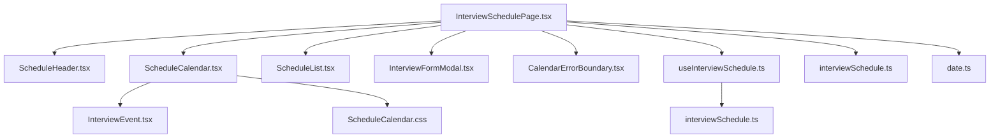
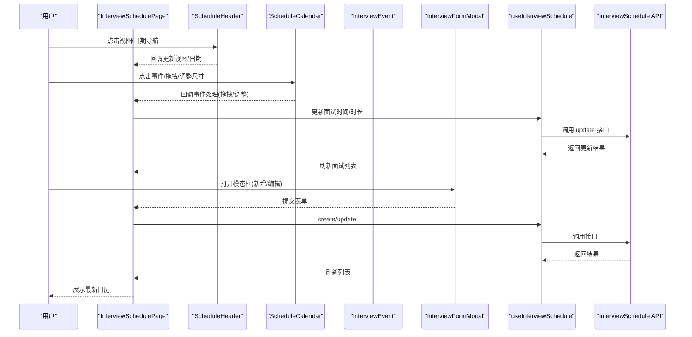
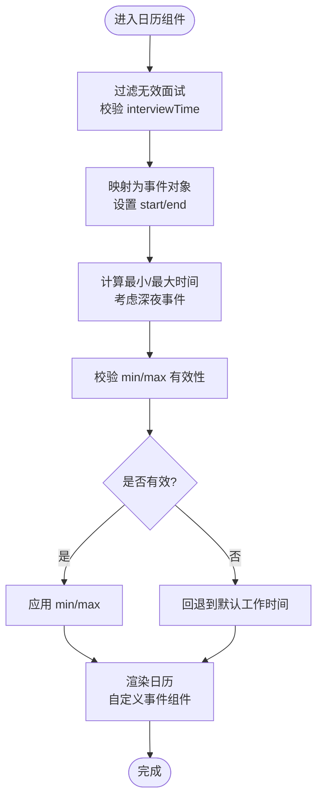
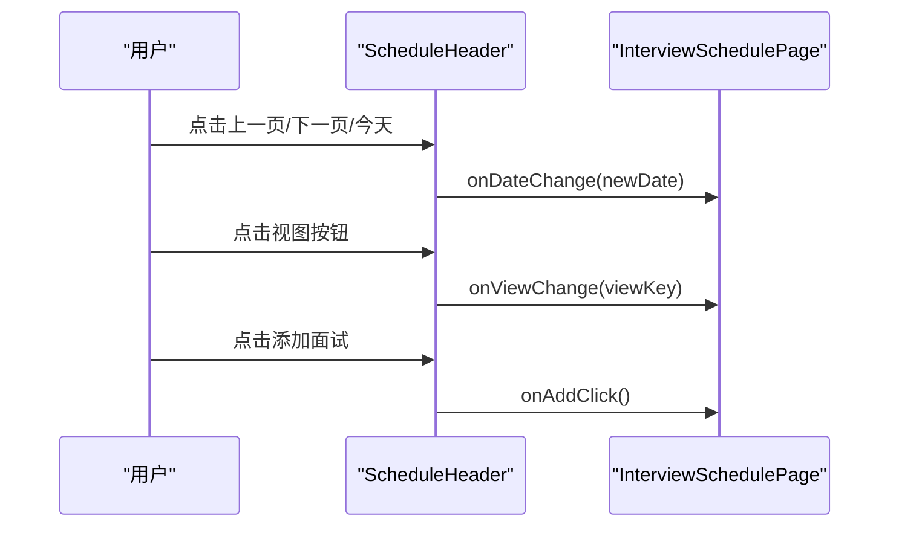
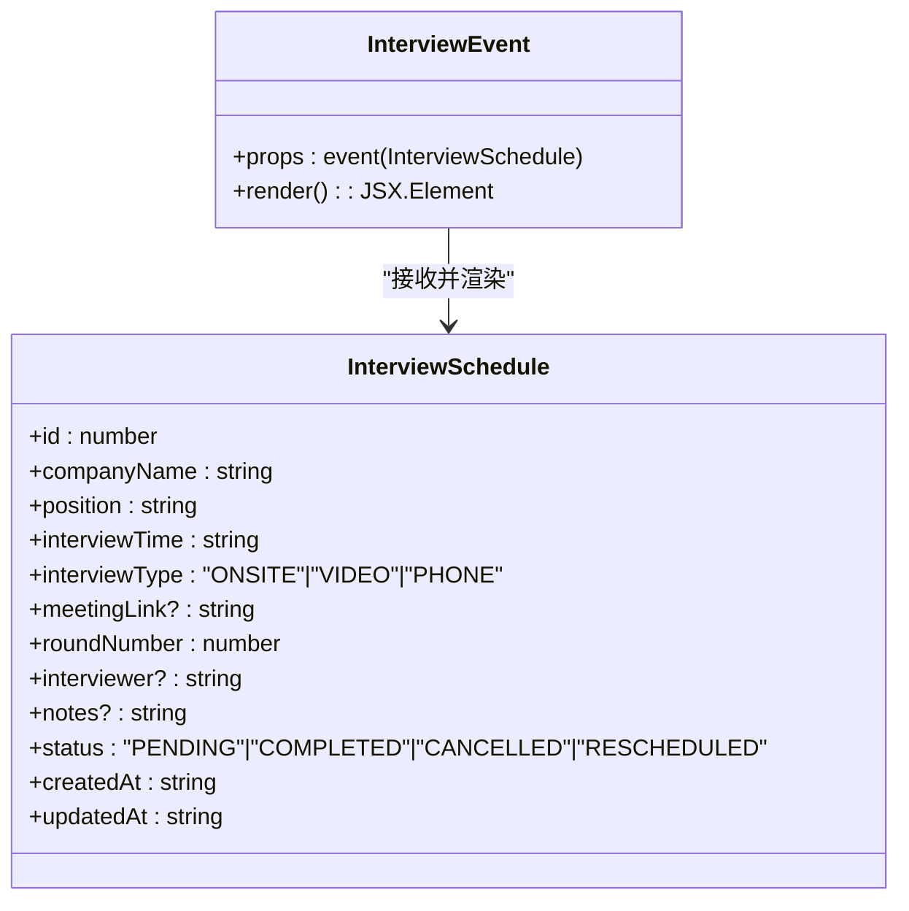
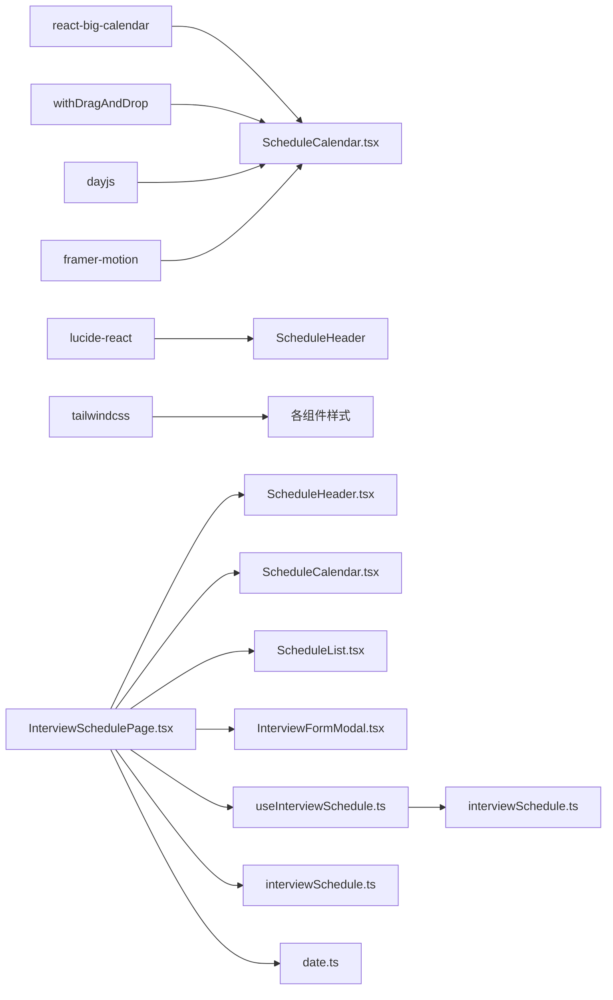

# 日历管理系统

<cite>
**本文引用的文件**
- [ScheduleCalendar.tsx](file://frontend/src/components/interviewschedule/ScheduleCalendar.tsx)
- [ScheduleHeader.tsx](file://frontend/src/components/interviewschedule/ScheduleHeader.tsx)
- [InterviewEvent.tsx](file://frontend/src/components/interviewschedule/InterviewEvent.tsx)
- [ScheduleCalendar.css](file://frontend/src/components/interviewschedule/ScheduleCalendar.css)
- [InterviewFormModal.tsx](file://frontend/src/components/interviewschedule/InterviewFormModal.tsx)
- [useInterviewSchedule.ts](file://frontend/src/hooks/useInterviewSchedule.ts)
- [InterviewSchedulePage.tsx](file://frontend/src/pages/InterviewSchedulePage.tsx)
- [interviewSchedule.ts](file://frontend/src/types/interviewSchedule.ts)
- [date.ts](file://frontend/src/utils/date.ts)
- [ScheduleList.tsx](file://frontend/src/components/interviewschedule/ScheduleList.tsx)
- [CalendarErrorBoundary.tsx](file://frontend/src/components/interviewschedule/CalendarErrorBoundary.tsx)
- [interviewSchedule.ts](file://frontend/src/api/interviewSchedule.ts)
- [package.json](file://frontend/package.json)
</cite>

## 目录
1. [简介](#简介)
2. [项目结构](#项目结构)
3. [核心组件](#核心组件)
4. [架构总览](#架构总览)
5. [详细组件分析](#详细组件分析)
6. [依赖关系分析](#依赖关系分析)
7. [性能考虑](#性能考虑)
8. [故障排查指南](#故障排查指南)
9. [结论](#结论)
10. [附录](#附录)

## 简介
本项目为“日历管理系统”，围绕面试调度场景，基于 React Big Calendar 实现日/周/月视图的日程展示与交互，并通过自定义事件渲染、拖拽调整、表单模态框、错误边界等能力，提供完整的日历体验。系统采用 TypeScript、TailwindCSS、Framer Motion、dayjs 等技术栈，确保类型安全、样式一致性与动画流畅性。

## 项目结构
前端位于 frontend 目录，日历相关代码集中在 components/interviewschedule 与 pages 下：
- 页面层：InterviewSchedulePage 负责状态管理与视图切换
- 组件层：ScheduleHeader、ScheduleCalendar、InterviewEvent、ScheduleList、InterviewFormModal、CalendarErrorBoundary
- 数据层：useInterviewSchedule Hook 与 interviewSchedule API 模块
- 类型与工具：interviewSchedule.ts 类型定义、date.ts 工具函数

图表来源
- [InterviewSchedulePage.tsx:15-227](file://frontend/src/pages/InterviewSchedulePage.tsx#L15-L227)
- [ScheduleHeader.tsx:16-146](file://frontend/src/components/interviewschedule/ScheduleHeader.tsx#L16-L146)
- [ScheduleCalendar.tsx:27-177](file://frontend/src/components/interviewschedule/ScheduleCalendar.tsx#L27-L177)
- [InterviewEvent.tsx:11-55](file://frontend/src/components/interviewschedule/InterviewEvent.tsx#L11-L55)
- [ScheduleList.tsx:15-58](file://frontend/src/components/interviewschedule/ScheduleList.tsx#L15-L58)
- [InterviewFormModal.tsx:29-497](file://frontend/src/components/interviewschedule/InterviewFormModal.tsx#L29-L497)
- [CalendarErrorBoundary.tsx:14-56](file://frontend/src/components/interviewschedule/CalendarErrorBoundary.tsx#L14-L56)
- [useInterviewSchedule.ts:11-71](file://frontend/src/hooks/useInterviewSchedule.ts#L11-L71)
- [interviewSchedule.ts:12-47](file://frontend/src/api/interviewSchedule.ts#L12-L47)
- [interviewSchedule.ts:7-20](file://frontend/src/types/interviewSchedule.ts#L7-L20)
- [date.ts:11-58](file://frontend/src/utils/date.ts#L11-L58)

章节来源
- [InterviewSchedulePage.tsx:15-227](file://frontend/src/pages/InterviewSchedulePage.tsx#L15-L227)
- [package.json:11-27](file://frontend/package.json#L11-L27)

## 核心组件
- 日历容器与视图切换：ScheduleCalendar 封装 react-big-calendar，支持 day/week/month 视图，动态计算时间范围，自定义事件组件与样式。
- 头部导航：ScheduleHeader 提供日期导航、视图切换按钮、添加面试按钮，以及响应式动效。
- 自定义事件渲染：InterviewEvent 基于面试状态映射不同主题色与阴影，提升可读性与状态表达。
- 列表视图：ScheduleList 在 list 视图下按时间排序展示面试项。
- 表单模态框：InterviewFormModal 支持文本解析与手动输入两种创建方式，提供多步骤流程与错误提示。
- 数据钩子：useInterviewSchedule 统一封装 CRUD 与状态查询。
- 错误边界：CalendarErrorBoundary 捕获日历渲染异常并提供恢复入口。

章节来源
- [ScheduleCalendar.tsx:27-177](file://frontend/src/components/interviewschedule/ScheduleCalendar.tsx#L27-L177)
- [ScheduleHeader.tsx:16-146](file://frontend/src/components/interviewschedule/ScheduleHeader.tsx#L16-L146)
- [InterviewEvent.tsx:11-55](file://frontend/src/components/interviewschedule/InterviewEvent.tsx#L11-L55)
- [ScheduleList.tsx:15-58](file://frontend/src/components/interviewschedule/ScheduleList.tsx#L15-L58)
- [InterviewFormModal.tsx:29-497](file://frontend/src/components/interviewschedule/InterviewFormModal.tsx#L29-L497)
- [useInterviewSchedule.ts:11-71](file://frontend/src/hooks/useInterviewSchedule.ts#L11-L71)
- [CalendarErrorBoundary.tsx:14-56](file://frontend/src/components/interviewschedule/CalendarErrorBoundary.tsx#L14-L56)

## 架构总览
系统采用“页面-组件-数据钩子-API-类型”的分层架构：
- 页面层负责状态与控制流，协调头部、日历、列表、模态框与确认对话框。
- 组件层封装 UI 与交互，日历组件通过 withDragAndDrop 增强拖拽能力。
- 数据层通过 Hook 与 API 模块统一管理面试数据，支持分页/筛选参数。
- 类型层保证数据模型一致，工具层提供日期格式化辅助。

图表来源
- [InterviewSchedulePage.tsx:65-119](file://frontend/src/pages/InterviewSchedulePage.tsx#L65-L119)
- [ScheduleCalendar.tsx:135-174](file://frontend/src/components/interviewschedule/ScheduleCalendar.tsx#L135-L174)
- [InterviewFormModal.tsx:111-124](file://frontend/src/components/interviewschedule/InterviewFormModal.tsx#L111-L124)
- [useInterviewSchedule.ts:34-55](file://frontend/src/hooks/useInterviewSchedule.ts#L34-L55)
- [interviewSchedule.ts:18-46](file://frontend/src/api/interviewSchedule.ts#L18-L46)

## 详细组件分析

### 日历组件（ScheduleCalendar）
- 视图与导航：绑定 react-big-calendar 的 view/date/onView/onNavigate，支持 day/week/month。
- 事件数据转换：过滤无效时间，将 interviewTime 转换为 Date，设置默认 30 分钟时长。
- 时间范围自适应：根据当前显示日期内的最早/最晚事件动态调整 min/max，支持深夜延时场景。
- 自定义渲染：eventPropGetter 设置透明背景；components.event 指向 InterviewEvent。
- 本地化与格式：dayjsLocalizer，时间列格式 HH:mm，事件时间范围格式化。
- 拖拽与调整：启用 resizable/selectable，暴露 onEventDrop/onEventResize 回调给父组件。

图表来源
- [ScheduleCalendar.tsx:37-110](file://frontend/src/components/interviewschedule/ScheduleCalendar.tsx#L37-L110)
- [ScheduleCalendar.tsx:135-174](file://frontend/src/components/interviewschedule/ScheduleCalendar.tsx#L135-L174)

章节来源
- [ScheduleCalendar.tsx:27-177](file://frontend/src/components/interviewschedule/ScheduleCalendar.tsx#L27-L177)
- [ScheduleCalendar.css:1-76](file://frontend/src/components/interviewschedule/ScheduleCalendar.css#L1-L76)

### 头部导航（ScheduleHeader）
- 日期导航：根据当前视图类型（day/week/month）计算上一页/下一页/今天。
- 视图切换：提供 day/week/month/list 四种视图按钮，高亮当前视图。
- 添加面试：触发模态框打开，支持新建/编辑两种模式。
- 动画与交互：使用 Framer Motion 提供平滑过渡与点击反馈。

图表来源
- [ScheduleHeader.tsx:23-49](file://frontend/src/components/interviewschedule/ScheduleHeader.tsx#L23-L49)
- [ScheduleHeader.tsx:115-130](file://frontend/src/components/interviewschedule/ScheduleHeader.tsx#L115-L130)

章节来源
- [ScheduleHeader.tsx:16-146](file://frontend/src/components/interviewschedule/ScheduleHeader.tsx#L16-L146)

### 自定义事件渲染（InterviewEvent）
- 状态映射：根据面试状态（PENDING/COMPLETED/CANCELLED/RESCHEDULED）映射背景、文字、边框与阴影。
- 内容展示：公司名、岗位、轮次（大于 1 显示），使用断词与紧凑排版提升可读性。
- 动画与悬停：入场动画与悬停缩放增强交互体验。

图表来源
- [InterviewEvent.tsx:11-55](file://frontend/src/components/interviewschedule/InterviewEvent.tsx#L11-L55)
- [interviewSchedule.ts:7-20](file://frontend/src/types/interviewSchedule.ts#L7-L20)

章节来源
- [InterviewEvent.tsx:11-55](file://frontend/src/components/interviewschedule/InterviewEvent.tsx#L11-L55)
- [interviewSchedule.ts:3-20](file://frontend/src/types/interviewSchedule.ts#L3-L20)

### 列表视图（ScheduleList）
- 排序：按面试时间升序排列。
- 空状态：无数据时展示提示卡片。
- 动画：逐项入场动画，提升加载体验。

章节来源
- [ScheduleList.tsx:15-58](file://frontend/src/components/interviewschedule/ScheduleList.tsx#L15-L58)

### 表单模态框（InterviewFormModal）
- 三步流程：文本输入 -> 解析结果 -> 表单填写。
- 文本解析：调用 parse 接口，支持置信度与日志展示。
- 表单字段：公司名、岗位、面试时间、面试形式、会议链接、轮次、面试官、备注。
- 错误处理：提交失败时显示错误提示，支持重置与取消。
- 示例：内置示例文本，一键填充。

章节来源
- [InterviewFormModal.tsx:29-497](file://frontend/src/components/interviewschedule/InterviewFormModal.tsx#L29-L497)
- [interviewSchedule.ts:13-16](file://frontend/src/api/interviewSchedule.ts#L13-L16)

### 数据钩子与 API（useInterviewSchedule 与 interviewSchedule API）
- 钩子职责：统一管理面试列表、加载状态、错误状态；提供查询、创建、更新、删除、状态变更方法。
- API 模块：封装 parse/create/getById/getAll/update/delete/updateStatus 等接口，支持分页/筛选参数。

章节来源
- [useInterviewSchedule.ts:11-71](file://frontend/src/hooks/useInterviewSchedule.ts#L11-L71)
- [interviewSchedule.ts:12-47](file://frontend/src/api/interviewSchedule.ts#L12-L47)

### 错误边界（CalendarErrorBoundary）
- 捕获日历渲染异常，展示错误信息与刷新按钮，避免整页崩溃。

章节来源
- [CalendarErrorBoundary.tsx:14-56](file://frontend/src/components/interviewschedule/CalendarErrorBoundary.tsx#L14-L56)

## 依赖关系分析
- 组件依赖：ScheduleCalendar 依赖 InterviewEvent 作为事件组件；页面层依赖 Hook 与 API；头部组件与日历组件均被页面层控制。
- 第三方库：react-big-calendar、withDragAndDrop、dayjs、framer-motion、lucide-react、tailwindcss。
- 类型与工具：interviewSchedule.ts 定义数据模型；date.ts 提供格式化工具。

图表来源
- [package.json:11-27](file://frontend/package.json#L11-L27)
- [ScheduleCalendar.tsx:3-11](file://frontend/src/components/interviewschedule/ScheduleCalendar.tsx#L3-L11)
- [ScheduleHeader.tsx:5-6](file://frontend/src/components/interviewschedule/ScheduleHeader.tsx#L5-L6)
- [InterviewSchedulePage.tsx:3-13](file://frontend/src/pages/InterviewSchedulePage.tsx#L3-L13)

章节来源
- [package.json:11-27](file://frontend/package.json#L11-L27)

## 性能考虑
- 事件数据预处理：在组件内过滤无效时间与转换时间，减少渲染阶段计算。
- 时间范围自适应：仅基于当前显示日期内的事件计算 min/max，避免全量扫描。
- 动画与滚动：使用 Framer Motion 的入场动画与滚动容器溢出，避免不必要的重绘。
- 列表渲染：列表视图按时间排序，结合逐项动画，提升可感知性能。
- 错误边界：捕获渲染异常，避免页面级卡顿。

[本节为通用性能建议，不直接分析具体文件]

## 故障排查指南
- 日历渲染异常：检查事件时间是否有效，确认 min/max 时间范围是否合理；查看错误边界提示并刷新。
- 拖拽/调整失败：确认父组件回调已正确处理并调用更新接口；检查网络请求与权限。
- 表单提交失败：查看错误提示与控制台日志；确认必填字段与格式。
- 日期格式问题：使用 date 工具函数进行格式化，确保本地化显示一致。

章节来源
- [CalendarErrorBoundary.tsx:20-50](file://frontend/src/components/interviewschedule/CalendarErrorBoundary.tsx#L20-L50)
- [InterviewSchedulePage.tsx:65-119](file://frontend/src/pages/InterviewSchedulePage.tsx#L65-L119)
- [date.ts:11-58](file://frontend/src/utils/date.ts#L11-L58)

## 结论
该日历管理系统以 React Big Calendar 为核心，结合自定义事件渲染、拖拽调整、多视图切换与表单解析，构建了完整的面试调度体验。通过 Hook 与 API 的统一抽象、错误边界与动画优化，系统在可用性与性能之间取得良好平衡。建议后续可扩展冲突检测、批量操作与导出功能，进一步提升用户体验。

[本节为总结性内容，不直接分析具体文件]

## 附录
- 技术栈：React、TypeScript、TailwindCSS、Framer Motion、dayjs、Lucide Icons、react-big-calendar、axios
- 主题与样式：通过 CSS 变量与暗色模式类名实现主题切换；日历样式覆盖 react-big-calendar 默认样式
- 交互要点：拖拽/调整尺寸需配合后端更新；列表视图适合大量数据浏览；文本解析提升录入效率

[本节为概览性内容，不直接分析具体文件]