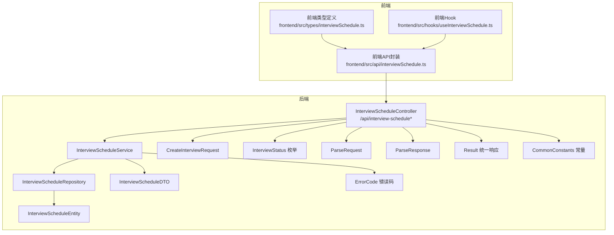
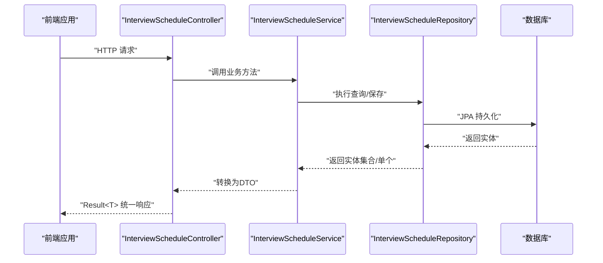
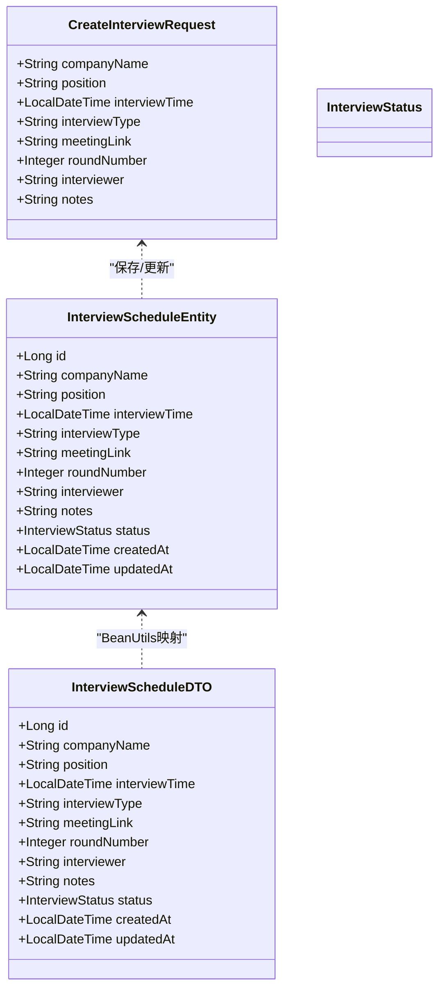
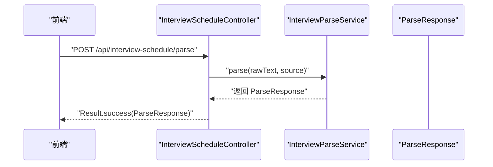
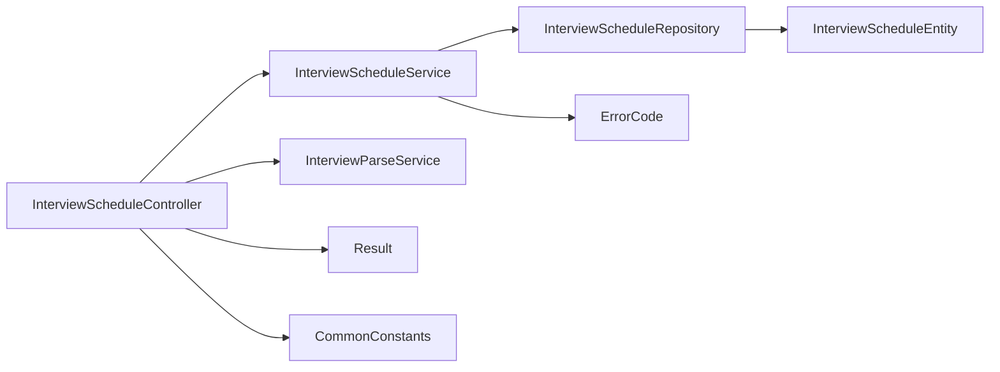

# 面试安排API接口

<cite>
**本文引用的文件**
- [InterviewScheduleController.java](file://app/src/main/java/interview/guide/modules/interviewschedule/InterviewScheduleController.java)
- [InterviewScheduleService.java](file://app/src/main/java/interview/guide/modules/interviewschedule/service/InterviewScheduleService.java)
- [InterviewScheduleRepository.java](file://app/src/main/java/interview/guide/modules/interviewschedule/repository/InterviewScheduleRepository.java)
- [InterviewScheduleEntity.java](file://app/src/main/java/interview/guide/modules/interviewschedule/model/InterviewScheduleEntity.java)
- [CreateInterviewRequest.java](file://app/src/main/java/interview/guide/modules/interviewschedule/model/CreateInterviewRequest.java)
- [InterviewScheduleDTO.java](file://app/src/main/java/interview/guide/modules/interviewschedule/model/InterviewScheduleDTO.java)
- [InterviewStatus.java](file://app/src/main/java/interview/guide/modules/interviewschedule/model/InterviewStatus.java)
- [ParseRequest.java](file://app/src/main/java/interview/guide/modules/interviewschedule/model/ParseRequest.java)
- [ParseResponse.java](file://app/src/main/java/interview/guide/modules/interviewschedule/model/ParseResponse.java)
- [Result.java](file://app/src/main/java/interview/guide/common/result/Result.java)
- [ErrorCode.java](file://app/src/main/java/interview/guide/common/exception/ErrorCode.java)
- [CommonConstants.java](file://app/src/main/java/interview/guide/common/constant/CommonConstants.java)
- [interviewSchedule.ts（前端API封装）](file://frontend/src/api/interviewSchedule.ts)
- [interviewSchedule.ts（前端类型定义）](file://frontend/src/types/interviewSchedule.ts)
- [useInterviewSchedule.ts（前端Hook）](file://frontend/src/hooks/useInterviewSchedule.ts)
</cite>

## 目录
1. [简介](#简介)
2. [项目结构](#项目结构)
3. [核心组件](#核心组件)
4. [架构总览](#架构总览)
5. [详细组件分析](#详细组件分析)
6. [依赖分析](#依赖分析)
7. [性能考虑](#性能考虑)
8. [故障排查指南](#故障排查指南)
9. [结论](#结论)
10. [附录：接口规范与示例](#附录接口规范与示例)

## 简介
本文件为“面试安排API接口”的完整技术文档，覆盖以下内容：
- RESTful 接口清单与规范：GET /api/interview-schedule、POST /api/interview-schedule、PUT /api/interview-schedule/{id}、DELETE /api/interview-schedule/{id}、PATCH/PUT /api/interview-schedule/{id}/status、POST /api/interview-schedule/parse
- 请求/响应数据模型：CreateInterviewRequest、InterviewScheduleDTO、InterviewScheduleEntity、InterviewStatus、ParseRequest、ParseResponse
- 认证授权、错误处理、分页与条件过滤、版本与兼容性、性能优化等运维要点
- 前端集成示例：curl、JavaScript、Python 客户端调用方式

## 项目结构
后端采用 Spring Boot + JPA 的分层架构，面试日程模块位于 app/src/main/java/interview/guide/modules/interviewschedule 下，包含 Controller、Service、Repository、Model 四层，以及统一返回体 Result 与错误码 ErrorCode。

图表来源
- [InterviewScheduleController.java:16-131](file://app/src/main/java/interview/guide/modules/interviewschedule/InterviewScheduleController.java#L16-L131)
- [InterviewScheduleService.java:16-85](file://app/src/main/java/interview/guide/modules/interviewschedule/service/InterviewScheduleService.java#L16-L85)
- [InterviewScheduleRepository.java:14-28](file://app/src/main/java/interview/guide/modules/interviewschedule/repository/InterviewScheduleRepository.java#L14-L28)
- [InterviewScheduleEntity.java:7-58](file://app/src/main/java/interview/guide/modules/interviewschedule/model/InterviewScheduleEntity.java#L7-L58)
- [InterviewScheduleDTO.java:6-22](file://app/src/main/java/interview/guide/modules/interviewschedule/model/InterviewScheduleDTO.java#L6-L22)
- [CreateInterviewRequest.java:8-29](file://app/src/main/java/interview/guide/modules/interviewschedule/model/CreateInterviewRequest.java#L8-L29)
- [InterviewStatus.java:3-8](file://app/src/main/java/interview/guide/modules/interviewschedule/model/InterviewStatus.java#L3-L8)
- [ParseRequest.java:6-12](file://app/src/main/java/interview/guide/modules/interviewschedule/model/ParseRequest.java#L6-L12)
- [ParseResponse.java:7-16](file://app/src/main/java/interview/guide/modules/interviewschedule/model/ParseResponse.java#L7-L16)
- [Result.java:10-60](file://app/src/main/java/interview/guide/common/result/Result.java#L10-L60)
- [ErrorCode.java:11-80](file://app/src/main/java/interview/guide/common/exception/ErrorCode.java#L11-L80)
- [CommonConstants.java:13-44](file://app/src/main/java/interview/guide/common/constant/CommonConstants.java#L13-L44)
- [interviewSchedule.ts（前端API封装）:12-47](file://frontend/src/api/interviewSchedule.ts#L12-L47)
- [interviewSchedule.ts（前端类型定义）:3-48](file://frontend/src/types/interviewSchedule.ts#L3-L48)
- [useInterviewSchedule.ts（前端Hook）:11-71](file://frontend/src/hooks/useInterviewSchedule.ts#L11-L71)

章节来源
- [InterviewScheduleController.java:16-131](file://app/src/main/java/interview/guide/modules/interviewschedule/InterviewScheduleController.java#L16-L131)
- [InterviewScheduleService.java:16-85](file://app/src/main/java/interview/guide/modules/interviewschedule/service/InterviewScheduleService.java#L16-L85)
- [InterviewScheduleRepository.java:14-28](file://app/src/main/java/interview/guide/modules/interviewschedule/repository/InterviewScheduleRepository.java#L14-L28)
- [InterviewScheduleEntity.java:7-58](file://app/src/main/java/interview/guide/modules/interviewschedule/model/InterviewScheduleEntity.java#L7-L58)
- [InterviewScheduleDTO.java:6-22](file://app/src/main/java/interview/guide/modules/interviewschedule/model/InterviewScheduleDTO.java#L6-L22)
- [CreateInterviewRequest.java:8-29](file://app/src/main/java/interview/guide/modules/interviewschedule/model/CreateInterviewRequest.java#L8-L29)
- [InterviewStatus.java:3-8](file://app/src/main/java/interview/guide/modules/interviewschedule/model/InterviewStatus.java#L3-L8)
- [ParseRequest.java:6-12](file://app/src/main/java/interview/guide/modules/interviewschedule/model/ParseRequest.java#L6-L12)
- [ParseResponse.java:7-16](file://app/src/main/java/interview/guide/modules/interviewschedule/model/ParseResponse.java#L7-L16)
- [Result.java:10-60](file://app/src/main/java/interview/guide/common/result/Result.java#L10-L60)
- [ErrorCode.java:11-80](file://app/src/main/java/interview/guide/common/exception/ErrorCode.java#L11-L80)
- [CommonConstants.java:13-44](file://app/src/main/java/interview/guide/common/constant/CommonConstants.java#L13-L44)
- [interviewSchedule.ts（前端API封装）:12-47](file://frontend/src/api/interviewSchedule.ts#L12-L47)
- [interviewSchedule.ts（前端类型定义）:3-48](file://frontend/src/types/interviewSchedule.ts#L3-L48)
- [useInterviewSchedule.ts（前端Hook）:11-71](file://frontend/src/hooks/useInterviewSchedule.ts#L11-L71)

## 核心组件
- 控制器层：提供 REST 接口，负责参数校验、路由与统一响应包装
- 业务层：实现增删改查、状态变更、条件过滤逻辑
- 数据层：JPA Repository 提供基础查询与自定义查询
- 模型层：实体、DTO、请求体、状态枚举、解析请求/响应
- 统一响应与错误：Result<T> 统一返回结构，ErrorCode 定义错误码

章节来源
- [InterviewScheduleController.java:20-131](file://app/src/main/java/interview/guide/modules/interviewschedule/InterviewScheduleController.java#L20-L131)
- [InterviewScheduleService.java:16-85](file://app/src/main/java/interview/guide/modules/interviewschedule/service/InterviewScheduleService.java#L16-L85)
- [InterviewScheduleRepository.java:14-28](file://app/src/main/java/interview/guide/modules/interviewschedule/repository/InterviewScheduleRepository.java#L14-L28)
- [Result.java:10-60](file://app/src/main/java/interview/guide/common/result/Result.java#L10-L60)
- [ErrorCode.java:11-80](file://app/src/main/java/interview/guide/common/exception/ErrorCode.java#L11-L80)

## 架构总览
下图展示从前端到后端的数据流与控制流：

图表来源
- [InterviewScheduleController.java:48-113](file://app/src/main/java/interview/guide/modules/interviewschedule/InterviewScheduleController.java#L48-L113)
- [InterviewScheduleService.java:27-78](file://app/src/main/java/interview/guide/modules/interviewschedule/service/InterviewScheduleService.java#L27-L78)
- [InterviewScheduleRepository.java:14-28](file://app/src/main/java/interview/guide/modules/interviewschedule/repository/InterviewScheduleRepository.java#L14-L28)

## 详细组件分析

### 控制器层：InterviewScheduleController
- 路由前缀：/api/interview-schedule
- 主要接口：
  - POST /api/interview-schedule：创建面试记录
  - GET /api/interview-schedule/{id}：按ID获取详情
  - GET /api/interview-schedule：条件过滤列表（status、start、end）
  - PUT /api/interview-schedule/{id}：更新面试记录
  - DELETE /api/interview-schedule/{id}：删除面试记录
  - PATCH/PUT /api/interview-schedule/{id}/status：更新状态
  - POST /api/interview-schedule/parse：解析邀请文本为结构化请求

章节来源
- [InterviewScheduleController.java:29-130](file://app/src/main/java/interview/guide/modules/interviewschedule/InterviewScheduleController.java#L29-L130)

### 业务层：InterviewScheduleService
- 支持的过滤策略：
  - 时间区间过滤：findByInterviewTimeBetween
  - 状态过滤：findByStatus
  - 全量查询：findAll
- 关键方法：
  - create/update/delete/updateStatus：事务性操作
  - getAll：根据参数选择不同查询路径
  - getById：按ID获取并转换为DTO
  - toDTO：实体到DTO映射

章节来源
- [InterviewScheduleService.java:27-78](file://app/src/main/java/interview/guide/modules/interviewschedule/service/InterviewScheduleService.java#L27-L78)
- [InterviewScheduleRepository.java:16-27](file://app/src/main/java/interview/guide/modules/interviewschedule/repository/InterviewScheduleRepository.java#L16-L27)

### 数据模型与映射
- 实体：InterviewScheduleEntity（持久化表 interview_schedule）
- DTO：InterviewScheduleDTO（对外传输）
- 请求体：CreateInterviewRequest（创建/更新输入）
- 状态：InterviewStatus（枚举）
- 解析：ParseRequest/ParseResponse（解析邀请文本）

图表来源
- [InterviewScheduleEntity.java:10-58](file://app/src/main/java/interview/guide/modules/interviewschedule/model/InterviewScheduleEntity.java#L10-L58)
- [InterviewScheduleDTO.java:7-22](file://app/src/main/java/interview/guide/modules/interviewschedule/model/InterviewScheduleDTO.java#L7-L22)
- [CreateInterviewRequest.java:9-29](file://app/src/main/java/interview/guide/modules/interviewschedule/model/CreateInterviewRequest.java#L9-L29)
- [InterviewStatus.java:3-8](file://app/src/main/java/interview/guide/modules/interviewschedule/model/InterviewStatus.java#L3-L8)

章节来源
- [InterviewScheduleEntity.java:10-58](file://app/src/main/java/interview/guide/modules/interviewschedule/model/InterviewScheduleEntity.java#L10-L58)
- [InterviewScheduleDTO.java:7-22](file://app/src/main/java/interview/guide/modules/interviewschedule/model/InterviewScheduleDTO.java#L7-L22)
- [CreateInterviewRequest.java:9-29](file://app/src/main/java/interview/guide/modules/interviewschedule/model/CreateInterviewRequest.java#L9-L29)
- [InterviewStatus.java:3-8](file://app/src/main/java/interview/guide/modules/interviewschedule/model/InterviewStatus.java#L3-L8)

### 解析流程（POST /api/interview-schedule/parse）
- 输入：ParseRequest（rawText、source）
- 输出：ParseResponse（success、data、confidence、parseMethod、log）
- 业务：InterviewParseService（在控制器中注入并调用）

图表来源
- [InterviewScheduleController.java:35-40](file://app/src/main/java/interview/guide/modules/interviewschedule/InterviewScheduleController.java#L35-L40)
- [ParseRequest.java:7-12](file://app/src/main/java/interview/guide/modules/interviewschedule/model/ParseRequest.java#L7-L12)
- [ParseResponse.java:10-16](file://app/src/main/java/interview/guide/modules/interviewschedule/model/ParseResponse.java#L10-L16)

章节来源
- [InterviewScheduleController.java:35-40](file://app/src/main/java/interview/guide/modules/interviewschedule/InterviewScheduleController.java#L35-L40)
- [ParseRequest.java:7-12](file://app/src/main/java/interview/guide/modules/interviewschedule/model/ParseRequest.java#L7-L12)
- [ParseResponse.java:10-16](file://app/src/main/java/interview/guide/modules/interviewschedule/model/ParseResponse.java#L10-L16)

## 依赖分析
- 控制器依赖 Service 与解析服务
- Service 依赖 Repository
- Repository 继承 JPA，提供自定义查询方法
- 统一响应 Result 与错误码 ErrorCode 在全局生效

图表来源
- [InterviewScheduleController.java:26-27](file://app/src/main/java/interview/guide/modules/interviewschedule/InterviewScheduleController.java#L26-L27)
- [InterviewScheduleService.java:20-25](file://app/src/main/java/interview/guide/modules/interviewschedule/service/InterviewScheduleService.java#L20-L25)
- [InterviewScheduleRepository.java:14-28](file://app/src/main/java/interview/guide/modules/interviewschedule/repository/InterviewScheduleRepository.java#L14-L28)
- [Result.java:10-60](file://app/src/main/java/interview/guide/common/result/Result.java#L10-L60)
- [ErrorCode.java:11-80](file://app/src/main/java/interview/guide/common/exception/ErrorCode.java#L11-L80)
- [CommonConstants.java:13-44](file://app/src/main/java/interview/guide/common/constant/CommonConstants.java#L13-L44)

章节来源
- [InterviewScheduleController.java:26-27](file://app/src/main/java/interview/guide/modules/interviewschedule/InterviewScheduleController.java#L26-L27)
- [InterviewScheduleService.java:20-25](file://app/src/main/java/interview/guide/modules/interviewschedule/service/InterviewScheduleService.java#L20-L25)
- [InterviewScheduleRepository.java:14-28](file://app/src/main/java/interview/guide/modules/interviewschedule/repository/InterviewScheduleRepository.java#L14-L28)
- [Result.java:10-60](file://app/src/main/java/interview/guide/common/result/Result.java#L10-L60)
- [ErrorCode.java:11-80](file://app/src/main/java/interview/guide/common/exception/ErrorCode.java#L11-L80)
- [CommonConstants.java:13-44](file://app/src/main/java/interview/guide/common/constant/CommonConstants.java#L13-L44)

## 性能考虑
- 查询优化
  - 使用 findByInterviewTimeBetween、findByStatus 等精准查询减少扫描
  - 合理使用时间范围与状态过滤，避免全表扫描
- 事务边界
  - CRUD 方法均在事务内执行，保证一致性
- 序列化与时间格式
  - 实体与DTO对时间字段使用统一的JSON格式化策略，避免时区与精度问题
- 前端缓存与批量刷新
  - Hook 中集中拉取与刷新列表，减少重复请求

章节来源
- [InterviewScheduleService.java:55-69](file://app/src/main/java/interview/guide/modules/interviewschedule/service/InterviewScheduleService.java#L55-L69)
- [InterviewScheduleRepository.java:16-27](file://app/src/main/java/interview/guide/modules/interviewschedule/repository/InterviewScheduleRepository.java#L16-L27)
- [InterviewScheduleEntity.java:12-13](file://app/src/main/java/interview/guide/modules/interviewschedule/model/InterviewScheduleEntity.java#L12-L13)
- [InterviewScheduleDTO.java:12-13](file://app/src/main/java/interview/guide/modules/interviewschedule/model/InterviewScheduleDTO.java#L12-L13)
- [useInterviewSchedule.ts:16-32](file://frontend/src/hooks/useInterviewSchedule.ts#L16-L32)

## 故障排查指南
- 常见错误码
  - 9001：INTERVIEW_SCHEDULE_NOT_FOUND（面试日程不存在）
  - 400：BAD_REQUEST（请求参数错误）
  - 404：NOT_FOUND（资源不存在）
  - 500：INTERNAL_ERROR（服务器内部错误）
- 控制器层统一返回 Result<T>，前端可依据 code/message 判断
- 建议
  - 前端在调用失败时打印 message 并提示用户
  - 后端日志记录关键操作（创建、更新、删除、状态变更）

章节来源
- [ErrorCode.java:67-68](file://app/src/main/java/interview/guide/common/exception/ErrorCode.java#L67-L68)
- [Result.java:39-53](file://app/src/main/java/interview/guide/common/result/Result.java#L39-L53)
- [InterviewScheduleController.java:48-113](file://app/src/main/java/interview/guide/modules/interviewschedule/InterviewScheduleController.java#L48-L113)

## 结论
该模块以清晰的分层设计实现了面试日程的全生命周期管理，配合统一响应与错误码体系，具备良好的可维护性与扩展性。通过前端 Hook 与类型定义，提供了便捷的集成体验。

## 附录：接口规范与示例

### 1. 统一响应结构
- 成功：code=200，message="success"，data=具体数据
- 失败：code=错误码，message=错误描述，data=null

章节来源
- [Result.java:23-53](file://app/src/main/java/interview/guide/common/result/Result.java#L23-L53)

### 2. 接口清单与规范

- GET /api/interview-schedule
  - 功能：获取面试日程列表，支持条件过滤
  - 查询参数：
    - status：字符串，如 "PENDING"/"COMPLETED"/"CANCELLED"/"RESCHEDULED"
    - start：ISO时间，开始时间
    - end：ISO时间，结束时间
  - 返回：Result<List<InterviewScheduleDTO>>
  - 过滤策略：
    - 若同时提供 start 与 end：按时间区间查询
    - 否则若提供 status：按状态查询
    - 否则：全量查询

  章节来源
  - [InterviewScheduleController.java:75-83](file://app/src/main/java/interview/guide/modules/interviewschedule/InterviewScheduleController.java#L75-L83)
  - [InterviewScheduleService.java:55-69](file://app/src/main/java/interview/guide/modules/interviewschedule/service/InterviewScheduleService.java#L55-L69)

- GET /api/interview-schedule/{id}
  - 功能：按ID获取面试日程详情
  - 路径参数：id（Long）
  - 返回：Result<InterviewScheduleDTO>

  章节来源
  - [InterviewScheduleController.java:61-65](file://app/src/main/java/interview/guide/modules/interviewschedule/InterviewScheduleController.java#L61-L65)
  - [InterviewScheduleService.java:71-73](file://app/src/main/java/interview/guide/modules/interviewschedule/service/InterviewScheduleService.java#L71-L73)

- POST /api/interview-schedule
  - 功能：创建面试日程
  - 请求体：CreateInterviewRequest
  - 返回：Result<InterviewScheduleDTO>

  章节来源
  - [InterviewScheduleController.java:48-53](file://app/src/main/java/interview/guide/modules/interviewschedule/InterviewScheduleController.java#L48-L53)
  - [CreateInterviewRequest.java:9-29](file://app/src/main/java/interview/guide/modules/interviewschedule/model/CreateInterviewRequest.java#L9-L29)
  - [InterviewScheduleService.java:27-34](file://app/src/main/java/interview/guide/modules/interviewschedule/service/InterviewScheduleService.java#L27-L34)

- PUT /api/interview-schedule/{id}
  - 功能：更新面试日程
  - 路径参数：id（Long）
  - 请求体：CreateInterviewRequest
  - 返回：Result<InterviewScheduleDTO>

  章节来源
  - [InterviewScheduleController.java:92-100](file://app/src/main/java/interview/guide/modules/interviewschedule/InterviewScheduleController.java#L92-L100)
  - [InterviewScheduleService.java:36-41](file://app/src/main/java/interview/guide/modules/interviewschedule/service/InterviewScheduleService.java#L36-L41)

- DELETE /api/interview-schedule/{id}
  - 功能：删除面试日程
  - 路径参数：id（Long）
  - 返回：Result<Void>

  章节来源
  - [InterviewScheduleController.java:108-113](file://app/src/main/java/interview/guide/modules/interviewschedule/InterviewScheduleController.java#L108-L113)
  - [InterviewScheduleService.java:43-46](file://app/src/main/java/interview/guide/modules/interviewschedule/service/InterviewScheduleService.java#L43-L46)

- PATCH/PUT /api/interview-schedule/{id}/status
  - 功能：更新面试日程状态
  - 路径参数：id（Long）
  - 查询参数：status（枚举，PENDING/COMPLETED/CANCELLED/RESCHEDULED）
  - 返回：Result<InterviewScheduleDTO>

  章节来源
  - [InterviewScheduleController.java:122-130](file://app/src/main/java/interview/guide/modules/interviewschedule/InterviewScheduleController.java#L122-L130)
  - [InterviewScheduleService.java:48-53](file://app/src/main/java/interview/guide/modules/interviewschedule/service/InterviewScheduleService.java#L48-L53)

- POST /api/interview-schedule/parse
  - 功能：解析邀请文本为结构化请求
  - 请求体：ParseRequest（rawText、source）
  - 返回：Result<ParseResponse>

  章节来源
  - [InterviewScheduleController.java:35-40](file://app/src/main/java/interview/guide/modules/interviewschedule/InterviewScheduleController.java#L35-L40)
  - [ParseRequest.java:7-12](file://app/src/main/java/interview/guide/modules/interviewschedule/model/ParseRequest.java#L7-L12)
  - [ParseResponse.java:10-16](file://app/src/main/java/interview/guide/modules/interviewschedule/model/ParseResponse.java#L10-L16)

### 3. 数据模型与验证规则

- CreateInterviewRequest（创建/更新输入）
  - 字段：companyName（必填）、position（必填）、interviewTime（必填，ISO时间）、interviewType（可选，ONSITE/VIDEO/PHONE）、meetingLink（可选）、roundNumber（可选，默认1）、interviewer（可选）、notes（可选）
  - 验证：使用注解确保非空与时间格式

  章节来源
  - [CreateInterviewRequest.java:10-28](file://app/src/main/java/interview/guide/modules/interviewschedule/model/CreateInterviewRequest.java#L10-L28)

- InterviewScheduleDTO（对外传输）
  - 字段：id、companyName、position、interviewTime（ISO时间）、interviewType、meetingLink、roundNumber、interviewer、notes、status（枚举）、createdAt、updatedAt

  章节来源
  - [InterviewScheduleDTO.java:7-22](file://app/src/main/java/interview/guide/modules/interviewschedule/model/InterviewScheduleDTO.java#L7-L22)

- InterviewScheduleEntity（持久化）
  - 字段：id、companyName、position、interviewTime、interviewType、meetingLink（TEXT）、roundNumber、interviewer、notes（TEXT）、status（默认PENDING）、createdAt、updatedAt（自动维护）

  章节来源
  - [InterviewScheduleEntity.java:10-58](file://app/src/main/java/interview/guide/modules/interviewschedule/model/InterviewScheduleEntity.java#L10-L58)

- InterviewStatus（枚举）
  - 取值：PENDING、COMPLETED、CANCELLED、RESCHEDULED

  章节来源
  - [InterviewStatus.java:3-8](file://app/src/main/java/interview/guide/modules/interviewschedule/model/InterviewStatus.java#L3-L8)

- ParseRequest/ParseResponse
  - ParseRequest：rawText（必填）、source（可选）
  - ParseResponse：success、data（CreateInterviewRequest或null）、confidence、parseMethod（rule/ai）、log

  章节来源
  - [ParseRequest.java:7-12](file://app/src/main/java/interview/guide/modules/interviewschedule/model/ParseRequest.java#L7-L12)
  - [ParseResponse.java:10-16](file://app/src/main/java/interview/guide/modules/interviewschedule/model/ParseResponse.java#L10-L16)

### 4. 前端集成示例

- JavaScript（基于 axios 或 fetch 封装）
  - 使用 frontend/src/api/interviewSchedule.ts 中的方法进行调用
  - 类型定义参考 frontend/src/types/interviewSchedule.ts

  章节来源
  - [interviewSchedule.ts（前端API封装）:12-47](file://frontend/src/api/interviewSchedule.ts#L12-L47)
  - [interviewSchedule.ts（前端类型定义）:3-48](file://frontend/src/types/interviewSchedule.ts#L3-L48)
  - [useInterviewSchedule.ts（前端Hook）:11-71](file://frontend/src/hooks/useInterviewSchedule.ts#L11-L71)

- Python 客户端（requests）
  - 示例步骤
    - POST /api/interview-schedule：构造 CreateInterviewRequest JSON，发送到后端
    - GET /api/interview-schedule：可带 status/start/end 参数
    - PUT /api/interview-schedule/{id}：更新指定ID的日程
    - DELETE /api/interview-schedule/{id}：删除指定ID的日程
    - PATCH/PUT /api/interview-schedule/{id}/status：更新状态
    - POST /api/interview-schedule/parse：解析邀请文本
  - 注意：时间字段请使用 ISO 8601 字符串格式

  章节来源
  - [InterviewScheduleController.java:48-130](file://app/src/main/java/interview/guide/modules/interviewschedule/InterviewScheduleController.java#L48-L130)
  - [CreateInterviewRequest.java:17-18](file://app/src/main/java/interview/guide/modules/interviewschedule/model/CreateInterviewRequest.java#L17-L18)
  - [InterviewScheduleDTO.java:12-13](file://app/src/main/java/interview/guide/modules/interviewschedule/model/InterviewScheduleDTO.java#L12-L13)

- curl 示例
  - 创建日程
    - curl -X POST http://localhost:8080/api/interview-schedule -H "Content-Type: application/json" -d '{"companyName":"公司A","position":"后端开发","interviewTime":"2026-06-15T14:00:00","interviewType":"VIDEO","meetingLink":"https://example.com/meeting","roundNumber":1,"interviewer":"张三","notes":"备注"}'
  - 获取列表（按状态）
    - curl "http://localhost:8080/api/interview-schedule?status=PENDING"
  - 获取列表（按时间区间）
    - curl "http://localhost:8080/api/interview-schedule?start=2026-06-01T00:00:00&end=2026-06-30T23:59:59"
  - 更新日程
    - curl -X PUT http://localhost:8080/api/interview-schedule/{id} -H "Content-Type: application/json" -d '{"companyName":"公司A","position":"后端开发","interviewTime":"2026-06-15T15:00:00","interviewType":"VIDEO","meetingLink":"https://example.com/meeting","roundNumber":1,"interviewer":"张三","notes":"备注"}'
  - 删除日程
    - curl -X DELETE http://localhost:8080/api/interview-schedule/{id}
  - 更新状态
    - curl -X PATCH "http://localhost:8080/api/interview-schedule/{id}/status?status=COMPLETED"
  - 解析邀请文本
    - curl -X POST http://localhost:8080/api/interview-schedule/parse -H "Content-Type: application/json" -d '{"rawText":"邀请内容","source":"feishu"}'

  章节来源
  - [InterviewScheduleController.java:48-130](file://app/src/main/java/interview/guide/modules/interviewschedule/InterviewScheduleController.java#L48-L130)
  - [CreateInterviewRequest.java:17-18](file://app/src/main/java/interview/guide/modules/interviewschedule/model/CreateInterviewRequest.java#L17-L18)
  - [InterviewScheduleDTO.java:12-13](file://app/src/main/java/interview/guide/modules/interviewschedule/model/InterviewScheduleDTO.java#L12-L13)

### 5. 认证授权机制
- 当前控制器未声明显式鉴权注解，建议在生产环境结合 Spring Security 实现基于 Token 的认证与基于角色的授权控制。

### 6. 错误处理策略
- 后端统一返回 Result<T>，错误码来源于 ErrorCode
- 未找到日程时抛出业务异常并返回对应错误码
- 建议前端在捕获异常后展示友好提示并记录日志

章节来源
- [Result.java:39-53](file://app/src/main/java/interview/guide/common/result/Result.java#L39-L53)
- [ErrorCode.java:67-68](file://app/src/main/java/interview/guide/common/exception/ErrorCode.java#L67-L68)
- [InterviewScheduleService.java:75-78](file://app/src/main/java/interview/guide/modules/interviewschedule/service/InterviewScheduleService.java#L75-L78)

### 7. 分页查询与条件过滤
- 当前实现支持按状态与时间区间过滤，未内置分页参数
- 如需分页，可在 Service 层引入 Pageable 并调整 Controller 参数

章节来源
- [InterviewScheduleController.java:75-83](file://app/src/main/java/interview/guide/modules/interviewschedule/InterviewScheduleController.java#L75-L83)
- [InterviewScheduleService.java:55-69](file://app/src/main/java/interview/guide/modules/interviewschedule/service/InterviewScheduleService.java#L55-L69)

### 8. API 版本管理与向后兼容
- 建议在控制器层增加版本前缀（如 /api/v1/interview-schedule），并在新增字段或变更行为时保持向后兼容，通过默认值与可选字段过渡

### 9. 性能优化建议
- 对高频查询建立索引（如 interview_time、status）
- 使用 DTO 与投影查询减少字段传输
- 合理设置时间范围，避免全表扫描
- 前端使用 Hook 集中刷新，减少重复请求

章节来源
- [InterviewScheduleRepository.java:16-27](file://app/src/main/java/interview/guide/modules/interviewschedule/repository/InterviewScheduleRepository.java#L16-L27)
- [InterviewScheduleService.java:55-69](file://app/src/main/java/interview/guide/modules/interviewschedule/service/InterviewScheduleService.java#L55-L69)
- [useInterviewSchedule.ts:16-32](file://frontend/src/hooks/useInterviewSchedule.ts#L16-L32)