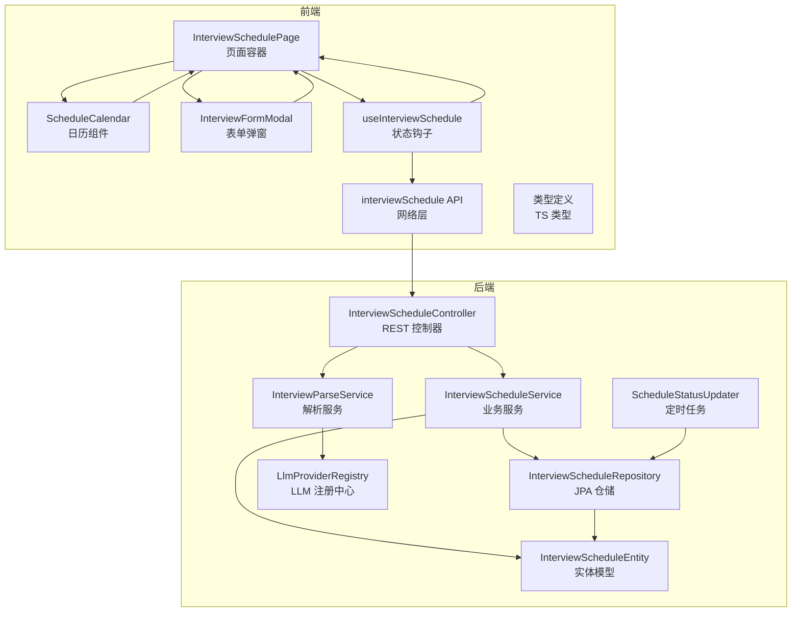
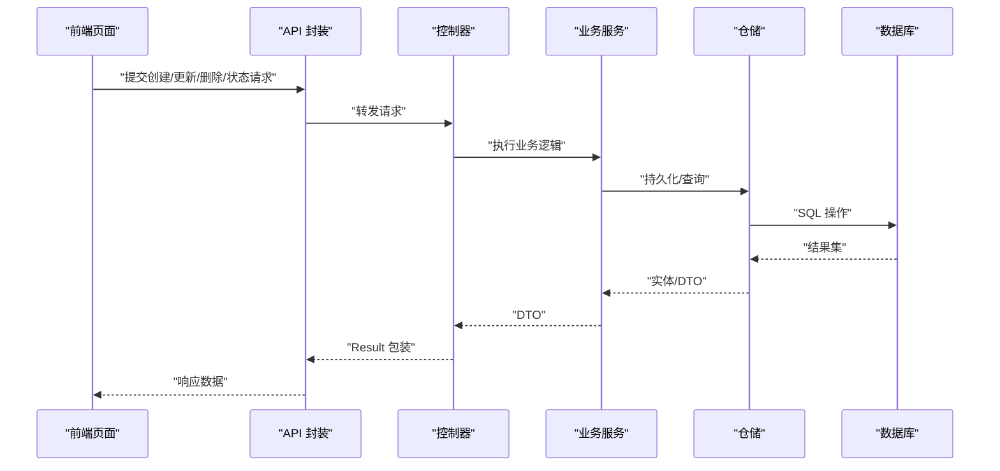
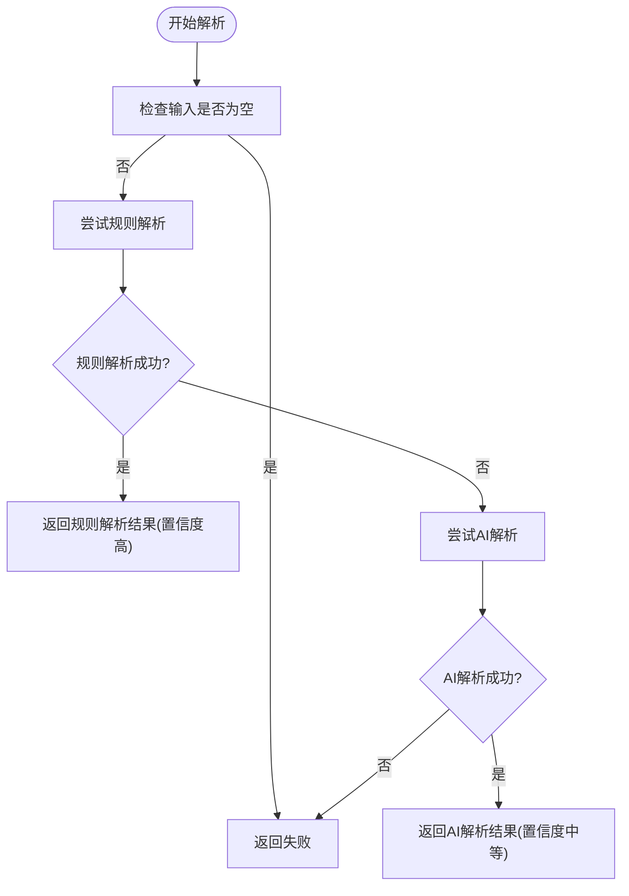
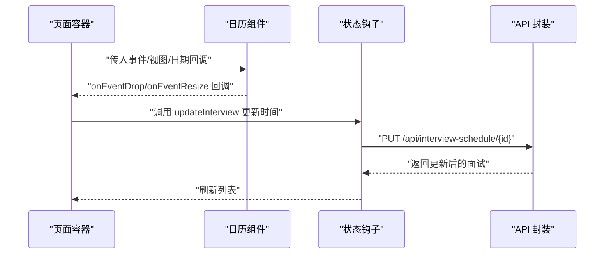
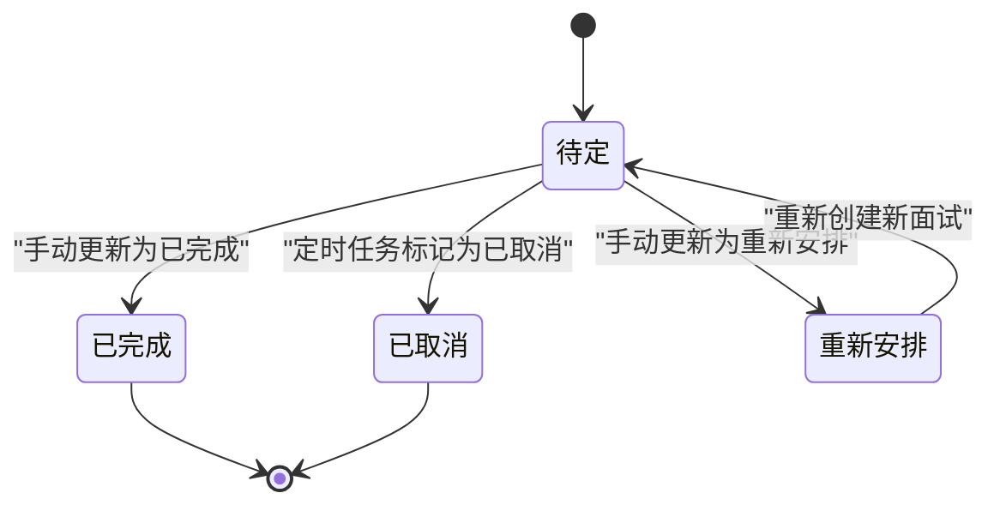
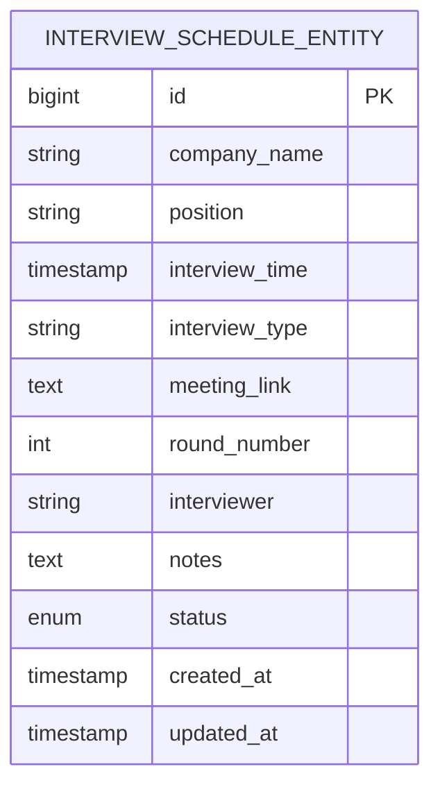
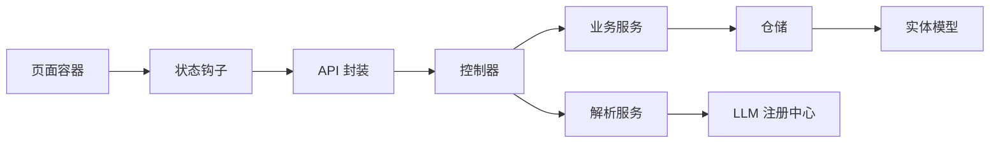

# 面试安排模块

<cite>
**本文引用的文件**
- [InterviewScheduleController.java](file://app/src/main/java/interview/guide/modules/interviewschedule/InterviewScheduleController.java)
- [InterviewParseService.java](file://app/src/main/java/interview/guide/modules/interviewschedule/service/InterviewParseService.java)
- [InterviewScheduleService.java](file://app/src/main/java/interview/guide/modules/interviewschedule/service/InterviewScheduleService.java)
- [ScheduleStatusUpdater.java](file://app/src/main/java/interview/guide/modules/interviewschedule/service/ScheduleStatusUpdater.java)
- [InterviewScheduleRepository.java](file://app/src/main/java/interview/guide/modules/interviewschedule/repository/InterviewScheduleRepository.java)
- [InterviewScheduleEntity.java](file://app/src/main/java/interview/guide/modules/interviewschedule/model/InterviewScheduleEntity.java)
- [CreateInterviewRequest.java](file://app/src/main/java/interview/guide/modules/interviewschedule/model/CreateInterviewRequest.java)
- [InterviewStatus.java](file://app/src/main/java/interview/guide/modules/interviewschedule/model/InterviewStatus.java)
- [LlmProviderRegistry.java](file://app/src/main/java/interview/guide/common/ai/LlmProviderRegistry.java)
- [InterviewSchedulePage.tsx](file://frontend/src/pages/InterviewSchedulePage.tsx)
- [ScheduleCalendar.tsx](file://frontend/src/components/interviewschedule/ScheduleCalendar.tsx)
- [InterviewFormModal.tsx](file://frontend/src/components/interviewschedule/InterviewFormModal.tsx)
- [useInterviewSchedule.ts](file://frontend/src/hooks/useInterviewSchedule.ts)
- [interviewSchedule.ts](file://frontend/src/api/interviewSchedule.ts)
- [interviewSchedule.ts](file://frontend/src/types/interviewSchedule.ts)
</cite>

## 目录
1. [简介](#简介)
2. [项目结构](#项目结构)
3. [核心组件](#核心组件)
4. [架构总览](#架构总览)
5. [详细组件分析](#详细组件分析)
6. [依赖分析](#依赖分析)
7. [性能考量](#性能考量)
8. [故障排查指南](#故障排查指南)
9. [结论](#结论)
10. [附录](#附录)

## 简介
本模块提供完整的面试安排能力，涵盖：
- 面试邀请解析：基于规则引擎与AI双引擎融合，支持飞书/腾讯会议/Zoom等多平台格式自动识别与抽取
- 日历管理：集成React Big Calendar，支持日/周/月视图与拖拽调整
- 状态流转：定时任务自动过期、手动状态标记、状态变更通知
- 提醒机制：提醒配置、通知渠道与策略（当前仓库未实现具体提醒逻辑，仅提供扩展建议）
- 前端界面：日历组件、表单校验、用户交互流程
- 调度规则：冲突检测、资源分配、时间窗口管理（当前仓库未实现冲突检测与资源分配，仅提供扩展建议）
- 数据模型与API：统一数据模型、REST接口定义与前端状态管理策略
- 配置与扩展：LLM提供商注册中心、可扩展的解析与调度策略

## 项目结构
面试安排模块位于后端的modules/interviewschedule目录，前端位于frontend/src/components/interviewschedule与pages目录。

图表来源
- [InterviewScheduleController.java:1-132](file://app/src/main/java/interview/guide/modules/interviewschedule/InterviewScheduleController.java#L1-L132)
- [InterviewParseService.java:1-430](file://app/src/main/java/interview/guide/modules/interviewschedule/service/InterviewParseService.java#L1-L430)
- [InterviewScheduleService.java:1-86](file://app/src/main/java/interview/guide/modules/interviewschedule/service/InterviewScheduleService.java#L1-L86)
- [ScheduleStatusUpdater.java:1-31](file://app/src/main/java/interview/guide/modules/interviewschedule/service/ScheduleStatusUpdater.java#L1-L31)
- [InterviewScheduleRepository.java:1-29](file://app/src/main/java/interview/guide/modules/interviewschedule/repository/InterviewScheduleRepository.java#L1-L29)
- [InterviewScheduleEntity.java:1-59](file://app/src/main/java/interview/guide/modules/interviewschedule/model/InterviewScheduleEntity.java#L1-L59)
- [LlmProviderRegistry.java:1-230](file://app/src/main/java/interview/guide/common/ai/LlmProviderRegistry.java#L1-L230)
- [InterviewSchedulePage.tsx:1-230](file://frontend/src/pages/InterviewSchedulePage.tsx#L1-L230)
- [ScheduleCalendar.tsx:1-178](file://frontend/src/components/interviewschedule/ScheduleCalendar.tsx#L1-L178)
- [InterviewFormModal.tsx:1-498](file://frontend/src/components/interviewschedule/InterviewFormModal.tsx#L1-L498)
- [useInterviewSchedule.ts:1-72](file://frontend/src/hooks/useInterviewSchedule.ts#L1-L72)
- [interviewSchedule.ts:1-48](file://frontend/src/api/interviewSchedule.ts#L1-L48)
- [interviewSchedule.ts:1-49](file://frontend/src/types/interviewSchedule.ts#L1-L49)

章节来源
- [InterviewScheduleController.java:1-132](file://app/src/main/java/interview/guide/modules/interviewschedule/InterviewScheduleController.java#L1-L132)
- [InterviewSchedulePage.tsx:1-230](file://frontend/src/pages/InterviewSchedulePage.tsx#L1-L230)

## 核心组件
- 后端控制器：提供解析、增删改查、状态更新等REST接口
- 解析服务：规则引擎（正则）+AI解析（Spring AI ChatClient），支持多平台格式
- 业务服务：封装持久化、状态更新、查询过滤
- 定时任务：按小时扫描过期面试并标记为取消
- 仓储层：JPA访问数据库，提供条件查询与批量状态更新
- 实体模型：统一面试记录的数据结构与状态枚举
- 前端页面：日历视图、列表视图、表单弹窗、状态钩子与API封装
- LLM注册中心：动态构建不同提供商的ChatClient，支持默认回退

章节来源
- [InterviewParseService.java:1-430](file://app/src/main/java/interview/guide/modules/interviewschedule/service/InterviewParseService.java#L1-L430)
- [InterviewScheduleService.java:1-86](file://app/src/main/java/interview/guide/modules/interviewschedule/service/InterviewScheduleService.java#L1-L86)
- [ScheduleStatusUpdater.java:1-31](file://app/src/main/java/interview/guide/modules/interviewschedule/service/ScheduleStatusUpdater.java#L1-L31)
- [InterviewScheduleRepository.java:1-29](file://app/src/main/java/interview/guide/modules/interviewschedule/repository/InterviewScheduleRepository.java#L1-L29)
- [InterviewScheduleEntity.java:1-59](file://app/src/main/java/interview/guide/modules/interviewschedule/model/InterviewScheduleEntity.java#L1-L59)
- [InterviewScheduleController.java:1-132](file://app/src/main/java/interview/guide/modules/interviewschedule/InterviewScheduleController.java#L1-L132)
- [LlmProviderRegistry.java:1-230](file://app/src/main/java/interview/guide/common/ai/LlmProviderRegistry.java#L1-L230)
- [InterviewSchedulePage.tsx:1-230](file://frontend/src/pages/InterviewSchedulePage.tsx#L1-L230)
- [ScheduleCalendar.tsx:1-178](file://frontend/src/components/interviewschedule/ScheduleCalendar.tsx#L1-L178)
- [InterviewFormModal.tsx:1-498](file://frontend/src/components/interviewschedule/InterviewFormModal.tsx#L1-L498)
- [useInterviewSchedule.ts:1-72](file://frontend/src/hooks/useInterviewSchedule.ts#L1-L72)
- [interviewSchedule.ts:1-48](file://frontend/src/api/interviewSchedule.ts#L1-L48)
- [interviewSchedule.ts:1-49](file://frontend/src/types/interviewSchedule.ts#L1-L49)

## 架构总览
后端采用分层架构：控制器负责HTTP协议与参数绑定；服务层处理业务逻辑；仓储层负责数据持久化；解析服务通过规则与AI协同工作；定时任务保障状态一致性。前端以页面容器为核心，组合日历、表单与状态钩子，通过API层与后端交互。

图表来源
- [InterviewScheduleController.java:1-132](file://app/src/main/java/interview/guide/modules/interviewschedule/InterviewScheduleController.java#L1-L132)
- [InterviewScheduleService.java:1-86](file://app/src/main/java/interview/guide/modules/interviewschedule/service/InterviewScheduleService.java#L1-L86)
- [InterviewScheduleRepository.java:1-29](file://app/src/main/java/interview/guide/modules/interviewschedule/repository/InterviewScheduleRepository.java#L1-L29)

## 详细组件分析

### 面试邀请解析服务（规则引擎 + AI）
- 规则解析优先：针对飞书/腾讯会议/Zoom的特定格式进行正则匹配，提取公司名、岗位、时间、会议链接、轮次等关键字段，并默认视频面试类型
- AI解析兜底：当规则解析失败或未指定来源时，构造提示词，调用LLM注册中心提供的ChatClient进行结构化解析，支持中文轮次转阿拉伯数字
- 置信度与方法标识：返回解析是否成功、置信度、使用的解析方法（rule/ai）以及日志
- 时间与轮次处理：统一时间格式化与中文数字映射，确保后续业务处理一致性

图表来源
- [InterviewParseService.java:96-122](file://app/src/main/java/interview/guide/modules/interviewschedule/service/InterviewParseService.java#L96-L122)
- [InterviewParseService.java:124-158](file://app/src/main/java/interview/guide/modules/interviewschedule/service/InterviewParseService.java#L124-L158)
- [InterviewParseService.java:295-386](file://app/src/main/java/interview/guide/modules/interviewschedule/service/InterviewParseService.java#L295-L386)

章节来源
- [InterviewParseService.java:1-430](file://app/src/main/java/interview/guide/modules/interviewschedule/service/InterviewParseService.java#L1-L430)
- [LlmProviderRegistry.java:65-89](file://app/src/main/java/interview/guide/common/ai/LlmProviderRegistry.java#L65-L89)

### 日历管理系统（React Big Calendar 集成）
- 组件职责：将面试数据转换为日历事件，支持日/周/月视图切换、拖拽调整时间、调整时长、选择事件、自适应时间范围
- 事件渲染：使用自定义事件组件展示面试信息，标题为公司名，时长默认30分钟
- 时间范围适配：根据当前显示日期与事件起止时间动态计算最小/最大时间，避免日历崩溃
- 用户交互：页面容器监听拖拽与调整事件，调用API更新面试时间；支持批量确认变更

图表来源
- [InterviewSchedulePage.tsx:65-109](file://frontend/src/pages/InterviewSchedulePage.tsx#L65-L109)
- [ScheduleCalendar.tsx:135-174](file://frontend/src/components/interviewschedule/ScheduleCalendar.tsx#L135-L174)
- [useInterviewSchedule.ts:40-44](file://frontend/src/hooks/useInterviewSchedule.ts#L40-L44)
- [interviewSchedule.ts:34-36](file://frontend/src/api/interviewSchedule.ts#L34-L36)

章节来源
- [InterviewSchedulePage.tsx:1-230](file://frontend/src/pages/InterviewSchedulePage.tsx#L1-L230)
- [ScheduleCalendar.tsx:1-178](file://frontend/src/components/interviewschedule/ScheduleCalendar.tsx#L1-L178)
- [useInterviewSchedule.ts:1-72](file://frontend/src/hooks/useInterviewSchedule.ts#L1-L72)
- [interviewSchedule.ts:1-48](file://frontend/src/api/interviewSchedule.ts#L1-L48)

### 面试状态流转机制
- 手动状态更新：通过控制器的PATCH/PUT接口更新面试状态
- 定时任务自动过期：每小时扫描PENDING且面试时间早于当前时间的记录，标记为CANCELLED
- 查询过滤：支持按状态与时间区间查询，便于前端筛选与统计

图表来源
- [InterviewStatus.java:1-9](file://app/src/main/java/interview/guide/modules/interviewschedule/model/InterviewStatus.java#L1-L9)
- [ScheduleStatusUpdater.java:20-29](file://app/src/main/java/interview/guide/modules/interviewschedule/service/ScheduleStatusUpdater.java#L20-L29)
- [InterviewScheduleController.java:122-130](file://app/src/main/java/interview/guide/modules/interviewschedule/InterviewScheduleController.java#L122-L130)
- [InterviewScheduleService.java:48-53](file://app/src/main/java/interview/guide/modules/interviewschedule/service/InterviewScheduleService.java#L48-L53)

章节来源
- [InterviewScheduleService.java:1-86](file://app/src/main/java/interview/guide/modules/interviewschedule/service/InterviewScheduleService.java#L1-L86)
- [InterviewScheduleRepository.java:1-29](file://app/src/main/java/interview/guide/modules/interviewschedule/repository/InterviewScheduleRepository.java#L1-L29)
- [ScheduleStatusUpdater.java:1-31](file://app/src/main/java/interview/guide/modules/interviewschedule/service/ScheduleStatusUpdater.java#L1-L31)

### 面试提醒功能（当前实现与扩展建议）
- 当前实现：仓库未提供具体的提醒配置、通知渠道与提醒策略实现
- 扩展建议：
  - 提醒配置：支持提前5/15/30/60分钟提醒，支持邮件/站内信/短信等渠道
  - 提醒策略：基于面试状态与时间窗口动态调整提醒频率
  - 通知渠道：集成消息队列异步发送，避免阻塞主流程
  - 记录与追踪：记录提醒发送状态与结果，支持重试与失败告警

[本节为概念性扩展说明，不直接分析具体文件，故无章节来源]

### 面试调度业务规则（当前实现与扩展建议）
- 冲突检测：当前未实现，建议在创建/更新时查询同一时间段内是否存在冲突
- 资源分配：当前未实现，建议引入会议室/面试官资源池，支持资源占用与释放
- 时间窗口管理：当前未实现，建议支持面试时长、缓冲时间、最大连续面试数等约束
- 扩展点：可在业务服务层增加拦截器或策略类，统一处理冲突与资源分配

[本节为概念性扩展说明，不直接分析具体文件，故无章节来源]

### 数据模型设计
- 实体模型：包含公司名、岗位、面试时间、面试形式、会议链接、轮次、面试官、备注、状态、创建/更新时间等字段
- 请求模型：创建/更新请求的字段集合，用于API传输
- 状态枚举：PENDING/COMPLETED/CANCELLED/RESCHEDULED

图表来源
- [InterviewScheduleEntity.java:1-59](file://app/src/main/java/interview/guide/modules/interviewschedule/model/InterviewScheduleEntity.java#L1-L59)
- [CreateInterviewRequest.java:1-30](file://app/src/main/java/interview/guide/modules/interviewschedule/model/CreateInterviewRequest.java#L1-L30)
- [InterviewStatus.java:1-9](file://app/src/main/java/interview/guide/modules/interviewschedule/model/InterviewStatus.java#L1-L9)

章节来源
- [InterviewScheduleEntity.java:1-59](file://app/src/main/java/interview/guide/modules/interviewschedule/model/InterviewScheduleEntity.java#L1-L59)
- [CreateInterviewRequest.java:1-30](file://app/src/main/java/interview/guide/modules/interviewschedule/model/CreateInterviewRequest.java#L1-L30)
- [InterviewStatus.java:1-9](file://app/src/main/java/interview/guide/modules/interviewschedule/model/InterviewStatus.java#L1-L9)

### API 接口定义
- 解析接口：POST /api/interview-schedule/parse，支持指定来源（feishu/tencent/zoom/other）
- 创建接口：POST /api/interview-schedule
- 查询接口：GET /api/interview-schedule（支持status/start/end过滤）
- 更新接口：PUT /api/interview-schedule/{id}
- 删除接口：DELETE /api/interview-schedule/{id}
- 状态更新：PATCH/PUT /api/interview-schedule/{id}/status

章节来源
- [InterviewScheduleController.java:1-132](file://app/src/main/java/interview/guide/modules/interviewschedule/InterviewScheduleController.java#L1-L132)
- [interviewSchedule.ts:1-48](file://frontend/src/api/interviewSchedule.ts#L1-L48)
- [interviewSchedule.ts:1-49](file://frontend/src/types/interviewSchedule.ts#L1-L49)

### 前端状态管理策略
- 页面容器：维护视图模式、日期、对话框状态、待确认变更集合
- 状态钩子：封装增删改查与状态更新，统一错误处理与加载状态
- 表单弹窗：三步流程（文本输入→解析结果→表单编辑），支持示例文本与错误提示
- 日历组件：事件转换、时间范围适配、拖拽与调整回调

章节来源
- [InterviewSchedulePage.tsx:1-230](file://frontend/src/pages/InterviewSchedulePage.tsx#L1-L230)
- [useInterviewSchedule.ts:1-72](file://frontend/src/hooks/useInterviewSchedule.ts#L1-L72)
- [InterviewFormModal.tsx:1-498](file://frontend/src/components/interviewschedule/InterviewFormModal.tsx#L1-L498)
- [ScheduleCalendar.tsx:1-178](file://frontend/src/components/interviewschedule/ScheduleCalendar.tsx#L1-L178)

## 依赖分析
- 控制器依赖业务服务与解析服务
- 业务服务依赖仓储与实体模型
- 解析服务依赖LLM注册中心与对象映射
- 定时任务依赖仓储进行批量状态更新
- 前端依赖API封装与状态钩子

图表来源
- [InterviewScheduleController.java:1-132](file://app/src/main/java/interview/guide/modules/interviewschedule/InterviewScheduleController.java#L1-L132)
- [InterviewScheduleService.java:1-86](file://app/src/main/java/interview/guide/modules/interviewschedule/service/InterviewScheduleService.java#L1-L86)
- [InterviewParseService.java:1-430](file://app/src/main/java/interview/guide/modules/interviewschedule/service/InterviewParseService.java#L1-L430)
- [LlmProviderRegistry.java:1-230](file://app/src/main/java/interview/guide/common/ai/LlmProviderRegistry.java#L1-L230)
- [InterviewSchedulePage.tsx:1-230](file://frontend/src/pages/InterviewSchedulePage.tsx#L1-L230)
- [useInterviewSchedule.ts:1-72](file://frontend/src/hooks/useInterviewSchedule.ts#L1-L72)
- [interviewSchedule.ts:1-48](file://frontend/src/api/interviewSchedule.ts#L1-L48)

章节来源
- [InterviewScheduleController.java:1-132](file://app/src/main/java/interview/guide/modules/interviewschedule/InterviewScheduleController.java#L1-L132)
- [InterviewParseService.java:1-430](file://app/src/main/java/interview/guide/modules/interviewschedule/service/InterviewParseService.java#L1-L430)
- [InterviewScheduleService.java:1-86](file://app/src/main/java/interview/guide/modules/interviewschedule/service/InterviewScheduleService.java#L1-L86)
- [InterviewScheduleRepository.java:1-29](file://app/src/main/java/interview/guide/modules/interviewschedule/repository/InterviewScheduleRepository.java#L1-L29)
- [ScheduleStatusUpdater.java:1-31](file://app/src/main/java/interview/guide/modules/interviewschedule/service/ScheduleStatusUpdater.java#L1-L31)
- [LlmProviderRegistry.java:1-230](file://app/src/main/java/interview/guide/common/ai/LlmProviderRegistry.java#L1-L230)
- [InterviewSchedulePage.tsx:1-230](file://frontend/src/pages/InterviewSchedulePage.tsx#L1-L230)
- [useInterviewSchedule.ts:1-72](file://frontend/src/hooks/useInterviewSchedule.ts#L1-L72)
- [interviewSchedule.ts:1-48](file://frontend/src/api/interviewSchedule.ts#L1-L48)

## 性能考量
- 解析性能：规则解析为纯正则匹配，复杂度低；AI解析受网络与模型影响，建议缓存热点解析结果与限制并发
- 日历渲染：事件数量较多时，建议虚拟滚动与懒加载；时间范围动态计算避免无效渲染
- 数据库查询：按状态与时间区间查询时建立索引；批量状态更新使用原生SQL减少开销
- 前端状态：合理拆分组件状态，避免不必要的重渲染；使用防抖与批处理优化拖拽与调整

[本节为通用性能建议，不直接分析具体文件，故无章节来源]

## 故障排查指南
- 解析失败：检查输入文本是否为空；查看解析日志与置信度；必要时手动输入
- AI解析异常：确认LLM提供商配置与网络连通性；检查提示词格式与返回JSON结构
- 日历崩溃：检查事件时间有效性与min/max时间范围；确保时间格式正确
- 状态未更新：确认定时任务是否启用；检查数据库时区与时间对比逻辑
- 前端错误：查看状态钩子中的错误捕获与提示；确认API响应与类型定义一致

章节来源
- [InterviewParseService.java:96-122](file://app/src/main/java/interview/guide/modules/interviewschedule/service/InterviewParseService.java#L96-L122)
- [InterviewParseService.java:295-386](file://app/src/main/java/interview/guide/modules/interviewschedule/service/InterviewParseService.java#L295-L386)
- [ScheduleCalendar.tsx:104-111](file://frontend/src/components/interviewschedule/ScheduleCalendar.tsx#L104-L111)
- [ScheduleStatusUpdater.java:20-29](file://app/src/main/java/interview/guide/modules/interviewschedule/service/ScheduleStatusUpdater.java#L20-L29)
- [useInterviewSchedule.ts:20-32](file://frontend/src/hooks/useInterviewSchedule.ts#L20-L32)

## 结论
面试安排模块通过规则与AI双引擎实现了对主流面试邀请格式的自动解析，结合React Big Calendar提供了直观的日历管理体验，并通过定时任务保障状态一致性。当前仓库未实现提醒与调度冲突检测/资源分配等高级特性，建议在现有架构基础上扩展相应模块，以满足更复杂的业务需求。

## 附录
- 配置项建议：LLM提供商基础URL、模型名、超时时间；定时任务执行周期；日历步长与时间槽
- 扩展点：新增解析平台时在解析服务中添加对应正则与AI提示词；新增提醒渠道时在通知模块中接入；新增调度规则时在业务服务中扩展策略类

[本节为通用扩展建议，不直接分析具体文件，故无章节来源]