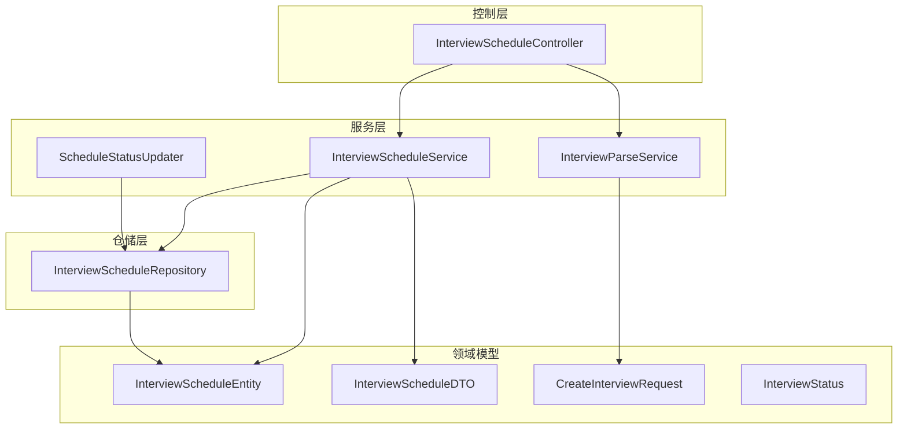
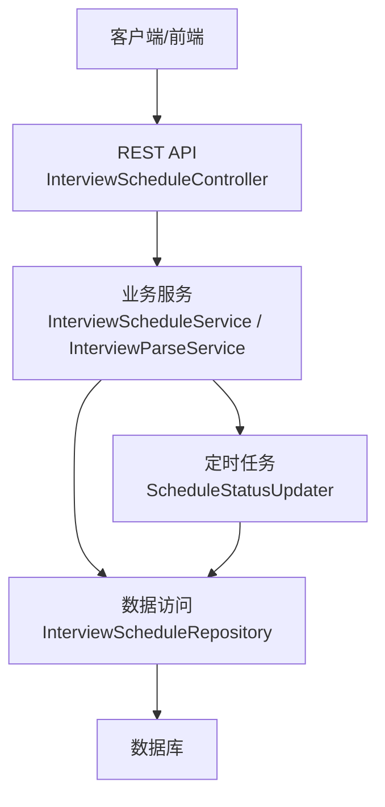
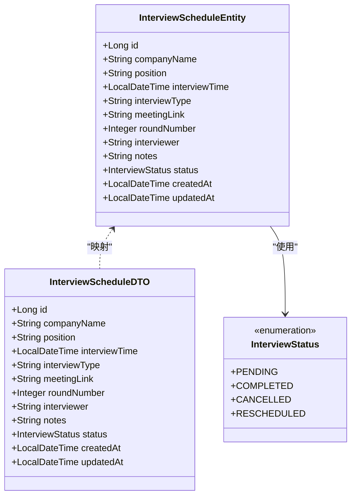
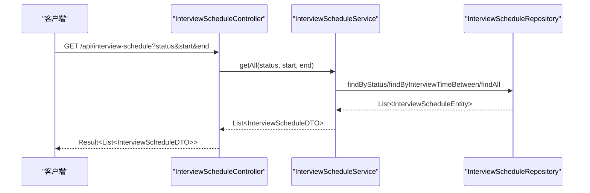
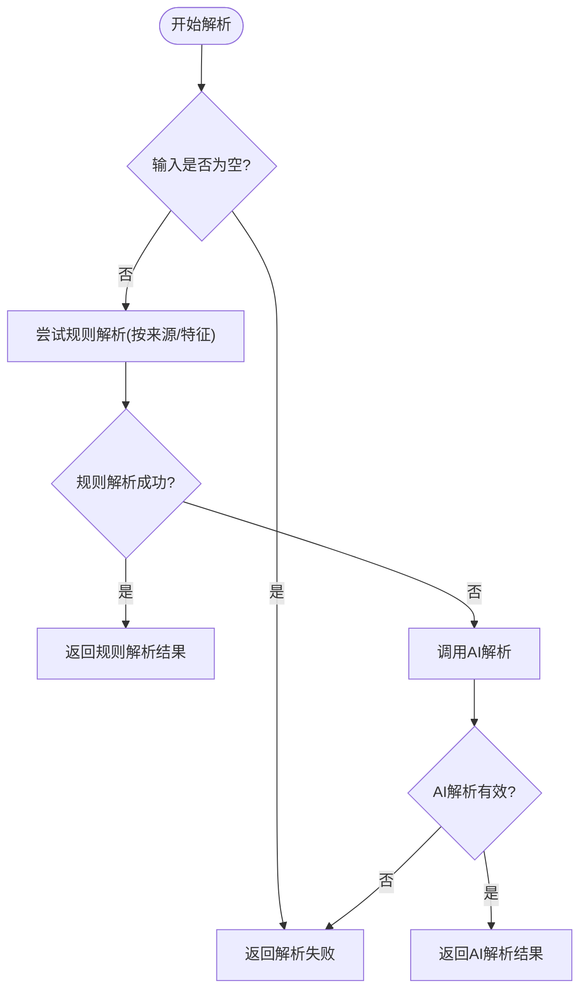
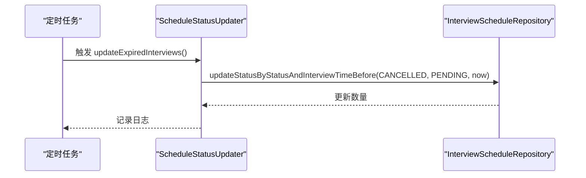
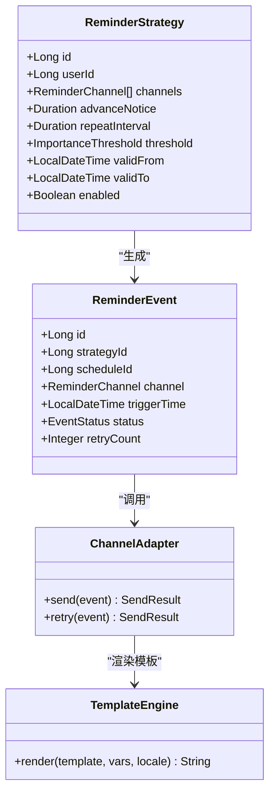
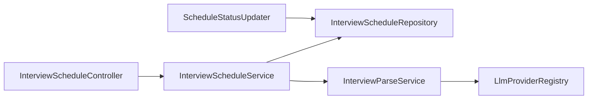

# 面试提醒系统

<cite>
**本文引用的文件**
- [InterviewScheduleEntity.java](file://app/src/main/java/interview/guide/modules/interviewschedule/model/InterviewScheduleEntity.java)
- [InterviewScheduleDTO.java](file://app/src/main/java/interview/guide/modules/interviewschedule/model/InterviewScheduleDTO.java)
- [InterviewStatus.java](file://app/src/main/java/interview/guide/modules/interviewschedule/model/InterviewStatus.java)
- [CreateInterviewRequest.java](file://app/src/main/java/interview/guide/modules/interviewschedule/model/CreateInterviewRequest.java)
- [InterviewScheduleService.java](file://app/src/main/java/interview/guide/modules/interviewschedule/service/InterviewScheduleService.java)
- [InterviewScheduleRepository.java](file://app/src/main/java/interview/guide/modules/interviewschedule/repository/InterviewScheduleRepository.java)
- [InterviewScheduleController.java](file://app/src/main/java/interview/guide/modules/interviewschedule/InterviewScheduleController.java)
- [ScheduleStatusUpdater.java](file://app/src/main/java/interview/guide/modules/interviewschedule/service/ScheduleStatusUpdater.java)
- [InterviewParseService.java](file://app/src/main/java/interview/guide/modules/interviewschedule/service/InterviewParseService.java)
</cite>

## 目录
1. [引言](#引言)
2. [项目结构](#项目结构)
3. [核心组件](#核心组件)
4. [架构总览](#架构总览)
5. [详细组件分析](#详细组件分析)
6. [依赖分析](#依赖分析)
7. [性能考虑](#性能考虑)
8. [故障排查指南](#故障排查指南)
9. [结论](#结论)
10. [附录](#附录)

## 引言
本文件面向“面试提醒系统”的技术实现，聚焦于提醒策略设计与触发机制、提醒渠道集成、模板管理、配置与偏好、监控统计与性能优化等方面。当前仓库中与“面试日程/提醒”直接相关的核心模块位于后端模块 interviewschedule 下，包含实体、DTO、服务、仓储与定时任务等。本文将基于现有代码进行系统化梳理，并对提醒策略、渠道、模板、配置与监控提出可落地的扩展建议。

## 项目结构
面试提醒系统的核心位于后端模块 interviewschedule，采用分层架构：控制层负责对外接口；服务层封装业务逻辑；仓储层负责持久化；定时任务负责状态更新与过期处理；解析服务负责从文本中抽取面试信息。

图表来源
- [InterviewScheduleController.java:1-132](file://app/src/main/java/interview/guide/modules/interviewschedule/InterviewScheduleController.java#L1-L132)
- [InterviewScheduleService.java:1-86](file://app/src/main/java/interview/guide/modules/interviewschedule/service/InterviewScheduleService.java#L1-L86)
- [InterviewParseService.java:1-430](file://app/src/main/java/interview/guide/modules/interviewschedule/service/InterviewParseService.java#L1-L430)
- [ScheduleStatusUpdater.java:1-31](file://app/src/main/java/interview/guide/modules/interviewschedule/service/ScheduleStatusUpdater.java#L1-L31)
- [InterviewScheduleRepository.java:1-29](file://app/src/main/java/interview/guide/modules/interviewschedule/repository/InterviewScheduleRepository.java#L1-L29)
- [InterviewScheduleEntity.java:1-59](file://app/src/main/java/interview/guide/modules/interviewschedule/model/InterviewScheduleEntity.java#L1-L59)
- [InterviewScheduleDTO.java:1-23](file://app/src/main/java/interview/guide/modules/interviewschedule/model/InterviewScheduleDTO.java#L1-L23)
- [CreateInterviewRequest.java:1-30](file://app/src/main/java/interview/guide/modules/interviewschedule/model/CreateInterviewRequest.java#L1-L30)
- [InterviewStatus.java:1-9](file://app/src/main/java/interview/guide/modules/interviewschedule/model/InterviewStatus.java#L1-L9)

章节来源
- [InterviewScheduleController.java:1-132](file://app/src/main/java/interview/guide/modules/interviewschedule/InterviewScheduleController.java#L1-L132)
- [InterviewScheduleService.java:1-86](file://app/src/main/java/interview/guide/modules/interviewschedule/service/InterviewScheduleService.java#L1-L86)
- [InterviewParseService.java:1-430](file://app/src/main/java/interview/guide/modules/interviewschedule/service/InterviewParseService.java#L1-L430)
- [ScheduleStatusUpdater.java:1-31](file://app/src/main/java/interview/guide/modules/interviewschedule/service/ScheduleStatusUpdater.java#L1-L31)
- [InterviewScheduleRepository.java:1-29](file://app/src/main/java/interview/guide/modules/interviewschedule/repository/InterviewScheduleRepository.java#L1-L29)
- [InterviewScheduleEntity.java:1-59](file://app/src/main/java/interview/guide/modules/interviewschedule/model/InterviewScheduleEntity.java#L1-L59)
- [InterviewScheduleDTO.java:1-23](file://app/src/main/java/interview/guide/modules/interviewschedule/model/InterviewScheduleDTO.java#L1-L23)
- [CreateInterviewRequest.java:1-30](file://app/src/main/java/interview/guide/modules/interviewschedule/model/CreateInterviewRequest.java#L1-L30)
- [InterviewStatus.java:1-9](file://app/src/main/java/interview/guide/modules/interviewschedule/model/InterviewStatus.java#L1-L9)

## 核心组件
- 实体与DTO：定义面试日程的数据结构与传输对象，包含公司、岗位、时间、类型、会议链接、轮次、面试官、备注、状态及时间戳等字段。
- 控制器：提供创建、查询、更新、删除、状态变更与文本解析等接口。
- 服务层：
  - 日程服务：封装增删改查与状态更新，支持按时间段与状态筛选。
  - 解析服务：整合规则解析与AI解析，自动识别来源平台并抽取关键字段。
  - 状态更新器：基于定时任务扫描过期日程并更新状态。
- 仓储层：提供JPA查询方法，包括按状态与截止时间筛选、按时间段范围查询、批量状态更新等。

章节来源
- [InterviewScheduleEntity.java:1-59](file://app/src/main/java/interview/guide/modules/interviewschedule/model/InterviewScheduleEntity.java#L1-L59)
- [InterviewScheduleDTO.java:1-23](file://app/src/main/java/interview/guide/modules/interviewschedule/model/InterviewScheduleDTO.java#L1-L23)
- [InterviewStatus.java:1-9](file://app/src/main/java/interview/guide/modules/interviewschedule/model/InterviewStatus.java#L1-L9)
- [CreateInterviewRequest.java:1-30](file://app/src/main/java/interview/guide/modules/interviewschedule/model/CreateInterviewRequest.java#L1-L30)
- [InterviewScheduleService.java:1-86](file://app/src/main/java/interview/guide/modules/interviewschedule/service/InterviewScheduleService.java#L1-L86)
- [InterviewParseService.java:1-430](file://app/src/main/java/interview/guide/modules/interviewschedule/service/InterviewParseService.java#L1-L430)
- [ScheduleStatusUpdater.java:1-31](file://app/src/main/java/interview/guide/modules/interviewschedule/service/ScheduleStatusUpdater.java#L1-L31)
- [InterviewScheduleRepository.java:1-29](file://app/src/main/java/interview/guide/modules/interviewschedule/repository/InterviewScheduleRepository.java#L1-L29)

## 架构总览
系统采用经典的分层架构，控制层暴露REST接口，服务层编排业务，仓储层访问数据库。定时任务负责后台状态维护，解析服务负责从文本中抽取结构化数据。

图表来源
- [InterviewScheduleController.java:1-132](file://app/src/main/java/interview/guide/modules/interviewschedule/InterviewScheduleController.java#L1-L132)
- [InterviewScheduleService.java:1-86](file://app/src/main/java/interview/guide/modules/interviewschedule/service/InterviewScheduleService.java#L1-L86)
- [InterviewParseService.java:1-430](file://app/src/main/java/interview/guide/modules/interviewschedule/service/InterviewParseService.java#L1-L430)
- [ScheduleStatusUpdater.java:1-31](file://app/src/main/java/interview/guide/modules/interviewschedule/service/ScheduleStatusUpdater.java#L1-L31)
- [InterviewScheduleRepository.java:1-29](file://app/src/main/java/interview/guide/modules/interviewschedule/repository/InterviewScheduleRepository.java#L1-L29)

## 详细组件分析

### 数据模型与状态机
- 实体包含主键、公司名、岗位、面试时间、形式、会议链接、轮次、面试官、备注、状态与时间戳等字段，并在持久化/更新时自动填充时间。
- DTO用于对外传输，字段与实体一致，便于API交互。
- 状态枚举包含待定、完成、取消、重排，支撑后续提醒策略的状态联动。

图表来源
- [InterviewScheduleEntity.java:1-59](file://app/src/main/java/interview/guide/modules/interviewschedule/model/InterviewScheduleEntity.java#L1-L59)
- [InterviewScheduleDTO.java:1-23](file://app/src/main/java/interview/guide/modules/interviewschedule/model/InterviewScheduleDTO.java#L1-L23)
- [InterviewStatus.java:1-9](file://app/src/main/java/interview/guide/modules/interviewschedule/model/InterviewStatus.java#L1-L9)

章节来源
- [InterviewScheduleEntity.java:1-59](file://app/src/main/java/interview/guide/modules/interviewschedule/model/InterviewScheduleEntity.java#L1-L59)
- [InterviewScheduleDTO.java:1-23](file://app/src/main/java/interview/guide/modules/interviewschedule/model/InterviewScheduleDTO.java#L1-L23)
- [InterviewStatus.java:1-9](file://app/src/main/java/interview/guide/modules/interviewschedule/model/InterviewStatus.java#L1-L9)

### 控制层与API流程
- 提供创建、查询、更新、删除、状态变更与文本解析接口。
- 查询支持按状态与时间区间过滤，便于前端展示与提醒筛选。

图表来源
- [InterviewScheduleController.java:75-83](file://app/src/main/java/interview/guide/modules/interviewschedule/InterviewScheduleController.java#L75-L83)
- [InterviewScheduleService.java:55-69](file://app/src/main/java/interview/guide/modules/interviewschedule/service/InterviewScheduleService.java#L55-L69)
- [InterviewScheduleRepository.java:16-20](file://app/src/main/java/interview/guide/modules/interviewschedule/repository/InterviewScheduleRepository.java#L16-L20)

章节来源
- [InterviewScheduleController.java:1-132](file://app/src/main/java/interview/guide/modules/interviewschedule/InterviewScheduleController.java#L1-L132)
- [InterviewScheduleService.java:55-69](file://app/src/main/java/interview/guide/modules/interviewschedule/service/InterviewScheduleService.java#L55-L69)
- [InterviewScheduleRepository.java:16-20](file://app/src/main/java/interview/guide/modules/interviewschedule/repository/InterviewScheduleRepository.java#L16-L20)

### 解析服务：规则解析与AI解析
- 规则解析：针对飞书、腾讯会议、Zoom三种来源，分别定义正则匹配模式，抽取公司、岗位、时间、会议链接、轮次等字段。
- AI解析：通过大模型生成结构化JSON，再反序列化为请求对象；支持Markdown代码块包裹的JSON输出。
- 自动检测：若未指定来源，则按文本特征自动尝试不同格式。
- 时间与轮次解析：支持中文数字转阿拉伯数字、相对时间推算等。

图表来源
- [InterviewParseService.java:96-122](file://app/src/main/java/interview/guide/modules/interviewschedule/service/InterviewParseService.java#L96-L122)
- [InterviewParseService.java:124-158](file://app/src/main/java/interview/guide/modules/interviewschedule/service/InterviewParseService.java#L124-L158)
- [InterviewParseService.java:295-386](file://app/src/main/java/interview/guide/modules/interviewschedule/service/InterviewParseService.java#L295-L386)

章节来源
- [InterviewParseService.java:1-430](file://app/src/main/java/interview/guide/modules/interviewschedule/service/InterviewParseService.java#L1-L430)

### 状态更新与过期处理
- 定时任务每小时扫描一次，将“待定”且“面试时间早于当前时间”的记录更新为“取消”，避免无效提醒。
- 该机制为提醒系统提供“兜底”的状态约束，确保过期日程不会继续触发后续流程。

图表来源
- [ScheduleStatusUpdater.java:20-29](file://app/src/main/java/interview/guide/modules/interviewschedule/service/ScheduleStatusUpdater.java#L20-L29)
- [InterviewScheduleRepository.java:22-27](file://app/src/main/java/interview/guide/modules/interviewschedule/repository/InterviewScheduleRepository.java#L22-L27)

章节来源
- [ScheduleStatusUpdater.java:1-31](file://app/src/main/java/interview/guide/modules/interviewschedule/service/ScheduleStatusUpdater.java#L1-L31)
- [InterviewScheduleRepository.java:1-29](file://app/src/main/java/interview/guide/modules/interviewschedule/repository/InterviewScheduleRepository.java#L1-L29)

### 提醒策略设计（基于现有能力的扩展建议）
当前系统未内置“提醒策略”实体与“提醒事件”调度器。为满足“提前通知时间设置、重复提醒机制、重要程度分级、个性化配置”等需求，建议新增以下组件与流程：

- 提醒策略实体：包含策略名称、所属用户、提醒通道集合、提前通知时间、重复间隔、重要程度阈值、生效时间范围、启用状态等。
- 提醒事件实体：记录每次提醒的触发时间、策略ID、日程ID、通道、状态（待发送/已发送/已取消/失败）、重试次数等。
- 调度器：基于策略与日程时间计算下一次提醒时间，结合数据库索引与分页批量扫描，避免全表扫描。
- 通道适配器：统一抽象邮件、短信、站内消息、日历等通道，支持失败重试与降级策略。
- 模板引擎：支持变量替换与多语言，模板按语言与场景分类存储。
- 配置中心：默认提醒设置、用户偏好、批量配置导入导出。
- 监控统计：发送成功率、延迟分布、失败原因统计、通道SLA。

说明
- 上述类图用于指导系统扩展，非现有代码结构映射，故不附“图表来源”。

## 依赖分析
- 控制器依赖服务层；服务层依赖仓储层；仓储层依赖JPA与数据库。
- 解析服务依赖大模型注册表与JSON解析工具。
- 定时任务依赖仓储层提供的批量更新方法。

图表来源
- [InterviewScheduleController.java:26-27](file://app/src/main/java/interview/guide/modules/interviewschedule/InterviewScheduleController.java#L26-L27)
- [InterviewScheduleService.java:20](file://app/src/main/java/interview/guide/modules/interviewschedule/service/InterviewScheduleService.java#L20)
- [InterviewParseService.java:28-29](file://app/src/main/java/interview/guide/modules/interviewschedule/service/InterviewParseService.java#L28-L29)
- [ScheduleStatusUpdater.java:18](file://app/src/main/java/interview/guide/modules/interviewschedule/service/ScheduleStatusUpdater.java#L18)

章节来源
- [InterviewScheduleController.java:1-132](file://app/src/main/java/interview/guide/modules/interviewschedule/InterviewScheduleController.java#L1-L132)
- [InterviewScheduleService.java:1-86](file://app/src/main/java/interview/guide/modules/interviewschedule/service/InterviewScheduleService.java#L1-L86)
- [InterviewParseService.java:1-430](file://app/src/main/java/interview/guide/modules/interviewschedule/service/InterviewParseService.java#L1-L430)
- [ScheduleStatusUpdater.java:1-31](file://app/src/main/java/interview/guide/modules/interviewschedule/service/ScheduleStatusUpdater.java#L1-L31)

## 性能考虑
- 查询优化：按状态与时间范围查询时，建议在数据库层面建立复合索引（状态+时间），减少扫描范围。
- 批量更新：定时任务使用原生SQL批量更新，避免逐条加载实体带来的内存与事务压力。
- 解析性能：规则解析优先，AI解析作为兜底；对AI输出进行缓存与限流，避免高并发下的大模型调用抖动。
- 异步化：提醒事件的发送建议异步化，结合队列与重试策略，提升吞吐与稳定性。
- 监控埋点：对解析耗时、提醒发送延迟、失败率等关键指标进行埋点与可视化。

## 故障排查指南
- 解析失败
  - 现象：解析接口返回失败或置信度较低。
  - 排查：确认输入文本是否为空；检查来源参数是否正确；查看规则解析正则是否覆盖目标格式；必要时切换AI解析路径。
- 状态更新异常
  - 现象：过期日程未被标记为取消。
  - 排查：确认定时任务是否启用；检查数据库连接与事务配置；核对批量更新语句与时间参数。
- 查询结果为空
  - 现象：按状态或时间范围查询无结果。
  - 排查：确认传入参数格式与时区；检查数据库索引是否存在；验证数据是否已入库。
- 控制台告警
  - 现象：解析或发送过程出现异常日志。
  - 排查：查看异常堆栈与上下文参数；定位具体正则或AI解析分支；检查网络连通性与鉴权配置。

章节来源
- [InterviewParseService.java:96-122](file://app/src/main/java/interview/guide/modules/interviewschedule/service/InterviewParseService.java#L96-L122)
- [ScheduleStatusUpdater.java:20-29](file://app/src/main/java/interview/guide/modules/interviewschedule/service/ScheduleStatusUpdater.java#L20-L29)
- [InterviewScheduleController.java:75-83](file://app/src/main/java/interview/guide/modules/interviewschedule/InterviewScheduleController.java#L75-L83)

## 结论
当前系统提供了完整的面试日程管理与文本解析能力，具备良好的扩展基础。要实现完善的“提醒系统”，可在现有基础上引入“提醒策略、提醒事件、调度器、通道适配器、模板引擎、配置中心与监控统计”等模块，形成从“策略制定—事件生成—通道发送—反馈统计”的闭环。通过索引优化、批量更新、异步化与监控埋点，可显著提升系统性能与可靠性。

## 附录
- 默认提醒设置建议
  - 提前通知：默认15分钟；重要程度高可设为5/10/30分钟。
  - 重复提醒：默认每小时一次；重要程度高可设为每15分钟一次。
  - 通道优先级：邮件/短信/站内消息/日历，按用户偏好排序。
- 用户偏好管理
  - 支持按用户维度配置提醒偏好、通道偏好、语言与时区。
- 批量配置
  - 支持导入/导出提醒策略模板，便于团队共享与快速部署。
- 国际化与模板
  - 模板按语言与场景分类，支持变量占位符与本地化文案。
- 监控与统计
  - 关键指标：提醒命中率、发送成功率、平均延迟、失败原因TopN、通道SLA。