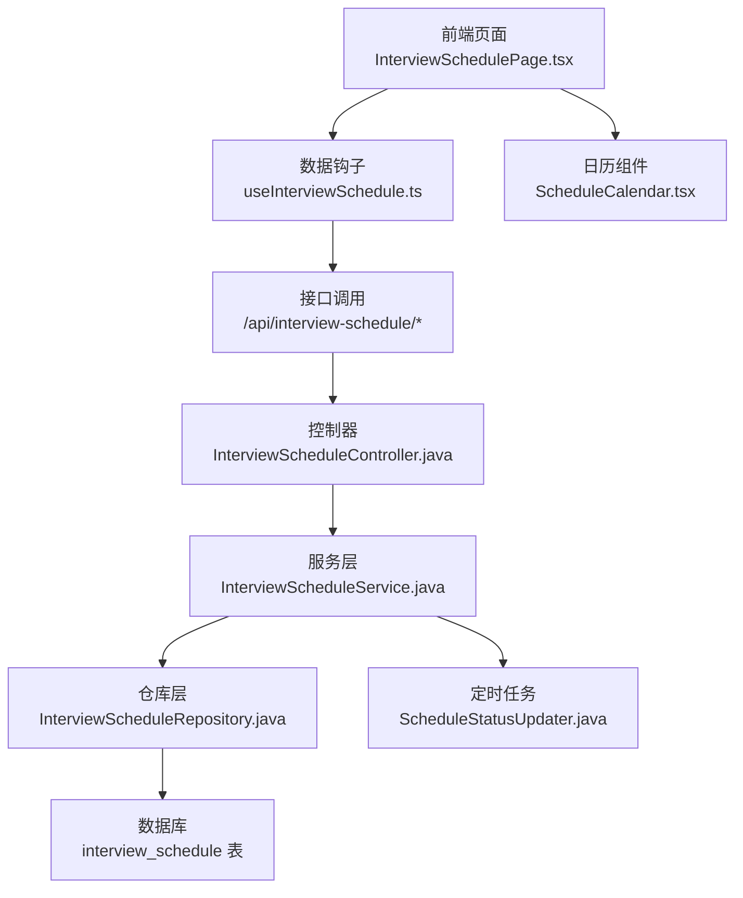
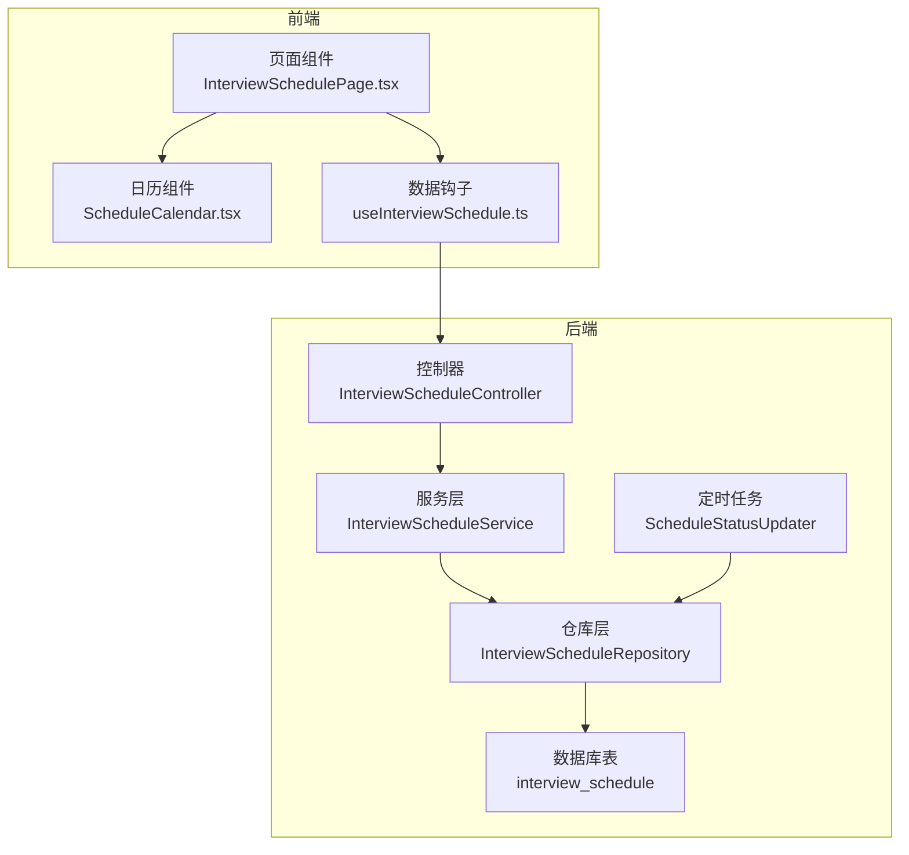
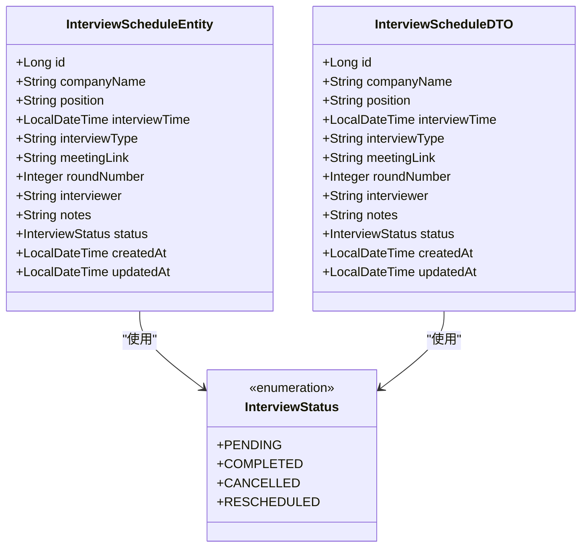
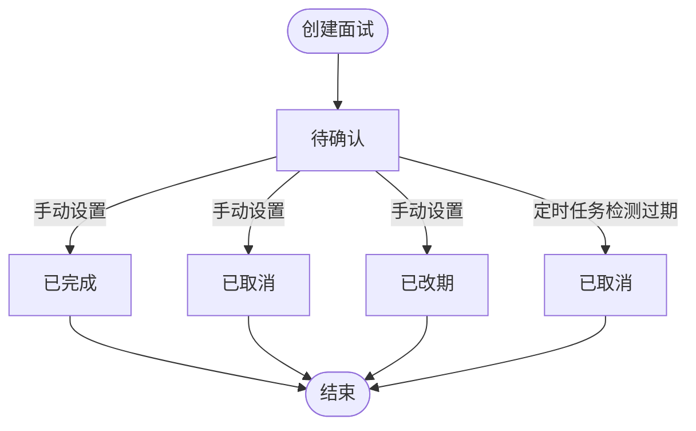
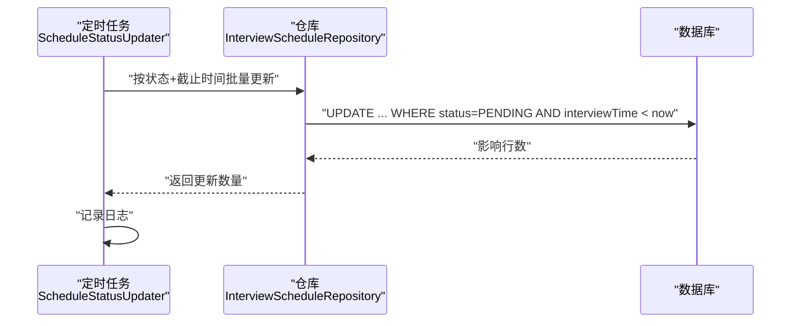
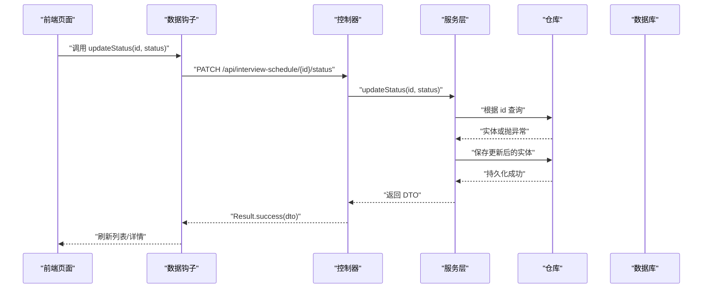
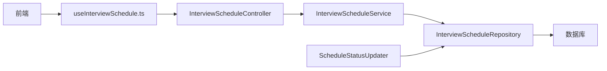
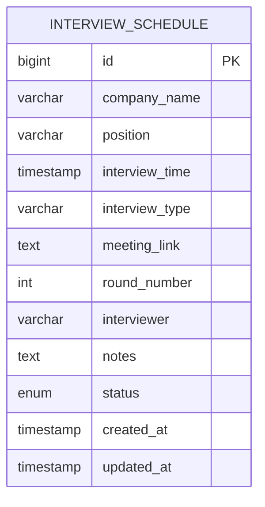

# 面试状态生命周期

<cite>
**本文引用的文件**
- [InterviewStatus.java](file://app/src/main/java/interview/guide/modules/interviewschedule/model/InterviewStatus.java)
- [InterviewScheduleEntity.java](file://app/src/main/java/interview/guide/modules/interviewschedule/model/InterviewScheduleEntity.java)
- [InterviewScheduleDTO.java](file://app/src/main/java/interview/guide/modules/interviewschedule/model/InterviewScheduleDTO.java)
- [InterviewScheduleService.java](file://app/src/main/java/interview/guide/modules/interviewschedule/service/InterviewScheduleService.java)
- [ScheduleStatusUpdater.java](file://app/src/main/java/interview/guide/modules/interviewschedule/service/ScheduleStatusUpdater.java)
- [InterviewScheduleRepository.java](file://app/src/main/java/interview/guide/modules/interviewschedule/repository/InterviewScheduleRepository.java)
- [InterviewScheduleController.java](file://app/src/main/java/interview/guide/modules/interviewschedule/InterviewScheduleController.java)
- [InterviewSchedulePage.tsx](file://frontend/src/pages/InterviewSchedulePage.tsx)
- [ScheduleCalendar.tsx](file://frontend/src/components/interviewschedule/ScheduleCalendar.tsx)
- [useInterviewSchedule.ts](file://frontend/src/hooks/useInterviewSchedule.ts)
- [BusinessException.java](file://app/src/main/java/interview/guide/common/exception/BusinessException.java)
- [ErrorCode.java](file://app/src/main/java/interview/guide/common/exception/ErrorCode.java)
</cite>

## 目录
1. [简介](#简介)
2. [项目结构](#项目结构)
3. [核心组件](#核心组件)
4. [架构总览](#架构总览)
5. [详细组件分析](#详细组件分析)
6. [依赖关系分析](#依赖关系分析)
7. [性能考量](#性能考量)
8. [故障排查指南](#故障排查指南)
9. [结论](#结论)
10. [附录](#附录)

## 简介
本文件面向面试状态生命周期管理，系统性阐述面试状态从“待确认”到“已取消/已完成/已改期”的完整流转与控制机制，覆盖以下主题：
- 状态定义与流转规则
- 定时任务与过期检测
- 手动状态变更流程与安全控制
- 通知机制现状与扩展建议
- 查询、统计与历史追踪能力
- 业务规则配置与扩展性设计

## 项目结构
面试状态生命周期主要由后端 Spring Boot 模块与前端 React 页面协同实现：
- 后端模块：interviewschedule（状态模型、实体、仓库、服务、控制器、定时任务）
- 前端模块：InterviewSchedulePage 及相关组件（日历视图、列表视图、表单弹窗、状态变更交互）

图表来源
- [InterviewScheduleController.java:1-132](file://app/src/main/java/interview/guide/modules/interviewschedule/InterviewScheduleController.java#L1-L132)
- [InterviewScheduleService.java:1-86](file://app/src/main/java/interview/guide/modules/interviewschedule/service/InterviewScheduleService.java#L1-L86)
- [InterviewScheduleRepository.java:1-29](file://app/src/main/java/interview/guide/modules/interviewschedule/repository/InterviewScheduleRepository.java#L1-L29)
- [ScheduleStatusUpdater.java:1-31](file://app/src/main/java/interview/guide/modules/interviewschedule/service/ScheduleStatusUpdater.java#L1-L31)
- [InterviewSchedulePage.tsx:1-230](file://frontend/src/pages/InterviewSchedulePage.tsx#L1-L230)
- [ScheduleCalendar.tsx:1-178](file://frontend/src/components/interviewschedule/ScheduleCalendar.tsx#L1-L178)

章节来源
- [InterviewScheduleController.java:1-132](file://app/src/main/java/interview/guide/modules/interviewschedule/InterviewScheduleController.java#L1-L132)
- [InterviewScheduleService.java:1-86](file://app/src/main/java/interview/guide/modules/interviewschedule/service/InterviewScheduleService.java#L1-L86)
- [InterviewScheduleRepository.java:1-29](file://app/src/main/java/interview/guide/modules/interviewschedule/repository/InterviewScheduleRepository.java#L1-L29)
- [ScheduleStatusUpdater.java:1-31](file://app/src/main/java/interview/guide/modules/interviewschedule/service/ScheduleStatusUpdater.java#L1-L31)
- [InterviewSchedulePage.tsx:1-230](file://frontend/src/pages/InterviewSchedulePage.tsx#L1-L230)
- [ScheduleCalendar.tsx:1-178](file://frontend/src/components/interviewschedule/ScheduleCalendar.tsx#L1-L178)

## 核心组件
- 状态枚举：定义可用状态集合，用于统一约束与校验
- 实体与 DTO：映射数据库字段与对外传输结构
- 仓库：提供按状态、时间范围等查询与批量更新能力
- 服务：封装业务逻辑（创建、更新、状态变更、查询）
- 控制器：暴露 REST 接口，接收前端请求
- 定时任务：周期性扫描并更新过期面试状态
- 前端页面与组件：提供日历/列表视图、状态变更交互

章节来源
- [InterviewStatus.java:1-9](file://app/src/main/java/interview/guide/modules/interviewschedule/model/InterviewStatus.java#L1-L9)
- [InterviewScheduleEntity.java:1-59](file://app/src/main/java/interview/guide/modules/interviewschedule/model/InterviewScheduleEntity.java#L1-L59)
- [InterviewScheduleDTO.java:1-23](file://app/src/main/java/interview/guide/modules/interviewschedule/model/InterviewScheduleDTO.java#L1-L23)
- [InterviewScheduleRepository.java:1-29](file://app/src/main/java/interview/guide/modules/interviewschedule/repository/InterviewScheduleRepository.java#L1-L29)
- [InterviewScheduleService.java:1-86](file://app/src/main/java/interview/guide/modules/interviewschedule/service/InterviewScheduleService.java#L1-L86)
- [InterviewScheduleController.java:1-132](file://app/src/main/java/interview/guide/modules/interviewschedule/InterviewScheduleController.java#L1-L132)
- [ScheduleStatusUpdater.java:1-31](file://app/src/main/java/interview/guide/modules/interviewschedule/service/ScheduleStatusUpdater.java#L1-L31)
- [InterviewSchedulePage.tsx:1-230](file://frontend/src/pages/InterviewSchedulePage.tsx#L1-L230)
- [ScheduleCalendar.tsx:1-178](file://frontend/src/components/interviewschedule/ScheduleCalendar.tsx#L1-L178)

## 架构总览
系统采用经典的分层架构：前端通过 HTTP 接口与后端交互；后端控制器接收请求，调用服务层执行业务逻辑，服务层通过仓库访问数据库；同时通过定时任务实现后台状态维护。

图表来源
- [InterviewScheduleController.java:1-132](file://app/src/main/java/interview/guide/modules/interviewschedule/InterviewScheduleController.java#L1-L132)
- [InterviewScheduleService.java:1-86](file://app/src/main/java/interview/guide/modules/interviewschedule/service/InterviewScheduleService.java#L1-L86)
- [InterviewScheduleRepository.java:1-29](file://app/src/main/java/interview/guide/modules/interviewschedule/repository/InterviewScheduleRepository.java#L1-L29)
- [ScheduleStatusUpdater.java:1-31](file://app/src/main/java/interview/guide/modules/interviewschedule/service/ScheduleStatusUpdater.java#L1-L31)
- [InterviewSchedulePage.tsx:1-230](file://frontend/src/pages/InterviewSchedulePage.tsx#L1-L230)
- [ScheduleCalendar.tsx:1-178](file://frontend/src/components/interviewschedule/ScheduleCalendar.tsx#L1-L178)

## 详细组件分析

### 状态模型与实体
- 状态枚举：包含待确认、已完成、已取消、已改期等状态，作为系统统一的状态标识
- 实体：持久化存储面试信息，包含状态字段及时间戳
- DTO：对外传输对象，避免直接暴露实体细节

图表来源
- [InterviewStatus.java:1-9](file://app/src/main/java/interview/guide/modules/interviewschedule/model/InterviewStatus.java#L1-L9)
- [InterviewScheduleEntity.java:1-59](file://app/src/main/java/interview/guide/modules/interviewschedule/model/InterviewScheduleEntity.java#L1-L59)
- [InterviewScheduleDTO.java:1-23](file://app/src/main/java/interview/guide/modules/interviewschedule/model/InterviewScheduleDTO.java#L1-L23)

章节来源
- [InterviewStatus.java:1-9](file://app/src/main/java/interview/guide/modules/interviewschedule/model/InterviewStatus.java#L1-L9)
- [InterviewScheduleEntity.java:1-59](file://app/src/main/java/interview/guide/modules/interviewschedule/model/InterviewScheduleEntity.java#L1-L59)
- [InterviewScheduleDTO.java:1-23](file://app/src/main/java/interview/guide/modules/interviewschedule/model/InterviewScheduleDTO.java#L1-L23)

### 状态流转与触发条件
- 初始状态：创建面试时默认为“待确认”
- 手动变更：通过接口将状态更新为“已完成”、“已取消”、“已改期”
- 自动变更：定时任务将“待确认”且已过期的面试自动标记为“已取消”

图表来源
- [InterviewScheduleService.java:27-53](file://app/src/main/java/interview/guide/modules/interviewschedule/service/InterviewScheduleService.java#L27-L53)
- [ScheduleStatusUpdater.java:20-29](file://app/src/main/java/interview/guide/modules/interviewschedule/service/ScheduleStatusUpdater.java#L20-L29)
- [InterviewStatus.java:3-8](file://app/src/main/java/interview/guide/modules/interviewschedule/model/InterviewStatus.java#L3-L8)

章节来源
- [InterviewScheduleService.java:27-53](file://app/src/main/java/interview/guide/modules/interviewschedule/service/InterviewScheduleService.java#L27-L53)
- [ScheduleStatusUpdater.java:20-29](file://app/src/main/java/interview/guide/modules/interviewschedule/service/ScheduleStatusUpdater.java#L20-L29)
- [InterviewStatus.java:3-8](file://app/src/main/java/interview/guide/modules/interviewschedule/model/InterviewStatus.java#L3-L8)

### 定时任务实现机制
- 触发频率：每小时执行一次（cron 表达式）
- 逻辑：查询“待确认”且面试时间早于当前时间的记录，批量更新为“已取消”
- 事务性：在事务上下文中执行，保证一致性

图表来源
- [ScheduleStatusUpdater.java:20-29](file://app/src/main/java/interview/guide/modules/interviewschedule/service/ScheduleStatusUpdater.java#L20-L29)
- [InterviewScheduleRepository.java:22-27](file://app/src/main/java/interview/guide/modules/interviewschedule/repository/InterviewScheduleRepository.java#L22-L27)

章节来源
- [ScheduleStatusUpdater.java:1-31](file://app/src/main/java/interview/guide/modules/interviewschedule/service/ScheduleStatusUpdater.java#L1-L31)
- [InterviewScheduleRepository.java:1-29](file://app/src/main/java/interview/guide/modules/interviewschedule/repository/InterviewScheduleRepository.java#L1-L29)

### 手动状态变更流程与安全控制
- 接口：提供 PATCH/PUT /api/interview-schedule/{id}/status 更新状态
- 服务层：校验记录存在性，设置新状态并持久化
- 异常处理：当记录不存在时抛出业务异常，前端捕获并提示

图表来源
- [InterviewScheduleController.java:122-130](file://app/src/main/java/interview/guide/modules/interviewschedule/InterviewScheduleController.java#L122-L130)
- [InterviewScheduleService.java:48-53](file://app/src/main/java/interview/guide/modules/interviewschedule/service/InterviewScheduleService.java#L48-L53)
- [InterviewScheduleRepository.java:14-16](file://app/src/main/java/interview/guide/modules/interviewschedule/repository/InterviewScheduleRepository.java#L14-L16)
- [BusinessException.java:1-50](file://app/src/main/java/interview/guide/common/exception/BusinessException.java#L1-L50)
- [ErrorCode.java:67-69](file://app/src/main/java/interview/guide/common/exception/ErrorCode.java#L67-L69)

章节来源
- [InterviewScheduleController.java:1-132](file://app/src/main/java/interview/guide/modules/interviewschedule/InterviewScheduleController.java#L1-L132)
- [InterviewScheduleService.java:1-86](file://app/src/main/java/interview/guide/modules/interviewschedule/service/InterviewScheduleService.java#L1-L86)
- [InterviewScheduleRepository.java:1-29](file://app/src/main/java/interview/guide/modules/interviewschedule/repository/InterviewScheduleRepository.java#L1-L29)
- [BusinessException.java:1-50](file://app/src/main/java/interview/guide/common/exception/BusinessException.java#L1-L50)
- [ErrorCode.java:67-69](file://app/src/main/java/interview/guide/common/exception/ErrorCode.java#L67-L69)

### 通知机制现状与扩展建议
- 现状：代码库中未发现与面试状态变更相关的通知发送逻辑（邮件、站内消息、日历同步）
- 建议：
  - 在服务层状态变更后增加通知发布点（如事件总线/消息队列）
  - 支持多通道通知：邮件、站内信、日历事件
  - 提供通知模板与开关配置，便于扩展与治理

（本节为概念性建议，不直接分析具体文件）

### 查询、统计与历史追踪
- 查询能力：
  - 支持按状态过滤、按时间区间过滤、全量查询
  - 前端页面提供日历/列表视图展示
- 统计与历史：
  - 可基于仓库提供的查询方法扩展统计报表（按状态分布、时间维度）
  - 历史追踪可通过审计字段或独立审计表实现（当前实体包含创建/更新时间戳）

章节来源
- [InterviewScheduleService.java:55-69](file://app/src/main/java/interview/guide/modules/interviewschedule/service/InterviewScheduleService.java#L55-L69)
- [InterviewScheduleRepository.java:16-20](file://app/src/main/java/interview/guide/modules/interviewschedule/repository/InterviewScheduleRepository.java#L16-L20)
- [InterviewScheduleEntity.java:42-57](file://app/src/main/java/interview/guide/modules/interviewschedule/model/InterviewScheduleEntity.java#L42-L57)
- [InterviewSchedulePage.tsx:174-194](file://frontend/src/pages/InterviewSchedulePage.tsx#L174-L194)
- [ScheduleCalendar.tsx:37-52](file://frontend/src/components/interviewschedule/ScheduleCalendar.tsx#L37-L52)

### 业务规则配置与扩展性设计
- 状态枚举集中管理，便于统一约束与迁移
- 仓库提供按状态与时间的批量更新能力，利于扩展更多自动规则
- 服务层可注入配置类以支持动态规则（如过期阈值、允许的手动变更路径等）
- 建议引入状态机或规则引擎，将状态转换规则外置化，提升可维护性

章节来源
- [InterviewStatus.java:3-8](file://app/src/main/java/interview/guide/modules/interviewschedule/model/InterviewStatus.java#L3-L8)
- [InterviewScheduleRepository.java:22-27](file://app/src/main/java/interview/guide/modules/interviewschedule/repository/InterviewScheduleRepository.java#L22-L27)
- [InterviewScheduleService.java:16-18](file://app/src/main/java/interview/guide/modules/interviewschedule/service/InterviewScheduleService.java#L16-L18)

## 依赖关系分析
- 控制器依赖服务层，服务层依赖仓库层
- 定时任务依赖仓库层进行批量更新
- 前端通过钩子与控制器交互，日历组件负责可视化展示

图表来源
- [InterviewScheduleController.java:1-132](file://app/src/main/java/interview/guide/modules/interviewschedule/InterviewScheduleController.java#L1-L132)
- [InterviewScheduleService.java:1-86](file://app/src/main/java/interview/guide/modules/interviewschedule/service/InterviewScheduleService.java#L1-L86)
- [InterviewScheduleRepository.java:1-29](file://app/src/main/java/interview/guide/modules/interviewschedule/repository/InterviewScheduleRepository.java#L1-L29)
- [ScheduleStatusUpdater.java:1-31](file://app/src/main/java/interview/guide/modules/interviewschedule/service/ScheduleStatusUpdater.java#L1-L31)

章节来源
- [InterviewScheduleController.java:1-132](file://app/src/main/java/interview/guide/modules/interviewschedule/InterviewScheduleController.java#L1-L132)
- [InterviewScheduleService.java:1-86](file://app/src/main/java/interview/guide/modules/interviewschedule/service/InterviewScheduleService.java#L1-L86)
- [InterviewScheduleRepository.java:1-29](file://app/src/main/java/interview/guide/modules/interviewschedule/repository/InterviewScheduleRepository.java#L1-L29)
- [ScheduleStatusUpdater.java:1-31](file://app/src/main/java/interview/guide/modules/interviewschedule/service/ScheduleStatusUpdater.java#L1-L31)

## 性能考量
- 定时任务批处理：批量更新减少多次往返，建议结合数据库索引优化（状态+时间字段）
- 查询性能：按状态与时间范围查询应建立合适索引，避免全表扫描
- 前端渲染：日历组件对大量事件的渲染需注意虚拟化与懒加载策略

（本节为通用指导，不直接分析具体文件）

## 故障排查指南
- 记录不存在：当更新状态时若记录不存在，将抛出业务异常，前端应提示用户并刷新数据
- 定时任务未生效：检查是否启用定时任务注解、时区与时钟配置、数据库连接与事务隔离级别
- 状态未按预期变化：核对过期判定逻辑与当前时间、手动变更接口调用情况

章节来源
- [BusinessException.java:1-50](file://app/src/main/java/interview/guide/common/exception/BusinessException.java#L1-L50)
- [ErrorCode.java:67-69](file://app/src/main/java/interview/guide/common/exception/ErrorCode.java#L67-L69)
- [ScheduleStatusUpdater.java:20-29](file://app/src/main/java/interview/guide/modules/interviewschedule/service/ScheduleStatusUpdater.java#L20-L29)

## 结论
本系统通过明确的状态枚举、清晰的服务层职责、可扩展的仓库接口以及定时任务的自动化维护，实现了面试状态生命周期的稳定管理。建议后续补充通知机制与规则配置能力，进一步完善用户体验与运维治理。

## 附录
- 数据模型 ER 图（基于实体字段）

图表来源
- [InterviewScheduleEntity.java:10-59](file://app/src/main/java/interview/guide/modules/interviewschedule/model/InterviewScheduleEntity.java#L10-L59)