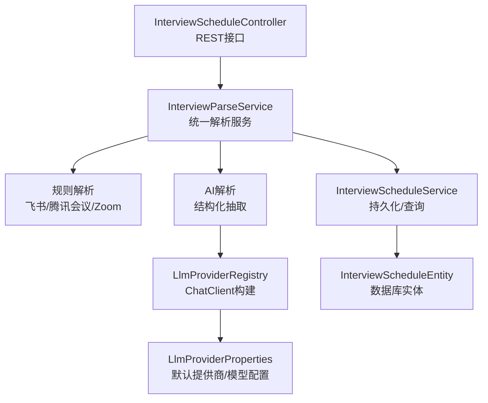
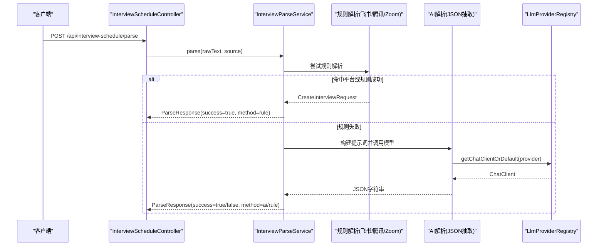
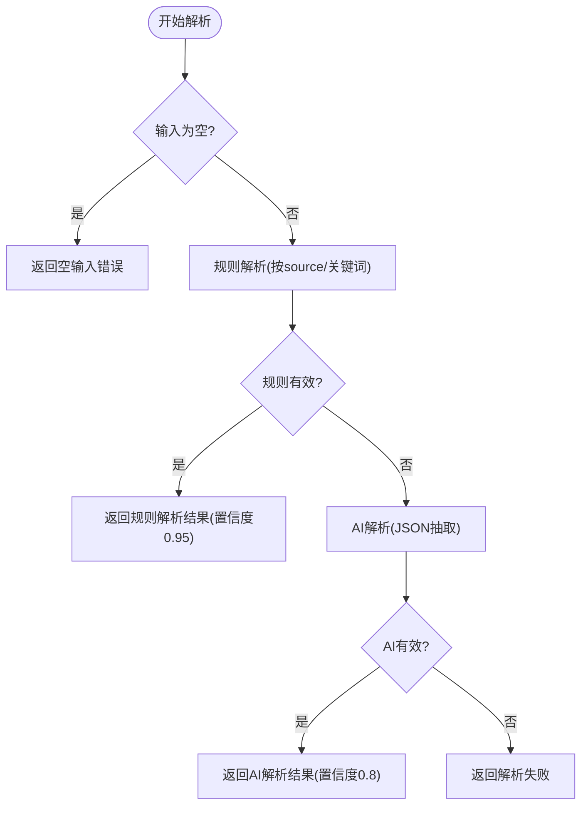
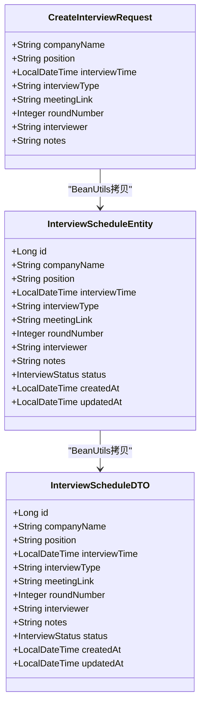
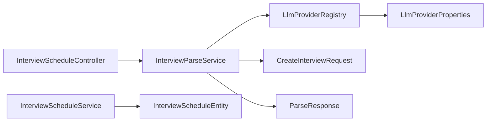

# 面试邀请解析

<cite>
**本文引用的文件**
- [InterviewParseService.java](file://app/src/main/java/interview/guide/modules/interviewschedule/service/InterviewParseService.java)
- [InterviewScheduleController.java](file://app/src/main/java/interview/guide/modules/interviewschedule/InterviewScheduleController.java)
- [InterviewScheduleService.java](file://app/src/main/java/interview/guide/modules/interviewschedule/service/InterviewScheduleService.java)
- [CreateInterviewRequest.java](file://app/src/main/java/interview/guide/modules/interviewschedule/model/CreateInterviewRequest.java)
- [ParseRequest.java](file://app/src/main/java/interview/guide/modules/interviewschedule/model/ParseRequest.java)
- [ParseResponse.java](file://app/src/main/java/interview/guide/modules/interviewschedule/model/ParseResponse.java)
- [InterviewScheduleEntity.java](file://app/src/main/java/interview/guide/modules/interviewschedule/model/InterviewScheduleEntity.java)
- [InterviewScheduleDTO.java](file://app/src/main/java/interview/guide/modules/interviewschedule/model/InterviewScheduleDTO.java)
- [LlmProviderRegistry.java](file://app/src/main/java/interview/guide/common/ai/LlmProviderRegistry.java)
- [LlmProviderProperties.java](file://app/src/main/java/interview/guide/common/config/LlmProviderProperties.java)
</cite>

## 目录
1. [简介](#简介)
2. [项目结构](#项目结构)
3. [核心组件](#核心组件)
4. [架构总览](#架构总览)
5. [详细组件分析](#详细组件分析)
6. [依赖分析](#依赖分析)
7. [性能考虑](#性能考虑)
8. [故障排查指南](#故障排查指南)
9. [结论](#结论)
10. [附录](#附录)

## 简介
本技术文档围绕“面试邀请解析”功能展开，系统性阐述规则引擎与AI双引擎融合的解析架构。该架构通过正则表达式规则匹配快速解析常见格式（飞书、腾讯会议、Zoom），在规则解析失败时回退至基于大模型的结构化抽取，确保高准确率与强鲁棒性。文档覆盖支持的会议平台格式、解析流程细节（文本预处理、字段识别、数据验证、错误处理）、解析结果数据结构设计、性能优化策略以及扩展新平台支持的方法。

## 项目结构
面试邀请解析功能位于后端模块 interviewschedule 下，采用分层架构：
- 控制器层：接收解析请求，调用解析服务
- 业务服务层：统一解析入口，协调规则解析与AI解析
- 模型层：请求/响应/持久化实体与DTO
- AI集成层：LLM提供商注册中心，负责构建ChatClient并执行结构化抽取

图表来源
- [InterviewScheduleController.java:1-132](file://app/src/main/java/interview/guide/modules/interviewschedule/InterviewScheduleController.java#L1-L132)
- [InterviewParseService.java:1-430](file://app/src/main/java/interview/guide/modules/interviewschedule/service/InterviewParseService.java#L1-L430)
- [InterviewScheduleService.java:1-86](file://app/src/main/java/interview/guide/modules/interviewschedule/service/InterviewScheduleService.java#L1-L86)
- [LlmProviderRegistry.java:1-230](file://app/src/main/java/interview/guide/common/ai/LlmProviderRegistry.java#L1-L230)
- [LlmProviderProperties.java:1-40](file://app/src/main/java/interview/guide/common/config/LlmProviderProperties.java#L1-L40)

章节来源
- [InterviewScheduleController.java:1-132](file://app/src/main/java/interview/guide/modules/interviewschedule/InterviewScheduleController.java#L1-L132)
- [InterviewParseService.java:1-430](file://app/src/main/java/interview/guide/modules/interviewschedule/service/InterviewParseService.java#L1-L430)
- [InterviewScheduleService.java:1-86](file://app/src/main/java/interview/guide/modules/interviewschedule/service/InterviewScheduleService.java#L1-L86)
- [LlmProviderRegistry.java:1-230](file://app/src/main/java/interview/guide/common/ai/LlmProviderRegistry.java#L1-L230)
- [LlmProviderProperties.java:1-40](file://app/src/main/java/interview/guide/common/config/LlmProviderProperties.java#L1-L40)

## 核心组件
- 统一解析服务：负责规则解析与AI解析的编排，优先返回规则解析结果，失败时回退AI解析，并对结果进行有效性校验与置信度标注。
- 规则解析器：针对飞书、腾讯会议、Zoom三种主流平台，定义专用正则表达式，提取时间、链接、公司、岗位、轮次等关键字段。
- AI解析器：通过结构化抽取提示词，要求模型输出标准化JSON，再反序列化为领域对象；对时间、轮次等字段做二次校验。
- 数据模型：CreateInterviewRequest/ParseRequest/ParseResponse/InterviewScheduleEntity/InterviewScheduleDTO构成解析与存储的完整数据链路。
- AI提供商注册中心：按提供商ID动态构建ChatClient，支持缓存、超时配置、Advisor装配等能力。

章节来源
- [InterviewParseService.java:1-430](file://app/src/main/java/interview/guide/modules/interviewschedule/service/InterviewParseService.java#L1-L430)
- [CreateInterviewRequest.java:1-30](file://app/src/main/java/interview/guide/modules/interviewschedule/model/CreateInterviewRequest.java#L1-L30)
- [ParseRequest.java:1-13](file://app/src/main/java/interview/guide/modules/interviewschedule/model/ParseRequest.java#L1-L13)
- [ParseResponse.java:1-17](file://app/src/main/java/interview/guide/modules/interviewschedule/model/ParseResponse.java#L1-L17)
- [InterviewScheduleEntity.java:1-59](file://app/src/main/java/interview/guide/modules/interviewschedule/model/InterviewScheduleEntity.java#L1-L59)
- [InterviewScheduleDTO.java:1-23](file://app/src/main/java/interview/guide/modules/interviewschedule/model/InterviewScheduleDTO.java#L1-L23)
- [LlmProviderRegistry.java:1-230](file://app/src/main/java/interview/guide/common/ai/LlmProviderRegistry.java#L1-L230)

## 架构总览
解析流程分为“规则解析优先、AI解析兜底”的双引擎架构。当输入包含明确平台标识或命中平台特征关键词时，优先走对应平台的规则解析；否则依次尝试三种平台的规则解析；若仍失败，则进入AI解析阶段，由模型输出结构化JSON并进行字段校验。

图表来源
- [InterviewScheduleController.java:35-40](file://app/src/main/java/interview/guide/modules/interviewschedule/InterviewScheduleController.java#L35-L40)
- [InterviewParseService.java:96-122](file://app/src/main/java/interview/guide/modules/interviewschedule/service/InterviewParseService.java#L96-L122)
- [LlmProviderRegistry.java:85-89](file://app/src/main/java/interview/guide/common/ai/LlmProviderRegistry.java#L85-L89)

## 详细组件分析

### 统一解析服务（InterviewParseService）
- 双引擎编排：先规则解析，失败再AI解析；规则解析命中优先级为显式source > 平台关键词 > 全量尝试。
- 字段提取：
  - 飞书：时间、会议链接、公司、岗位、轮次（支持中文数字转阿拉伯数字）。
  - 腾讯会议：日期+时间、会议号、密码、公司、岗位。
  - Zoom：会议链接、日期+时间。
- 时间解析：支持多种格式，自动标准化为LocalDateTime；相对时间依赖当前日期推算。
- 轮次解析：支持中文数字与阿拉伯数字混合识别。
- AI解析：构造结构化提示词，要求模型输出标准JSON；支持从Markdown代码块中提取JSON；对时间与时长等字段进行二次校验。
- 结果校验：仅当公司名、岗位、面试时间三要素齐备时视为有效。

图表来源
- [InterviewParseService.java:96-122](file://app/src/main/java/interview/guide/modules/interviewschedule/service/InterviewParseService.java#L96-L122)
- [InterviewParseService.java:124-158](file://app/src/main/java/interview/guide/modules/interviewschedule/service/InterviewParseService.java#L124-L158)
- [InterviewParseService.java:295-386](file://app/src/main/java/interview/guide/modules/interviewschedule/service/InterviewParseService.java#L295-L386)

章节来源
- [InterviewParseService.java:1-430](file://app/src/main/java/interview/guide/modules/interviewschedule/service/InterviewParseService.java#L1-L430)

### 规则解析（平台特征与正则）
- 飞书：时间、会议链接、公司、岗位、轮次（“第X轮/场”）。
- 腾讯会议：日期+时间、会议号、密码、公司、岗位。
- Zoom：会议链接、日期、时间。
- 自动检测：若未指定source，通过关键词与域名特征自动判定平台。

章节来源
- [InterviewParseService.java:40-58](file://app/src/main/java/interview/guide/modules/interviewschedule/service/InterviewParseService.java#L40-L58)
- [InterviewParseService.java:162-207](file://app/src/main/java/interview/guide/modules/interviewschedule/service/InterviewParseService.java#L162-L207)
- [InterviewParseService.java:211-258](file://app/src/main/java/interview/guide/modules/interviewschedule/service/InterviewParseService.java#L211-L258)
- [InterviewParseService.java:262-291](file://app/src/main/java/interview/guide/modules/interviewschedule/service/InterviewParseService.java#L262-L291)

### AI解析（结构化抽取）
- 提示词设计：明确字段清单、必填项、格式约束、默认值与示例。
- 输出解析：支持去除Markdown代码块包裹的JSON；使用ObjectMapper反序列化为Map；逐字段映射到CreateInterviewRequest。
- 容错与校验：时间格式兼容、轮次默认值、空结果保护。

章节来源
- [InterviewParseService.java:62-87](file://app/src/main/java/interview/guide/modules/interviewschedule/service/InterviewParseService.java#L62-L87)
- [InterviewParseService.java:295-386](file://app/src/main/java/interview/guide/modules/interviewschedule/service/InterviewParseService.java#L295-L386)

### 数据模型与持久化
- 请求/响应模型：ParseRequest、ParseResponse、CreateInterviewRequest。
- 实体与DTO：InterviewScheduleEntity（数据库实体）、InterviewScheduleDTO（对外传输）。
- 字段映射：统一拷贝可复制字段，新增状态字段并维护创建/更新时间。

图表来源
- [CreateInterviewRequest.java:1-30](file://app/src/main/java/interview/guide/modules/interviewschedule/model/CreateInterviewRequest.java#L1-L30)
- [InterviewScheduleEntity.java:1-59](file://app/src/main/java/interview/guide/modules/interviewschedule/model/InterviewScheduleEntity.java#L1-L59)
- [InterviewScheduleDTO.java:1-23](file://app/src/main/java/interview/guide/modules/interviewschedule/model/InterviewScheduleDTO.java#L1-L23)
- [InterviewScheduleService.java:22-25](file://app/src/main/java/interview/guide/modules/interviewschedule/service/InterviewScheduleService.java#L22-L25)

章节来源
- [CreateInterviewRequest.java:1-30](file://app/src/main/java/interview/guide/modules/interviewschedule/model/CreateInterviewRequest.java#L1-L30)
- [InterviewScheduleEntity.java:1-59](file://app/src/main/java/interview/guide/modules/interviewschedule/model/InterviewScheduleEntity.java#L1-L59)
- [InterviewScheduleDTO.java:1-23](file://app/src/main/java/interview/guide/modules/interviewschedule/model/InterviewScheduleDTO.java#L1-L23)
- [InterviewScheduleService.java:1-86](file://app/src/main/java/interview/guide/modules/interviewschedule/service/InterviewScheduleService.java#L1-L86)

### 控制器与服务编排
- 控制器提供解析接口与日程管理接口，解析接口直接委托统一解析服务。
- 服务层负责实体与DTO的转换、状态管理与查询。

章节来源
- [InterviewScheduleController.java:1-132](file://app/src/main/java/interview/guide/modules/interviewschedule/InterviewScheduleController.java#L1-L132)
- [InterviewScheduleService.java:1-86](file://app/src/main/java/interview/guide/modules/interviewschedule/service/InterviewScheduleService.java#L1-L86)

### AI提供商注册中心（LlmProviderRegistry）
- 动态构建ChatClient：按提供商ID从配置读取baseUrl、apiKey、model，组装OpenAiChatModel与ChatClient。
- 缓存机制：同一提供商ID复用已创建的ChatClient实例。
- 默认客户端：支持通过默认提供商ID获取ChatClient；支持在无provider时回退默认。
- Advisor装配：可选装配ToolCallAdvisor、MessageChatMemoryAdvisor、SimpleLoggerAdvisor等。

章节来源
- [LlmProviderRegistry.java:1-230](file://app/src/main/java/interview/guide/common/ai/LlmProviderRegistry.java#L1-L230)
- [LlmProviderProperties.java:1-40](file://app/src/main/java/interview/guide/common/config/LlmProviderProperties.java#L1-L40)

## 依赖分析
- 组件耦合：控制器依赖解析服务与日程服务；解析服务依赖AI注册中心；服务层依赖仓库层（未在本文展开）。
- 外部依赖：Spring AI ChatClient、OpenAI API、Jackson ObjectMapper。
- 配置依赖：AI提供商配置、模型选择、超时与重试策略。

图表来源
- [InterviewScheduleController.java:26-27](file://app/src/main/java/interview/guide/modules/interviewschedule/InterviewScheduleController.java#L26-L27)
- [InterviewParseService.java:28-29](file://app/src/main/java/interview/guide/modules/interviewschedule/service/InterviewParseService.java#L28-L29)
- [LlmProviderRegistry.java:46-55](file://app/src/main/java/interview/guide/common/ai/LlmProviderRegistry.java#L46-L55)
- [LlmProviderProperties.java:11-14](file://app/src/main/java/interview/guide/common/config/LlmProviderProperties.java#L11-L14)
- [InterviewScheduleService.java:20](file://app/src/main/java/interview/guide/modules/interviewschedule/service/InterviewScheduleService.java#L20)

章节来源
- [InterviewScheduleController.java:1-132](file://app/src/main/java/interview/guide/modules/interviewschedule/InterviewScheduleController.java#L1-L132)
- [InterviewParseService.java:1-430](file://app/src/main/java/interview/guide/modules/interviewschedule/service/InterviewParseService.java#L1-L430)
- [LlmProviderRegistry.java:1-230](file://app/src/main/java/interview/guide/common/ai/LlmProviderRegistry.java#L1-L230)
- [LlmProviderProperties.java:1-40](file://app/src/main/java/interview/guide/common/config/LlmProviderProperties.java#L1-L40)
- [InterviewScheduleService.java:1-86](file://app/src/main/java/interview/guide/modules/interviewschedule/service/InterviewScheduleService.java#L1-L86)

## 性能考虑
- 正则解析优先：规则解析为纯CPU计算，复杂度与文本长度线性相关，命中率高时可显著降低延迟。
- AI解析降级：仅在规则解析失败时触发，避免不必要的大模型调用。
- ChatClient缓存：LlmProviderRegistry对ChatClient进行缓存，减少重复初始化开销。
- 超时与重试：注册中心为本地或远端模型配置了连接与读取超时，提升稳定性。
- 字段校验前置：在AI解析前对必要字段进行校验，减少无效JSON带来的反序列化成本。
- 扩展建议：
  - 对高频平台增加更精细的正则特征，减少误判。
  - 在AI解析中引入示例学习（few-shot）以提升稳定性。
  - 对大文本分片或分段解析，避免单次提示过长导致截断或超时。

## 故障排查指南
- 输入为空：统一返回“输入文本为空”，置信度为0，方法为“none”。
- 规则解析失败：检查平台关键词是否缺失、时间格式是否符合预期、轮次是否为中文数字。
- AI解析失败：
  - 检查提示词是否被模型拒绝或返回非JSON内容。
  - 确认ChatClient构建是否成功、默认提供商配置是否存在。
  - 关注日志中的JSON提取与反序列化错误。
- 时间解析失败：确认时间字符串格式，避免遗漏秒字段。
- 字段缺失：确保提示词中要求的必需字段（公司名、岗位、面试时间）在输入中明确出现。

章节来源
- [InterviewParseService.java:99-121](file://app/src/main/java/interview/guide/modules/interviewschedule/service/InterviewParseService.java#L99-L121)
- [InterviewParseService.java:390-403](file://app/src/main/java/interview/guide/modules/interviewschedule/service/InterviewParseService.java#L390-L403)
- [LlmProviderRegistry.java:134-190](file://app/src/main/java/interview/guide/common/ai/LlmProviderRegistry.java#L134-L190)

## 结论
该面试邀请解析功能通过“规则优先、AI兜底”的双引擎架构，在保证高准确率的同时兼顾性能与可扩展性。规则解析覆盖主流平台的关键字段提取，AI解析提供强大的泛化能力与容错保障。配套的模型与配置管理使系统具备良好的可运维性与可演进性。

## 附录

### 支持的会议平台与字段映射
- 飞书
  - 时间：从“时间/时段”关键字后提取
  - 会议链接：从URL中提取
  - 公司/岗位：从“公司/单位/组织”、“岗位/职位/职务”关键字后提取
  - 轮次：从“第X轮/场”中提取，支持中文数字
- 腾讯会议
  - 时间：从“年-月-日 时:分”模式提取
  - 会议号/密码：从“会议号/ID”、“密码”关键字后提取，拼接为meetingLink
  - 公司/岗位：从“公司/单位”、“岗位/职位”关键字后提取
- Zoom
  - 会议链接：从URL中提取
  - 时间：从“年-月-日”与“时:分”组合提取

章节来源
- [InterviewParseService.java:40-58](file://app/src/main/java/interview/guide/modules/interviewschedule/service/InterviewParseService.java#L40-L58)
- [InterviewParseService.java:162-207](file://app/src/main/java/interview/guide/modules/interviewschedule/service/InterviewParseService.java#L162-L207)
- [InterviewParseService.java:211-258](file://app/src/main/java/interview/guide/modules/interviewschedule/service/InterviewParseService.java#L211-L258)
- [InterviewParseService.java:262-291](file://app/src/main/java/interview/guide/modules/interviewschedule/service/InterviewParseService.java#L262-L291)

### 解析流程示例（路径指引）
- 飞书示例：参考飞书正则匹配与字段提取逻辑
  - [InterviewParseService.java:162-207](file://app/src/main/java/interview/guide/modules/interviewschedule/service/InterviewParseService.java#L162-L207)
- 腾讯会议示例：参考日期/时间、会议号/密码提取
  - [InterviewParseService.java:211-258](file://app/src/main/java/interview/guide/modules/interviewschedule/service/InterviewParseService.java#L211-L258)
- Zoom示例：参考链接与日期/时间组合
  - [InterviewParseService.java:262-291](file://app/src/main/java/interview/guide/modules/interviewschedule/service/InterviewParseService.java#L262-L291)
- AI解析示例：参考提示词与JSON抽取
  - [InterviewParseService.java:62-87](file://app/src/main/java/interview/guide/modules/interviewschedule/service/InterviewParseService.java#L62-L87)
  - [InterviewParseService.java:295-386](file://app/src/main/java/interview/guide/modules/interviewschedule/service/InterviewParseService.java#L295-L386)

### 扩展新平台支持方法
- 新增平台正则：在规则解析部分添加新的Pattern常量与解析方法。
- 自动检测：在tryRuleParsing中加入平台关键词判断与优先级控制。
- 字段映射：确保CreateInterviewRequest字段覆盖新平台关键字段。
- AI兜底：保持提示词对新字段的覆盖，确保模型输出结构化JSON。
- 配置与缓存：无需额外配置，LlmProviderRegistry按默认提供商工作。

章节来源
- [InterviewParseService.java:124-158](file://app/src/main/java/interview/guide/modules/interviewschedule/service/InterviewParseService.java#L124-L158)
- [CreateInterviewRequest.java:1-30](file://app/src/main/java/interview/guide/modules/interviewschedule/model/CreateInterviewRequest.java#L1-L30)
- [LlmProviderRegistry.java:85-89](file://app/src/main/java/interview/guide/common/ai/LlmProviderRegistry.java#L85-L89)