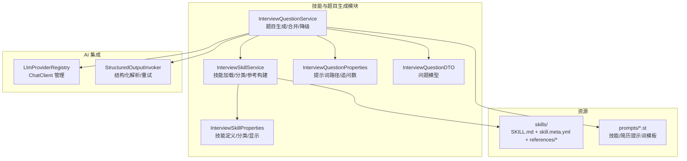
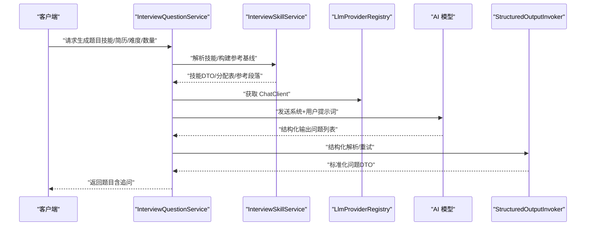
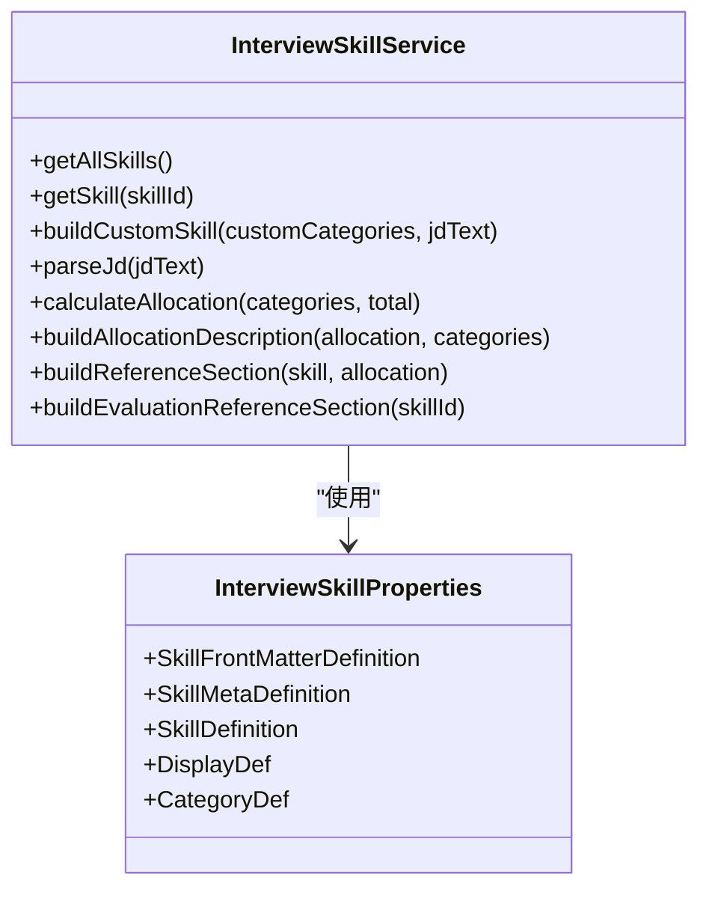
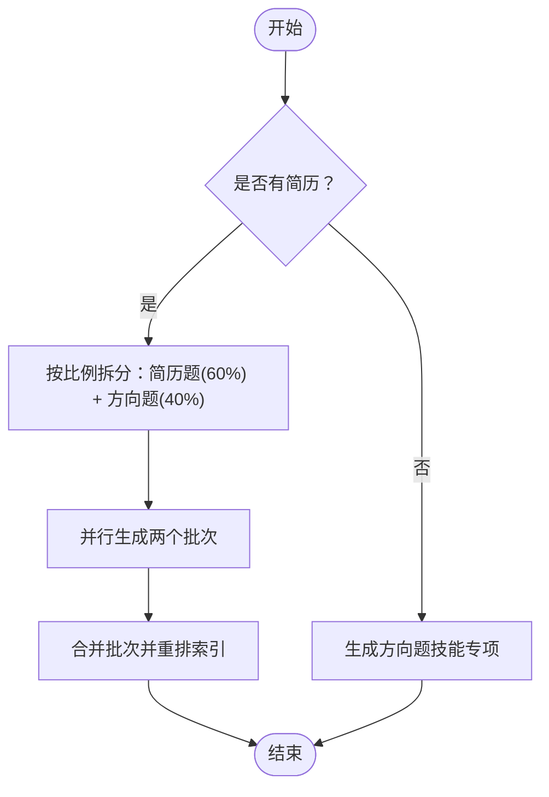
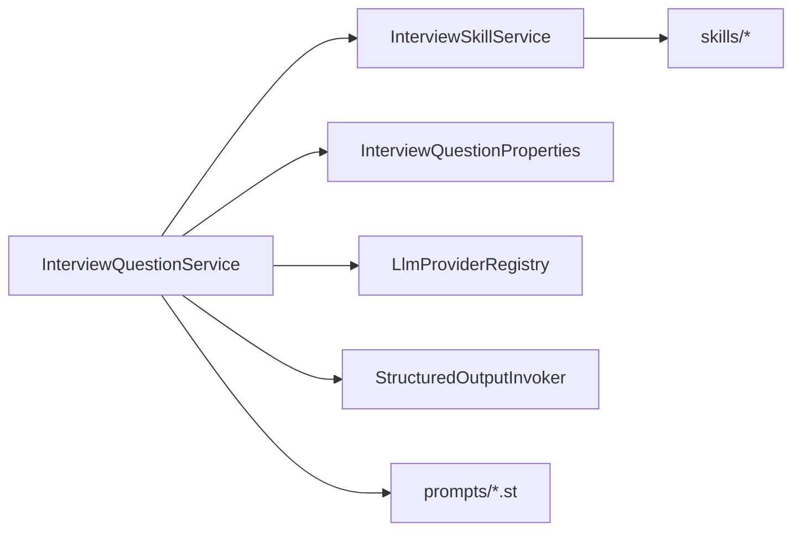

# 技能系统与题目生成

<cite>
**本文引用的文件**
- [InterviewSkillService.java](file://app/src/main/java/interview/guide/modules/interview/skill/InterviewSkillService.java)
- [InterviewQuestionService.java](file://app/src/main/java/interview/guide/modules/interview/service/InterviewQuestionService.java)
- [InterviewSkillProperties.java](file://app/src/main/java/interview/guide/modules/interview/skill/InterviewSkillProperties.java)
- [InterviewQuestionProperties.java](file://app/src/main/java/interview/guide/modules/interview/service/InterviewQuestionProperties.java)
- [InterviewQuestionDTO.java](file://app/src/main/java/interview/guide/modules/interview/model/InterviewQuestionDTO.java)
- [LlmProviderRegistry.java](file://app/src/main/java/interview/guide/common/ai/LlmProviderRegistry.java)
- [StructuredOutputInvoker.java](file://app/src/main/java/interview/guide/common/ai/StructuredOutputInvoker.java)
- [SKILL.md（Java 后端）](file://app/src/main/resources/skills/java-backend/SKILL.md)
- [skill.meta.yml（Java 后端）](file://app/src/main/resources/skills/java-backend/skill.meta.yml)
- [system-design-scenarios.md（共享参考）](file://app/src/main/resources/skills/_shared/references/system-design-scenarios.md)
- [interview-question-skill-user.st](file://app/src/main/resources/prompts/interview-question-skill-user.st)
- [interview-question-resume-user.st](file://app/src/main/resources/prompts/interview-question-resume-user.st)
</cite>

## 目录
1. [简介](#简介)
2. [项目结构](#项目结构)
3. [核心组件](#核心组件)
4. [架构总览](#架构总览)
5. [详细组件分析](#详细组件分析)
6. [依赖分析](#依赖分析)
7. [性能考量](#性能考量)
8. [故障排查指南](#故障排查指南)
9. [结论](#结论)
10. [附录](#附录)

## 简介
本文件面向“技能系统与题目生成”功能，系统性阐述 InterviewSkillService 的技能管理机制与 InterviewQuestionService 的题目生成算法。内容涵盖：
- 技能定义、分类体系、难度等级与显示配置
- 基于 Skill 的题目分配与参考基线构建
- 题目池管理与并行抽样策略
- 技能资源文件组织（技能目录、元数据、提示词模板）
- 不同类型题目生成策略（简历导向、技能专项、综合评估）
- 技能系统扩展机制（新增技能、定制模板、评估标准）
- 与 AI 模型的集成（提示词工程、上下文构建、多轮对话）
- 题目质量控制（去重、难度平衡、内容审核）

## 项目结构
技能与题目生成相关的核心模块位于后端 Java 工程 app/src/main/java 下的 modules/interview 子包，配套资源位于 app/src/main/resources 下的 skills 与 prompts 目录。

图表来源
- [InterviewSkillService.java:1-593](file://app/src/main/java/interview/guide/modules/interview/skill/InterviewSkillService.java#L1-L593)
- [InterviewQuestionService.java:1-449](file://app/src/main/java/interview/guide/modules/interview/service/InterviewQuestionService.java#L1-L449)
- [InterviewQuestionProperties.java:1-18](file://app/src/main/java/interview/guide/modules/interview/service/InterviewQuestionProperties.java#L1-L18)
- [InterviewSkillProperties.java:1-74](file://app/src/main/java/interview/guide/modules/interview/skill/InterviewSkillProperties.java#L1-L74)
- [InterviewQuestionDTO.java:1-36](file://app/src/main/java/interview/guide/modules/interview/model/InterviewQuestionDTO.java#L1-L36)
- [LlmProviderRegistry.java:1-230](file://app/src/main/java/interview/guide/common/ai/LlmProviderRegistry.java#L1-L230)
- [StructuredOutputInvoker.java:1-172](file://app/src/main/java/interview/guide/common/ai/StructuredOutputInvoker.java#L1-L172)

章节来源
- [InterviewSkillService.java:79-105](file://app/src/main/java/interview/guide/modules/interview/skill/InterviewSkillService.java#L79-L105)
- [InterviewQuestionService.java:86-104](file://app/src/main/java/interview/guide/modules/interview/service/InterviewQuestionService.java#L86-L104)

## 核心组件
- InterviewSkillService：负责技能加载、分类索引、参考文件缓存、JD 解析、题目分配与参考基线构建。
- InterviewQuestionService：负责根据技能与简历并行生成题目，合并批次，处理降级与回退。
- InterviewSkillProperties：技能定义的数据模型（前端元数据 + 自定义显示）。
- InterviewQuestionProperties：题目生成相关的配置（提示词路径、追问数）。
- InterviewQuestionDTO：统一的问题数据模型（含主/追问、类型、摘要等）。
- LlmProviderRegistry：LLM 提供商注册与 ChatClient 构建。
- StructuredOutputInvoker：结构化输出调用封装与重试策略。

章节来源
- [InterviewSkillService.java:34-105](file://app/src/main/java/interview/guide/modules/interview/skill/InterviewSkillService.java#L34-L105)
- [InterviewQuestionService.java:41-104](file://app/src/main/java/interview/guide/modules/interview/service/InterviewQuestionService.java#L41-L104)
- [InterviewSkillProperties.java:10-74](file://app/src/main/java/interview/guide/modules/interview/skill/InterviewSkillProperties.java#L10-L74)
- [InterviewQuestionProperties.java:7-18](file://app/src/main/java/interview/guide/modules/interview/service/InterviewQuestionProperties.java#L7-L18)
- [InterviewQuestionDTO.java:7-36](file://app/src/main/java/interview/guide/modules/interview/model/InterviewQuestionDTO.java#L7-L36)
- [LlmProviderRegistry.java:35-90](file://app/src/main/java/interview/guide/common/ai/LlmProviderRegistry.java#L35-L90)
- [StructuredOutputInvoker.java:19-103](file://app/src/main/java/interview/guide/common/ai/StructuredOutputInvoker.java#L19-L103)

## 架构总览
技能系统与题目生成的整体流程如下：

图表来源
- [InterviewQuestionService.java:111-173](file://app/src/main/java/interview/guide/modules/interview/service/InterviewQuestionService.java#L111-L173)
- [InterviewSkillService.java:209-256](file://app/src/main/java/interview/guide/modules/interview/skill/InterviewSkillService.java#L209-L256)
- [LlmProviderRegistry.java:65-90](file://app/src/main/java/interview/guide/common/ai/LlmProviderRegistry.java#L65-L90)
- [StructuredOutputInvoker.java:59-103](file://app/src/main/java/interview/guide/common/ai/StructuredOutputInvoker.java#L59-L103)

## 详细组件分析

### 技能系统：InterviewSkillService
- 技能加载与注册
  - 启动时扫描 classpath:skills/*/SKILL.md，解析 Front Matter 与正文，合并 skill.meta.yml 的自定义字段，构建预设技能注册表。
  - 通过 categoryRefIndex 建立分类到参考文件的映射，支持 shared/local 两种来源。
- 参考文件管理
  - 参考内容缓存（ConcurrentHashMap），按候选路径顺序查找，支持 shared 与 skill-local 优先级。
  - 单文件与总体大小限制，防止过大内容影响上下文。
- JD 解析与自定义技能
  - 使用结构化输出模板与系统提示词，解析 JD 并输出分类列表；随后按本地映射纠正 reference 与 shared 标记，生成自定义技能 DTO。
- 题目分配与参考基线
  - calculateAllocation：按优先级（ALWAYS_ONE/CORE/NORMAL）分阶段分配，先保底再覆盖率，最后轮转补齐。
  - buildReferenceSection/buildEvaluationReferenceSection：按分配过滤分类，拼接参考段落，限制长度并截断。
- 数据模型
  - SkillDTO/SkillCategoryDTO/DisplayDTO 作为运行时聚合结构，便于前端渲染与题目生成。

图表来源
- [InterviewSkillService.java:122-385](file://app/src/main/java/interview/guide/modules/interview/skill/InterviewSkillService.java#L122-L385)
- [InterviewSkillProperties.java:18-72](file://app/src/main/java/interview/guide/modules/interview/skill/InterviewSkillProperties.java#L18-L72)

章节来源
- [InterviewSkillService.java:79-105](file://app/src/main/java/interview/guide/modules/interview/skill/InterviewSkillService.java#L79-L105)
- [InterviewSkillService.java:200-228](file://app/src/main/java/interview/guide/modules/interview/skill/InterviewSkillService.java#L200-L228)
- [InterviewSkillService.java:234-297](file://app/src/main/java/interview/guide/modules/interview/skill/InterviewSkillService.java#L234-L297)
- [InterviewSkillService.java:310-385](file://app/src/main/java/interview/guide/modules/interview/skill/InterviewSkillService.java#L310-L385)

### 题目生成：InterviewQuestionService
- 生成策略
  - 无简历：仅技能专项出题（方向题）。
  - 有简历：并行生成“简历题（60%）+ 方向题（40%）”，合并批次并调整索引。
- 结构化输出与降级
  - 使用 StructuredOutputInvoker 调用 AI，严格 JSON 输出；失败时按策略降级：先方向题降简历题，再全回退默认问题。
- 上下文构建
  - 历史去重：基于历史问题类型与摘要汇总，避免重复。
  - 难度描述：支持 junior/mid/senior 三档描述。
  - 参考基线：按分配表拼接 references，限制长度。
  - 个人风格：支持 persona 段落与 JD 段落。
- 追问策略
  - 默认追问数可配置；对空/非法追问进行清洗与截断；追问类型与父问题索引保持关联。

图表来源
- [InterviewQuestionService.java:111-173](file://app/src/main/java/interview/guide/modules/interview/service/InterviewQuestionService.java#L111-L173)
- [InterviewQuestionService.java:258-277](file://app/src/main/java/interview/guide/modules/interview/service/InterviewQuestionService.java#L258-L277)

章节来源
- [InterviewQuestionService.java:111-173](file://app/src/main/java/interview/guide/modules/interview/service/InterviewQuestionService.java#L111-L173)
- [InterviewQuestionService.java:175-256](file://app/src/main/java/interview/guide/modules/interview/service/InterviewQuestionService.java#L175-L256)
- [InterviewQuestionService.java:293-348](file://app/src/main/java/interview/guide/modules/interview/service/InterviewQuestionService.java#L293-L348)
- [InterviewQuestionService.java:350-385](file://app/src/main/java/interview/guide/modules/interview/service/InterviewQuestionService.java#L350-L385)

### 技能资源文件组织
- 技能目录结构
  - skills/<skill>/SKILL.md：技能定义（Front Matter + 说明 + 参考资源清单）。
  - skills/<skill>/skill.meta.yml：自定义显示与分类（key/label/priority/ref/shared）。
  - skills/_shared/references/：共享参考文件，供多技能复用。
- 示例
  - Java 后端技能包含 persona 指南与参考资源清单。
  - skill.meta.yml 定义分类优先级与引用文件。
  - system-design-scenarios.md 提供系统设计通用框架与高频场景思路。

章节来源
- [SKILL.md（Java 后端）:1-22](file://app/src/main/resources/skills/java-backend/SKILL.md#L1-L22)
- [skill.meta.yml（Java 后端）:1-36](file://app/src/main/resources/skills/java-backend/skill.meta.yml#L1-L36)
- [system-design-scenarios.md（共享参考）:1-74](file://app/src/main/resources/skills/_shared/references/system-design-scenarios.md#L1-L74)

### 提示词模板与上下文
- 技能专项模板（interview-question-skill-user.st）
  - 输入：问题总数、追问数、难度描述、技能名称/描述、分配表、历史去重、参考基线、JD、persona。
  - 输出：严格 JSON 的问题数组，包含主问题与追问，以及 topicSummary 用于去重。
- 简历模板（interview-question-resume-user.st）
  - 输入：问题总数、追问数、技能名称/描述、难度描述、简历文本、历史去重。
  - 输出：针对项目经历的主问题与追问。
- 系统提示词
  - LlmProviderRegistry 提供 ChatClient，默认 advisor 配置可启用工具调用、记忆与日志等。

章节来源
- [interview-question-skill-user.st:1-39](file://app/src/main/resources/prompts/interview-question-skill-user.st#L1-L39)
- [interview-question-resume-user.st:1-25](file://app/src/main/resources/prompts/interview-question-resume-user.st#L1-L25)
- [LlmProviderRegistry.java:134-190](file://app/src/main/java/interview/guide/common/ai/LlmProviderRegistry.java#L134-L190)

### 题目质量控制
- 去重策略
  - 历史去重：按类型分组汇总 topicSummary，避免重复出题。
  - 历史摘要：若无摘要，自动截取主问题前 30 字作为摘要。
- 难度平衡
  - 难度描述映射：junior/mid/senior → 不同侧重点与深度。
  - 分配策略：优先 ALWAYS_ONE 与 CORE 类别，保证覆盖面与代表性。
- 内容审核与降级
  - 结构化解析失败时，按“方向题→简历题→默认问题”的顺序降级。
  - 截断与清洗：AI 多生时截断到主问题上限；追问非法或为空时清洗与截断。

章节来源
- [InterviewQuestionService.java:387-410](file://app/src/main/java/interview/guide/modules/interview/service/InterviewQuestionService.java#L387-L410)
- [InterviewQuestionService.java:287-291](file://app/src/main/java/interview/guide/modules/interview/service/InterviewQuestionService.java#L287-L291)
- [InterviewQuestionService.java:324-348](file://app/src/main/java/interview/guide/modules/interview/service/InterviewQuestionService.java#L324-L348)
- [InterviewQuestionService.java:426-435](file://app/src/main/java/interview/guide/modules/interview/service/InterviewQuestionService.java#L426-L435)

### 扩展机制
- 新增技能
  - 在 skills/<new>/ 下新增 SKILL.md 与 skill.meta.yml；重启后自动加载。
  - 若需共享参考，放入 skills/_shared/references/ 并在 meta 中设置 shared: true。
- 题目模板定制
  - 修改 prompts/*.st 模板，或新增模板并通过 InterviewQuestionProperties 指定路径。
- 评估标准配置
  - 通过 buildEvaluationReferenceSectionSafe 安全地在评估阶段加载参考基线，避免异常中断。

章节来源
- [InterviewSkillService.java:333-343](file://app/src/main/java/interview/guide/modules/interview/skill/InterviewSkillService.java#L333-L343)
- [InterviewQuestionProperties.java:10-17](file://app/src/main/java/interview/guide/modules/interview/service/InterviewQuestionProperties.java#L10-L17)

### 与 AI 模型的集成
- ChatClient 管理
  - LlmProviderRegistry 基于配置动态创建 ChatClient，支持默认提供商与工具回调。
- 结构化输出
  - StructuredOutputInvoker 统一封装重试、严格 JSON 指令与指标采集，提升稳定性与可观测性。
- 多轮对话与上下文
  - 可通过 advisor 配置启用消息记忆与工具调用，增强上下文连贯性。

章节来源
- [LlmProviderRegistry.java:65-90](file://app/src/main/java/interview/guide/common/ai/LlmProviderRegistry.java#L65-L90)
- [StructuredOutputInvoker.java:59-103](file://app/src/main/java/interview/guide/common/ai/StructuredOutputInvoker.java#L59-L103)
- [LlmProviderRegistry.java:192-228](file://app/src/main/java/interview/guide/common/ai/LlmProviderRegistry.java#L192-L228)

## 依赖分析
- 组件耦合
  - InterviewQuestionService 依赖 InterviewSkillService（技能解析/参考）、InterviewQuestionProperties（提示词路径）、LlmProviderRegistry（模型接入）、StructuredOutputInvoker（结构化解析）。
  - InterviewSkillService 依赖技能资源文件与 YAML 解析，内部构建只读索引。
- 外部依赖
  - Spring AI ChatClient、BeanOutputConverter、SnakeYAML、资源加载器。

图表来源
- [InterviewQuestionService.java:86-104](file://app/src/main/java/interview/guide/modules/interview/service/InterviewQuestionService.java#L86-L104)
- [InterviewSkillService.java:69-77](file://app/src/main/java/interview/guide/modules/interview/skill/InterviewSkillService.java#L69-L77)

章节来源
- [InterviewQuestionService.java:86-104](file://app/src/main/java/interview/guide/modules/interview/service/InterviewQuestionService.java#L86-L104)
- [InterviewSkillService.java:69-77](file://app/src/main/java/interview/guide/modules/interview/skill/InterviewSkillService.java#L69-L77)

## 性能考量
- 并行生成
  - 使用虚拟线程执行器并行生成简历题与方向题，缩短总等待时间。
- 缓存与索引
  - 技能注册表与参考内容缓存减少 IO 与解析开销；categoryRefIndex 提升查找效率。
- 上下文截断
  - 对单文件与总体参考内容设置上限，避免超出模型上下文限制。
- 结构化解析重试
  - 通过重试与严格 JSON 指令降低失败率，提升吞吐稳定性。

章节来源
- [InterviewQuestionService.java:93-94](file://app/src/main/java/interview/guide/modules/interview/service/InterviewQuestionService.java#L93-L94)
- [InterviewSkillService.java:58-62](file://app/src/main/java/interview/guide/modules/interview/skill/InterviewSkillService.java#L58-L62)
- [InterviewSkillService.java:463-531](file://app/src/main/java/interview/guide/modules/interview/skill/InterviewSkillService.java#L463-L531)
- [StructuredOutputInvoker.java:72-96](file://app/src/main/java/interview/guide/common/ai/StructuredOutputInvoker.java#L72-L96)

## 故障排查指南
- 技能加载失败
  - 检查 SKILL.md 是否包含合法 Front Matter；确认 skill.meta.yml 路径存在且可读。
  - 查看启动日志中的加载条目与警告。
- 参考文件缺失
  - 确认 ref 名称与 shared 标记正确；检查候选路径是否存在。
- 题目生成失败
  - 观察结构化解析重试日志；确认提示词模板字段齐全；检查 AI 服务可用性。
- 降级行为
  - 若方向题失败，系统会降级为简历题；若两者皆失败，则回退默认问题集合。

章节来源
- [InterviewSkillService.java:92-99](file://app/src/main/java/interview/guide/modules/interview/skill/InterviewSkillService.java#L92-L99)
- [InterviewQuestionService.java:147-162](file://app/src/main/java/interview/guide/modules/interview/service/InterviewQuestionService.java#L147-L162)
- [StructuredOutputInvoker.java:89-95](file://app/src/main/java/interview/guide/common/ai/StructuredOutputInvoker.java#L89-L95)

## 结论
本系统通过“技能定义 + 分类优先级 + 参考基线 + 结构化提示词 + 并行生成”的组合，实现了可扩展、可控制、可评估的题目生成流水线。InterviewSkillService 提供稳定的技能与参考管理，InterviewQuestionService 则在多样性与一致性之间取得平衡，配合 AI 集成与质量控制策略，能够高效支撑不同难度与方向的面试场景。

## 附录
- 技能与分类示例
  - Java 后端技能包含 JAVA/MYSQL/REDIS/SPRING/SYSTEM_DESIGN_SCENARIO/PROJECT 等分类，优先级分别为 CORE 与 ALWAYS_ONE。
- 提示词模板字段
  - 技能专项模板强调分配表、历史去重、参考基线与 persona；简历模板强调项目经历与难度描述。
- 数据模型要点
  - InterviewQuestionDTO 支持主/追问、类型（Skill 分类 key）、摘要（topicSummary）与父子关系索引。

章节来源
- [skill.meta.yml（Java 后端）:7-36](file://app/src/main/resources/skills/java-backend/skill.meta.yml#L7-L36)
- [interview-question-skill-user.st:15-39](file://app/src/main/resources/prompts/interview-question-skill-user.st#L15-L39)
- [interview-question-resume-user.st:19-25](file://app/src/main/resources/prompts/interview-question-resume-user.st#L19-L25)
- [InterviewQuestionDTO.java:7-36](file://app/src/main/java/interview/guide/modules/interview/model/InterviewQuestionDTO.java#L7-L36)