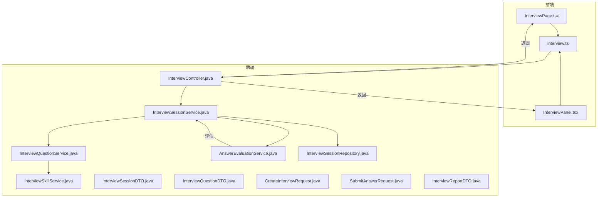
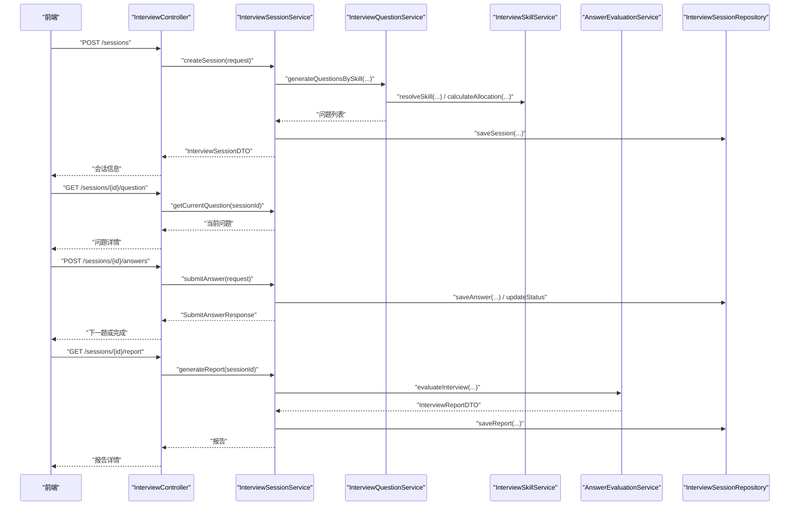
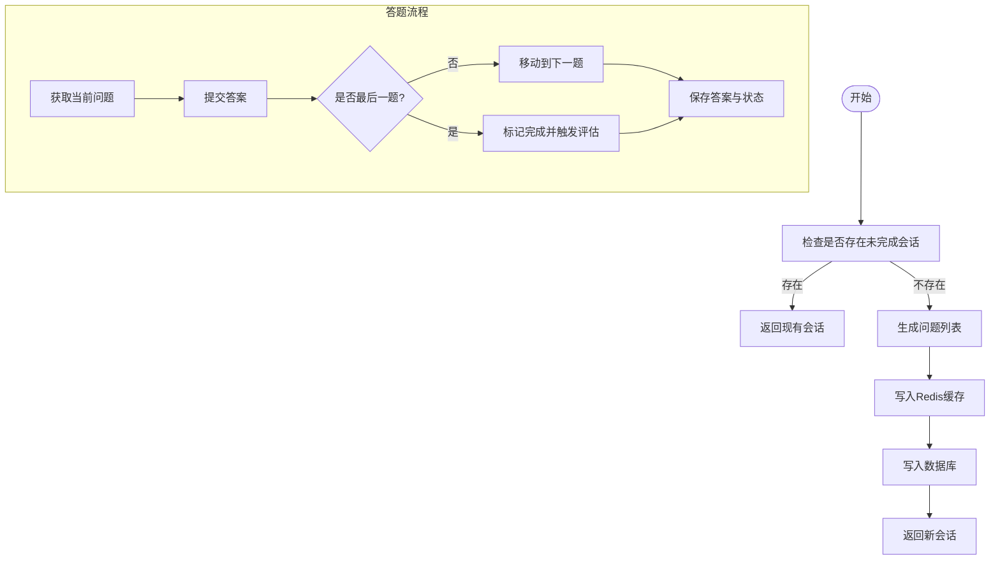
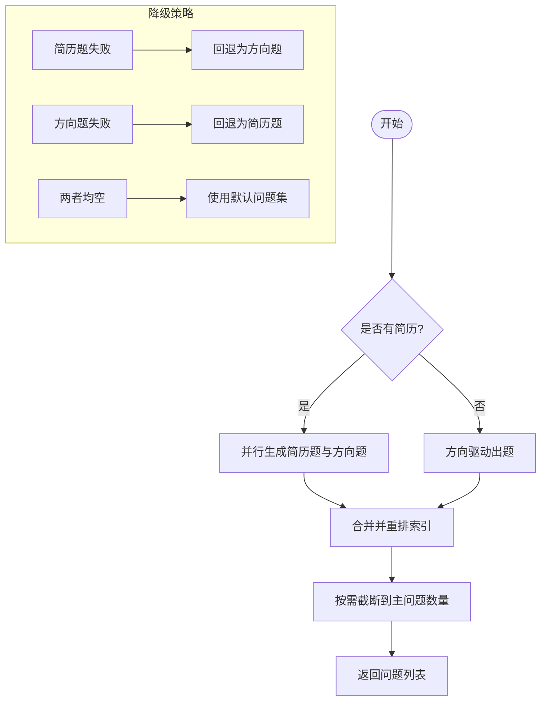
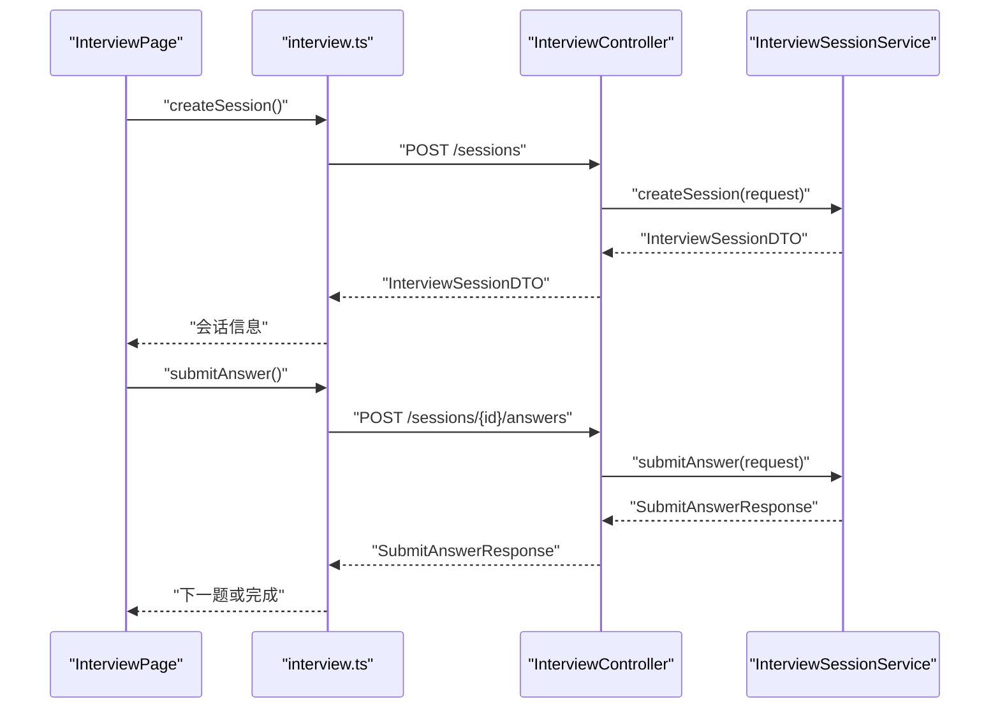
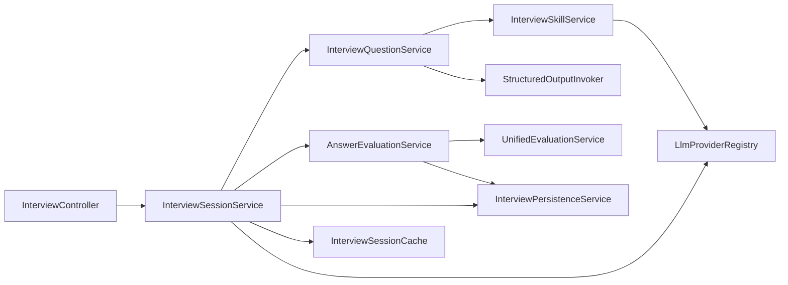

# 文字面试功能

<cite>
**本文引用的文件**
- [InterviewController.java](file://app/src/main/java/interview/guide/modules/interview/InterviewController.java)
- [InterviewSessionService.java](file://app/src/main/java/interview/guide/modules/interview/service/InterviewSessionService.java)
- [InterviewQuestionService.java](file://app/src/main/java/interview/guide/modules/interview/service/InterviewQuestionService.java)
- [AnswerEvaluationService.java](file://app/src/main/java/interview/guide/modules/interview/service/AnswerEvaluationService.java)
- [InterviewSessionDTO.java](file://app/src/main/java/interview/guide/modules/interview/model/InterviewSessionDTO.java)
- [InterviewQuestionDTO.java](file://app/src/main/java/interview/guide/modules/interview/model/InterviewQuestionDTO.java)
- [CreateInterviewRequest.java](file://app/src/main/java/interview/guide/modules/interview/model/CreateInterviewRequest.java)
- [SubmitAnswerRequest.java](file://app/src/main/java/interview/guide/modules/interview/model/SubmitAnswerRequest.java)
- [InterviewReportDTO.java](file://app/src/main/java/interview/guide/modules/interview/model/InterviewReportDTO.java)
- [InterviewSessionRepository.java](file://app/src/main/java/interview/guide/modules/interview/repository/InterviewSessionRepository.java)
- [InterviewSkillService.java](file://app/src/main/java/interview/guide/modules/interview/skill/InterviewSkillService.java)
- [InterviewPage.tsx](file://frontend/src/pages/InterviewPage.tsx)
- [InterviewPanel.tsx](file://frontend/src/components/InterviewPanel.tsx)
- [interview.ts](file://frontend/src/api/interview.ts)
- [interview-question-skill-user.st](file://app/src/main/resources/prompts/interview-question-skill-user.st)
- [interview-question-resume-user.st](file://app/src/main/resources/prompts/interview-question-resume-user.st)
</cite>

## 目录
1. [简介](#简介)
2. [项目结构](#项目结构)
3. [核心组件](#核心组件)
4. [架构总览](#架构总览)
5. [详细组件分析](#详细组件分析)
6. [依赖分析](#依赖分析)
7. [性能考量](#性能考量)
8. [故障排查指南](#故障排查指南)
9. [结论](#结论)
10. [附录](#附录)

## 简介
本文件面向“文字面试”功能，系统性阐述其核心实现机制与技术细节，覆盖会话创建流程、问题生成算法、答案提交处理、报告生成与导出、以及前后端交互状态管理。重点包括：
- InterviewSessionService 的会话管理逻辑（状态维护、问题索引、答案存储与持久化）
- InterviewQuestionService 的问题生成策略（Skill 驱动、难度分布、历史去重）
- 前端 InterviewPage 与 InterviewPanel 的交互与状态管理
- 完整的 RESTful 接口说明（参数、响应、错误处理）
- 面试流程生命周期（从初始化到完成）

## 项目结构
文字面试功能位于后端模块 interview 下，采用分层架构：控制器层负责对外暴露 API；服务层封装业务逻辑；仓储层负责持久化；模型层承载数据传输对象；技能服务负责 Skill 与参考资源解析；前端通过 API 模块与后端交互。

**图表来源**
- [InterviewController.java:30-175](file://app/src/main/java/interview/guide/modules/interview/InterviewController.java#L30-L175)
- [InterviewSessionService.java:40-506](file://app/src/main/java/interview/guide/modules/interview/service/InterviewSessionService.java#L40-L506)
- [InterviewQuestionService.java:40-448](file://app/src/main/java/interview/guide/modules/interview/service/InterviewQuestionService.java#L40-L448)
- [AnswerEvaluationService.java:25-98](file://app/src/main/java/interview/guide/modules/interview/service/AnswerEvaluationService.java#L25-L98)
- [InterviewSkillService.java:34-200](file://app/src/main/java/interview/guide/modules/interview/skill/InterviewSkillService.java#L34-L200)
- [InterviewSessionRepository.java:17-76](file://app/src/main/java/interview/guide/modules/interview/repository/InterviewSessionRepository.java#L17-L76)
- [InterviewPage.tsx:35-291](file://frontend/src/pages/InterviewPage.tsx#L35-L291)
- [InterviewPanel.tsx:24-200](file://frontend/src/components/InterviewPanel.tsx#L24-L200)
- [interview.ts:25-106](file://frontend/src/api/interview.ts#L25-L106)

**章节来源**
- [InterviewController.java:30-175](file://app/src/main/java/interview/guide/modules/interview/InterviewController.java#L30-L175)
- [InterviewSessionService.java:40-506](file://app/src/main/java/interview/guide/modules/interview/service/InterviewSessionService.java#L40-L506)
- [InterviewQuestionService.java:40-448](file://app/src/main/java/interview/guide/modules/interview/service/InterviewQuestionService.java#L40-L448)
- [AnswerEvaluationService.java:25-98](file://app/src/main/java/interview/guide/modules/interview/service/AnswerEvaluationService.java#L25-L98)
- [InterviewSkillService.java:34-200](file://app/src/main/java/interview/guide/modules/interview/skill/InterviewSkillService.java#L34-L200)
- [InterviewSessionRepository.java:17-76](file://app/src/main/java/interview/guide/modules/interview/repository/InterviewSessionRepository.java#L17-L76)
- [InterviewPage.tsx:35-291](file://frontend/src/pages/InterviewPage.tsx#L35-L291)
- [InterviewPanel.tsx:24-200](file://frontend/src/components/InterviewPanel.tsx#L24-L200)
- [interview.ts:25-106](file://frontend/src/api/interview.ts#L25-L106)

## 核心组件
- 控制器层：提供会话创建、问题获取、答案提交、报告生成、导出、删除等 RESTful 接口，并集成限流保护。
- 会话服务层：负责会话生命周期管理（创建、恢复、状态推进）、问题索引与答案存储、持久化与缓存同步、异步评估触发。
- 问题生成服务层：基于 Skill 与难度生成题目，支持简历驱动与方向驱动两种模式，具备历史去重、追问生成与降级回退。
- 评估服务层：将问题与答案转为统一评估模型，调用通用评估服务生成报告。
- 技能服务层：加载预设 Skill、解析 JD 构建自定义 Skill、构建参考材料与分配表。
- 仓储层：提供会话、答案、历史记录的查询与持久化能力。
- 前端页面与组件：负责会话初始化、问题展示、答案提交、提前交卷、报告导出与历史记录展示。

**章节来源**
- [InterviewController.java:30-175](file://app/src/main/java/interview/guide/modules/interview/InterviewController.java#L30-L175)
- [InterviewSessionService.java:40-506](file://app/src/main/java/interview/guide/modules/interview/service/InterviewSessionService.java#L40-L506)
- [InterviewQuestionService.java:40-448](file://app/src/main/java/interview/guide/modules/interview/service/InterviewQuestionService.java#L40-L448)
- [AnswerEvaluationService.java:25-98](file://app/src/main/java/interview/guide/modules/interview/service/AnswerEvaluationService.java#L25-L98)
- [InterviewSkillService.java:34-200](file://app/src/main/java/interview/guide/modules/interview/skill/InterviewSkillService.java#L34-L200)
- [InterviewSessionRepository.java:17-76](file://app/src/main/java/interview/guide/modules/interview/repository/InterviewSessionRepository.java#L17-L76)
- [InterviewPage.tsx:35-291](file://frontend/src/pages/InterviewPage.tsx#L35-L291)
- [InterviewPanel.tsx:24-200](file://frontend/src/components/InterviewPanel.tsx#L24-L200)
- [interview.ts:25-106](file://frontend/src/api/interview.ts#L25-L106)

## 架构总览
文字面试采用“控制器-服务-仓储-模型”的分层架构，配合 Redis 缓存与数据库双写，保证高并发下的会话状态一致性与可恢复性。问题生成与评估通过结构化输出与统一评估服务实现标准化。

**图表来源**
- [InterviewController.java:50-100](file://app/src/main/java/interview/guide/modules/interview/InterviewController.java#L50-L100)
- [InterviewSessionService.java:55-118](file://app/src/main/java/interview/guide/modules/interview/service/InterviewSessionService.java#L55-L118)
- [InterviewQuestionService.java:111-173](file://app/src/main/java/interview/guide/modules/interview/service/InterviewQuestionService.java#L111-L173)
- [AnswerEvaluationService.java:45-75](file://app/src/main/java/interview/guide/modules/interview/service/AnswerEvaluationService.java#L45-L75)
- [InterviewSessionRepository.java:23-29](file://app/src/main/java/interview/guide/modules/interview/repository/InterviewSessionRepository.java#L23-L29)

## 详细组件分析

### 会话管理与生命周期（InterviewSessionService）
- 会话创建
  - 若请求包含简历ID且未强制创建，优先检查是否存在未完成会话，存在则直接返回现有会话，避免重复创建。
  - 使用随机 sessionId，基于 skillId 与难度生成问题列表，合并历史问题，写入 Redis 缓存与数据库。
- 会话恢复
  - 优先从 Redis 缓存获取；若未命中，从数据库恢复并回填缓存。
- 当前问题与索引
  - 首次访问时将状态从 CREATED 推进至 IN_PROGRESS；当索引越界时视为完成。
- 答案提交
  - 更新对应问题的答案，移动到下一题；若为最后一题，状态置为 COMPLETED，并触发异步评估任务。
- 提前交卷
  - 将状态置为 COMPLETED，设置评估状态为 PENDING，并发送评估任务。
- 报告生成
  - 仅在会话完成或已评估状态下允许生成；调用评估服务生成报告并持久化。

**图表来源**
- [InterviewSessionService.java:55-118](file://app/src/main/java/interview/guide/modules/interview/service/InterviewSessionService.java#L55-L118)
- [InterviewSessionService.java:295-357](file://app/src/main/java/interview/guide/modules/interview/service/InterviewSessionService.java#L295-L357)
- [InterviewSessionService.java:403-427](file://app/src/main/java/interview/guide/modules/interview/service/InterviewSessionService.java#L403-L427)

**章节来源**
- [InterviewSessionService.java:55-118](file://app/src/main/java/interview/guide/modules/interview/service/InterviewSessionService.java#L55-L118)
- [InterviewSessionService.java:142-178](file://app/src/main/java/interview/guide/modules/interview/service/InterviewSessionService.java#L142-L178)
- [InterviewSessionService.java:266-289](file://app/src/main/java/interview/guide/modules/interview/service/InterviewSessionService.java#L266-L289)
- [InterviewSessionService.java:295-357](file://app/src/main/java/interview/guide/modules/interview/service/InterviewSessionService.java#L295-L357)
- [InterviewSessionService.java:403-427](file://app/src/main/java/interview/guide/modules/interview/service/InterviewSessionService.java#L403-L427)
- [InterviewSessionService.java:453-490](file://app/src/main/java/interview/guide/modules/interview/service/InterviewSessionService.java#L453-L490)

### 问题生成策略（InterviewQuestionService）
- 模式选择
  - 无简历：仅方向驱动（Skill）出题。
  - 有简历：并行生成“简历题（60%）+ 方向题（40%）”，最终合并并重排索引。
- 技能与难度
  - 解析 skillId 或自定义分类构建 SkillDTO；难度映射为描述字符串。
- 历史去重
  - 构建历史知识点摘要段落，避免重复出题。
- 追问生成
  - 每个主问题附加固定数量的追问，类型标注为“追问N”。
- 降级回退
  - 任一分支失败时进行降级：简历题失败则回退为方向题，方向题失败则回退为简历题，均失败则使用默认问题集。
- 输出规范
  - 结构化输出，严格限制主问题数量，确保每题包含 topicSummary 便于去重。

**图表来源**
- [InterviewQuestionService.java:111-173](file://app/src/main/java/interview/guide/modules/interview/service/InterviewQuestionService.java#L111-L173)
- [InterviewQuestionService.java:136-162](file://app/src/main/java/interview/guide/modules/interview/service/InterviewQuestionService.java#L136-L162)
- [InterviewQuestionService.java:258-277](file://app/src/main/java/interview/guide/modules/interview/service/InterviewQuestionService.java#L258-L277)
- [InterviewQuestionService.java:324-348](file://app/src/main/java/interview/guide/modules/interview/service/InterviewQuestionService.java#L324-L348)
- [InterviewQuestionService.java:350-385](file://app/src/main/java/interview/guide/modules/interview/service/InterviewQuestionService.java#L350-L385)

**章节来源**
- [InterviewQuestionService.java:111-173](file://app/src/main/java/interview/guide/modules/interview/service/InterviewQuestionService.java#L111-L173)
- [InterviewQuestionService.java:175-207](file://app/src/main/java/interview/guide/modules/interview/service/InterviewQuestionService.java#L175-L207)
- [InterviewQuestionService.java:209-256](file://app/src/main/java/interview/guide/modules/interview/service/InterviewQuestionService.java#L209-L256)
- [InterviewQuestionService.java:258-277](file://app/src/main/java/interview/guide/modules/interview/service/InterviewQuestionService.java#L258-L277)
- [InterviewQuestionService.java:324-385](file://app/src/main/java/interview/guide/modules/interview/service/InterviewQuestionService.java#L324-L385)
- [InterviewQuestionService.java:387-410](file://app/src/main/java/interview/guide/modules/interview/service/InterviewQuestionService.java#L387-L410)
- [InterviewQuestionService.java:426-447](file://app/src/main/java/interview/guide/modules/interview/service/InterviewQuestionService.java#L426-L447)

### 前端交互与状态管理（InterviewPage 与 InterviewPanel）
- InterviewPage
  - 初始化：根据是否存在 sessionIdToResume 决定恢复现有会话或创建新会话；创建时携带 questionCount、llmProvider、skillId、difficulty、customCategories、jdText 等配置。
  - 答题流程：提交答案后根据 hasNextQuestion 判断是否进入下一题或完成；支持暂存答案（不推进索引）与提前交卷。
  - 界面更新：根据会话 questions 重建消息历史，渲染面试官问题与用户答案。
- InterviewPanel
  - 展示历史面试记录，支持导出 PDF、删除记录；提供趋势图展示整体表现。

**图表来源**
- [InterviewPage.tsx:73-97](file://frontend/src/pages/InterviewPage.tsx#L73-L97)
- [InterviewPage.tsx:99-118](file://frontend/src/pages/InterviewPage.tsx#L99-L118)
- [InterviewPage.tsx:149-186](file://frontend/src/pages/InterviewPage.tsx#L149-L186)
- [InterviewPage.tsx:188-202](file://frontend/src/pages/InterviewPage.tsx#L188-L202)
- [interview.ts:36-66](file://frontend/src/api/interview.ts#L36-L66)
- [InterviewController.java:50-90](file://app/src/main/java/interview/guide/modules/interview/InterviewController.java#L50-L90)

**章节来源**
- [InterviewPage.tsx:35-291](file://frontend/src/pages/InterviewPage.tsx#L35-L291)
- [InterviewPanel.tsx:24-200](file://frontend/src/components/InterviewPanel.tsx#L24-L200)
- [interview.ts:25-106](file://frontend/src/api/interview.ts#L25-L106)
- [InterviewController.java:50-175](file://app/src/main/java/interview/guide/modules/interview/InterviewController.java#L50-L175)

### 数据模型与持久化
- 会话模型
  - InterviewSessionDTO：包含 sessionId、简历文本、总题数、当前索引、问题列表与状态枚举。
  - InterviewQuestionDTO：包含索引、问题、类型（Skill 分类 key）、分类标签、摘要、用户答案、分数、反馈、是否追问、父问题索引。
- 请求模型
  - CreateInterviewRequest：题目数量、简历ID、是否强制创建、LLM提供商、skillId、难度、自定义分类、JD文本。
  - SubmitAnswerRequest：会话ID、问题索引、答案。
- 报告模型
  - InterviewReportDTO：总分、各分类得分、每题详情、总体反馈、优势与改进建议、参考答案。
- 仓储
  - InterviewSessionRepository：提供按会话ID、简历ID、状态、技能ID等多维度查询与历史记录检索。

**章节来源**
- [InterviewSessionDTO.java:8-22](file://app/src/main/java/interview/guide/modules/interview/model/InterviewSessionDTO.java#L8-L22)
- [InterviewQuestionDTO.java:7-35](file://app/src/main/java/interview/guide/modules/interview/model/InterviewQuestionDTO.java#L7-L35)
- [CreateInterviewRequest.java:13-34](file://app/src/main/java/interview/guide/modules/interview/model/CreateInterviewRequest.java#L13-L34)
- [SubmitAnswerRequest.java:10-20](file://app/src/main/java/interview/guide/modules/interview/model/SubmitAnswerRequest.java#L10-L20)
- [InterviewReportDTO.java:8-49](file://app/src/main/java/interview/guide/modules/interview/model/InterviewReportDTO.java#L8-L49)
- [InterviewSessionRepository.java:17-76](file://app/src/main/java/interview/guide/modules/interview/repository/InterviewSessionRepository.java#L17-L76)

## 依赖分析
- 组件耦合
  - InterviewController 依赖 InterviewSessionService、InterviewHistoryService、InterviewPersistenceService。
  - InterviewSessionService 依赖 InterviewQuestionService、AnswerEvaluationService、InterviewPersistenceService、InterviewSessionCache、LlmProviderRegistry。
  - InterviewQuestionService 依赖 InterviewSkillService、StructuredOutputInvoker、PromptTemplate。
  - AnswerEvaluationService 依赖 UnifiedEvaluationService、InterviewPersistenceService、InterviewSkillService。
- 外部依赖
  - LLM 提供商注册中心（LlmProviderRegistry）与结构化输出调用器（StructuredOutputInvoker）。
  - Redis 缓存（InterviewSessionCache）与数据库（JPA Repository）。

**图表来源**
- [InterviewController.java:32-34](file://app/src/main/java/interview/guide/modules/interview/InterviewController.java#L32-L34)
- [InterviewSessionService.java:42-48](file://app/src/main/java/interview/guide/modules/interview/service/InterviewSessionService.java#L42-L48)
- [InterviewQuestionService.java:86-98](file://app/src/main/java/interview/guide/modules/interview/service/InterviewQuestionService.java#L86-L98)
- [AnswerEvaluationService.java:34-40](file://app/src/main/java/interview/guide/modules/interview/service/AnswerEvaluationService.java#L34-L40)

**章节来源**
- [InterviewController.java:32-34](file://app/src/main/java/interview/guide/modules/interview/InterviewController.java#L32-L34)
- [InterviewSessionService.java:42-48](file://app/src/main/java/interview/guide/modules/interview/service/InterviewSessionService.java#L42-L48)
- [InterviewQuestionService.java:86-98](file://app/src/main/java/interview/guide/modules/interview/service/InterviewQuestionService.java#L86-L98)
- [AnswerEvaluationService.java:34-40](file://app/src/main/java/interview/guide/modules/interview/service/AnswerEvaluationService.java#L34-L40)

## 性能考量
- 缓存优先：会话状态优先从 Redis 缓存读取，减少数据库压力；未命中时再从数据库恢复。
- 并行生成：简历题与方向题并行生成，缩短首屏等待时间。
- 虚拟线程：问题生成使用虚拟线程池，降低上下文切换开销。
- 超时控制：前端对 AI 生成与评估接口设置较长超时，避免网络抖动导致中断。
- 异步评估：完成答题后异步触发评估，避免阻塞主线程。

[本节为通用性能建议，无需特定文件引用]

## 故障排查指南
- 会话未找到
  - 现象：获取会话或生成报告时报错。
  - 排查：确认 sessionId 是否正确；检查 Redis 缓存与数据库是否存在；查看恢复流程日志。
- 答案索引无效
  - 现象：提交答案时报错。
  - 排查：确认 questionIndex 是否在问题列表范围内；检查当前索引与问题总数。
- 会话已完成
  - 现象：重复提交或提前交卷失败。
  - 排查：确认会话状态是否为 COMPLETED 或 EVALUATED。
- 评估失败
  - 现象：生成报告失败。
  - 排查：检查评估服务日志与 LLM 提供商可用性；确认参考材料与 prompt 正常。

**章节来源**
- [InterviewSessionService.java:133-134](file://app/src/main/java/interview/guide/modules/interview/service/InterviewSessionService.java#L133-L134)
- [InterviewSessionService.java:300-302](file://app/src/main/java/interview/guide/modules/interview/service/InterviewSessionService.java#L300-L302)
- [InterviewSessionService.java:406-408](file://app/src/main/java/interview/guide/modules/interview/service/InterviewSessionService.java#L406-L408)
- [AnswerEvaluationService.java:70-74](file://app/src/main/java/interview/guide/modules/interview/service/AnswerEvaluationService.java#L70-L74)

## 结论
文字面试功能通过清晰的分层架构与缓存-数据库双写策略，实现了高可用、可扩展的面试体验。问题生成采用 Skill 驱动与历史去重机制，确保题目质量与多样性；前端交互简洁直观，支持暂存与提前交卷等灵活操作；后端提供完善的 RESTful 接口与异步评估，满足大规模并发场景。

[本节为总结性内容，无需特定文件引用]

## 附录

### API 接口说明
- 会话管理
  - GET /api/interview/sessions：列出所有会话（用于历史页）
  - POST /api/interview/sessions：创建会话（请求体：CreateInterviewRequest）
  - GET /api/interview/sessions/{sessionId}：获取会话详情
  - GET /api/interview/sessions/{sessionId}/question：获取当前问题
  - GET /api/interview/sessions/unfinished/{resumeId}：查找未完成会话
  - DELETE /api/interview/sessions/{sessionId}：删除会话
- 答案与报告
  - POST /api/interview/sessions/{sessionId}/answers：提交答案（请求体：questionIndex, answer）
  - PUT /api/interview/sessions/{sessionId}/answers：暂存答案（请求体同上）
  - POST /api/interview/sessions/{sessionId}/complete：提前交卷
  - GET /api/interview/sessions/{sessionId}/report：生成报告
  - GET /api/interview/sessions/{sessionId}/details：获取面试详情
  - GET /api/interview/sessions/{sessionId}/export：导出 PDF（响应：application/pdf）
- 请求与响应
  - CreateInterviewRequest：questionCount（3-20）、resumeId、forceCreate、llmProvider、skillId、difficulty、customCategories、jdText
  - SubmitAnswerRequest：sessionId、questionIndex（≥0）、answer
  - SubmitAnswerResponse：hasNextQuestion、nextQuestion、newIndex、totalQuestions
  - InterviewReportDTO：overallScore、categoryScores、questionDetails、overallFeedback、strengths、improvements、referenceAnswers
- 错误处理
  - 业务异常：抛出 ErrorCode 对应错误码与消息
  - 限流：全局与IP限流保护接口
  - 导出失败：返回 500

**章节来源**
- [InterviewController.java:39-174](file://app/src/main/java/interview/guide/modules/interview/InterviewController.java#L39-L174)
- [CreateInterviewRequest.java:13-34](file://app/src/main/java/interview/guide/modules/interview/model/CreateInterviewRequest.java#L13-L34)
- [SubmitAnswerRequest.java:10-20](file://app/src/main/java/interview/guide/modules/interview/model/SubmitAnswerRequest.java#L10-L20)
- [InterviewReportDTO.java:8-49](file://app/src/main/java/interview/guide/modules/interview/model/InterviewReportDTO.java#L8-L49)

### 面试流程生命周期
- 初始化
  - 前端决定创建新会话或恢复现有会话；后端根据 skillId、难度、简历/JD 生成问题列表并写入缓存与数据库。
- 进行中
  - 前端轮询当前问题；用户提交答案后推进索引；支持暂存与提前交卷。
- 完成与评估
  - 最后一题提交或提前交卷后，触发异步评估；完成后可生成报告并导出 PDF。
- 历史与导出
  - 历史记录展示与导出，支持删除。

**章节来源**
- [InterviewPage.tsx:61-118](file://frontend/src/pages/InterviewPage.tsx#L61-L118)
- [InterviewSessionService.java:295-357](file://app/src/main/java/interview/guide/modules/interview/service/InterviewSessionService.java#L295-L357)
- [InterviewController.java:95-164](file://app/src/main/java/interview/guide/modules/interview/InterviewController.java#L95-L164)

### 提示模板要点（问题生成）
- 方向驱动用户模板（interview-question-skill-user.st）
  - 输入：questionCount、followUpCount、difficultyDescription、skillName、skillDescription、allocationTable、historicalSection、referenceSection、jdSection、personaSection
  - 输出：严格包含 exactly {questionCount} 个问题，每个主问题包含 topicSummary
- 简历驱动用户模板（interview-question-resume-user.st）
  - 输入：questionCount、followUpCount、difficultyDescription、skillName、skillDescription、resumeText、historicalSection
  - 输出：严格包含 exactly {questionCount} 个问题，每个主问题包含 topicSummary

**章节来源**
- [interview-question-skill-user.st:1-39](file://app/src/main/resources/prompts/interview-question-skill-user.st#L1-L39)
- [interview-question-resume-user.st:1-25](file://app/src/main/resources/prompts/interview-question-resume-user.st#L1-L25)