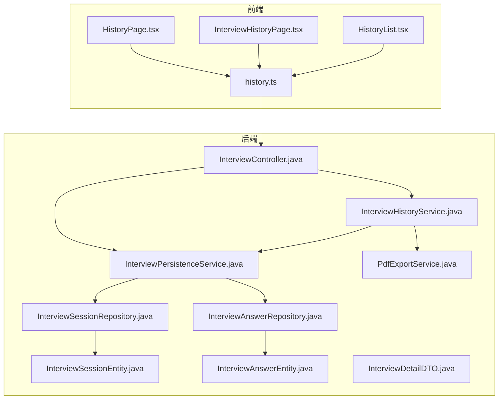
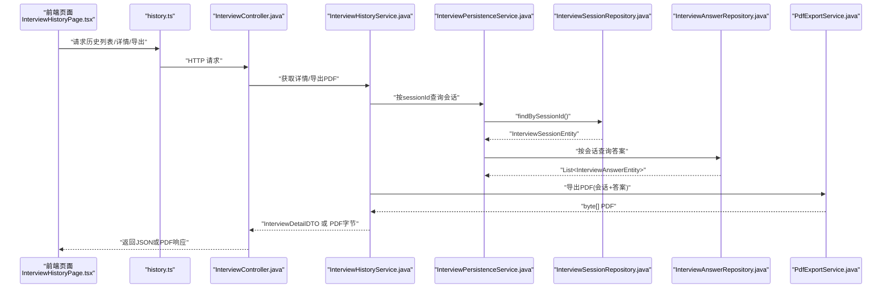
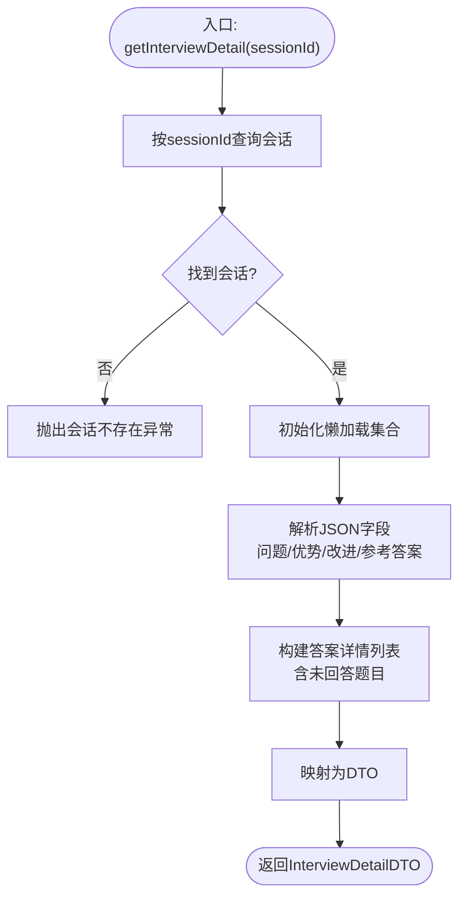
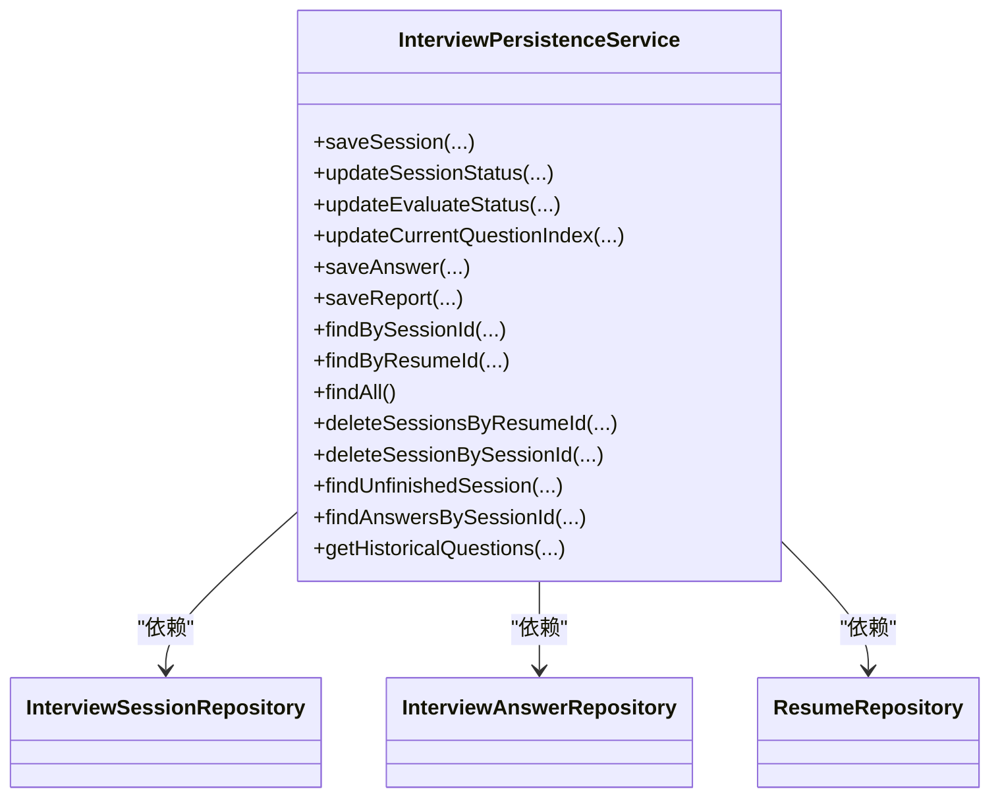
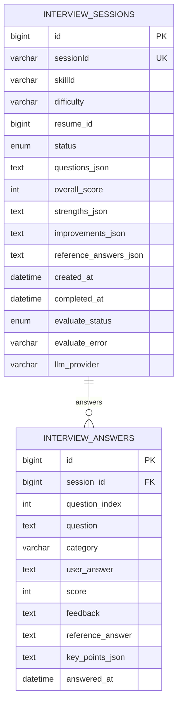
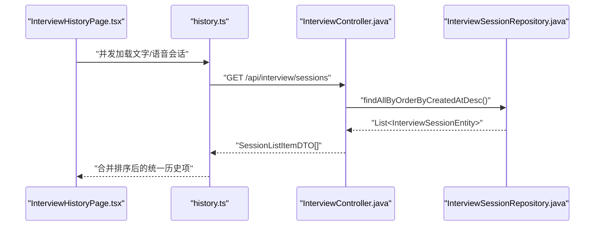
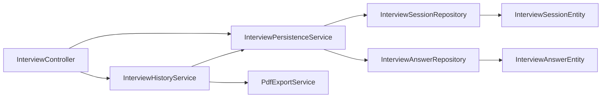

# 面试历史管理

<cite>
**本文引用的文件**
- [InterviewHistoryService.java](file://app/src/main/java/interview/guide/modules/interview/service/InterviewHistoryService.java)
- [InterviewPersistenceService.java](file://app/src/main/java/interview/guide/modules/interview/service/InterviewPersistenceService.java)
- [InterviewSessionRepository.java](file://app/src/main/java/interview/guide/modules/interview/repository/InterviewSessionRepository.java)
- [InterviewAnswerRepository.java](file://app/src/main/java/interview/guide/modules/interview/repository/InterviewAnswerRepository.java)
- [InterviewSessionEntity.java](file://app/src/main/java/interview/guide/modules/interview/model/InterviewSessionEntity.java)
- [InterviewAnswerEntity.java](file://app/src/main/java/interview/guide/modules/interview/model/InterviewAnswerEntity.java)
- [InterviewDetailDTO.java](file://app/src/main/java/interview/guide/modules/interview/model/InterviewDetailDTO.java)
- [InterviewController.java](file://app/src/main/java/interview/guide/modules/interview/InterviewController.java)
- [PdfExportService.java](file://app/src/main/java/interview/guide/infrastructure/export/PdfExportService.java)
- [HistoryPage.tsx](file://frontend/src/pages/HistoryPage.tsx)
- [InterviewHistoryPage.tsx](file://frontend/src/pages/InterviewHistoryPage.tsx)
- [HistoryList.tsx](file://frontend/src/components/HistoryList.tsx)
- [history.ts](file://frontend/src/api/history.ts)
- [interview.ts](file://frontend/src/types/interview.ts)
</cite>

## 目录
1. [简介](#简介)
2. [项目结构](#项目结构)
3. [核心组件](#核心组件)
4. [架构总览](#架构总览)
5. [详细组件分析](#详细组件分析)
6. [依赖分析](#依赖分析)
7. [性能考虑](#性能考虑)
8. [故障排查指南](#故障排查指南)
9. [结论](#结论)
10. [附录](#附录)

## 简介
本技术文档围绕“面试历史管理”功能，系统阐述后端服务层、数据访问层与前端页面/组件的协作机制，覆盖以下能力：
- 历史记录查询与聚合：按简历、技能、状态等维度检索会话与答案
- 数据统计与可视化：面试总数、完成数、平均分等指标计算
- 历史筛选与搜索：按类型、关键词、状态等条件过滤
- 报告导出：PDF格式导出面试报告，确保数据完整性与跨平台字体兼容
- 历史清理与归档策略：基于会话状态与索引的优化建议

## 项目结构
后端采用分层架构：
- 控制器层：对外暴露REST接口，负责参数校验与响应封装
- 服务层：业务编排与领域逻辑，包括历史详情组装、持久化、导出
- 数据访问层：JPA仓库封装数据库查询与索引优化
- 基础设施层：PDF导出、文件存储等基础设施能力

前端采用React组件化：
- 页面组件：负责数据拉取、轮询、状态管理与UI渲染
- 组件：复用的列表、统计卡片、状态图标等
- 类型定义：统一前后端数据契约，保障类型安全

图表来源
- [InterviewController.java:30-175](file://app/src/main/java/interview/guide/modules/interview/InterviewController.java#L30-L175)
- [InterviewHistoryService.java:29-167](file://app/src/main/java/interview/guide/modules/interview/service/InterviewHistoryService.java#L29-L167)
- [InterviewPersistenceService.java:36-358](file://app/src/main/java/interview/guide/modules/interview/service/InterviewPersistenceService.java#L36-L358)
- [InterviewSessionRepository.java:18-76](file://app/src/main/java/interview/guide/modules/interview/repository/InterviewSessionRepository.java#L18-L76)
- [InterviewAnswerRepository.java:15-36](file://app/src/main/java/interview/guide/modules/interview/repository/InterviewAnswerRepository.java#L15-L36)
- [PdfExportService.java:39-313](file://app/src/main/java/interview/guide/infrastructure/export/PdfExportService.java#L39-L313)
- [InterviewSessionEntity.java:20-286](file://app/src/main/java/interview/guide/modules/interview/model/InterviewSessionEntity.java#L20-L286)
- [InterviewAnswerEntity.java:18-156](file://app/src/main/java/interview/guide/modules/interview/model/InterviewAnswerEntity.java#L18-L156)
- [InterviewDetailDTO.java:9-41](file://app/src/main/java/interview/guide/modules/interview/model/InterviewDetailDTO.java#L9-L41)
- [HistoryPage.tsx:44-337](file://frontend/src/pages/HistoryPage.tsx#L44-L337)
- [InterviewHistoryPage.tsx:170-613](file://frontend/src/pages/InterviewHistoryPage.tsx#L170-L613)
- [HistoryList.tsx:116-451](file://frontend/src/components/HistoryList.tsx#L116-L451)
- [history.ts:90-161](file://frontend/src/api/history.ts#L90-L161)

章节来源
- [InterviewController.java:30-175](file://app/src/main/java/interview/guide/modules/interview/InterviewController.java#L30-L175)
- [InterviewHistoryService.java:29-167](file://app/src/main/java/interview/guide/modules/interview/service/InterviewHistoryService.java#L29-L167)
- [InterviewPersistenceService.java:36-358](file://app/src/main/java/interview/guide/modules/interview/service/InterviewPersistenceService.java#L36-L358)
- [InterviewSessionRepository.java:18-76](file://app/src/main/java/interview/guide/modules/interview/repository/InterviewSessionRepository.java#L18-L76)
- [InterviewAnswerRepository.java:15-36](file://app/src/main/java/interview/guide/modules/interview/repository/InterviewAnswerRepository.java#L15-L36)
- [PdfExportService.java:39-313](file://app/src/main/java/interview/guide/infrastructure/export/PdfExportService.java#L39-L313)
- [InterviewSessionEntity.java:20-286](file://app/src/main/java/interview/guide/modules/interview/model/InterviewSessionEntity.java#L20-L286)
- [InterviewAnswerEntity.java:18-156](file://app/src/main/java/interview/guide/modules/interview/model/InterviewAnswerEntity.java#L18-L156)
- [InterviewDetailDTO.java:9-41](file://app/src/main/java/interview/guide/modules/interview/model/InterviewDetailDTO.java#L9-L41)
- [HistoryPage.tsx:44-337](file://frontend/src/pages/HistoryPage.tsx#L44-L337)
- [InterviewHistoryPage.tsx:170-613](file://frontend/src/pages/InterviewHistoryPage.tsx#L170-L613)
- [HistoryList.tsx:116-451](file://frontend/src/components/HistoryList.tsx#L116-L451)
- [history.ts:90-161](file://frontend/src/api/history.ts#L90-L161)

## 核心组件
- 历史详情服务：负责会话详情组装、答案详情构建、报告导出
- 持久化服务：负责会话/答案的保存、更新、查询与删除
- 数据访问层：基于JPA的仓库接口，提供多维度查询与索引优化
- 前端页面与组件：简历历史、面试历史、历史列表，支持搜索、筛选、轮询与导出
- PDF导出：统一的报告导出能力，支持中文字体与内容清洗

章节来源
- [InterviewHistoryService.java:29-167](file://app/src/main/java/interview/guide/modules/interview/service/InterviewHistoryService.java#L29-L167)
- [InterviewPersistenceService.java:36-358](file://app/src/main/java/interview/guide/modules/interview/service/InterviewPersistenceService.java#L36-L358)
- [InterviewSessionRepository.java:18-76](file://app/src/main/java/interview/guide/modules/interview/repository/InterviewSessionRepository.java#L18-L76)
- [InterviewAnswerRepository.java:15-36](file://app/src/main/java/interview/guide/modules/interview/repository/InterviewAnswerRepository.java#L15-L36)
- [PdfExportService.java:39-313](file://app/src/main/java/interview/guide/infrastructure/export/PdfExportService.java#L39-L313)
- [InterviewHistoryPage.tsx:170-613](file://frontend/src/pages/InterviewHistoryPage.tsx#L170-L613)
- [HistoryList.tsx:116-451](file://frontend/src/components/HistoryList.tsx#L116-L451)

## 架构总览
后端通过控制器暴露REST接口，服务层编排业务流程，数据访问层负责查询与索引，前端通过API模块调用后端接口，实现历史数据的展示、筛选与导出。

图表来源
- [InterviewHistoryService.java:40-77](file://app/src/main/java/interview/guide/modules/interview/service/InterviewHistoryService.java#L40-L77)
- [InterviewHistoryService.java:150-165](file://app/src/main/java/interview/guide/modules/interview/service/InterviewHistoryService.java#L150-L165)
- [InterviewPersistenceService.java:249-251](file://app/src/main/java/interview/guide/modules/interview/service/InterviewPersistenceService.java#L249-L251)
- [InterviewPersistenceService.java:311-313](file://app/src/main/java/interview/guide/modules/interview/service/InterviewPersistenceService.java#L311-L313)
- [InterviewSessionRepository.java:23](file://app/src/main/java/interview/guide/modules/interview/repository/InterviewSessionRepository.java#L23)
- [InterviewAnswerRepository.java:30](file://app/src/main/java/interview/guide/modules/interview/repository/InterviewAnswerRepository.java#L30)
- [PdfExportService.java:170-283](file://app/src/main/java/interview/guide/infrastructure/export/PdfExportService.java#L170-L283)
- [InterviewController.java:140-164](file://app/src/main/java/interview/guide/modules/interview/InterviewController.java#L140-L164)

## 详细组件分析

### 历史详情服务（InterviewHistoryService）
职责：
- 获取会话详情：加载会话与答案，解析JSON字段，构建答案详情列表（包含未回答题目）
- 导出PDF：委托PDF导出服务生成报告

关键点：
- 使用MapStruct映射与DTO装配，保证数据一致性
- 答案详情构建时，对未回答题目构造空答案，确保列表完整性
- JSON解析失败时记录日志并降级为空值，避免影响整体流程

图表来源
- [InterviewHistoryService.java:40-77](file://app/src/main/java/interview/guide/modules/interview/service/InterviewHistoryService.java#L40-L77)
- [InterviewHistoryService.java:83-123](file://app/src/main/java/interview/guide/modules/interview/service/InterviewHistoryService.java#L83-L123)
- [InterviewHistoryService.java:135-145](file://app/src/main/java/interview/guide/modules/interview/service/InterviewHistoryService.java#L135-L145)

章节来源
- [InterviewHistoryService.java:29-167](file://app/src/main/java/interview/guide/modules/interview/service/InterviewHistoryService.java#L29-L167)

### 持久化服务（InterviewPersistenceService）
职责：
- 保存会话：序列化问题列表，设置默认属性，可选绑定简历
- 更新状态：会话状态、评估状态、当前问题索引
- 保存答案：UPSERT逻辑，按会话+问题索引唯一约束
- 保存报告：更新会话评估信息，并同步答案评分、反馈与参考答案
- 历史问题去重：按简历+技能或技能维度取最近N条会话的问题，去重并限制数量

图表来源
- [InterviewPersistenceService.java:36-358](file://app/src/main/java/interview/guide/modules/interview/service/InterviewPersistenceService.java#L36-L358)
- [InterviewSessionRepository.java:18-76](file://app/src/main/java/interview/guide/modules/interview/repository/InterviewSessionRepository.java#L18-L76)
- [InterviewAnswerRepository.java:15-36](file://app/src/main/java/interview/guide/modules/interview/repository/InterviewAnswerRepository.java#L15-L36)

章节来源
- [InterviewPersistenceService.java:36-358](file://app/src/main/java/interview/guide/modules/interview/service/InterviewPersistenceService.java#L36-L358)

### 数据访问层（InterviewSessionRepository / InterviewAnswerRepository）
职责：
- 会话查询：按ID、简历、状态、技能等多维组合查询
- 答案查询：按会话与问题索引排序查询
- 索引设计：针对高频查询字段建立复合索引，提升查询性能

图表来源
- [InterviewSessionEntity.java:20-286](file://app/src/main/java/interview/guide/modules/interview/model/InterviewSessionEntity.java#L20-L286)
- [InterviewAnswerEntity.java:18-156](file://app/src/main/java/interview/guide/modules/interview/model/InterviewAnswerEntity.java#L18-L156)

章节来源
- [InterviewSessionRepository.java:18-76](file://app/src/main/java/interview/guide/modules/interview/repository/InterviewSessionRepository.java#L18-L76)
- [InterviewAnswerRepository.java:15-36](file://app/src/main/java/interview/guide/modules/interview/repository/InterviewAnswerRepository.java#L15-L36)
- [InterviewSessionEntity.java:15-19](file://app/src/main/java/interview/guide/modules/interview/model/InterviewSessionEntity.java#L15-L19)
- [InterviewAnswerEntity.java:11-17](file://app/src/main/java/interview/guide/modules/interview/model/InterviewAnswerEntity.java#L11-L17)

### 前端页面与组件
- 历史页面（HistoryPage.tsx）：简历列表展示、搜索、删除、轮询分析状态
- 面试历史页面（InterviewHistoryPage.tsx）：统一历史列表（文字/语音）、统计卡片、筛选、导出PDF、删除、继续/重新面试
- 历史列表组件（HistoryList.tsx）：简历库列表、统计、搜索、下载、重新分析、删除
- API模块（history.ts）：统一的REST客户端，封装导出PDF、删除、统计等接口
- 类型定义（interview.ts）：前后端一致的面试会话与报告结构

图表来源
- [InterviewHistoryPage.tsx:194-210](file://frontend/src/pages/InterviewHistoryPage.tsx#L194-L210)
- [InterviewController.java:39-45](file://app/src/main/java/interview/guide/modules/interview/InterviewController.java#L39-L45)
- [InterviewSessionRepository.java:65](file://app/src/main/java/interview/guide/modules/interview/repository/InterviewSessionRepository.java#L65)

章节来源
- [HistoryPage.tsx:44-337](file://frontend/src/pages/HistoryPage.tsx#L44-L337)
- [InterviewHistoryPage.tsx:170-613](file://frontend/src/pages/InterviewHistoryPage.tsx#L170-L613)
- [HistoryList.tsx:116-451](file://frontend/src/components/HistoryList.tsx#L116-L451)
- [history.ts:90-161](file://frontend/src/api/history.ts#L90-L161)
- [interview.ts:5-87](file://frontend/src/types/interview.ts#L5-L87)

### 历史数据结构说明
- 会话信息：会话ID、技能ID、难度、状态、创建/完成时间、评估状态与错误、LLM提供商、问题总数、当前问题索引
- 答案记录：问题索引、问题内容、类别、用户答案、评分、反馈、参考答案、关键点、回答时间
- 评估结果：总分、总体反馈、优势、改进建议、参考答案明细
- 时间统计：创建时间、完成时间、评估状态变化时间

章节来源
- [InterviewSessionEntity.java:20-286](file://app/src/main/java/interview/guide/modules/interview/model/InterviewSessionEntity.java#L20-L286)
- [InterviewAnswerEntity.java:18-156](file://app/src/main/java/interview/guide/modules/interview/model/InterviewAnswerEntity.java#L18-L156)
- [InterviewDetailDTO.java:9-41](file://app/src/main/java/interview/guide/modules/interview/model/InterviewDetailDTO.java#L9-L41)

### 历史查询与筛选
- 后端：按简历ID、技能ID、状态、创建时间等维度查询，使用复合索引优化
- 前端：按类型（文字/语音）、关键词搜索、评估状态轮询更新

章节来源
- [InterviewSessionRepository.java:23-76](file://app/src/main/java/interview/guide/modules/interview/repository/InterviewSessionRepository.java#L23-L76)
- [InterviewHistoryPage.tsx:354-358](file://frontend/src/pages/InterviewHistoryPage.tsx#L354-L358)

### 历史数据导出
- PDF导出：统一的导出服务，支持中文字体、内容清洗、评分颜色映射
- 接口：控制器提供导出PDF的HTTP接口，返回附件流

章节来源
- [PdfExportService.java:39-313](file://app/src/main/java/interview/guide/infrastructure/export/PdfExportService.java#L39-L313)
- [InterviewController.java:148-164](file://app/src/main/java/interview/guide/modules/interview/InterviewController.java#L148-L164)

## 依赖分析
- 控制器依赖服务层，服务层依赖持久化服务与导出服务
- 持久化服务依赖仓库接口与实体模型
- 前端通过API模块与控制器交互，页面组件负责状态管理与轮询

图表来源
- [InterviewController.java:30-175](file://app/src/main/java/interview/guide/modules/interview/InterviewController.java#L30-L175)
- [InterviewHistoryService.java:29-167](file://app/src/main/java/interview/guide/modules/interview/service/InterviewHistoryService.java#L29-L167)
- [InterviewPersistenceService.java:36-358](file://app/src/main/java/interview/guide/modules/interview/service/InterviewPersistenceService.java#L36-L358)
- [InterviewSessionRepository.java:18-76](file://app/src/main/java/interview/guide/modules/interview/repository/InterviewSessionRepository.java#L18-L76)
- [InterviewAnswerRepository.java:15-36](file://app/src/main/java/interview/guide/modules/interview/repository/InterviewAnswerRepository.java#L15-L36)
- [InterviewSessionEntity.java:20-286](file://app/src/main/java/interview/guide/modules/interview/model/InterviewSessionEntity.java#L20-L286)
- [InterviewAnswerEntity.java:18-156](file://app/src/main/java/interview/guide/modules/interview/model/InterviewAnswerEntity.java#L18-L156)

## 性能考虑
- 查询优化
  - 会话表复合索引：简历+创建时间、简历+状态+创建时间、技能+创建时间
  - 答案表复合索引：会话+问题索引，保证答案按序查询
- 批量与去重
  - 历史问题去重与数量限制，减少重复与超大数据集
- 懒加载与初始化
  - 在服务层主动初始化答案集合，避免N+1查询
- 导出性能
  - PDF导出使用内嵌字体与内容清洗，避免渲染异常导致的失败重试

章节来源
- [InterviewSessionEntity.java:15-19](file://app/src/main/java/interview/guide/modules/interview/model/InterviewSessionEntity.java#L15-L19)
- [InterviewAnswerEntity.java:11-17](file://app/src/main/java/interview/guide/modules/interview/model/InterviewAnswerEntity.java#L11-L17)
- [InterviewPersistenceService.java:315-357](file://app/src/main/java/interview/guide/modules/interview/service/InterviewPersistenceService.java#L315-L357)
- [InterviewHistoryService.java:47](file://app/src/main/java/interview/guide/modules/interview/service/InterviewHistoryService.java#L47)

## 故障排查指南
- 会话不存在
  - 现象：获取详情或导出时报错
  - 排查：确认sessionId是否正确，检查会话是否存在
- JSON解析失败
  - 现象：答案详情缺失或异常
  - 排查：检查会话/答案JSON字段格式，查看日志
- 导出PDF失败
  - 现象：导出接口返回错误
  - 排查：确认字体资源存在、网络异常、PDF生成异常
- 评估状态轮询
  - 现象：评估中状态长时间不更新
  - 排查：前端轮询逻辑、后端评估任务状态

章节来源
- [InterviewHistoryService.java:42-44](file://app/src/main/java/interview/guide/modules/interview/service/InterviewHistoryService.java#L42-L44)
- [InterviewHistoryService.java:162-164](file://app/src/main/java/interview/guide/modules/interview/service/InterviewHistoryService.java#L162-L164)
- [PdfExportService.java:62-70](file://app/src/main/java/interview/guide/infrastructure/export/PdfExportService.java#L62-L70)
- [InterviewHistoryPage.tsx:282-299](file://frontend/src/pages/InterviewHistoryPage.tsx#L282-L299)

## 结论
面试历史管理功能通过清晰的分层设计与完善的索引策略，实现了高效的历史查询、统计与导出能力。前端以组件化方式提供良好的用户体验，后端以服务层为核心编排业务流程，确保数据一致性与可维护性。建议持续关注查询性能与导出稳定性，结合实际业务增长迭代优化。

## 附录
- 历史清理与归档策略建议
  - 过期数据处理：基于完成时间与状态定期归档/清理
  - 存储优化：对历史问题JSON进行压缩与去重，控制单条记录体积
  - 事务与幂等：导出与删除操作需具备幂等性与事务一致性