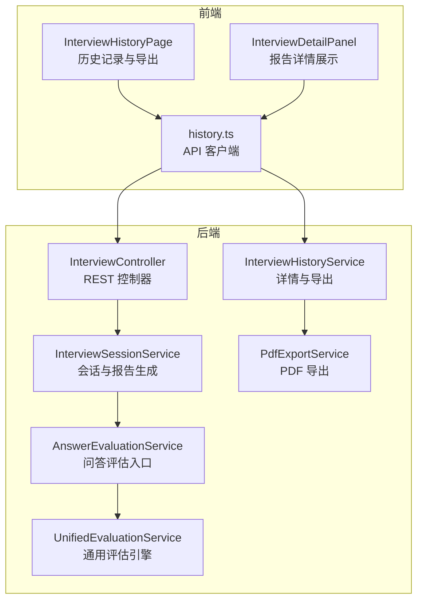
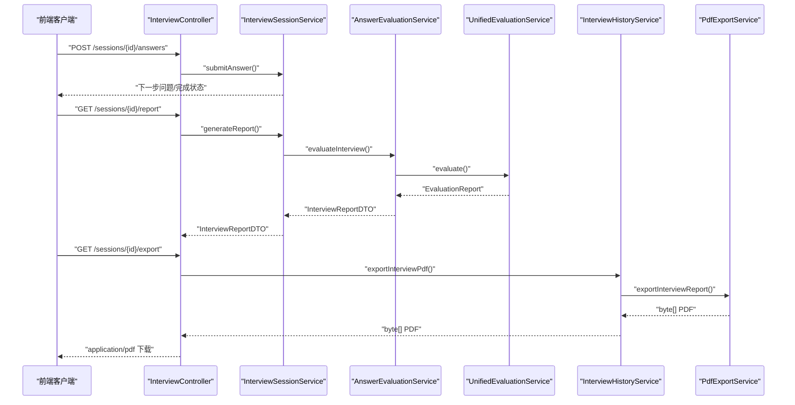
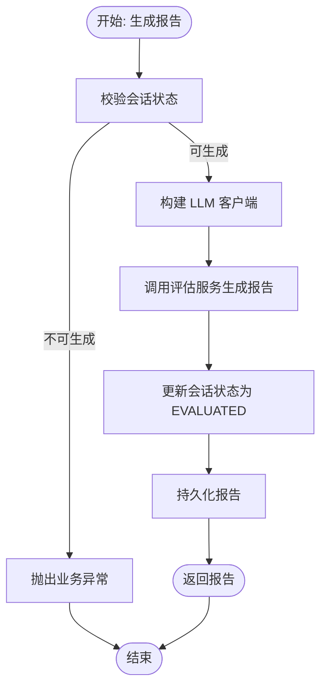
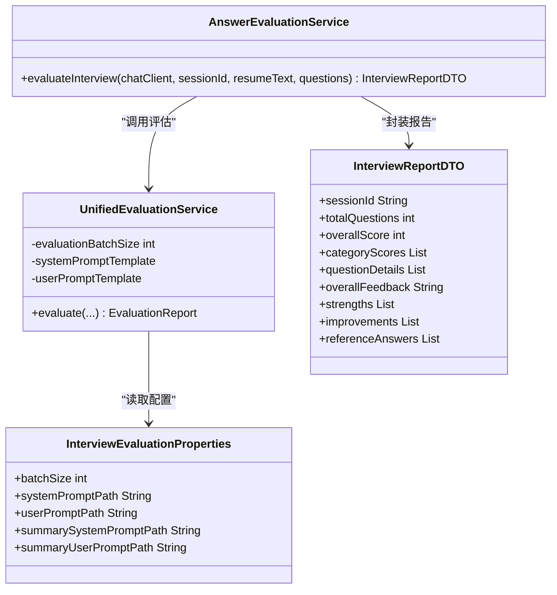
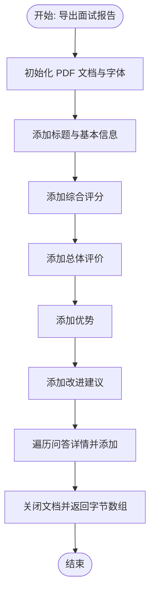
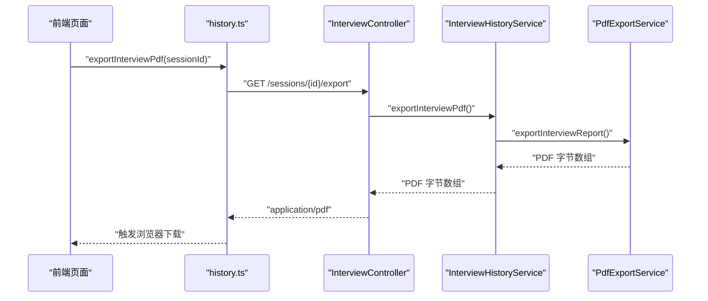
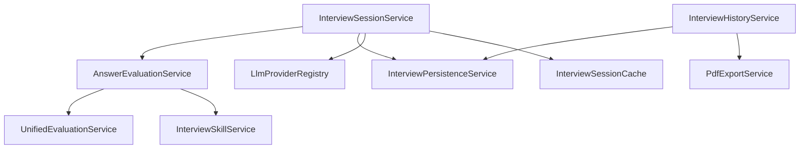

# 面试报告生成

<cite>
**本文引用的文件**
- [InterviewSessionService.java](file://app/src/main/java/interview/guide/modules/interview/service/InterviewSessionService.java)
- [AnswerEvaluationService.java](file://app/src/main/java/interview/guide/modules/interview/service/AnswerEvaluationService.java)
- [UnifiedEvaluationService.java](file://app/src/main/java/interview/guide/common/evaluation/UnifiedEvaluationService.java)
- [InterviewEvaluationProperties.java](file://app/src/main/java/interview/guide/common/evaluation/InterviewEvaluationProperties.java)
- [PdfExportService.java](file://app/src/main/java/interview/guide/infrastructure/export/PdfExportService.java)
- [InterviewHistoryService.java](file://app/src/main/java/interview/guide/modules/interview/service/InterviewHistoryService.java)
- [InterviewController.java](file://app/src/main/java/interview/guide/modules/interview/InterviewController.java)
- [InterviewDetailPanel.tsx](file://frontend/src/components/InterviewDetailPanel.tsx)
- [InterviewHistoryPage.tsx](file://frontend/src/pages/InterviewHistoryPage.tsx)
- [history.ts](file://frontend/src/api/history.ts)
- [InterviewReportDTO.java](file://app/src/main/java/interview/guide/modules/interview/model/InterviewReportDTO.java)
- [EvaluationReport.java](file://app/src/main/java/interview/guide/common/evaluation/EvaluationReport.java)
</cite>

## 目录
1. [简介](#简介)
2. [项目结构](#项目结构)
3. [核心组件](#核心组件)
4. [架构总览](#架构总览)
5. [详细组件分析](#详细组件分析)
6. [依赖分析](#依赖分析)
7. [性能考虑](#性能考虑)
8. [故障排查指南](#故障排查指南)
9. [结论](#结论)
10. [附录](#附录)

## 简介
本技术文档围绕“面试报告生成功能”展开，系统性阐述从面试问答到评估报告生成、PDF导出以及前端展示的全链路实现。重点覆盖以下方面：
- InterviewSessionService 的报告生成流程与控制流
- 评估结果整合、报告模板渲染与数据格式化
- PdfExportService 的 PDF 导出实现（模板设计、内容填充、样式渲染、文件生成）
- InterviewEvaluationProperties 的配置项与影响范围
- 前端 InterviewDetailPanel 与 InterviewHistoryPage 的报告展示与交互
- 报告数据结构定义与导出 API 接口规范
- 报告个性化定制能力（模板选择、内容过滤、格式调整）

## 项目结构
后端采用模块化分层设计，面试相关能力集中在 modules/interview 子模块；评估与导出分别由通用评估服务与基础设施导出服务承担；前端通过 API 层对接后端，提供报告展示与导出交互。

图表来源
- [InterviewController.java:30-175](file://app/src/main/java/interview/guide/modules/interview/InterviewController.java#L30-L175)
- [InterviewSessionService.java:40-506](file://app/src/main/java/interview/guide/modules/interview/service/InterviewSessionService.java#L40-L506)
- [AnswerEvaluationService.java:34-64](file://app/src/main/java/interview/guide/modules/interview/service/AnswerEvaluationService.java#L34-L64)
- [UnifiedEvaluationService.java:91-364](file://app/src/main/java/interview/guide/common/evaluation/UnifiedEvaluationService.java#L91-L364)
- [InterviewHistoryService.java:26-167](file://app/src/main/java/interview/guide/modules/interview/service/InterviewHistoryService.java#L26-L167)
- [PdfExportService.java:32-313](file://app/src/main/java/interview/guide/infrastructure/export/PdfExportService.java#L32-L313)
- [InterviewHistoryPage.tsx:170-613](file://frontend/src/pages/InterviewHistoryPage.tsx#L170-L613)
- [InterviewDetailPanel.tsx:1-351](file://frontend/src/components/InterviewDetailPanel.tsx#L1-L351)
- [history.ts:90-161](file://frontend/src/api/history.ts#L90-L161)

章节来源
- [InterviewController.java:30-175](file://app/src/main/java/interview/guide/modules/interview/InterviewController.java#L30-L175)
- [InterviewSessionService.java:40-506](file://app/src/main/java/interview/guide/modules/interview/service/InterviewSessionService.java#L40-L506)
- [InterviewHistoryService.java:26-167](file://app/src/main/java/interview/guide/modules/interview/service/InterviewHistoryService.java#L26-L167)
- [PdfExportService.java:32-313](file://app/src/main/java/interview/guide/infrastructure/export/PdfExportService.java#L32-L313)
- [InterviewHistoryPage.tsx:170-613](file://frontend/src/pages/InterviewHistoryPage.tsx#L170-L613)
- [InterviewDetailPanel.tsx:1-351](file://frontend/src/components/InterviewDetailPanel.tsx#L1-L351)
- [history.ts:90-161](file://frontend/src/api/history.ts#L90-L161)

## 核心组件
- InterviewSessionService：负责会话生命周期管理、提交答案、触发评估、生成报告与持久化。
- AnswerEvaluationService：将问答记录转为通用格式并调用统一评估服务。
- UnifiedEvaluationService：基于提示词模板与批处理策略执行评估，产出通用评估报告。
- InterviewHistoryService：组装面试详情 DTO、导出 PDF。
- PdfExportService：使用 iTextPDF 渲染中文、表格与颜色，输出 PDF 字节流。
- 前端组件：InterviewHistoryPage 展示历史与导出按钮；InterviewDetailPanel 展示报告详情与交互。

章节来源
- [InterviewSessionService.java:40-506](file://app/src/main/java/interview/guide/modules/interview/service/InterviewSessionService.java#L40-L506)
- [AnswerEvaluationService.java:34-64](file://app/src/main/java/interview/guide/modules/interview/service/AnswerEvaluationService.java#L34-L64)
- [UnifiedEvaluationService.java:91-364](file://app/src/main/java/interview/guide/common/evaluation/UnifiedEvaluationService.java#L91-L364)
- [InterviewHistoryService.java:26-167](file://app/src/main/java/interview/guide/modules/interview/service/InterviewHistoryService.java#L26-L167)
- [PdfExportService.java:32-313](file://app/src/main/java/interview/guide/infrastructure/export/PdfExportService.java#L32-L313)
- [InterviewHistoryPage.tsx:170-613](file://frontend/src/pages/InterviewHistoryPage.tsx#L170-L613)
- [InterviewDetailPanel.tsx:1-351](file://frontend/src/components/InterviewDetailPanel.tsx#L1-L351)

## 架构总览
下图展示从提交答案到生成报告与导出 PDF 的端到端流程，以及前后端交互。

图表来源
- [InterviewController.java:78-164](file://app/src/main/java/interview/guide/modules/interview/InterviewController.java#L78-L164)
- [InterviewSessionService.java:295-490](file://app/src/main/java/interview/guide/modules/interview/service/InterviewSessionService.java#L295-L490)
- [AnswerEvaluationService.java:45-64](file://app/src/main/java/interview/guide/modules/interview/service/AnswerEvaluationService.java#L45-L64)
- [UnifiedEvaluationService.java:100-144](file://app/src/main/java/interview/guide/common/evaluation/UnifiedEvaluationService.java#L100-L144)
- [InterviewHistoryService.java:150-165](file://app/src/main/java/interview/guide/modules/interview/service/InterviewHistoryService.java#L150-L165)
- [PdfExportService.java:170-283](file://app/src/main/java/interview/guide/infrastructure/export/PdfExportService.java#L170-L283)

## 详细组件分析

### 组件一：InterviewSessionService 报告生成逻辑
- 触发条件：当会话完成所有问题或提前交卷后，状态变为 COMPLETED 或 EVALUATED。
- 关键步骤：
  - 校验会话状态，确保可生成报告
  - 获取 LLM 客户端（优先使用会话绑定的 provider）
  - 调用 AnswerEvaluationService.evaluateInterview() 生成 InterviewReportDTO
  - 更新会话状态为 EVALUATED，并持久化报告
  - 返回报告给调用方（控制器或历史服务）

图表来源
- [InterviewSessionService.java:453-490](file://app/src/main/java/interview/guide/modules/interview/service/InterviewSessionService.java#L453-L490)

章节来源
- [InterviewSessionService.java:453-490](file://app/src/main/java/interview/guide/modules/interview/service/InterviewSessionService.java#L453-L490)

### 组件二：评估结果整合与报告模板渲染
- AnswerEvaluationService 将问题列表转换为通用 QaRecord，并调用 UnifiedEvaluationService 进行评估。
- UnifiedEvaluationService：
  - 加载系统与用户提示词模板
  - 支持批处理（batch）以平衡成本与质量
  - 聚合每题评估结果，计算总体分、类别分、总体反馈、优势与改进建议
  - 输出 EvaluationReport，再映射为 InterviewReportDTO
- 模板路径由 InterviewEvaluationProperties 配置，支持自定义提示词路径。

图表来源
- [AnswerEvaluationService.java:45-64](file://app/src/main/java/interview/guide/modules/interview/service/AnswerEvaluationService.java#L45-L64)
- [UnifiedEvaluationService.java:100-144](file://app/src/main/java/interview/guide/common/evaluation/UnifiedEvaluationService.java#L100-L144)
- [InterviewEvaluationProperties.java:10-17](file://app/src/main/java/interview/guide/common/evaluation/InterviewEvaluationProperties.java#L10-L17)
- [InterviewReportDTO.java:8-49](file://app/src/main/java/interview/guide/modules/interview/model/InterviewReportDTO.java#L8-L49)

章节来源
- [AnswerEvaluationService.java:45-64](file://app/src/main/java/interview/guide/modules/interview/service/AnswerEvaluationService.java#L45-L64)
- [UnifiedEvaluationService.java:100-144](file://app/src/main/java/interview/guide/common/evaluation/UnifiedEvaluationService.java#L100-L144)
- [InterviewEvaluationProperties.java:10-17](file://app/src/main/java/interview/guide/common/evaluation/InterviewEvaluationProperties.java#L10-L17)
- [InterviewReportDTO.java:8-49](file://app/src/main/java/interview/guide/modules/interview/model/InterviewReportDTO.java#L8-L49)

### 组件三：PdfExportService 的 PDF 导出实现
- 字体与国际化：内嵌中文字体，确保跨平台一致性；对文本进行清洗，避免字体渲染问题。
- 模板设计与内容填充：
  - 标题、基本信息、综合评分、总体评价、优势、改进建议、问答详情
  - 问答详情中包含问题序号、分类、问题、回答、得分、AI评价、参考答案
- 样式渲染：标题与章节使用固定颜色；得分按等级着色；表格单元格对齐与宽度自适应。
- 文件生成：使用 iTextPDF 写入 ByteArrayOutputStream，返回字节数组供下载。

图表来源
- [PdfExportService.java:170-283](file://app/src/main/java/interview/guide/infrastructure/export/PdfExportService.java#L170-L283)

章节来源
- [PdfExportService.java:47-71](file://app/src/main/java/interview/guide/infrastructure/export/PdfExportService.java#L47-L71)
- [PdfExportService.java:170-283](file://app/src/main/java/interview/guide/infrastructure/export/PdfExportService.java#L170-L283)

### 组件四：前端展示与交互
- InterviewHistoryPage：展示历史记录、状态图标与进度条、导出按钮、搜索与筛选；支持轮询评估状态变化。
- InterviewDetailPanel：展示总分、总体评价、优势、改进建议与问答详情；支持展开/折叠题目、按得分着色。
- history.ts：封装导出 PDF 的 API 请求，设置 responseType 为 blob，便于浏览器直接下载。

图表来源
- [InterviewHistoryPage.tsx:333-351](file://frontend/src/pages/InterviewHistoryPage.tsx#L333-L351)
- [history.ts:123-132](file://frontend/src/api/history.ts#L123-L132)
- [InterviewController.java:149-164](file://app/src/main/java/interview/guide/modules/interview/InterviewController.java#L149-L164)
- [InterviewHistoryService.java:150-165](file://app/src/main/java/interview/guide/modules/interview/service/InterviewHistoryService.java#L150-L165)
- [PdfExportService.java:170-283](file://app/src/main/java/interview/guide/infrastructure/export/PdfExportService.java#L170-L283)

章节来源
- [InterviewHistoryPage.tsx:170-613](file://frontend/src/pages/InterviewHistoryPage.tsx#L170-L613)
- [InterviewDetailPanel.tsx:1-351](file://frontend/src/components/InterviewDetailPanel.tsx#L1-L351)
- [history.ts:123-132](file://frontend/src/api/history.ts#L123-L132)

### 组件五：报告数据结构说明
- InterviewReportDTO：对外暴露的报告结构，包含会话标识、总题数、总分、类别分、每题详情、总体反馈、优势、改进建议、参考答案。
- EvaluationReport：通用评估报告结构，用于内部流转与持久化。
- 前端 InterviewDetail 与 AnswerItem 结构与后端 DTO 对应，便于展示与导出。

章节来源
- [InterviewReportDTO.java:8-49](file://app/src/main/java/interview/guide/modules/interview/model/InterviewReportDTO.java#L8-L49)
- [EvaluationReport.java:8-40](file://app/src/main/java/interview/guide/common/evaluation/EvaluationReport.java#L8-L40)
- [history.ts:84-88](file://frontend/src/api/history.ts#L84-L88)
- [history.ts:57-67](file://frontend/src/api/history.ts#L57-L67)

### 组件六：个性化定制能力
- 模板选择：通过 InterviewEvaluationProperties 指定提示词模板路径，支持系统与用户提示词分离。
- 内容过滤：前端可根据状态与搜索条件过滤历史记录；导出时仅对已完成评估的会话开放。
- 格式调整：PdfExportService 中的颜色、字体与表格样式可按需调整；前端展示组件支持主题切换与动画效果。

章节来源
- [InterviewEvaluationProperties.java:10-17](file://app/src/main/java/interview/guide/common/evaluation/InterviewEvaluationProperties.java#L10-L17)
- [InterviewHistoryPage.tsx:354-358](file://frontend/src/pages/InterviewHistoryPage.tsx#L354-L358)
- [PdfExportService.java:41-43](file://app/src/main/java/interview/guide/infrastructure/export/PdfExportService.java#L41-L43)
- [PdfExportService.java:299-303](file://app/src/main/java/interview/guide/infrastructure/export/PdfExportService.java#L299-L303)

## 依赖分析
- 组件耦合：
  - InterviewSessionService 依赖 AnswerEvaluationService 与 InterviewPersistenceService，负责会话状态与报告生成。
  - AnswerEvaluationService 依赖 UnifiedEvaluationService 与 InterviewSkillService，负责评估入口与参考上下文。
  - InterviewHistoryService 依赖 InterviewPersistenceService 与 PdfExportService，负责详情组装与 PDF 导出。
  - PdfExportService 依赖 iTextPDF 与内嵌字体资源，负责 PDF 渲染。
- 外部依赖：
  - LLM 提供商注册中心（LlmProviderRegistry），用于获取 ChatClient。
  - Redis 缓存（InterviewSessionCache），用于会话状态与问题列表的临时存储。
  - 数据库持久化（InterviewPersistenceService），用于会话、答案与报告的持久化。

图表来源
- [InterviewSessionService.java:42-48](file://app/src/main/java/interview/guide/modules/interview/service/InterviewSessionService.java#L42-L48)
- [AnswerEvaluationService.java:34-40](file://app/src/main/java/interview/guide/modules/interview/service/AnswerEvaluationService.java#L34-L40)
- [InterviewHistoryService.java:31-34](file://app/src/main/java/interview/guide/modules/interview/service/InterviewHistoryService.java#L31-L34)
- [PdfExportService.java](file://app/src/main/java/interview/guide/infrastructure/export/PdfExportService.java#L45)

章节来源
- [InterviewSessionService.java:42-48](file://app/src/main/java/interview/guide/modules/interview/service/InterviewSessionService.java#L42-L48)
- [AnswerEvaluationService.java:34-40](file://app/src/main/java/interview/guide/modules/interview/service/AnswerEvaluationService.java#L34-L40)
- [InterviewHistoryService.java:31-34](file://app/src/main/java/interview/guide/modules/interview/service/InterviewHistoryService.java#L31-L34)
- [PdfExportService.java](file://app/src/main/java/interview/guide/infrastructure/export/PdfExportService.java#L45)

## 性能考虑
- 批量评估：UnifiedEvaluationService 通过批量大小控制每次评估的题数，降低 LLM 调用次数与成本。
- 缓存与懒加载：Redis 缓存会话状态与问题列表，减少数据库访问；实体集合采用懒加载并在导出前初始化。
- 异步评估：提交最后一个问题后，将评估任务入队，避免阻塞请求线程。
- PDF 渲染优化：内嵌字体与一次性写入 ByteArrayOutputStream，减少 IO 开销。

章节来源
- [UnifiedEvaluationService.java:151-162](file://app/src/main/java/interview/guide/common/evaluation/UnifiedEvaluationService.java#L151-L162)
- [InterviewSessionService.java:339-343](file://app/src/main/java/interview/guide/modules/interview/service/InterviewSessionService.java#L339-L343)
- [InterviewHistoryService.java:158-158](file://app/src/main/java/interview/guide/modules/interview/service/InterviewHistoryService.java#L158-L158)
- [PdfExportService.java:85-164](file://app/src/main/java/interview/guide/infrastructure/export/PdfExportService.java#L85-L164)

## 故障排查指南
- 评估失败：
  - 检查 LLM 提供商配置与可用性
  - 查看评估批处理与提示词模板是否正确加载
- PDF 导出失败：
  - 确认内嵌字体资源是否存在
  - 检查 JSON 字段解析（优势、改进建议、参考答案）是否异常
- 前端导出无响应：
  - 确认后端返回 Content-Disposition 与 application/pdf
  - 检查 responseType 与 Blob 处理逻辑

章节来源
- [PdfExportService.java:65-70](file://app/src/main/java/interview/guide/infrastructure/export/PdfExportService.java#L65-L70)
- [PdfExportService.java:231-233](file://app/src/main/java/interview/guide/infrastructure/export/PdfExportService.java#L231-L233)
- [InterviewController.java:150-164](file://app/src/main/java/interview/guide/modules/interview/InterviewController.java#L150-L164)
- [history.ts:123-132](file://frontend/src/api/history.ts#L123-L132)

## 结论
该功能通过“会话管理—评估—持久化—导出—前端展示”的完整闭环，实现了从面试问答到可下载 PDF 报告的全流程自动化。配置化的提示词模板与可扩展的 PDF 渲染机制，为后续个性化与定制化提供了良好基础。

## 附录

### 报告导出 API 接口文档
- 接口：导出面试报告为 PDF
- 方法：GET
- 路径：/api/interview/sessions/{sessionId}/export
- 参数：
  - sessionId：会话标识（路径参数）
- 响应：
  - 成功：application/pdf，Content-Disposition 指定文件名
  - 失败：500 Internal Server Error
- 错误码：
  - 会话不存在：INTERVIEW_SESSION_NOT_FOUND
  - 导出失败：EXPORT_PDF_FAILED

章节来源
- [InterviewController.java:149-164](file://app/src/main/java/interview/guide/modules/interview/InterviewController.java#L149-L164)
- [InterviewHistoryService.java:150-165](file://app/src/main/java/interview/guide/modules/interview/service/InterviewHistoryService.java#L150-L165)