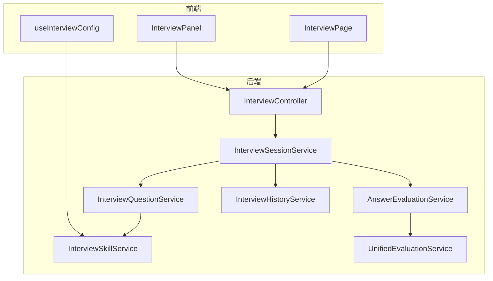
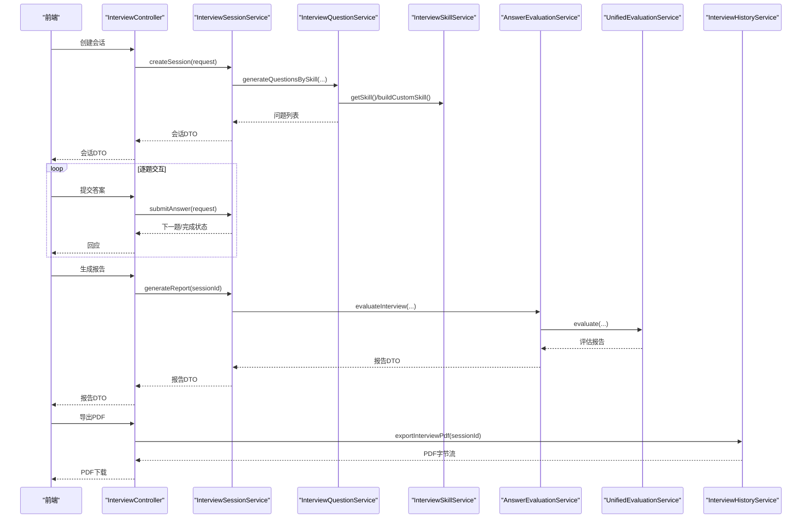
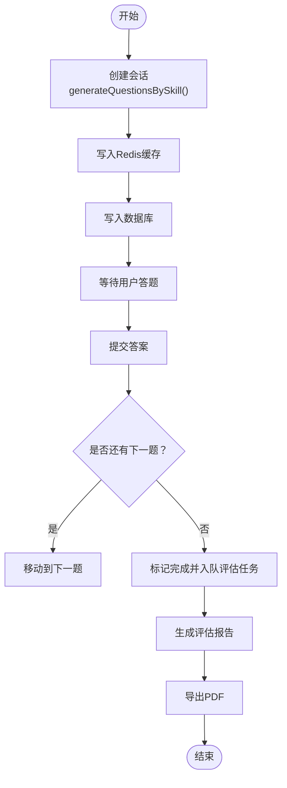
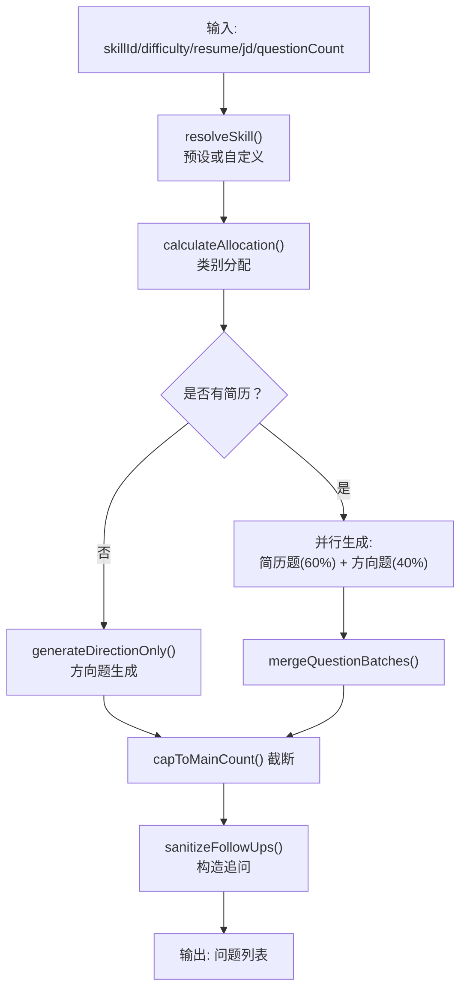
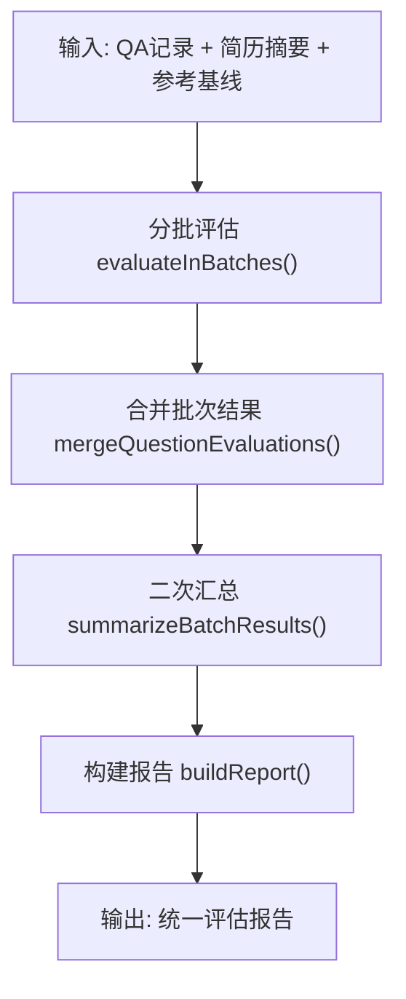
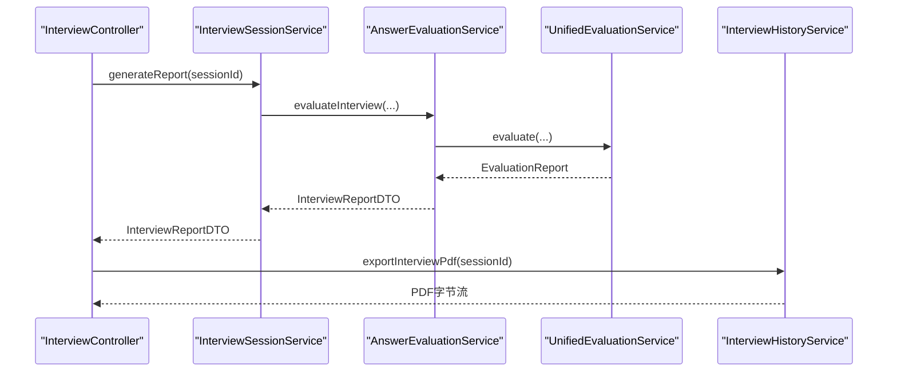
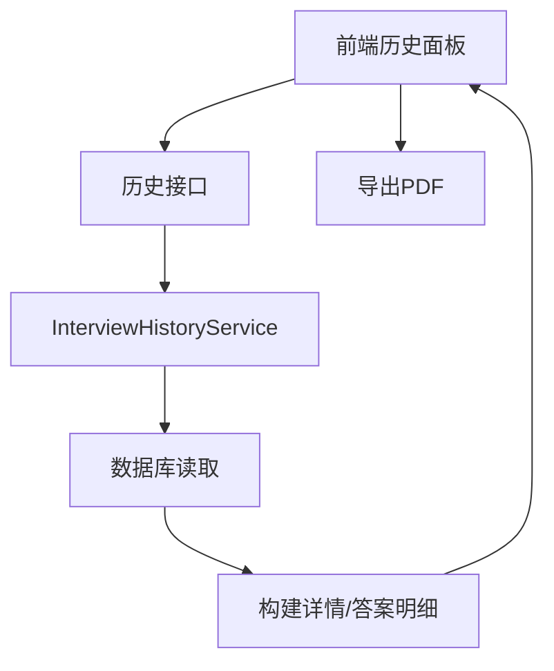
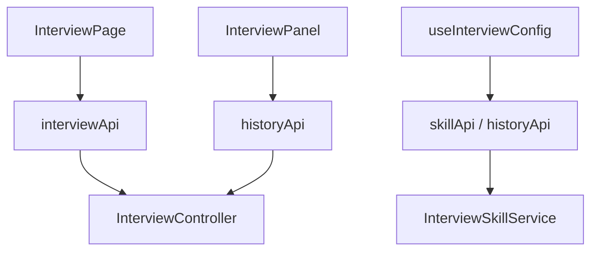
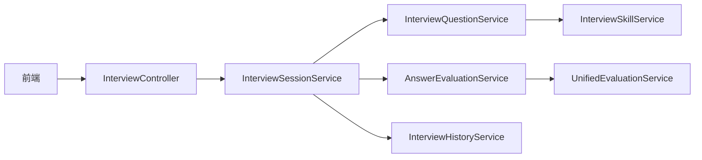
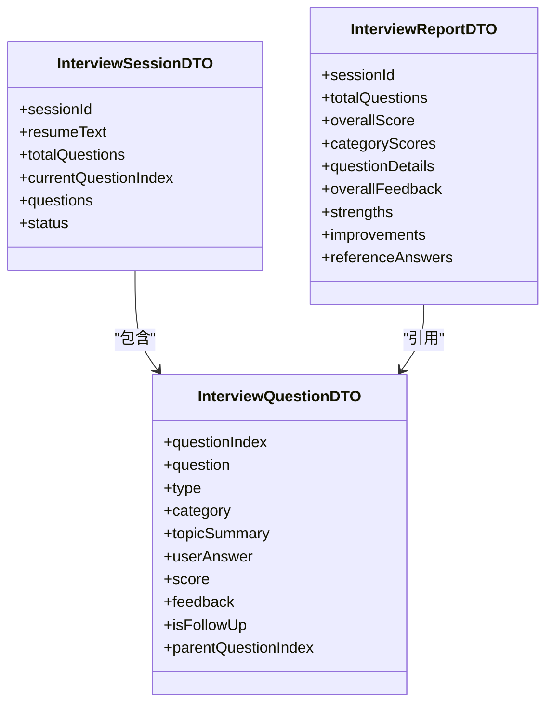

# 面试系统模块

<cite>
**本文引用的文件**
- [app/src/main/java/interview/guide/modules/interview/InterviewController.java](file://app/src/main/java/interview/guide/modules/interview/InterviewController.java)
- [app/src/main/java/interview/guide/modules/interview/service/InterviewSessionService.java](file://app/src/main/java/interview/guide/modules/interview/service/InterviewSessionService.java)
- [app/src/main/java/interview/guide/modules/interview/service/InterviewQuestionService.java](file://app/src/main/java/interview/guide/modules/interview/service/InterviewQuestionService.java)
- [app/src/main/java/interview/guide/modules/interview/service/AnswerEvaluationService.java](file://app/src/main/java/interview/guide/modules/interview/service/AnswerEvaluationService.java)
- [app/src/main/java/interview/guide/modules/interview/service/InterviewHistoryService.java](file://app/src/main/java/interview/guide/modules/interview/service/InterviewHistoryService.java)
- [app/src/main/java/interview/guide/modules/interview/skill/InterviewSkillService.java](file://app/src/main/java/interview/guide/modules/interview/skill/InterviewSkillService.java)
- [app/src/main/java/interview/guide/common/evaluation/UnifiedEvaluationService.java](file://app/src/main/java/interview/guide/common/evaluation/UnifiedEvaluationService.java)
- [app/src/main/java/interview/guide/modules/interview/model/InterviewSessionDTO.java](file://app/src/main/java/interview/guide/modules/interview/model/InterviewSessionDTO.java)
- [app/src/main/java/interview/guide/modules/interview/model/InterviewQuestionDTO.java](file://app/src/main/java/interview/guide/modules/interview/model/InterviewQuestionDTO.java)
- [app/src/main/java/interview/guide/modules/interview/model/InterviewReportDTO.java](file://app/src/main/java/interview/guide/modules/interview/model/InterviewReportDTO.java)
- [app/src/main/resources/prompts/interview-question-skill-user.st](file://app/src/main/resources/prompts/interview-question-skill-user.st)
- [app/src/main/resources/prompts/interview-evaluation-user.st](file://app/src/main/resources/prompts/interview-evaluation-user.st)
- [frontend/src/pages/InterviewPage.tsx](file://frontend/src/pages/InterviewPage.tsx)
- [frontend/src/components/InterviewPanel.tsx](file://frontend/src/components/InterviewPanel.tsx)
- [frontend/src/hooks/useInterviewConfig.ts](file://frontend/src/hooks/useInterviewConfig.ts)
</cite>

## 目录
1. [简介](#简介)
2. [项目结构](#项目结构)
3. [核心组件](#核心组件)
4. [架构总览](#架构总览)
5. [详细组件分析](#详细组件分析)
6. [依赖分析](#依赖分析)
7. [性能考量](#性能考量)
8. [故障排查指南](#故障排查指南)
9. [结论](#结论)
10. [附录](#附录)

## 简介
本模块提供“文字面试”与“语音面试”的统一面试体验，核心能力包括：
- Skill 驱动的出题机制：支持预设技能与自定义 JD 解析生成技能，按难度与方向分配题目，兼顾简历驱动与纯方向驱动两种模式，并具备历史去重与兜底策略。
- 面试会话生命周期管理：从会话创建、问题生成、答案提交、评估触发到报告生成与 PDF 导出的完整闭环。
- 统一评估架构：分批评估 + 结构化输出 + 二次汇总 + 降级兜底，确保稳定性与一致性。
- 历史记录与报告导出：支持历史查询、趋势可视化、报告导出与删除。
- 前端交互：实时答题、状态管理、提前交卷、确认对话框、图表与操作面板。

## 项目结构
后端采用分层架构，按功能域划分模块，面试模块位于 app/src/main/java/interview/guide/modules/interview，前端位于 frontend/src。核心文件组织如下：
- 控制器层：InterviewController 提供 REST 接口
- 服务层：InterviewSessionService、InterviewQuestionService、AnswerEvaluationService、InterviewHistoryService、InterviewSkillService、UnifiedEvaluationService
- 模型层：InterviewSessionDTO、InterviewQuestionDTO、InterviewReportDTO 等
- 前端页面与组件：InterviewPage、InterviewPanel、useInterviewConfig 等

**图表来源**
- [app/src/main/java/interview/guide/modules/interview/InterviewController.java:30-175](file://app/src/main/java/interview/guide/modules/interview/InterviewController.java#L30-L175)
- [app/src/main/java/interview/guide/modules/interview/service/InterviewSessionService.java:40-506](file://app/src/main/java/interview/guide/modules/interview/service/InterviewSessionService.java#L40-L506)
- [app/src/main/java/interview/guide/modules/interview/service/InterviewQuestionService.java:40-448](file://app/src/main/java/interview/guide/modules/interview/service/InterviewQuestionService.java#L40-L448)
- [app/src/main/java/interview/guide/modules/interview/service/AnswerEvaluationService.java:25-98](file://app/src/main/java/interview/guide/modules/interview/service/AnswerEvaluationService.java#L25-L98)
- [app/src/main/java/interview/guide/modules/interview/service/InterviewHistoryService.java:29-167](file://app/src/main/java/interview/guide/modules/interview/service/InterviewHistoryService.java#L29-L167)
- [app/src/main/java/interview/guide/modules/interview/skill/InterviewSkillService.java:34-592](file://app/src/main/java/interview/guide/modules/interview/skill/InterviewSkillService.java#L34-L592)
- [app/src/main/java/interview/guide/common/evaluation/UnifiedEvaluationService.java:31-379](file://app/src/main/java/interview/guide/common/evaluation/UnifiedEvaluationService.java#L31-L379)
- [frontend/src/pages/InterviewPage.tsx:35-291](file://frontend/src/pages/InterviewPage.tsx#L35-L291)
- [frontend/src/components/InterviewPanel.tsx:24-200](file://frontend/src/components/InterviewPanel.tsx#L24-L200)
- [frontend/src/hooks/useInterviewConfig.ts:41-151](file://frontend/src/hooks/useInterviewConfig.ts#L41-L151)

**章节来源**
- [app/src/main/java/interview/guide/modules/interview/InterviewController.java:30-175](file://app/src/main/java/interview/guide/modules/interview/InterviewController.java#L30-L175)
- [frontend/src/pages/InterviewPage.tsx:35-291](file://frontend/src/pages/InterviewPage.tsx#L35-L291)
- [frontend/src/components/InterviewPanel.tsx:24-200](file://frontend/src/components/InterviewPanel.tsx#L24-L200)
- [frontend/src/hooks/useInterviewConfig.ts:41-151](file://frontend/src/hooks/useInterviewConfig.ts#L41-L151)

## 核心组件
- 面试控制器：提供会话创建、获取、提交答案、生成报告、导出 PDF、删除会话等接口。
- 会话服务：负责会话生命周期、Redis 缓存与数据库持久化、答案保存与状态迁移、评估任务入队。
- 问题生成服务：Skill 驱动出题，支持简历题与方向题并行生成、历史去重、兜底策略与追问构造。
- 评估服务：将问题 DTO 转换为通用 QA 记录，调用统一评估服务生成报告。
- 统一评估服务：分批评估 + 结构化输出 + 二次汇总 + 降级兜底，保证稳定性与一致性。
- 技能服务：加载预设技能、构建自定义技能（JD 解析）、计算题目分配、拼接参考基线。
- 历史服务：查询会话详情、构建答案明细、导出 PDF。
- 前端页面与组件：面试页面、历史面板、配置钩子，负责交互与状态管理。

**章节来源**
- [app/src/main/java/interview/guide/modules/interview/InterviewController.java:30-175](file://app/src/main/java/interview/guide/modules/interview/InterviewController.java#L30-L175)
- [app/src/main/java/interview/guide/modules/interview/service/InterviewSessionService.java:40-506](file://app/src/main/java/interview/guide/modules/interview/service/InterviewSessionService.java#L40-L506)
- [app/src/main/java/interview/guide/modules/interview/service/InterviewQuestionService.java:40-448](file://app/src/main/java/interview/guide/modules/interview/service/InterviewQuestionService.java#L40-L448)
- [app/src/main/java/interview/guide/modules/interview/service/AnswerEvaluationService.java:25-98](file://app/src/main/java/interview/guide/modules/interview/service/AnswerEvaluationService.java#L25-L98)
- [app/src/main/java/interview/guide/common/evaluation/UnifiedEvaluationService.java:31-379](file://app/src/main/java/interview/guide/common/evaluation/UnifiedEvaluationService.java#L31-L379)
- [app/src/main/java/interview/guide/modules/interview/skill/InterviewSkillService.java:34-592](file://app/src/main/java/interview/guide/modules/interview/skill/InterviewSkillService.java#L34-L592)
- [app/src/main/java/interview/guide/modules/interview/service/InterviewHistoryService.java:29-167](file://app/src/main/java/interview/guide/modules/interview/service/InterviewHistoryService.java#L29-L167)
- [frontend/src/pages/InterviewPage.tsx:35-291](file://frontend/src/pages/InterviewPage.tsx#L35-L291)
- [frontend/src/components/InterviewPanel.tsx:24-200](file://frontend/src/components/InterviewPanel.tsx#L24-L200)
- [frontend/src/hooks/useInterviewConfig.ts:41-151](file://frontend/src/hooks/useInterviewConfig.ts#L41-L151)

## 架构总览
系统采用“控制器-服务-模型-前端”的分层设计，核心流程：
- 文字面试：控制器接收请求，会话服务创建/恢复会话，问题生成服务按 Skill 与难度生成题目，前端渲染并收集答案；完成后触发异步评估，生成报告并可导出 PDF。
- 语音面试：语音模块独立实现，但评估与报告生成沿用统一评估服务与导出能力。

**图表来源**
- [app/src/main/java/interview/guide/modules/interview/InterviewController.java:39-174](file://app/src/main/java/interview/guide/modules/interview/InterviewController.java#L39-L174)
- [app/src/main/java/interview/guide/modules/interview/service/InterviewSessionService.java:55-490](file://app/src/main/java/interview/guide/modules/interview/service/InterviewSessionService.java#L55-L490)
- [app/src/main/java/interview/guide/modules/interview/service/InterviewQuestionService.java:111-256](file://app/src/main/java/interview/guide/modules/interview/service/InterviewQuestionService.java#L111-L256)
- [app/src/main/java/interview/guide/modules/interview/skill/InterviewSkillService.java:128-198](file://app/src/main/java/interview/guide/modules/interview/skill/InterviewSkillService.java#L128-L198)
- [app/src/main/java/interview/guide/modules/interview/service/AnswerEvaluationService.java:45-75](file://app/src/main/java/interview/guide/modules/interview/service/AnswerEvaluationService.java#L45-L75)
- [app/src/main/java/interview/guide/common/evaluation/UnifiedEvaluationService.java:100-144](file://app/src/main/java/interview/guide/common/evaluation/UnifiedEvaluationService.java#L100-L144)
- [app/src/main/java/interview/guide/modules/interview/service/InterviewHistoryService.java:150-165](file://app/src/main/java/interview/guide/modules/interview/service/InterviewHistoryService.java#L150-L165)

## 详细组件分析

### 文字面试核心流程
- 会话创建：若提供 resumeId 且未强制创建，优先查找未完成会话；否则生成新会话，按 Skill 与难度生成题目，写入 Redis 缓存与数据库。
- 当前问题：从缓存或数据库恢复会话，返回当前问题；首次访问更新状态为进行中。
- 答案提交：更新问题答案，移动到下一题；最后一题自动触发评估任务入队。
- 提前交卷：将状态置为完成并入队评估任务。
- 报告生成：若会话已完成或已评估，则调用评估服务生成报告并持久化。
- PDF 导出：历史服务读取会话详情并导出 PDF。

**图表来源**
- [app/src/main/java/interview/guide/modules/interview/service/InterviewSessionService.java:55-357](file://app/src/main/java/interview/guide/modules/interview/service/InterviewSessionService.java#L55-L357)
- [app/src/main/java/interview/guide/modules/interview/service/InterviewQuestionService.java:111-173](file://app/src/main/java/interview/guide/modules/interview/service/InterviewQuestionService.java#L111-L173)
- [app/src/main/java/interview/guide/modules/interview/service/AnswerEvaluationService.java:45-75](file://app/src/main/java/interview/guide/modules/interview/service/AnswerEvaluationService.java#L45-L75)
- [app/src/main/java/interview/guide/modules/interview/service/InterviewHistoryService.java:150-165](file://app/src/main/java/interview/guide/modules/interview/service/InterviewHistoryService.java#L150-L165)

**章节来源**
- [app/src/main/java/interview/guide/modules/interview/service/InterviewSessionService.java:55-490](file://app/src/main/java/interview/guide/modules/interview/service/InterviewSessionService.java#L55-L490)
- [app/src/main/java/interview/guide/modules/interview/service/InterviewQuestionService.java:111-256](file://app/src/main/java/interview/guide/modules/interview/service/InterviewQuestionService.java#L111-L256)
- [app/src/main/java/interview/guide/modules/interview/service/AnswerEvaluationService.java:45-75](file://app/src/main/java/interview/guide/modules/interview/service/AnswerEvaluationService.java#L45-L75)
- [app/src/main/java/interview/guide/modules/interview/service/InterviewHistoryService.java:150-165](file://app/src/main/java/interview/guide/modules/interview/service/InterviewHistoryService.java#L150-L165)

### Skill 驱动的出题机制
- 技能加载：启动时扫描 classpath:skills/*/SKILL.md，构建预设技能注册表；同时建立 category→reference 映射与参考文件列表缓存。
- 自定义技能：JD 解析返回分类，按本地映射纠正 reference 与共享范围，构建自定义技能。
- 题目分配：按类别优先级（ALWAYS_ONE/CORE/NORMAL）与剩余题量进行分配，保证覆盖率与均衡性。
- 生成策略：
  - 无简历：仅方向题，按难度与分配表生成。
  - 有简历：并行生成简历题（占 60%）与方向题（占 40%），合并后截断至主问题数量。
  - 历史去重：基于历史问题的主题摘要避免重复。
  - 兜底策略：任一分支失败或空结果时，回退到默认问题模板。
- 追问构造：每个主问题生成固定数量的追问，带顺序标签与父问题索引。

**图表来源**
- [app/src/main/java/interview/guide/modules/interview/skill/InterviewSkillService.java:128-198](file://app/src/main/java/interview/guide/modules/interview/skill/InterviewSkillService.java#L128-L198)
- [app/src/main/java/interview/guide/modules/interview/service/InterviewQuestionService.java:111-256](file://app/src/main/java/interview/guide/modules/interview/service/InterviewQuestionService.java#L111-L256)
- [app/src/main/resources/prompts/interview-question-skill-user.st:1-39](file://app/src/main/resources/prompts/interview-question-skill-user.st#L1-L39)

**章节来源**
- [app/src/main/java/interview/guide/modules/interview/skill/InterviewSkillService.java:230-385](file://app/src/main/java/interview/guide/modules/interview/skill/InterviewSkillService.java#L230-L385)
- [app/src/main/java/interview/guide/modules/interview/service/InterviewQuestionService.java:111-256](file://app/src/main/java/interview/guide/modules/interview/service/InterviewQuestionService.java#L111-L256)
- [app/src/main/resources/prompts/interview-question-skill-user.st:1-39](file://app/src/main/resources/prompts/interview-question-skill-user.st#L1-L39)

### 面试评估机制（统一评估架构）
- 输入：问答记录（QaRecord）列表，可选简历摘要与参考基线。
- 分批评估：按 batch size 切分，逐批调用结构化输出提示词，保证稳定性。
- 二次汇总：对批次结果进行整体反馈与优势/改进建议的二次汇总，提升报告质量。
- 降级兜底：若某题未成功评估，按 0 分处理；若批次评估失败，返回空报告由合并逻辑兜底。
- 输出：总体评分、类别平均分、每题详情、总体反馈、优势、改进建议、参考答案与要点。

**图表来源**
- [app/src/main/java/interview/guide/common/evaluation/UnifiedEvaluationService.java:100-344](file://app/src/main/java/interview/guide/common/evaluation/UnifiedEvaluationService.java#L100-L344)

**章节来源**
- [app/src/main/java/interview/guide/common/evaluation/UnifiedEvaluationService.java:100-344](file://app/src/main/java/interview/guide/common/evaluation/UnifiedEvaluationService.java#L100-L344)
- [app/src/main/resources/prompts/interview-evaluation-user.st:1-23](file://app/src/main/resources/prompts/interview-evaluation-user.st#L1-L23)

### 面试报告生成与 PDF 导出
- 报告生成：会话服务在会话完成后调用评估服务生成报告，更新会话状态为已评估，并持久化报告。
- PDF 导出：历史服务读取会话详情，调用 PDF 导出服务生成 PDF 字节流并返回浏览器下载。

**图表来源**
- [app/src/main/java/interview/guide/modules/interview/service/InterviewSessionService.java:453-490](file://app/src/main/java/interview/guide/modules/interview/service/InterviewSessionService.java#L453-L490)
- [app/src/main/java/interview/guide/modules/interview/service/AnswerEvaluationService.java:45-75](file://app/src/main/java/interview/guide/modules/interview/service/AnswerEvaluationService.java#L45-L75)
- [app/src/main/java/interview/guide/common/evaluation/UnifiedEvaluationService.java:100-144](file://app/src/main/java/interview/guide/common/evaluation/UnifiedEvaluationService.java#L100-L144)
- [app/src/main/java/interview/guide/modules/interview/service/InterviewHistoryService.java:150-165](file://app/src/main/java/interview/guide/modules/interview/service/InterviewHistoryService.java#L150-L165)

**章节来源**
- [app/src/main/java/interview/guide/modules/interview/service/InterviewSessionService.java:453-490](file://app/src/main/java/interview/guide/modules/interview/service/InterviewSessionService.java#L453-L490)
- [app/src/main/java/interview/guide/modules/interview/service/InterviewHistoryService.java:150-165](file://app/src/main/java/interview/guide/modules/interview/service/InterviewHistoryService.java#L150-L165)

### 面试历史记录管理
- 历史查询：前端调用接口列出会话，后端通过持久化服务查询并映射为列表项。
- 详情查看：历史服务读取会话实体，解析 JSON 字段，构建完整答案明细（含未回答题目）。
- 统计与趋势：前端面板展示历史得分趋势图与操作按钮。
- 报告导出：支持将历史报告导出为 PDF。
- 删除记录：支持删除指定会话。

**图表来源**
- [frontend/src/components/InterviewPanel.tsx:24-200](file://frontend/src/components/InterviewPanel.tsx#L24-L200)
- [app/src/main/java/interview/guide/modules/interview/service/InterviewHistoryService.java:39-165](file://app/src/main/java/interview/guide/modules/interview/service/InterviewHistoryService.java#L39-L165)

**章节来源**
- [frontend/src/components/InterviewPanel.tsx:24-200](file://frontend/src/components/InterviewPanel.tsx#L24-L200)
- [app/src/main/java/interview/guide/modules/interview/service/InterviewHistoryService.java:39-165](file://app/src/main/java/interview/guide/modules/interview/service/InterviewHistoryService.java#L39-L165)

### 前端面试界面实现细节
- 页面组件：InterviewPage 负责创建/恢复会话、渲染聊天面板、提交答案、提前交卷与完成回调。
- 历史面板：InterviewPanel 展示历史记录、趋势图、导出与删除操作。
- 配置钩子：useInterviewConfig 管理技能、难度、简历、JD 解析、LLM 提供商等配置状态与加载逻辑。
- 交互优化：使用动画与确认对话框提升用户体验；支持从已有会话恢复答题进度。

**图表来源**
- [frontend/src/pages/InterviewPage.tsx:35-291](file://frontend/src/pages/InterviewPage.tsx#L35-L291)
- [frontend/src/components/InterviewPanel.tsx:24-200](file://frontend/src/components/InterviewPanel.tsx#L24-L200)
- [frontend/src/hooks/useInterviewConfig.ts:41-151](file://frontend/src/hooks/useInterviewConfig.ts#L41-L151)

**章节来源**
- [frontend/src/pages/InterviewPage.tsx:35-291](file://frontend/src/pages/InterviewPage.tsx#L35-L291)
- [frontend/src/components/InterviewPanel.tsx:24-200](file://frontend/src/components/InterviewPanel.tsx#L24-L200)
- [frontend/src/hooks/useInterviewConfig.ts:41-151](file://frontend/src/hooks/useInterviewConfig.ts#L41-L151)

## 依赖分析
- 控制器依赖服务层，服务层之间通过接口与领域对象交互，耦合度低、内聚性强。
- 评估链路统一：AnswerEvaluationService 作为 DTO 适配器，调用 UnifiedEvaluationService，确保文字与语音面试评估的一致性。
- 前端通过 API 钩子与后端交互，配置与状态管理集中在 useInterviewConfig，便于扩展与维护。

**图表来源**
- [app/src/main/java/interview/guide/modules/interview/InterviewController.java:30-175](file://app/src/main/java/interview/guide/modules/interview/InterviewController.java#L30-L175)
- [app/src/main/java/interview/guide/modules/interview/service/InterviewSessionService.java:40-506](file://app/src/main/java/interview/guide/modules/interview/service/InterviewSessionService.java#L40-L506)
- [app/src/main/java/interview/guide/modules/interview/service/InterviewQuestionService.java:40-448](file://app/src/main/java/interview/guide/modules/interview/service/InterviewQuestionService.java#L40-L448)
- [app/src/main/java/interview/guide/modules/interview/service/AnswerEvaluationService.java:25-98](file://app/src/main/java/interview/guide/modules/interview/service/AnswerEvaluationService.java#L25-L98)
- [app/src/main/java/interview/guide/common/evaluation/UnifiedEvaluationService.java:31-379](file://app/src/main/java/interview/guide/common/evaluation/UnifiedEvaluationService.java#L31-L379)
- [app/src/main/java/interview/guide/modules/interview/skill/InterviewSkillService.java:34-592](file://app/src/main/java/interview/guide/modules/interview/skill/InterviewSkillService.java#L34-L592)
- [frontend/src/pages/InterviewPage.tsx:35-291](file://frontend/src/pages/InterviewPage.tsx#L35-L291)

**章节来源**
- [app/src/main/java/interview/guide/modules/interview/InterviewController.java:30-175](file://app/src/main/java/interview/guide/modules/interview/InterviewController.java#L30-L175)
- [app/src/main/java/interview/guide/modules/interview/service/InterviewSessionService.java:40-506](file://app/src/main/java/interview/guide/modules/interview/service/InterviewSessionService.java#L40-L506)
- [app/src/main/java/interview/guide/modules/interview/service/InterviewQuestionService.java:40-448](file://app/src/main/java/interview/guide/modules/interview/service/InterviewQuestionService.java#L40-L448)
- [app/src/main/java/interview/guide/modules/interview/service/AnswerEvaluationService.java:25-98](file://app/src/main/java/interview/guide/modules/interview/service/AnswerEvaluationService.java#L25-L98)
- [app/src/main/java/interview/guide/common/evaluation/UnifiedEvaluationService.java:31-379](file://app/src/main/java/interview/guide/common/evaluation/UnifiedEvaluationService.java#L31-L379)
- [app/src/main/java/interview/guide/modules/interview/skill/InterviewSkillService.java:34-592](file://app/src/main/java/interview/guide/modules/interview/skill/InterviewSkillService.java#L34-L592)
- [frontend/src/pages/InterviewPage.tsx:35-291](file://frontend/src/pages/InterviewPage.tsx#L35-L291)

## 性能考量
- 并发与降级：问题生成采用虚拟线程并行，任一分支失败自动降级，避免整体阻塞。
- 缓存优先：会话状态优先从 Redis 缓存读取，减少数据库压力；会话恢复时同步到缓存。
- 分批评估：统一评估服务按批次评估，降低单次调用成本与失败风险。
- 截断与限制：简历与参考基线长度限制，避免 Token 过多导致成本与延迟上升。
- 前端优化：使用动画与懒加载，提升交互流畅度；趋势图按需渲染。

[本节为通用指导，无需特定文件引用]

## 故障排查指南
- 会话未找到：检查 sessionId 是否正确，或是否存在未完成会话被恢复。
- 问题索引无效：确认提交答案时的 questionIndex 在当前会话范围内。
- 评估失败：统一评估服务会捕获异常并返回兜底结果；检查提示词与上下文长度。
- PDF 导出失败：确认会话存在且历史服务可读取；查看日志中的错误堆栈。
- 前端交互异常：检查网络请求与状态更新，确认提前交卷与确认对话框逻辑。

**章节来源**
- [app/src/main/java/interview/guide/modules/interview/service/InterviewSessionService.java:133-134](file://app/src/main/java/interview/guide/modules/interview/service/InterviewSessionService.java#L133-L134)
- [app/src/main/java/interview/guide/modules/interview/service/InterviewSessionService.java:300-302](file://app/src/main/java/interview/guide/modules/interview/service/InterviewSessionService.java#L300-L302)
- [app/src/main/java/interview/guide/common/evaluation/UnifiedEvaluationService.java:179-188](file://app/src/main/java/interview/guide/common/evaluation/UnifiedEvaluationService.java#L179-L188)
- [app/src/main/java/interview/guide/modules/interview/service/InterviewHistoryService.java:152-164](file://app/src/main/java/interview/guide/modules/interview/service/InterviewHistoryService.java#L152-L164)
- [frontend/src/pages/InterviewPage.tsx:188-202](file://frontend/src/pages/InterviewPage.tsx#L188-L202)

## 结论
本模块通过 Skill 驱动的出题机制、统一评估架构与完善的会话生命周期管理，实现了稳定高效的面试体验。前后端协同清晰，具备良好的扩展性与可维护性，适合在多场景下持续演进。

[本节为总结，无需特定文件引用]

## 附录
- 数据模型概览

**图表来源**
- [app/src/main/java/interview/guide/modules/interview/model/InterviewSessionDTO.java:8-22](file://app/src/main/java/interview/guide/modules/interview/model/InterviewSessionDTO.java#L8-L22)
- [app/src/main/java/interview/guide/modules/interview/model/InterviewQuestionDTO.java:7-35](file://app/src/main/java/interview/guide/modules/interview/model/InterviewQuestionDTO.java#L7-L35)
- [app/src/main/java/interview/guide/modules/interview/model/InterviewReportDTO.java:8-49](file://app/src/main/java/interview/guide/modules/interview/model/InterviewReportDTO.java#L8-L49)