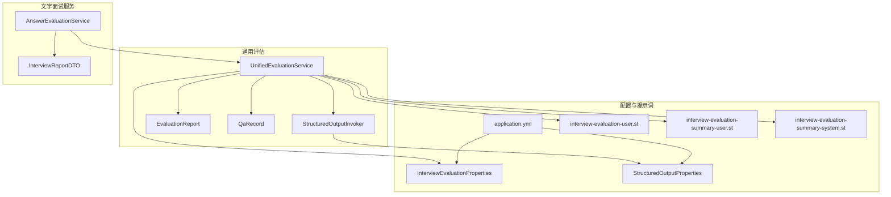
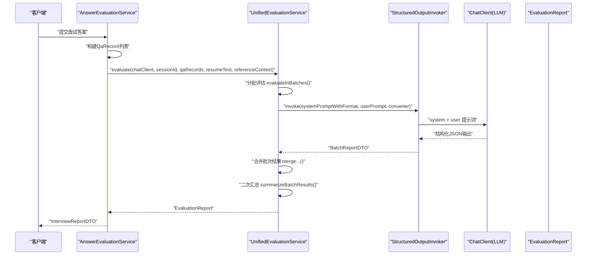
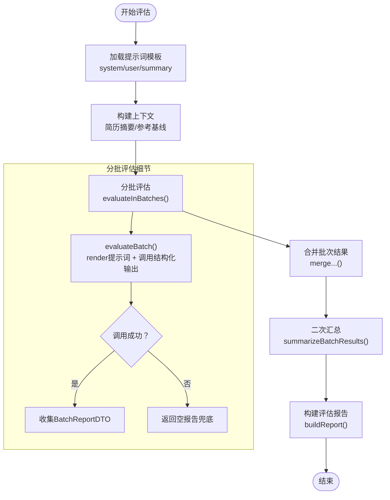
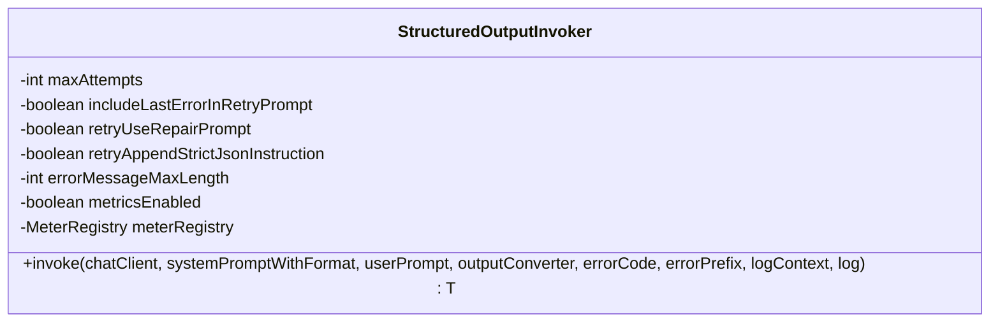
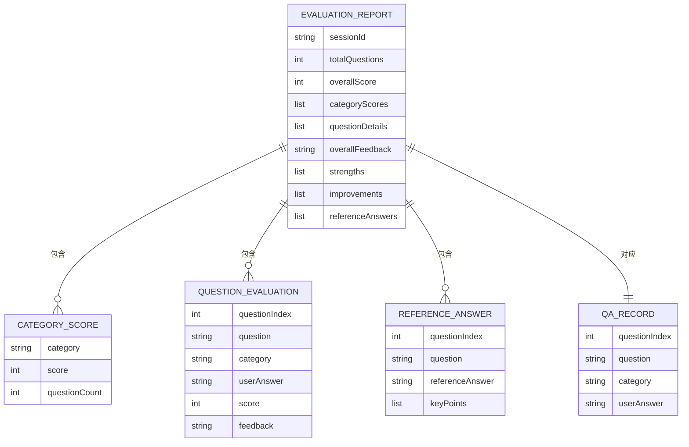
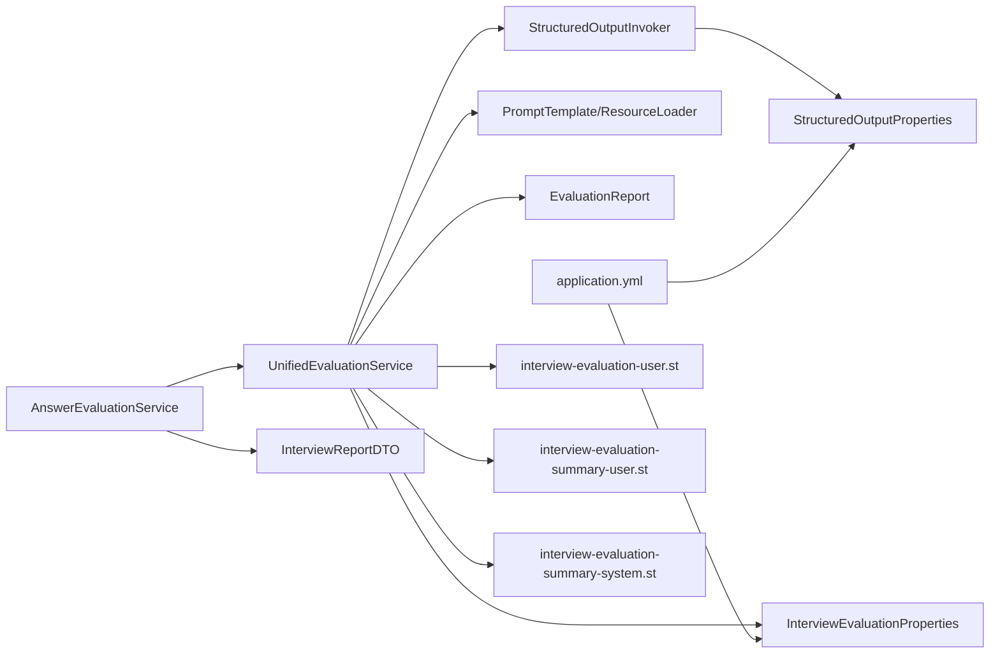

# 面试评估机制

<cite>
**本文引用的文件**
- [AnswerEvaluationService.java](file://app/src/main/java/interview/guide/modules/interview/service/AnswerEvaluationService.java)
- [UnifiedEvaluationService.java](file://app/src/main/java/interview/guide/common/evaluation/UnifiedEvaluationService.java)
- [StructuredOutputInvoker.java](file://app/src/main/java/interview/guide/common/ai/StructuredOutputInvoker.java)
- [EvaluationReport.java](file://app/src/main/java/interview/guide/common/evaluation/EvaluationReport.java)
- [QaRecord.java](file://app/src/main/java/interview/guide/common/evaluation/QaRecord.java)
- [InterviewEvaluationProperties.java](file://app/src/main/java/interview/guide/common/evaluation/InterviewEvaluationProperties.java)
- [StructuredOutputProperties.java](file://app/src/main/java/interview/guide/common/ai/StructuredOutputProperties.java)
- [InterviewReportDTO.java](file://app/src/main/java/interview/guide/modules/interview/model/InterviewReportDTO.java)
- [application.yml](file://app/src/main/resources/application.yml)
- [interview-evaluation-user.st](file://app/src/main/resources/prompts/interview-evaluation-user.st)
- [interview-evaluation-summary-user.st](file://app/src/main/resources/prompts/interview-evaluation-summary-user.st)
- [interview-evaluation-summary-system.st](file://app/src/main/resources/prompts/interview-evaluation-summary-system.st)
</cite>

## 目录
1. [简介](#简介)
2. [项目结构](#项目结构)
3. [核心组件](#核心组件)
4. [架构总览](#架构总览)
5. [详细组件分析](#详细组件分析)
6. [依赖分析](#依赖分析)
7. [性能考虑](#性能考虑)
8. [故障排查指南](#故障排查指南)
9. [结论](#结论)
10. [附录](#附录)

## 简介
本文件面向面试评估机制的技术文档，围绕以下目标展开：
- 深入解释 AnswerEvaluationService 的评估算法实现，包括答案质量评分、技能匹配度计算、综合评价指标等；
- 详解 StructuredOutputInvoker 的结构化输出处理机制，包括 AI 模型调用、结果解析、格式标准化与重试策略；
- 描述 UnifiedEvaluationService 的统一评估架构，包括多维度评估、权重分配、评分聚合与降级兜底；
- 解释 EvaluationReport 与 QaRecord 的数据模型设计，涵盖评估结果存储、历史记录管理与统计分析；
- 提供评估流程的完整说明，从答案接收、AI 评估、结果汇总到报告生成的全过程；
- 说明评估策略的配置选项，如评估标准、评分规则、降级策略等；
- 详述评估报告的生成机制，包括内容格式、数据结构、导出功能等。

## 项目结构
面试评估相关代码主要分布在以下模块：
- 通用评估与AI工具：common.evaluation、common.ai
- 文字面试服务：modules.interview.service
- 数据传输对象：modules.interview.model
- 配置与提示词：resources/application.yml、resources/prompts

图表来源
- [AnswerEvaluationService.java:1-99](file://app/src/main/java/interview/guide/modules/interview/service/AnswerEvaluationService.java#L1-L99)
- [UnifiedEvaluationService.java:1-380](file://app/src/main/java/interview/guide/common/evaluation/UnifiedEvaluationService.java#L1-L380)
- [StructuredOutputInvoker.java:1-172](file://app/src/main/java/interview/guide/common/ai/StructuredOutputInvoker.java#L1-L172)
- [InterviewEvaluationProperties.java:1-18](file://app/src/main/java/interview/guide/common/evaluation/InterviewEvaluationProperties.java#L1-L18)
- [StructuredOutputProperties.java:1-19](file://app/src/main/java/interview/guide/common/ai/StructuredOutputProperties.java#L1-L19)
- [InterviewReportDTO.java:1-50](file://app/src/main/java/interview/guide/modules/interview/model/InterviewReportDTO.java#L1-L50)
- [application.yml:125-179](file://app/src/main/resources/application.yml#L125-L179)

章节来源
- [AnswerEvaluationService.java:1-99](file://app/src/main/java/interview/guide/modules/interview/service/AnswerEvaluationService.java#L1-L99)
- [UnifiedEvaluationService.java:1-380](file://app/src/main/java/interview/guide/common/evaluation/UnifiedEvaluationService.java#L1-L380)
- [StructuredOutputInvoker.java:1-172](file://app/src/main/java/interview/guide/common/ai/StructuredOutputInvoker.java#L1-L172)
- [InterviewEvaluationProperties.java:1-18](file://app/src/main/java/interview/guide/common/evaluation/InterviewEvaluationProperties.java#L1-L18)
- [StructuredOutputProperties.java:1-19](file://app/src/main/java/interview/guide/common/ai/StructuredOutputProperties.java#L1-L19)
- [InterviewReportDTO.java:1-50](file://app/src/main/java/interview/guide/modules/interview/model/InterviewReportDTO.java#L1-L50)
- [application.yml:125-179](file://app/src/main/resources/application.yml#L125-L179)

## 核心组件
- AnswerEvaluationService：负责将文字面试的输入转换为通用问答记录，调用统一评估服务并返回文字面试专用报告。
- UnifiedEvaluationService：统一评估引擎，支持分批评估、结构化解析、二次汇总与降级兜底，产出通用评估报告。
- StructuredOutputInvoker：封装结构化输出调用与重试策略，确保模型输出符合预期格式。
- EvaluationReport 与 QaRecord：通用数据模型，承载评估结果与问答记录。
- InterviewReportDTO：文字面试专用报告数据模型。
- 配置类与提示词：InterviewEvaluationProperties、StructuredOutputProperties 以及对应的提示词模板。

章节来源
- [AnswerEvaluationService.java:25-99](file://app/src/main/java/interview/guide/modules/interview/service/AnswerEvaluationService.java#L25-L99)
- [UnifiedEvaluationService.java:31-380](file://app/src/main/java/interview/guide/common/evaluation/UnifiedEvaluationService.java#L31-L380)
- [StructuredOutputInvoker.java:19-172](file://app/src/main/java/interview/guide/common/ai/StructuredOutputInvoker.java#L19-L172)
- [EvaluationReport.java:8-41](file://app/src/main/java/interview/guide/common/evaluation/EvaluationReport.java#L8-L41)
- [QaRecord.java:6-12](file://app/src/main/java/interview/guide/common/evaluation/QaRecord.java#L6-L12)
- [InterviewReportDTO.java:8-50](file://app/src/main/java/interview/guide/modules/interview/model/InterviewReportDTO.java#L8-L50)
- [InterviewEvaluationProperties.java:10-17](file://app/src/main/java/interview/guide/common/evaluation/InterviewEvaluationProperties.java#L10-L17)
- [StructuredOutputProperties.java:9-19](file://app/src/main/java/interview/guide/common/ai/StructuredOutputProperties.java#L9-L19)

## 架构总览
整体流程从文字面试答案接收开始，经由 AnswerEvaluationService 转换为通用问答记录，随后由 UnifiedEvaluationService 分批调用 AI 模型进行结构化评估，最后生成通用评估报告并映射为文字面试报告。

图表来源
- [AnswerEvaluationService.java:45-75](file://app/src/main/java/interview/guide/modules/interview/service/AnswerEvaluationService.java#L45-L75)
- [UnifiedEvaluationService.java:100-144](file://app/src/main/java/interview/guide/common/evaluation/UnifiedEvaluationService.java#L100-L144)
- [StructuredOutputInvoker.java:59-103](file://app/src/main/java/interview/guide/common/ai/StructuredOutputInvoker.java#L59-L103)

## 详细组件分析

### AnswerEvaluationService：文字面试评估入口
职责与流程：
- 将输入的 InterviewQuestionDTO 列表转换为通用 QaRecord 列表；
- 通过技能服务构建评估参考上下文；
- 调用统一评估服务执行评估；
- 将通用评估报告映射为文字面试专用报告 InterviewReportDTO。

关键点：
- 输入适配：将 questionIndex、question、category、userAnswer 转换为 QaRecord；
- 参考上下文：基于会话技能 ID 构建参考基线，用于辅助评估；
- 异常处理：捕获业务异常并抛出统一错误码，保证上层调用一致性。

章节来源
- [AnswerEvaluationService.java:25-99](file://app/src/main/java/interview/guide/modules/interview/service/AnswerEvaluationService.java#L25-L99)

### UnifiedEvaluationService：统一评估引擎
职责与流程：
- 加载系统与用户提示词模板，初始化结构化输出转换器；
- 对问答记录进行分批评估，每批调用结构化输出 Invoker；
- 合并批次结果：逐题评分、综合评语、优势与改进建议去重合并；
- 二次汇总：基于类别概览与题目高亮生成更一致的综合结论；
- 构建通用评估报告：填充总体分、类别平均分、问题明细、参考答案与要点。

算法与数据流要点：
- 分批评估：batchSize 由配置决定，默认 8；
- 评分聚合：按类别求平均分，按已答题数量计算总体平均分；
- 降级策略：若某批评估失败，用零分兜底并记录提示，最终二次汇总阶段可覆盖；
- 结构化输出：通过 BeanOutputConverter 确保模型输出符合 DTO 结构；
- 提示词拼装：简历摘要、问答记录、参考基线、类别概览、题目高亮等。

图表来源
- [UnifiedEvaluationService.java:76-89](file://app/src/main/java/interview/guide/common/evaluation/UnifiedEvaluationService.java#L76-L89)
- [UnifiedEvaluationService.java:151-189](file://app/src/main/java/interview/guide/common/evaluation/UnifiedEvaluationService.java#L151-L189)
- [UnifiedEvaluationService.java:202-246](file://app/src/main/java/interview/guide/common/evaluation/UnifiedEvaluationService.java#L202-L246)
- [UnifiedEvaluationService.java:248-280](file://app/src/main/java/interview/guide/common/evaluation/UnifiedEvaluationService.java#L248-L280)
- [UnifiedEvaluationService.java:290-344](file://app/src/main/java/interview/guide/common/evaluation/UnifiedEvaluationService.java#L290-L344)

章节来源
- [UnifiedEvaluationService.java:31-380](file://app/src/main/java/interview/guide/common/evaluation/UnifiedEvaluationService.java#L31-L380)

### StructuredOutputInvoker：结构化输出与重试
职责与机制：
- 统一封装 ChatClient.prompt().call().entity(converter) 的调用；
- 支持多次重试，失败时可注入上次错误原因、修复提示词与严格 JSON 指令；
- 记录调用次数、尝试状态与延迟指标，便于可观测性；
- 提供上下文标签归一化，限制标签长度与字符集。

关键配置：
- 最大重试次数、是否包含上次错误、是否使用修复提示词、是否追加严格 JSON 指令、错误信息截断长度、是否启用指标。

图表来源
- [StructuredOutputInvoker.java:46-57](file://app/src/main/java/interview/guide/common/ai/StructuredOutputInvoker.java#L46-L57)
- [StructuredOutputInvoker.java:59-103](file://app/src/main/java/interview/guide/common/ai/StructuredOutputInvoker.java#L59-L103)

章节来源
- [StructuredOutputInvoker.java:19-172](file://app/src/main/java/interview/guide/common/ai/StructuredOutputInvoker.java#L19-L172)
- [StructuredOutputProperties.java:9-19](file://app/src/main/java/interview/guide/common/ai/StructuredOutputProperties.java#L9-L19)

### 数据模型：EvaluationReport 与 QaRecord
- EvaluationReport：通用评估报告载体，包含会话标识、总题数、总体分、类别得分、问题明细、总体评语、优势、改进建议、参考答案与要点。
- QaRecord：通用问答记录，包含问题索引、问题文本、类别、用户答案（未回答可为空）。

图表来源
- [EvaluationReport.java:8-41](file://app/src/main/java/interview/guide/common/evaluation/EvaluationReport.java#L8-L41)
- [QaRecord.java:6-12](file://app/src/main/java/interview/guide/common/evaluation/QaRecord.java#L6-L12)

章节来源
- [EvaluationReport.java:8-41](file://app/src/main/java/interview/guide/common/evaluation/EvaluationReport.java#L8-L41)
- [QaRecord.java:6-12](file://app/src/main/java/interview/guide/common/evaluation/QaRecord.java#L6-L12)

### 文字面试报告映射：InterviewReportDTO
- 将 EvaluationReport 中的通用字段映射为文字面试专用 DTO，保持字段一致性和类型安全。

章节来源
- [InterviewReportDTO.java:8-50](file://app/src/main/java/interview/guide/modules/interview/model/InterviewReportDTO.java#L8-L50)
- [AnswerEvaluationService.java:77-97](file://app/src/main/java/interview/guide/modules/interview/service/AnswerEvaluationService.java#L77-L97)

## 依赖分析
- AnswerEvaluationService 依赖 UnifiedEvaluationService、InterviewPersistenceService、InterviewSkillService；
- UnifiedEvaluationService 依赖 StructuredOutputInvoker、BeanOutputConverter、PromptTemplate、ResourceLoader；
- StructuredOutputInvoker 依赖 StructuredOutputProperties 与可选 MeterRegistry；
- 配置类 InterviewEvaluationProperties 与 StructuredOutputProperties 由 application.yml 提供默认值；
- 提示词模板通过 ResourceLoader 读取，路径由配置类指定。

图表来源
- [AnswerEvaluationService.java:34-40](file://app/src/main/java/interview/guide/modules/interview/service/AnswerEvaluationService.java#L34-L40)
- [UnifiedEvaluationService.java:76-89](file://app/src/main/java/interview/guide/common/evaluation/UnifiedEvaluationService.java#L76-L89)
- [StructuredOutputInvoker.java:46-57](file://app/src/main/java/interview/guide/common/ai/StructuredOutputInvoker.java#L46-L57)
- [InterviewEvaluationProperties.java:10-17](file://app/src/main/java/interview/guide/common/evaluation/InterviewEvaluationProperties.java#L10-L17)
- [StructuredOutputProperties.java:9-19](file://app/src/main/java/interview/guide/common/ai/StructuredOutputProperties.java#L9-L19)
- [application.yml:125-179](file://app/src/main/resources/application.yml#L125-L179)

章节来源
- [AnswerEvaluationService.java:34-40](file://app/src/main/java/interview/guide/modules/interview/service/AnswerEvaluationService.java#L34-L40)
- [UnifiedEvaluationService.java:76-89](file://app/src/main/java/interview/guide/common/evaluation/UnifiedEvaluationService.java#L76-L89)
- [StructuredOutputInvoker.java:46-57](file://app/src/main/java/interview/guide/common/ai/StructuredOutputInvoker.java#L46-L57)
- [InterviewEvaluationProperties.java:10-17](file://app/src/main/java/interview/guide/common/evaluation/InterviewEvaluationProperties.java#L10-L17)
- [StructuredOutputProperties.java:9-19](file://app/src/main/java/interview/guide/common/ai/StructuredOutputProperties.java#L9-L19)
- [application.yml:125-179](file://app/src/main/resources/application.yml#L125-L179)

## 性能考虑
- 分批评估：通过 batchSize 控制每次评估的问题数量，平衡吞吐与稳定性；
- 上下文截断：简历与参考基线存在长度上限，避免 Token 消耗过大；
- 重试与指标：结构化输出具备可配置重试与可观测性，有助于定位与恢复；
- 虚拟线程：应用启用虚拟线程，提升 I/O 密集场景并发能力，有利于 AI 调用与长连接。

章节来源
- [UnifiedEvaluationService.java:115-123](file://app/src/main/java/interview/guide/common/evaluation/UnifiedEvaluationService.java#L115-L123)
- [UnifiedEvaluationService.java:88-89](file://app/src/main/java/interview/guide/common/evaluation/UnifiedEvaluationService.java#L88-L89)
- [application.yml:42-47](file://app/src/main/resources/application.yml#L42-L47)
- [StructuredOutputInvoker.java:133-151](file://app/src/main/java/interview/guide/common/ai/StructuredOutputInvoker.java#L133-L151)

## 故障排查指南
- 结构化输出失败：检查提示词格式指令、模型输出是否严格 JSON、是否启用修复提示词与严格 JSON 指令；查看重试次数与错误信息截断长度配置；
- 评估结果为空：确认批次评估是否全部失败导致兜底为零分；检查参考上下文长度与提示词拼装；
- 报告字段缺失：核对 DTO 映射逻辑，确保非空字段的默认值处理；
- 指标不可用：确认是否启用结构化输出指标与 MeterRegistry 配置。

章节来源
- [StructuredOutputInvoker.java:59-103](file://app/src/main/java/interview/guide/common/ai/StructuredOutputInvoker.java#L59-L103)
- [UnifiedEvaluationService.java:177-188](file://app/src/main/java/interview/guide/common/evaluation/UnifiedEvaluationService.java#L177-L188)
- [AnswerEvaluationService.java:68-75](file://app/src/main/java/interview/guide/modules/interview/service/AnswerEvaluationService.java#L68-L75)

## 结论
面试评估机制通过 AnswerEvaluationService、UnifiedEvaluationService 与 StructuredOutputInvoker 的协同，实现了稳定、可配置且可扩展的评估流水线。其核心特性包括：
- 分批评估与二次汇总，兼顾性能与准确性；
- 结构化输出与重试策略，确保模型输出可解析；
- 通用数据模型与 DTO 映射，支持多场景复用；
- 可观测性与配置化，便于运维与调优。

## 附录

### 评估流程全览（文字面试）
- 输入：InterviewQuestionDTO 列表、会话 ID、简历摘要、可选参考上下文；
- 处理：AnswerEvaluationService 转换为 QaRecord，调用 UnifiedEvaluationService；
- 输出：InterviewReportDTO，包含总体分、类别分、问题明细、总体评语、优势与改进建议、参考答案与要点。

章节来源
- [AnswerEvaluationService.java:45-75](file://app/src/main/java/interview/guide/modules/interview/service/AnswerEvaluationService.java#L45-L75)
- [UnifiedEvaluationService.java:100-144](file://app/src/main/java/interview/guide/common/evaluation/UnifiedEvaluationService.java#L100-L144)

### 评估策略与配置
- 评估批大小：由 InterviewEvaluationProperties.batchSize 决定，默认 8；
- 提示词路径：系统提示词、用户提示词、摘要系统提示词、摘要用户提示词；
- 结构化输出重试：由 StructuredOutputProperties 控制最大重试次数、是否包含上次错误、是否使用修复提示词、是否追加严格 JSON 指令、错误信息截断长度、是否启用指标；
- 应用级 AI 配置：模型选择、温度、禁用自动重试、向量检索参数等。

章节来源
- [InterviewEvaluationProperties.java:10-17](file://app/src/main/java/interview/guide/common/evaluation/InterviewEvaluationProperties.java#L10-L17)
- [StructuredOutputProperties.java:9-19](file://app/src/main/java/interview/guide/common/ai/StructuredOutputProperties.java#L9-L19)
- [application.yml:125-179](file://app/src/main/resources/application.yml#L125-L179)

### 提示词模板说明
- 用户评估提示词：定义输入数据结构、评估要求（逐题评分、类别统计、优势与改进建议、参考答案与要点）；
- 摘要评估提示词：定义二次汇总任务、约束与输出格式；
- 摘要系统提示词：角色设定与任务约束。

章节来源
- [interview-evaluation-user.st:1-23](file://app/src/main/resources/prompts/interview-evaluation-user.st#L1-L23)
- [interview-evaluation-summary-user.st:1-25](file://app/src/main/resources/prompts/interview-evaluation-summary-user.st#L1-L25)
- [interview-evaluation-summary-system.st:1-11](file://app/src/main/resources/prompts/interview-evaluation-summary-system.st#L1-L11)