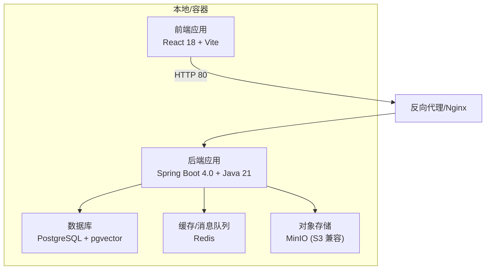
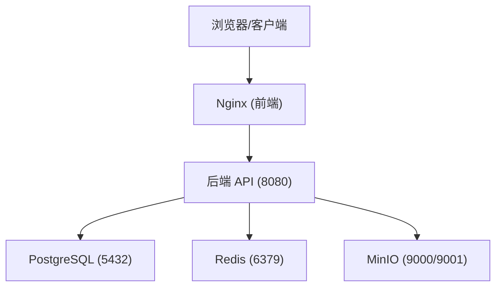
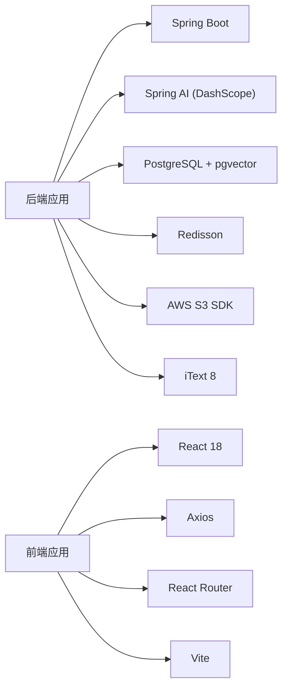

# 快速开始指南

<cite>
**本文引用的文件**
- [README.md](file://README.md)
- [docker-compose.yml](file://docker-compose.yml)
- [docker-compose.dev.yml](file://docker-compose.dev.yml)
- [app/build.gradle](file://app/build.gradle)
- [app/src/main/resources/application.yml](file://app/src/main/resources/application.yml)
- [frontend/package.json](file://frontend/package.json)
- [frontend/vite.config.ts](file://frontend/vite.config.ts)
- [frontend/src/api/request.ts](file://frontend/src/api/request.ts)
- [frontend/Dockerfile](file://frontend/Dockerfile)
- [docker/postgres/init.sql](file://docker/postgres/init.sql)
</cite>

## 目录
1. [简介](#简介)
2. [项目结构](#项目结构)
3. [核心组件](#核心组件)
4. [架构总览](#架构总览)
5. [详细组件分析](#详细组件分析)
6. [依赖关系分析](#依赖关系分析)
7. [性能注意事项](#性能注意事项)
8. [故障排查指南](#故障排查指南)
9. [结论](#结论)
10. [附录](#附录)

## 简介
本指南面向首次接触 InterviewGuide 的开发者与运维人员，提供从环境准备到两种启动模式（本地开发与 Docker 一键启动）的完整步骤，涵盖 .env 配置详解、启动命令与验证方法、常见问题排查以及不同操作系统（Windows、macOS、Linux）的针对性安装指导。项目采用 Spring Boot 4.0 + Java 21 + React 18 + PostgreSQL + Redis + MinIO（S3 兼容）的技术栈，支持简历分析、模拟面试（文字/语音）、知识库管理与面试安排等核心功能。

## 项目结构
项目采用前后端分离架构，后端位于 app/，前端位于 frontend/，并通过 Docker Compose 编排 PostgreSQL、Redis、MinIO 与应用服务。根目录提供 docker-compose.yml 与 docker-compose.dev.yml，分别用于一键部署与本地开发依赖服务启动。

图表来源
- [docker-compose.yml:13-186](file://docker-compose.yml#L13-L186)
- [frontend/Dockerfile:29-43](file://frontend/Dockerfile#L29-L43)

章节来源
- [README.md:210-247](file://README.md#L210-L247)

## 核心组件
- 后端（Spring Boot 4.0 + Java 21）
  - 通过 application.yml 读取环境变量进行配置，支持数据库、Redis、MinIO、AI Provider、语音面试等配置项。
  - 通过 Gradle 构建，JDK Toolchain 指定 Java 21。
- 前端（React 18 + Vite）
  - 通过 Vite 开发服务器运行，代理 /api 到后端 8080 端口。
  - Axios 统一请求封装，遵循后端统一响应结构。
- 依赖服务（Docker 编排）
  - PostgreSQL（pgvector 扩展）、Redis、MinIO（含初始化 Bucket 任务）、后端应用、前端 Nginx。

章节来源
- [app/src/main/resources/application.yml:48-282](file://app/src/main/resources/application.yml#L48-L282)
- [app/build.gradle:89-93](file://app/build.gradle#L89-L93)
- [frontend/vite.config.ts:24-37](file://frontend/vite.config.ts#L24-L37)
- [frontend/src/api/request.ts:12-17](file://frontend/src/api/request.ts#L12-L17)

## 架构总览
下图展示了 Docker 编排的服务关系与端口映射，以及前端通过 Nginx 反向代理访问后端 API 的典型链路。

图表来源
- [docker-compose.yml:13-186](file://docker-compose.yml#L13-L186)

章节来源
- [docker-compose.yml:13-186](file://docker-compose.yml#L13-L186)

## 详细组件分析

### 环境准备与安装
- JDK 21+
  - Spring Boot 4.0 + Java 21，Toolchain 已在构建脚本中固定。
- Node.js 18+
  - 前端使用 React 18 + Vite，package.json 指定依赖与脚本。
- Docker（可选）
  - 一键启动 PostgreSQL、Redis、MinIO 与应用服务；也可仅启动开发依赖服务。

章节来源
- [app/build.gradle:89-93](file://app/build.gradle#L89-L93)
- [frontend/package.json:1-47](file://frontend/package.json#L1-L47)
- [README.md:251-259](file://README.md#L251-L259)

### .env 配置文件详解
- 必填项
  - AI_BAILIAN_API_KEY：阿里云百炼 API Key（用于 AI 对话与语音服务）。
- 可选项
  - AI_MODEL：默认 qwen-plus，可选 qwen-max、qwen-long 等。
  - APP_VOICE_INTERVIEW_LLM_PROVIDER：语音面试 LLM 提供商（dashscope、minimax、openai、deepseek、lmstudio）。
  - APP_INTERVIEW_FOLLOW_UP_COUNT：每个主问题生成的追问数量（默认 1）。
  - APP_INTERVIEW_EVALUATION_BATCH_SIZE：回答评估分批大小（默认 8）。
  - 其他面试参数与语音面试配置项详见 application.yml 中 app.voice-interview.* 与 app.interview.*。
- Docker 一键部署
  - docker-compose.yml 已将 .env 中的变量注入到服务环境，包括数据库、Redis、MinIO、AI Provider 与面试参数。

章节来源
- [README.md:268-290](file://README.md#L268-L290)
- [README.md:356-378](file://README.md#L356-L378)
- [app/src/main/resources/application.yml:125-282](file://app/src/main/resources/application.yml#L125-L282)

### 两种启动方式

#### 本地开发模式（手动安装依赖服务）
- 步骤
  1) 启动依赖服务
     - PostgreSQL（含 pgvector 扩展）、Redis、MinIO（S3 兼容存储）。
     - 若不使用 Docker，需自行安装 PostgreSQL 14+（含 pgvector 扩展）、Redis 6+ 与 S3 兼容存储。
  2) 配置环境变量
     - 复制 .env.example 为 .env，填写 AI_BAILIAN_API_KEY 等配置。
     - 本地通过 Gradle bootRun 启动后端，Gradle 会读取 .env 注入环境变量。
  3) 启动后端
     - ./gradlew bootRun，监听 8080 端口。
  4) 启动前端
     - cd frontend，pnpm install，pnpm dev，监听 5173 端口。
     - Vite 代理 /api 到 http://localhost:8080。
- 验证
  - 访问 http://localhost:5173，进入首页；后端 Swagger 文档：http://localhost:8080/swagger-ui.html。
  - MinIO 控制台：http://localhost:9001，登录后创建名为 interview-guide 的 Bucket。

章节来源
- [README.md:292-336](file://README.md#L292-L336)
- [app/build.gradle:104-135](file://app/build.gradle#L104-L135)
- [frontend/vite.config.ts:24-37](file://frontend/vite.config.ts#L24-L37)

#### Docker 一键启动模式
- 步骤
  1) 准备
     - 安装 Docker 与 Docker Compose。
     - 申请阿里云百炼 API Key。
  2) 配置 .env
     - 复制 .env.example 为 .env，填写 AI_BAILIAN_API_KEY；其他面试参数按需配置。
  3) 启动
     - docker-compose up -d --build，等待服务全部健康。
- 验证
  - 访问 http://localhost（前端 Nginx），后端 API：http://localhost:8080，Swagger：http://localhost:8080/swagger-ui.html。
  - MinIO 控制台：http://localhost:9001，S3 API：localhost:9000。

章节来源
- [README.md:338-414](file://README.md#L338-L414)
- [docker-compose.yml:1-197](file://docker-compose.yml#L1-L197)

### 服务访问地址与默认凭据
- 前端应用：http://localhost
- 后端 API：http://localhost:8080
- 接口文档：http://localhost:8080/swagger-ui.html
- MinIO 控制台：http://localhost:9001
- MinIO API：localhost:9000
- PostgreSQL：localhost:5432
- Redis：localhost:6379

默认账号与密码（Docker 一键部署）
- PostgreSQL：用户名 postgres，密码 password
- Redis：无密码（默认）
- MinIO：控制台用户名 minioadmin，密码 minioadmin；S3 API 使用相同凭据

章节来源
- [README.md:380-393](file://README.md#L380-L393)
- [docker-compose.yml:17-89](file://docker-compose.yml#L17-L89)

### 基本功能验证
- 后端
  - 访问 Swagger UI，查看接口文档与测试。
  - 检查数据库连接与表结构（JPA ddl-auto: update）。
- 前端
  - 访问 http://localhost:5173（本地开发）或 http://localhost（Docker）。
  - 上传简历、发起模拟面试、查询知识库、语音面试等。

章节来源
- [README.md:317-336](file://README.md#L317-L336)
- [app/src/main/resources/application.yml:63-78](file://app/src/main/resources/application.yml#L63-L78)

## 依赖关系分析
- 后端依赖
  - Spring Boot Web、Validation、Data JPA、WebSocket
  - Spring AI（OpenAI 兼容模式，DashScope）
  - PostgreSQL Driver、pgvector
  - Redisson（Redis 客户端）
  - AWS S3 SDK（RustFS/MinIO）
  - iText 8（PDF 导出）
  - MapStruct、Lombok
- 前端依赖
  - React 18、React Router、Axios、Tailwind CSS、Recharts、Framer Motion 等
  - Vite 构建工具与插件（WASM、Top-Level Await）

图表来源
- [app/build.gradle:23-87](file://app/build.gradle#L23-L87)
- [frontend/package.json:11-44](file://frontend/package.json#L11-L44)

章节来源
- [app/build.gradle:23-87](file://app/build.gradle#L23-L87)
- [frontend/package.json:11-44](file://frontend/package.json#L11-L44)

## 性能注意事项
- 虚拟线程与连接池
  - 后端启用了虚拟线程（Java 21+），并针对 HikariCP 进行了优化配置，适合 I/O 密集型场景（AI 调用、SSE 长连接）。
- Redis Stream 异步处理
  - 简历分析、知识库向量化、面试报告生成采用 Redis Stream 异步处理，降低请求延迟。
- 前端构建优化
  - Vite 与手动分包策略（react-vendor、ui-vendor 等）提升首屏加载性能。

章节来源
- [app/src/main/resources/application.yml:42-47](file://app/src/main/resources/application.yml#L42-L47)
- [app/src/main/resources/application.yml:54-61](file://app/src/main/resources/application.yml#L54-L61)
- [frontend/vite.config.ts:13-23](file://frontend/vite.config.ts#L13-L23)

## 故障排查指南
- 数据库表创建失败/数据丢失
  - 检查 JPA 的 ddl-auto 配置，开发环境推荐 update，避免使用 create 导致数据丢失。
- 知识库向量化失败
  - 若 initialize-schema: false，Spring AI 不会自动创建 vector_store 表，需手动创建或设置为 true。
- 简历分析失败
  - 检查 AI_BAILIAN_API_KEY 是否正确配置。
- 简历分析一直显示“分析中”
  - 检查 Redis 连接与 Stream Consumer 是否正常运行，查看后端日志。
- PDF 导出失败或中文显示异常
  - 检查内置中文字体文件是否存在，确认 iText 依赖与字体加载日志。
- Windows PowerShell 中文乱码
  - 项目已配置 Gradle 与 Logback UTF-8，可在 PowerShell 中设置代码页与输出编码，或使用 .\gradlew.bat 启动。

章节来源
- [README.md:424-494](file://README.md#L424-L494)
- [app/src/main/resources/application.yml:116-124](file://app/src/main/resources/application.yml#L116-L124)

## 结论
通过本指南，您可以根据需求选择本地开发或 Docker 一键启动两种方式快速运行 InterviewGuide。建议在开发阶段使用 Docker 一键部署以减少环境差异带来的问题，生产部署可根据需要自行编排服务。遇到问题时，可依据故障排查章节逐项定位并解决。

## 附录

### 环境准备清单（按操作系统）
- Windows
  - 安装 JDK 21+、Node.js 18+、Docker Desktop
  - PowerShell 中如遇中文乱码，按 README 的 PowerShell 指南设置编码
- macOS
  - 使用 Homebrew 安装 JDK 21+、Node.js 18+、Docker Desktop
  - zsh 用户可将 export 命令写入 ~/.zshrc 并 source 生效
- Linux
  - 使用发行版包管理器安装 JDK 21+、Node.js 18+、Docker
  - bash 用户可将 export 命令写入 ~/.bashrc 并 source 生效

章节来源
- [README.md:251-259](file://README.md#L251-L259)
- [README.md:280-290](file://README.md#L280-L290)

### 启动命令与验证清单
- 本地开发模式
  - 启动依赖服务：docker compose -f docker-compose.dev.yml up -d
  - 配置 .env，填写 AI_BAILIAN_API_KEY
  - 启动后端：./gradlew bootRun
  - 启动前端：cd frontend && pnpm install && pnpm dev
  - 验证：访问 http://localhost:5173、http://localhost:8080/swagger-ui.html
- Docker 一键启动
  - 配置 .env，填写 AI_BAILIAN_API_KEY
  - 启动：docker-compose up -d --build
  - 验证：访问 http://localhost、http://localhost:8080、http://localhost:9001

章节来源
- [README.md:292-336](file://README.md#L292-L336)
- [README.md:338-414](file://README.md#L338-L414)

### .env 关键配置项对照
- 必填
  - AI_BAILIAN_API_KEY：阿里云百炼 API Key
- 可选
  - AI_MODEL：默认 qwen-plus
  - APP_VOICE_INTERVIEW_LLM_PROVIDER：dashscope/minimax/openai/deepseek/lmstudio
  - APP_INTERVIEW_FOLLOW_UP_COUNT：默认 1
  - APP_INTERVIEW_EVALUATION_BATCH_SIZE：默认 8
- Docker 注入
  - docker-compose.yml 将 .env 中的变量注入到服务环境（数据库、Redis、MinIO、AI Provider、面试参数）

章节来源
- [README.md:268-290](file://README.md#L268-L290)
- [README.md:356-378](file://README.md#L356-L378)
- [docker-compose.yml:140-169](file://docker-compose.yml#L140-L169)

### 数据库初始化脚本
- PostgreSQL 启动时自动创建 vector 扩展，用于向量检索增强（RAG）。

章节来源
- [docker/postgres/init.sql:1-2](file://docker/postgres/init.sql#L1-L2)