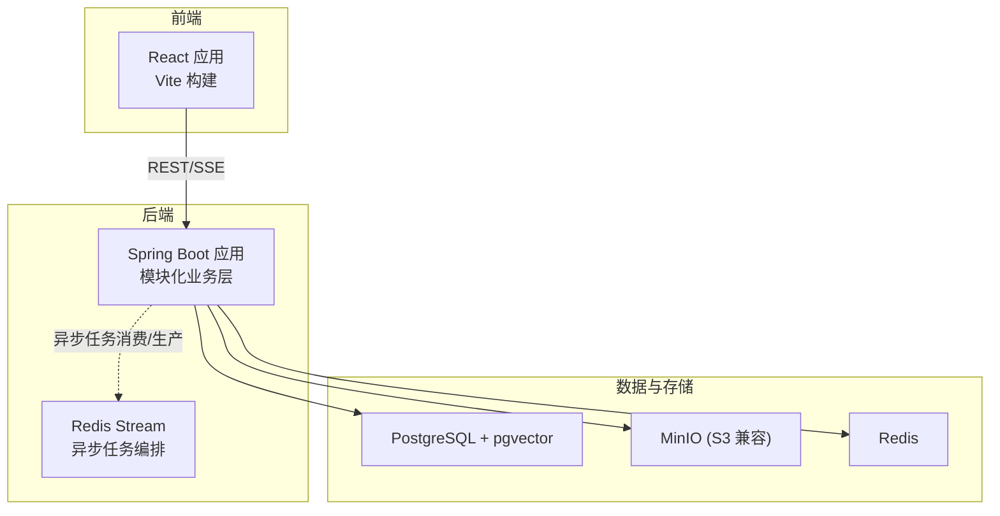
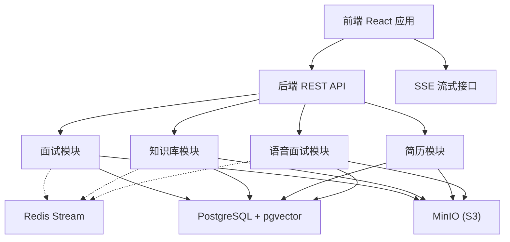
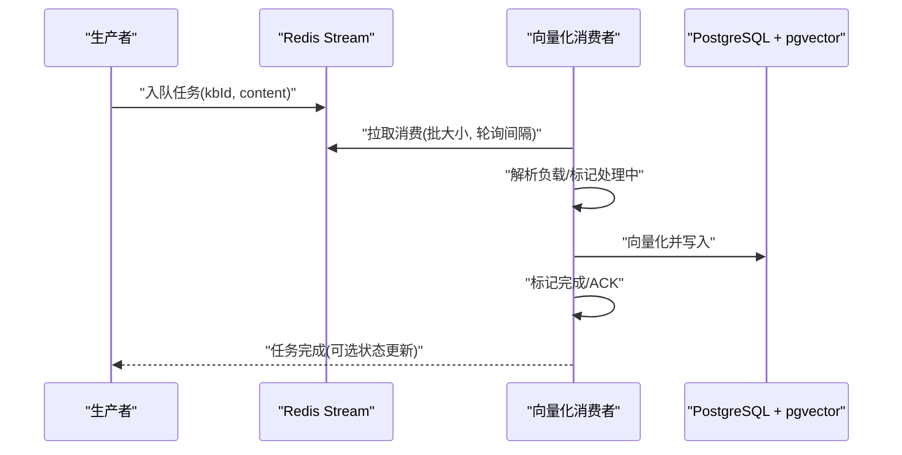
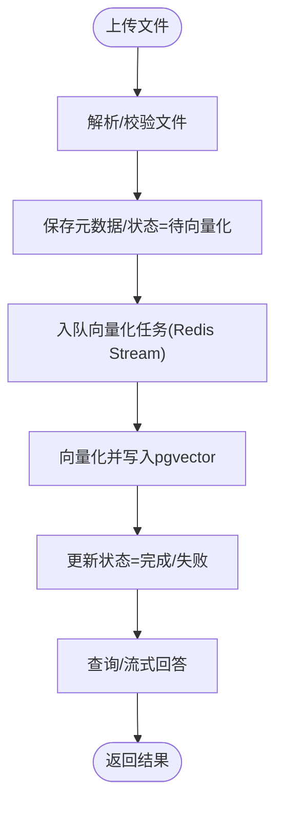
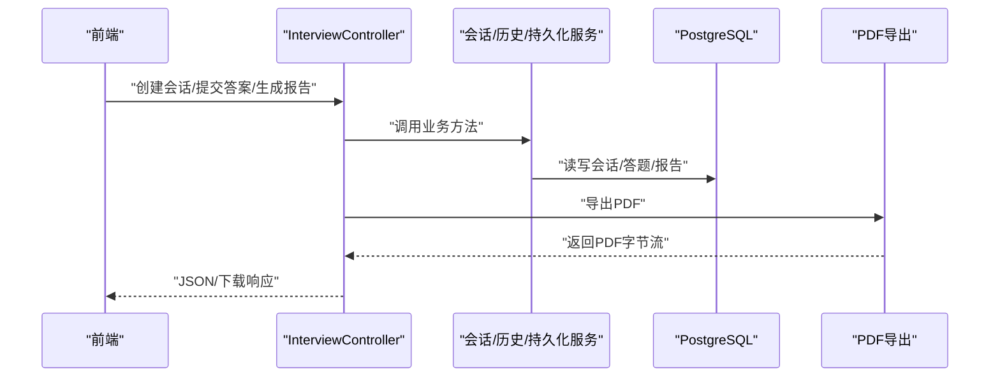
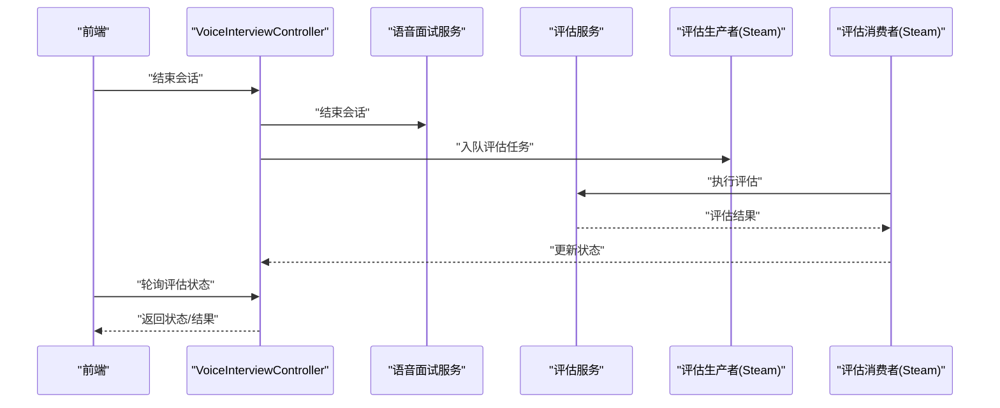
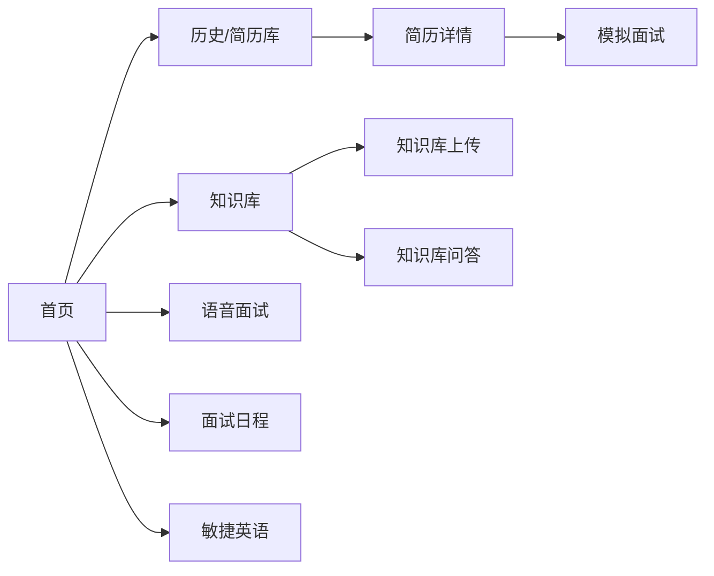
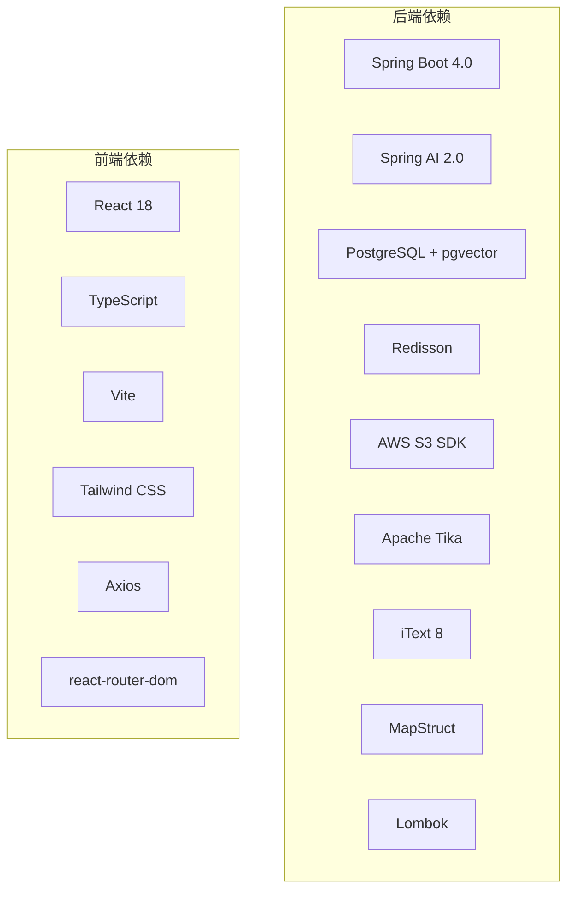

# 技术栈与架构

<cite>
**本文引用的文件**   
- [app/build.gradle](file://app/build.gradle)
- [gradle/libs.versions.toml](file://gradle/libs.versions.toml)
- [app/src/main/resources/application.yml](file://app/src/main/resources/application.yml)
- [app/src/main/java/interview/guide/App.java](file://app/src/main/java/interview/guide/App.java)
- [docker-compose.yml](file://docker-compose.yml)
- [frontend/package.json](file://frontend/package.json)
- [frontend/vite.config.ts](file://frontend/vite.config.ts)
- [frontend/src/App.tsx](file://frontend/src/App.tsx)
- [app/src/main/java/interview/guide/common/async/AbstractStreamConsumer.java](file://app/src/main/java/interview/guide/common/async/AbstractStreamConsumer.java)
- [app/src/main/java/interview/guide/common/async/AbstractStreamProducer.java](file://app/src/main/java/interview/guide/common/async/AbstractStreamProducer.java)
- [app/src/main/java/interview/guide/modules/knowledgebase/listener/VectorizeStreamConsumer.java](file://app/src/main/java/interview/guide/modules/knowledgebase/listener/VectorizeStreamConsumer.java)
- [app/src/main/java/interview/guide/modules/interview/InterviewController.java](file://app/src/main/java/interview/guide/modules/interview/InterviewController.java)
- [app/src/main/java/interview/guide/modules/knowledgebase/KnowledgeBaseController.java](file://app/src/main/java/interview/guide/modules/knowledgebase/KnowledgeBaseController.java)
- [app/src/main/java/interview/guide/modules/resume/ResumeController.java](file://app/src/main/java/interview/guide/modules/resume/ResumeController.java)
- [app/src/main/java/interview/guide/modules/voiceinterview/controller/VoiceInterviewController.java](file://app/src/main/java/interview/guide/modules/voiceinterview/controller/VoiceInterviewController.java)
</cite>

## 目录
1. [引言](#引言)
2. [项目结构](#项目结构)
3. [核心组件](#核心组件)
4. [架构总览](#架构总览)
5. [详细组件分析](#详细组件分析)
6. [依赖分析](#依赖分析)
7. [性能考量](#性能考量)
8. [故障排查指南](#故障排查指南)
9. [结论](#结论)
10. [附录](#附录)

## 引言
本项目是一个智能面试辅助平台，后端采用 Spring Boot 4.0 + Java 21 + Spring AI 2.0，结合 PostgreSQL + pgvector 向量数据库与 Redis 实现异步处理与缓存；前端采用 React 18 + TypeScript + Vite + Tailwind CSS，提供现代化交互体验。系统通过 Redis Stream 实现异步任务编排（如简历分析、知识库向量化、语音面试评估），并通过 Docker Compose 完成容器化部署，实现数据库、缓存、对象存储与应用服务的一体化编排。

## 项目结构
项目采用前后端分离的多模块布局：
- 后端模块位于 app/，基于 Gradle 构建，包含 Spring Boot 应用、模块化业务层（面试、知识库、简历、语音面试等）、异步流处理抽象与基础设施（Redis、文件存储）。
- 前端模块位于 frontend/，基于 Vite 构建，使用 React 18 + TypeScript，路由与页面组件清晰分层。
- docker-compose.yml 定义了 PostgreSQL（pgvector）、Redis、MinIO（S3 兼容）与后端应用、前端服务的完整运行环境。

图表来源
- [docker-compose.yml:1-197](file://docker-compose.yml#L1-L197)
- [app/src/main/resources/application.yml:48-124](file://app/src/main/resources/application.yml#L48-L124)

章节来源
- [docker-compose.yml:1-197](file://docker-compose.yml#L1-L197)
- [app/src/main/resources/application.yml:1-282](file://app/src/main/resources/application.yml#L1-L282)

## 核心组件
- 后端框架与语言
  - Spring Boot 4.0：模块化启动器、自动配置与 Web MVC 支持。
  - Java 21：启用虚拟线程，提升 I/O 密集型并发能力。
  - Spring AI 2.0：OpenAI 兼容模式集成 DashScope，向量存储使用 pgvector。
- 数据与缓存
  - PostgreSQL + pgvector：结构化数据与向量检索一体化。
  - Redis：缓存与 Redis Stream 异步任务编排。
  - MinIO：S3 兼容对象存储，用于简历与知识库文件存储。
- 前端技术栈
  - React 18 + TypeScript：类型安全与现代 Hooks。
  - Vite：快速构建与热更新。
  - Tailwind CSS：实用优先的样式工具集。
- 异步处理
  - Redis Stream 消费者/生产者模板：统一 ACK、重试、状态标记与生命周期管理。
- 容器化
  - Docker Compose：服务编排、健康检查与初始化容器（MinIO Bucket 创建）。

章节来源
- [app/build.gradle:23-87](file://app/build.gradle#L23-L87)
- [gradle/libs.versions.toml:3-30](file://gradle/libs.versions.toml#L3-L30)
- [app/src/main/resources/application.yml:42-124](file://app/src/main/resources/application.yml#L42-L124)
- [frontend/package.json:11-44](file://frontend/package.json#L11-L44)
- [frontend/vite.config.ts:1-42](file://frontend/vite.config.ts#L1-L42)
- [app/src/main/java/interview/guide/common/async/AbstractStreamConsumer.java:18-176](file://app/src/main/java/interview/guide/common/async/AbstractStreamConsumer.java#L18-L176)
- [app/src/main/java/interview/guide/common/async/AbstractStreamProducer.java:9-55](file://app/src/main/java/interview/guide/common/async/AbstractStreamProducer.java#L9-L55)

## 架构总览
系统采用前后端分离与微服务模块化设计：
- 前端通过 REST 接口与 SSE 流式接口与后端交互。
- 后端按功能域拆分为多个模块（面试、知识库、简历、语音面试），每个模块包含 Controller、Service、Repository、Listener 等层次。
- 异步任务通过 Redis Stream 解耦，生产者将任务入队，消费者串行处理并更新状态。
- 数据层统一使用 JPA/Hibernate，PostgreSQL + pgvector 提供结构化与向量检索能力；对象存储使用 S3 兼容接口。

图表来源
- [app/src/main/java/interview/guide/modules/interview/InterviewController.java:22-176](file://app/src/main/java/interview/guide/modules/interview/InterviewController.java#L22-L176)
- [app/src/main/java/interview/guide/modules/knowledgebase/KnowledgeBaseController.java:30-211](file://app/src/main/java/interview/guide/modules/knowledgebase/KnowledgeBaseController.java#L30-L211)
- [app/src/main/java/interview/guide/modules/resume/ResumeController.java:24-132](file://app/src/main/java/interview/guide/modules/resume/ResumeController.java#L24-L132)
- [app/src/main/java/interview/guide/modules/voiceinterview/controller/VoiceInterviewController.java:25-201](file://app/src/main/java/interview/guide/modules/voiceinterview/controller/VoiceInterviewController.java#L25-L201)
- [app/src/main/resources/application.yml:116-124](file://app/src/main/resources/application.yml#L116-L124)

## 详细组件分析

### 异步处理：Redis Stream 模板与知识库向量化
- 模板基类
  - AbstractStreamConsumer：统一消费者生命周期、ACK、重试、状态标记与异常处理。
  - AbstractStreamProducer：统一消息发送骨架与失败回调。
- 知识库向量化消费者
  - 从 Redis Stream 拉取 kbId 与 content，调用向量化服务写入向量库，并更新状态。
- 流程要点
  - 消费组与批大小、轮询间隔、最大重试次数、消息长度上限均在常量中集中定义。
  - 失败时写入失败状态并可重试入队，保证幂等性与可观测性。

图表来源
- [app/src/main/java/interview/guide/common/async/AbstractStreamConsumer.java:74-123](file://app/src/main/java/interview/guide/common/async/AbstractStreamConsumer.java#L74-L123)
- [app/src/main/java/interview/guide/common/async/AbstractStreamProducer.java:22-36](file://app/src/main/java/interview/guide/common/async/AbstractStreamProducer.java#L22-L36)
- [app/src/main/java/interview/guide/modules/knowledgebase/listener/VectorizeStreamConsumer.java:64-121](file://app/src/main/java/interview/guide/modules/knowledgebase/listener/VectorizeStreamConsumer.java#L64-L121)

章节来源
- [app/src/main/java/interview/guide/common/async/AbstractStreamConsumer.java:18-176](file://app/src/main/java/interview/guide/common/async/AbstractStreamConsumer.java#L18-L176)
- [app/src/main/java/interview/guide/common/async/AbstractStreamProducer.java:9-55](file://app/src/main/java/interview/guide/common/async/AbstractStreamProducer.java#L9-L55)
- [app/src/main/java/interview/guide/modules/knowledgebase/listener/VectorizeStreamConsumer.java:15-140](file://app/src/main/java/interview/guide/modules/knowledgebase/listener/VectorizeStreamConsumer.java#L15-L140)

### 知识库模块：上传、查询与向量化
- 控制器职责
  - 列表、详情、删除、上传、下载、分类管理、搜索、统计、流式查询等。
  - 流式查询使用 TEXT_EVENT_STREAM，便于前端实时渲染。
- 业务特性
  - 上传后触发向量化任务（通过 Redis Stream），支持手动重试。
  - 查询支持多知识库聚合与重写策略配置。

图表来源
- [app/src/main/java/interview/guide/modules/knowledgebase/KnowledgeBaseController.java:44-211](file://app/src/main/java/interview/guide/modules/knowledgebase/KnowledgeBaseController.java#L44-L211)
- [app/src/main/resources/application.yml:160-170](file://app/src/main/resources/application.yml#L160-L170)

章节来源
- [app/src/main/java/interview/guide/modules/knowledgebase/KnowledgeBaseController.java:30-211](file://app/src/main/java/interview/guide/modules/knowledgebase/KnowledgeBaseController.java#L30-L211)

### 面试模块：会话管理与报告导出
- 控制器职责
  - 会话创建、当前问题、提交答案、报告生成、导出 PDF、删除会话等。
  - 提供速率限制保护，避免滥用。
- 报告导出
  - 通过 PDF 导出服务生成并返回二进制流，前端触发下载。

图表来源
- [app/src/main/java/interview/guide/modules/interview/InterviewController.java:36-176](file://app/src/main/java/interview/guide/modules/interview/InterviewController.java#L36-L176)

章节来源
- [app/src/main/java/interview/guide/modules/interview/InterviewController.java:22-176](file://app/src/main/java/interview/guide/modules/interview/InterviewController.java#L22-L176)

### 简历模块：上传分析与导出
- 控制器职责
  - 上传并分析简历，返回评分与建议；支持导出 PDF、删除、重新分析。
- 业务特性
  - 重复检测：若检测到相同简历，返回历史分析结果，避免重复计算。
  - 重新分析：失败时可手动重试。

章节来源
- [app/src/main/java/interview/guide/modules/resume/ResumeController.java:24-132](file://app/src/main/java/interview/guide/modules/resume/ResumeController.java#L24-L132)

### 语音面试模块：会话生命周期与异步评估
- 控制器职责
  - 会话创建、暂停/恢复、结束、消息历史、评估状态轮询与触发。
- 异步评估
  - 结束会话时触发评估任务入队 Redis Stream，前端轮询评估状态直至完成。
- 配置
  - 语音面试相关参数（时长、采样率、限流等）集中配置在 application.yml 中。

图表来源
- [app/src/main/java/interview/guide/modules/voiceinterview/controller/VoiceInterviewController.java:74-201](file://app/src/main/java/interview/guide/modules/voiceinterview/controller/VoiceInterviewController.java#L74-L201)

章节来源
- [app/src/main/java/interview/guide/modules/voiceinterview/controller/VoiceInterviewController.java:25-201](file://app/src/main/java/interview/guide/modules/voiceinterview/controller/VoiceInterviewController.java#L25-L201)

### 前端路由与页面组织
- 路由组织
  - 使用 React Router v6 组织页面路由，支持懒加载与导航上下文传递。
- 页面与组件
  - 上传、历史、详情、模拟面试、知识库管理/上传/问答、语音面试、日程管理、敏捷英语等页面。
- 开发体验
  - Vite 提供快速构建与热更新；Tailwind CSS 提供实用样式工具集。

图表来源
- [frontend/src/App.tsx:167-379](file://frontend/src/App.tsx#L167-L379)

章节来源
- [frontend/src/App.tsx:1-379](file://frontend/src/App.tsx#L1-L379)
- [frontend/vite.config.ts:1-42](file://frontend/vite.config.ts#L1-L42)

## 依赖分析
- 后端依赖
  - Spring Boot 4.0 启动器：Web MVC、验证、JPA、WebSocket。
  - Spring AI 2.0：OpenAI 兼容模式（DashScope）、pgvector 向量存储。
  - Redisson：Redis 客户端与配置。
  - AWS S3 SDK：RustFS（S3 兼容）存储。
  - Apache Tika：文档解析（PDF/DOCX/TXT）。
  - iText 8：PDF 导出。
  - Lombok + MapStruct：简化实体与 DTO 映射。
- 前端依赖
  - React 18 + TypeScript：类型安全与现代语法。
  - Vite：构建与开发服务器。
  - Tailwind CSS：样式工具集。
  - Axios、react-router-dom、framer-motion、lucide-react 等生态库。

图表来源
- [app/build.gradle:23-87](file://app/build.gradle#L23-L87)
- [gradle/libs.versions.toml:17-29](file://gradle/libs.versions.toml#L17-L29)
- [frontend/package.json:11-44](file://frontend/package.json#L11-L44)

章节来源
- [app/build.gradle:23-87](file://app/build.gradle#L23-L87)
- [gradle/libs.versions.toml:17-29](file://gradle/libs.versions.toml#L17-L29)
- [frontend/package.json:11-44](file://frontend/package.json#L11-L44)

## 性能考量
- 虚拟线程与连接池
  - 启用虚拟线程（Java 21+），提升 I/O 并发；Tomcat 线程与 HikariCP 连接池参数针对虚拟线程场景优化。
- Redis Stream
  - 单线程消费者串行处理，配合批大小与轮询间隔平衡吞吐与延迟。
- 向量检索
  - pgvector HNSW + COSINE_DISTANCE，维度与索引类型按嵌入模型配置。
- 前端打包
  - Vite 分包策略（react-vendor、ui-vendor、syntax-highlighter）降低首屏体积。

章节来源
- [app/src/main/resources/application.yml:42-78](file://app/src/main/resources/application.yml#L42-L78)
- [app/src/main/resources/application.yml:116-124](file://app/src/main/resources/application.yml#L116-L124)
- [frontend/vite.config.ts:13-23](file://frontend/vite.config.ts#L13-L23)

## 故障排查指南
- 启动与健康检查
  - docker-compose 中对 PostgreSQL、Redis、MinIO 均配置健康检查，确保后端应用在基础设施就绪后再启动。
- 日志与编码
  - application.yml 统一设置控制台与文件编码为 UTF-8，避免日志乱码。
- 速率限制
  - 控制器层使用注解进行全局与 IP 维度的速率限制，防止突发流量压垮服务。
- 异步任务
  - Redis Stream 消费者模板内置重试与失败状态更新，便于定位失败原因与重试。
- 语音面试
  - 评估状态轮询与异常信息字段，前端根据状态决定 UI 行为与提示。

章节来源
- [docker-compose.yml:31-58](file://docker-compose.yml#L31-L58)
- [app/src/main/resources/application.yml:4-24](file://app/src/main/resources/application.yml#L4-L24)
- [app/src/main/java/interview/guide/modules/interview/InterviewController.java:50-57](file://app/src/main/java/interview/guide/modules/interview/InterviewController.java#L50-L57)
- [app/src/main/java/interview/guide/common/async/AbstractStreamConsumer.java:112-122](file://app/src/main/java/interview/guide/common/async/AbstractStreamConsumer.java#L112-L122)
- [app/src/main/java/interview/guide/modules/voiceinterview/controller/VoiceInterviewController.java:137-157](file://app/src/main/java/interview/guide/modules/voiceinterview/controller/VoiceInterviewController.java#L137-L157)

## 结论
本项目通过 Spring Boot 4.0 + Java 21 的现代化技术栈，结合 Spring AI 2.0 与 pgvector 实现 RAG 能力，借助 Redis Stream 构建高可靠异步任务编排，并以 Docker Compose 完成全栈容器化部署。前端采用 React 18 + Vite + Tailwind CSS，提供良好的开发体验与交互性能。整体架构在可扩展性、可观测性与运维效率方面具备良好基础，适合持续演进与企业级落地。

## 附录
- 技术选型对比与理由（概述）
  - Spring Boot 4.0 vs Spring Boot 3.x：模块化启动器更易维护，与 Java 21 虚拟线程生态契合。
  - Java 21：虚拟线程显著提升 I/O 密集型场景并发，适合 AI 调用与长连接。
  - Spring AI 2.0：OpenAI 兼容模式适配国内模型服务（DashScope），pgvector 与向量检索无缝集成。
  - PostgreSQL + pgvector：单库同时满足结构化与向量检索，运维简单。
  - Redis：缓存与轻量异步编排（替代 Kafka/RabbitMQ 的成本考量）。
  - React 18 + Vite：现代前端开发体验，构建速度快，生态成熟。
  - Tailwind CSS：实用优先的样式体系，减少样式文件体积与维护成本。
- 部署与运行
  - 使用 docker-compose 一键启动数据库、缓存、对象存储与应用服务，支持环境变量覆盖配置。

章节来源
- [docker-compose.yml:1-197](file://docker-compose.yml#L1-L197)
- [app/src/main/resources/application.yml:125-282](file://app/src/main/resources/application.yml#L125-L282)