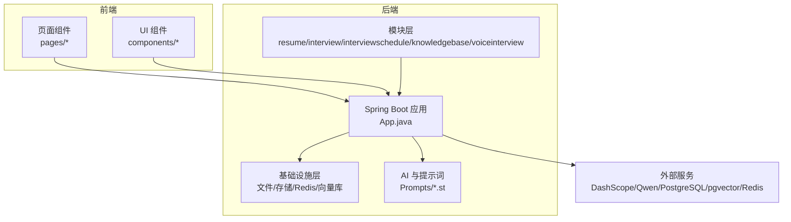
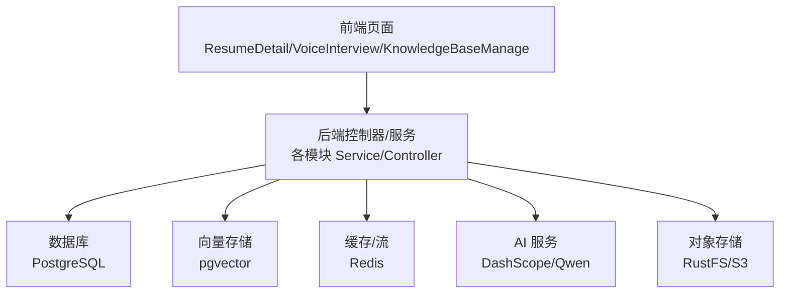
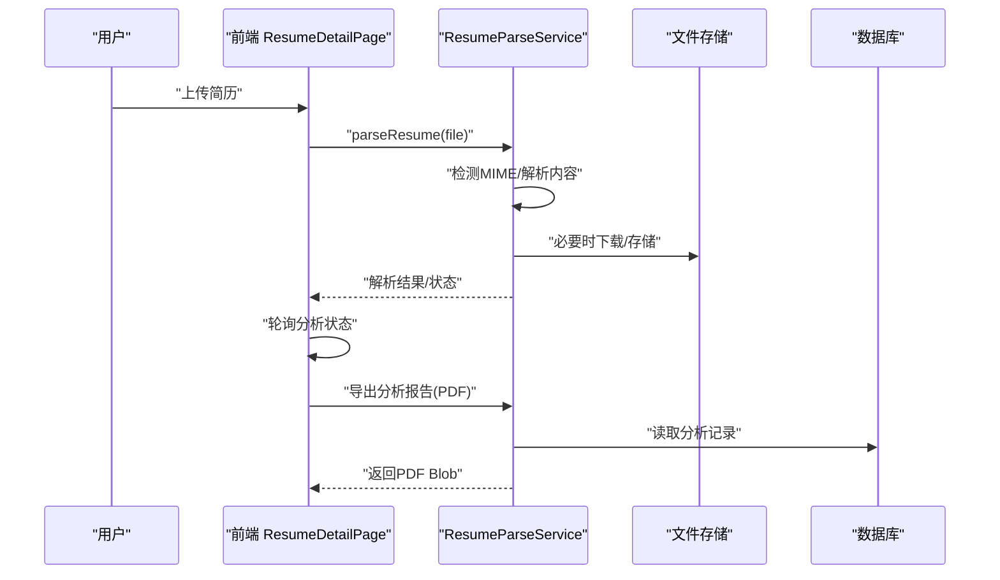
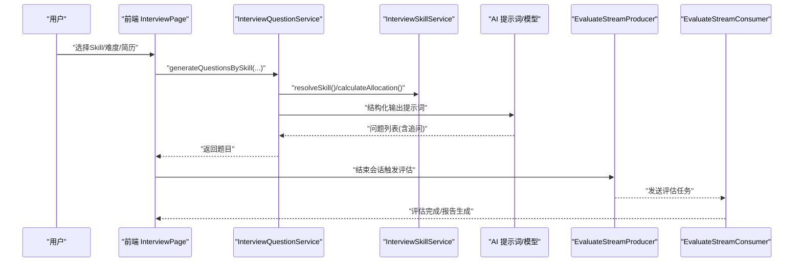
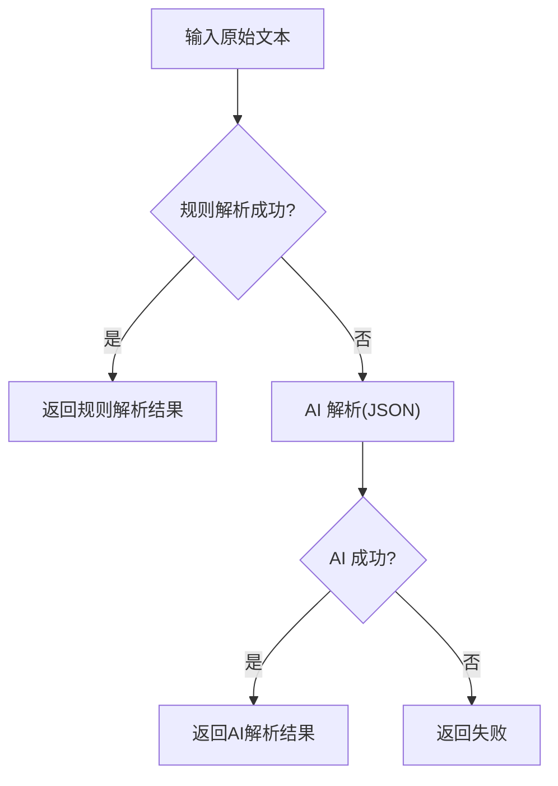
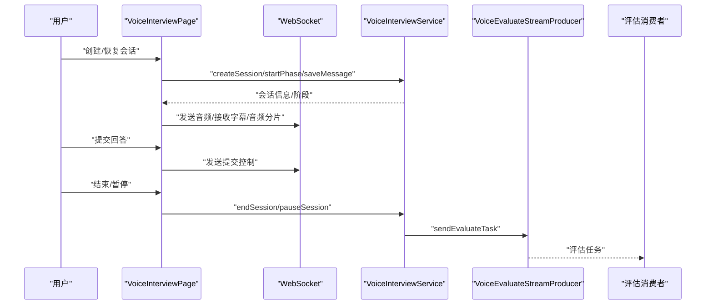
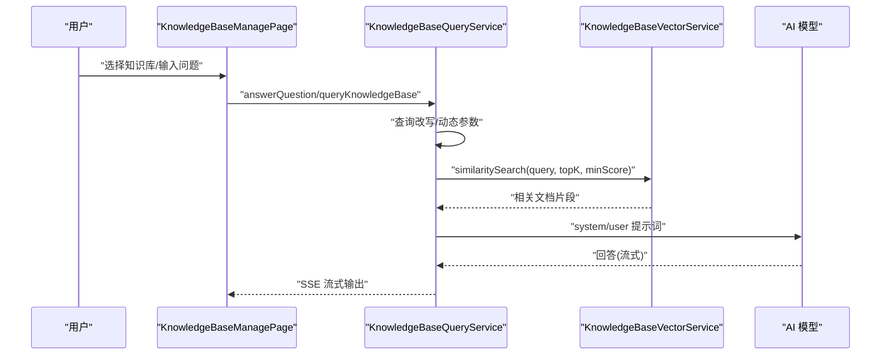
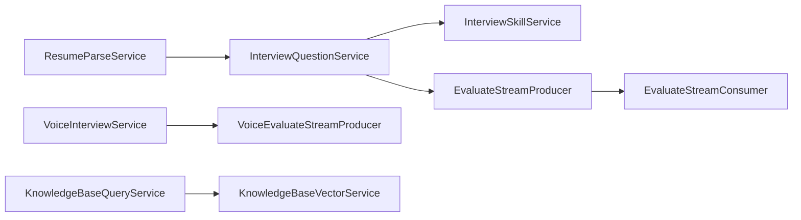

# 核心功能特性

<cite>
**本文档引用的文件**
- [app/src/main/java/interview/guide/modules/resume/service/ResumeParseService.java](file://app/src/main/java/interview/guide/modules/resume/service/ResumeParseService.java)
- [app/src/main/java/interview/guide/modules/interview/service/InterviewQuestionService.java](file://app/src/main/java/interview/guide/modules/interview/service/InterviewQuestionService.java)
- [app/src/main/java/interview/guide/modules/interview/skill/InterviewSkillService.java](file://app/src/main/java/interview/guide/modules/interview/skill/InterviewSkillService.java)
- [app/src/main/java/interview/guide/modules/interviewschedule/service/InterviewParseService.java](file://app/src/main/java/interview/guide/modules/interviewschedule/service/InterviewParseService.java)
- [app/src/main/java/interview/guide/modules/voiceinterview/service/VoiceInterviewService.java](file://app/src/main/java/interview/guide/modules/voiceinterview/service/VoiceInterviewService.java)
- [app/src/main/java/interview/guide/modules/knowledgebase/service/KnowledgeBaseQueryService.java](file://app/src/main/java/interview/guide/modules/knowledgebase/service/KnowledgeBaseQueryService.java)
- [app/src/main/java/interview/guide/modules/knowledgebase/service/KnowledgeBaseVectorService.java](file://app/src/main/java/interview/guide/modules/knowledgebase/service/KnowledgeBaseVectorService.java)
- [app/src/main/resources/prompts/interview-question-resume-system.st](file://app/src/main/resources/prompts/interview-question-resume-system.st)
- [app/src/main/resources/prompts/knowledgebase-query-user.st](file://app/src/main/resources/prompts/knowledgebase-query-user.st)
- [frontend/src/pages/ResumeDetailPage.tsx](file://frontend/src/pages/ResumeDetailPage.tsx)
- [frontend/src/pages/VoiceInterviewPage.tsx](file://frontend/src/pages/VoiceInterviewPage.tsx)
- [frontend/src/pages/KnowledgeBaseManagePage.tsx](file://frontend/src/pages/KnowledgeBaseManagePage.tsx)
- [frontend/src/components/InterviewDetailPanel.tsx](file://frontend/src/components/InterviewDetailPanel.tsx)
- [app/src/main/resources/voice-interview-opening.yml](file://app/src/main/resources/voice-interview-opening.yml)
- [app/src/main/java/interview/guide/modules/interview/listener/EvaluateStreamProducer.java](file://app/src/main/java/interview/guide/modules/interview/listener/EvaluateStreamProducer.java)
- [app/src/main/java/interview/guide/modules/interview/listener/EvaluateStreamConsumer.java](file://app/src/main/java/interview/guide/modules/interview/listener/EvaluateStreamConsumer.java)
- [app/src/main/java/interview/guide/modules/voiceinterview/listener/VoiceEvaluateStreamProducer.java](file://app/src/main/java/interview/guide/modules/voiceinterview/listener/VoiceEvaluateStreamProducer.java)
- [app/build.gradle](file://app/build.gradle)
</cite>

## 目录
1. [简介](#简介)
2. [项目结构](#项目结构)
3. [核心组件](#核心组件)
4. [架构总览](#架构总览)
5. [详细组件分析](#详细组件分析)
6. [依赖分析](#依赖分析)
7. [性能考量](#性能考量)
8. [故障排查指南](#故障排查指南)
9. [结论](#结论)
10. [附录](#附录)

## 简介
本文件聚焦系统五大核心功能特性，围绕“简历管理、模拟面试、面试安排、语音面试、知识库管理”展开，系统阐述技术实现原理、用户体验优势与业务价值，并提供功能间协同关系图、使用流程与扩展集成指南，帮助用户与开发者高效理解与落地。

## 项目结构
后端采用 Spring Boot 4.0 + Spring AI 2.0 + PostgreSQL + pgvector + Redis + WebSocket 技术栈；前端使用 React + TypeScript，配合 Framer Motion 与 Lucide 图标库，提供流畅的交互体验。核心模块位于 app/src/main/java/interview/guide/modules 下，前端页面位于 frontend/src/pages 与 components。

图表来源
- [app/build.gradle:23-87](file://app/build.gradle#L23-L87)

章节来源
- [app/build.gradle:1-136](file://app/build.gradle#L1-L136)

## 核心组件
- 简历管理模块：多格式解析与异步分析，支持 PDF/DOCX/TXT/MD 等，结合文件存储与内容清洗，提供分析状态轮询与报告导出。
- 模拟面试模块：Skill 驱动出题与统一评估架构，支持简历题与方向题混合策略、追问生成、历史避重、统一评估与报告。
- 面试安排模块：智能解析与日历管理，整合规则解析与 AI 解析，覆盖飞书/腾讯会议/Zoom 等平台，支持来源自动识别与回退策略。
- 语音面试模块：实时对话与流式输出，基于 WebSocket 的音频/文本双向传输，支持分片音频播放、阶段推进与异步评估。
- 知识库管理模块：RAG 检索增强与智能问答，支持向量化分块、相似度检索、查询改写、流式 SSE 输出与状态可视化。

章节来源
- [app/src/main/java/interview/guide/modules/resume/service/ResumeParseService.java:15-66](file://app/src/main/java/interview/guide/modules/resume/service/ResumeParseService.java#L15-L66)
- [app/src/main/java/interview/guide/modules/interview/service/InterviewQuestionService.java:40-173](file://app/src/main/java/interview/guide/modules/interview/service/InterviewQuestionService.java#L40-L173)
- [app/src/main/java/interview/guide/modules/interview/skill/InterviewSkillService.java:34-134](file://app/src/main/java/interview/guide/modules/interview/skill/InterviewSkillService.java#L34-L134)
- [app/src/main/java/interview/guide/modules/interviewschedule/service/InterviewParseService.java:26-122](file://app/src/main/java/interview/guide/modules/interviewschedule/service/InterviewParseService.java#L26-L122)
- [app/src/main/java/interview/guide/modules/voiceinterview/service/VoiceInterviewService.java:44-124](file://app/src/main/java/interview/guide/modules/voiceinterview/service/VoiceInterviewService.java#L44-L124)
- [app/src/main/java/interview/guide/modules/knowledgebase/service/KnowledgeBaseQueryService.java:35-155](file://app/src/main/java/interview/guide/modules/knowledgebase/service/KnowledgeBaseQueryService.java#L35-L155)
- [app/src/main/java/interview/guide/modules/knowledgebase/service/KnowledgeBaseVectorService.java:25-81](file://app/src/main/java/interview/guide/modules/knowledgebase/service/KnowledgeBaseVectorService.java#L25-L81)

## 架构总览
系统采用“前端页面 + 后端模块 + 基础设施/外部服务”的分层架构。前端通过 REST/SSE/WebSocket 与后端交互；后端模块内部通过服务、仓库、监听器与 Redis Stream 协作，实现异步评估与状态流转；AI 能力通过 Spring AI 与 DashScope/Qwen 集成，向量检索基于 pgvector。

图表来源
- [app/build.gradle:23-87](file://app/build.gradle#L23-L87)

## 详细组件分析

### 简历管理模块：多格式解析与异步分析
- 技术实现
  - 文件类型检测与内容解析委托给通用 DocumentParseService，支持 PDF/DOCX/TXT/MD 等。
  - 文件存储与下载解耦，支持字节数组与存储键两种解析入口。
  - 前端轮询分析状态，支持重新分析与 PDF 报告导出。
- 用户体验
  - 上传即解析，异步状态反馈，避免阻塞等待；分析完成后自动进入面试入口。
- 业务价值
  - 为后续模拟面试提供简历题素材，提升面试针对性与效率。
- 关键流程（解析与导出）

图表来源
- [app/src/main/java/interview/guide/modules/resume/service/ResumeParseService.java:30-57](file://app/src/main/java/interview/guide/modules/resume/service/ResumeParseService.java#L30-L57)
- [frontend/src/pages/ResumeDetailPage.tsx:32-74](file://frontend/src/pages/ResumeDetailPage.tsx#L32-L74)
- [frontend/src/pages/ResumeDetailPage.tsx:112-148](file://frontend/src/pages/ResumeDetailPage.tsx#L112-L148)

章节来源
- [app/src/main/java/interview/guide/modules/resume/service/ResumeParseService.java:15-66](file://app/src/main/java/interview/guide/modules/resume/service/ResumeParseService.java#L15-L66)
- [frontend/src/pages/ResumeDetailPage.tsx:20-110](file://frontend/src/pages/ResumeDetailPage.tsx#L20-L110)

### 模拟面试模块：Skill 驱动出题与统一评估架构
- 技术实现
  - 无简历：纯方向题（Skill 驱动）；有简历：简历题（60%）+ 方向题（40%）并行生成。
  - 支持追问生成、历史避重、难度描述注入、回退策略与题目截断。
  - Skill 系统从 classpath:skills 加载预设主题，支持 JD 解析生成自定义 Skill。
  - 评估采用 Redis Stream 异步评估，统一评估服务生成报告。
- 用户体验
  - 一键开始，AI 面试官按技能与难度出题，支持追问与阶段性推进。
- 业务价值
  - 标准化出题口径，统一评估维度，沉淀面试报告与改进建议。
- 关键流程（出题与评估）

图表来源
- [app/src/main/java/interview/guide/modules/interview/service/InterviewQuestionService.java:111-173](file://app/src/main/java/interview/guide/modules/interview/service/InterviewQuestionService.java#L111-L173)
- [app/src/main/java/interview/guide/modules/interview/skill/InterviewSkillService.java:122-134](file://app/src/main/java/interview/guide/modules/interview/skill/InterviewSkillService.java#L122-L134)
- [app/src/main/resources/prompts/interview-question-resume-system.st:1-24](file://app/src/main/resources/prompts/interview-question-resume-system.st#L1-L24)
- [app/src/main/java/interview/guide/modules/interview/listener/EvaluateStreamProducer.java:28-45](file://app/src/main/java/interview/guide/modules/interview/listener/EvaluateStreamProducer.java#L28-L45)
- [app/src/main/java/interview/guide/modules/interview/listener/EvaluateStreamConsumer.java:26-32](file://app/src/main/java/interview/guide/modules/interview/listener/EvaluateStreamConsumer.java#L26-L32)

章节来源
- [app/src/main/java/interview/guide/modules/interview/service/InterviewQuestionService.java:40-449](file://app/src/main/java/interview/guide/modules/interview/service/InterviewQuestionService.java#L40-L449)
- [app/src/main/java/interview/guide/modules/interview/skill/InterviewSkillService.java:34-200](file://app/src/main/java/interview/guide/modules/interview/skill/InterviewSkillService.java#L34-L200)

### 面试安排模块：智能解析与日历管理
- 技术实现
  - 规则解析优先：飞书/腾讯会议/Zoom 正则匹配，自动识别时间、链接、公司、岗位、轮次等。
  - AI 解析回退：当规则失败时，使用 ChatClient 生成结构化 JSON。
  - 结果封装：统一 ParseResponse，包含置信度与来源（rule/ai）。
- 用户体验
  - 支持粘贴面试邀请文本，自动提取关键信息，减少手工录入。
- 业务价值
  - 提升面试安排效率，降低人工成本，减少信息遗漏。
- 关键流程（解析与回退）

图表来源
- [app/src/main/java/interview/guide/modules/interviewschedule/service/InterviewParseService.java:96-122](file://app/src/main/java/interview/guide/modules/interviewschedule/service/InterviewParseService.java#L96-L122)
- [app/src/main/java/interview/guide/modules/interviewschedule/service/InterviewParseService.java:295-386](file://app/src/main/java/interview/guide/modules/interviewschedule/service/InterviewParseService.java#L295-L386)

章节来源
- [app/src/main/java/interview/guide/modules/interviewschedule/service/InterviewParseService.java:19-430](file://app/src/main/java/interview/guide/modules/interviewschedule/service/InterviewParseService.java#L19-L430)

### 语音面试模块：实时对话与流式输出
- 技术实现
  - 会话生命周期：创建/暂停/恢复/结束，阶段推进（自我介绍→技术→项目→HR）。
  - WebSocket 实时传输：音频分片（WAV Base64）、文本字幕、控制指令（提交）。
  - 分片音频播放：AudioContext 队列播放，保障连续性与低延迟。
  - 异步评估：结束会话后触发 Redis Stream 评估任务。
- 用户体验
  - 实时语音对话，AI 面试官持续追问，支持手动提交回答与阶段切换。
- 业务价值
  - 提供沉浸式模拟面试体验，支持录音回放与评估报告。
- 关键流程（会话与评估）

图表来源
- [frontend/src/pages/VoiceInterviewPage.tsx:382-405](file://frontend/src/pages/VoiceInterviewPage.tsx#L382-L405)
- [frontend/src/pages/VoiceInterviewPage.tsx:407-437](file://frontend/src/pages/VoiceInterviewPage.tsx#L407-L437)
- [app/src/main/java/interview/guide/modules/voiceinterview/service/VoiceInterviewService.java:63-124](file://app/src/main/java/interview/guide/modules/voiceinterview/service/VoiceInterviewService.java#L63-L124)
- [app/src/main/java/interview/guide/modules/voiceinterview/listener/VoiceEvaluateStreamProducer.java:29-41](file://app/src/main/java/interview/guide/modules/voiceinterview/listener/VoiceEvaluateStreamProducer.java#L29-L41)

章节来源
- [app/src/main/java/interview/guide/modules/voiceinterview/service/VoiceInterviewService.java:44-582](file://app/src/main/java/interview/guide/modules/voiceinterview/service/VoiceInterviewService.java#L44-L582)
- [frontend/src/pages/VoiceInterviewPage.tsx:16-734](file://frontend/src/pages/VoiceInterviewPage.tsx#L16-L734)

### 知识库管理模块：RAG 检索增强与智能问答
- 技术实现
  - 文档分块与向量化：TokenTextSplitter 分块，pgvector 存储，批量向量化（批大小限制）。
  - 检索策略：查询改写（可选）、动态 TopK 与最小相似度阈值、短查询命中确认。
  - 流式问答：SSE 推送，探测窗口快速识别“无信息”模板，避免长篇拒答。
  - 管理界面：统计卡片、搜索/分类/排序、重新向量化、下载与删除。
- 用户体验
  - 上传即向量化，管理界面直观展示状态；问答支持流式输出，体验流畅。
- 业务价值
  - 提升知识检索准确率与效率，支持多知识库聚合问答。
- 关键流程（RAG 问答与流式输出）

图表来源
- [app/src/main/java/interview/guide/modules/knowledgebase/service/KnowledgeBaseQueryService.java:100-155](file://app/src/main/java/interview/guide/modules/knowledgebase/service/KnowledgeBaseQueryService.java#L100-L155)
- [app/src/main/java/interview/guide/modules/knowledgebase/service/KnowledgeBaseQueryService.java:197-245](file://app/src/main/java/interview/guide/modules/knowledgebase/service/KnowledgeBaseQueryService.java#L197-L245)
- [app/src/main/java/interview/guide/modules/knowledgebase/service/KnowledgeBaseVectorService.java:91-125](file://app/src/main/java/interview/guide/modules/knowledgebase/service/KnowledgeBaseVectorService.java#L91-L125)
- [app/src/main/resources/prompts/knowledgebase-query-user.st:1-23](file://app/src/main/resources/prompts/knowledgebase-query-user.st#L1-L23)

章节来源
- [app/src/main/java/interview/guide/modules/knowledgebase/service/KnowledgeBaseQueryService.java:35-461](file://app/src/main/java/interview/guide/modules/knowledgebase/service/KnowledgeBaseQueryService.java#L35-L461)
- [app/src/main/java/interview/guide/modules/knowledgebase/service/KnowledgeBaseVectorService.java:25-200](file://app/src/main/java/interview/guide/modules/knowledgebase/service/KnowledgeBaseVectorService.java#L25-L200)
- [frontend/src/pages/KnowledgeBaseManagePage.tsx:115-604](file://frontend/src/pages/KnowledgeBaseManagePage.tsx#L115-L604)

## 依赖分析
- 外部依赖
  - Spring AI 2.0（OpenAI 兼容模式，DashScope/Qwen）
  - pgvector 向量存储
  - Redisson（Redis 客户端与 Stream）
  - iText（PDF 导出）
  - AWS S3 SDK（RustFS 存储）
- 模块耦合
  - 简历与面试：ResumeParseService 产出文本供 InterviewQuestionService 生成题目。
  - 语音面试：VoiceInterviewService 与 Redis Stream 评估链路解耦。
  - 知识库：QueryService 与 VectorService 分离，便于独立演进。

图表来源
- [app/src/main/java/interview/guide/modules/resume/service/ResumeParseService.java:20-22](file://app/src/main/java/interview/guide/modules/resume/service/ResumeParseService.java#L20-L22)
- [app/src/main/java/interview/guide/modules/interview/service/InterviewQuestionService.java:76-98](file://app/src/main/java/interview/guide/modules/interview/service/InterviewQuestionService.java#L76-L98)
- [app/src/main/java/interview/guide/modules/interview/listener/EvaluateStreamProducer.java:23-26](file://app/src/main/java/interview/guide/modules/interview/listener/EvaluateStreamProducer.java#L23-L26)
- [app/src/main/java/interview/guide/modules/interview/listener/EvaluateStreamConsumer.java:16-24](file://app/src/main/java/interview/guide/modules/interview/listener/EvaluateStreamConsumer.java#L16-L24)
- [app/src/main/java/interview/guide/modules/voiceinterview/service/VoiceInterviewService.java:50](file://app/src/main/java/interview/guide/modules/voiceinterview/service/VoiceInterviewService.java#L50)
- [app/src/main/java/interview/guide/modules/voiceinterview/listener/VoiceEvaluateStreamProducer.java:23-26](file://app/src/main/java/interview/guide/modules/voiceinterview/listener/VoiceEvaluateStreamProducer.java#L23-L26)
- [app/src/main/java/interview/guide/modules/knowledgebase/service/KnowledgeBaseQueryService.java:46-52](file://app/src/main/java/interview/guide/modules/knowledgebase/service/KnowledgeBaseQueryService.java#L46-L52)
- [app/src/main/java/interview/guide/modules/knowledgebase/service/KnowledgeBaseVectorService.java:34-36](file://app/src/main/java/interview/guide/modules/knowledgebase/service/KnowledgeBaseVectorService.java#L34-L36)

章节来源
- [app/build.gradle:23-87](file://app/build.gradle#L23-L87)

## 性能考量
- 并行出题：InterviewQuestionService 使用虚拟线程池并行生成简历题与方向题，提升响应速度。
- 向量化批处理：KnowledgeBaseVectorService 控制批大小（≤10），平衡吞吐与稳定性。
- 流式输出：KnowledgeBaseQueryService 使用探测窗口与 SSE，兼顾实时性与准确性。
- 缓存与降级：VoiceInterviewService 使用 Redisson 缓存会话，解析失败回退到规则或 AI。
- 数据库与向量库：合理设置 TopK 与相似度阈值，避免过度扫描；索引与过滤表达式提升检索效率。

## 故障排查指南
- 简历解析失败
  - 检查文件类型与内容清洗；确认存储键与文件名；查看解析日志。
  - 参考：[ResumeParseService.java:30-57](file://app/src/main/java/interview/guide/modules/resume/service/ResumeParseService.java#L30-L57)
- 面试出题异常
  - 查看结构化输出提示词与 AI 返回；确认 Skill 与难度配置；检查历史避重与回退策略。
  - 参考：[InterviewQuestionService.java:191-206](file://app/src/main/java/interview/guide/modules/interview/service/InterviewQuestionService.java#L191-L206)
- 面试安排解析失败
  - 检查文本格式与平台关键字；确认正则匹配；查看 AI JSON 解析。
  - 参考：[InterviewParseService.java:104-122](file://app/src/main/java/interview/guide/modules/interviewschedule/service/InterviewParseService.java#L104-L122)
- 语音面试连接问题
  - 检查 WebSocket URL 与连接状态；确认音频分片与播放队列；查看暂停/结束流程。
  - 参考：[VoiceInterviewService.java:133-161](file://app/src/main/java/interview/guide/modules/voiceinterview/service/VoiceInterviewService.java#L133-L161)
- 知识库检索无结果
  - 检查向量化状态与分块；调整 TopK/阈值；确认查询改写与短查询命中确认。
  - 参考：[KnowledgeBaseQueryService.java:264-281](file://app/src/main/java/interview/guide/modules/knowledgebase/service/KnowledgeBaseQueryService.java#L264-L281)

章节来源
- [app/src/main/java/interview/guide/modules/resume/service/ResumeParseService.java:15-66](file://app/src/main/java/interview/guide/modules/resume/service/ResumeParseService.java#L15-L66)
- [app/src/main/java/interview/guide/modules/interview/service/InterviewQuestionService.java:175-256](file://app/src/main/java/interview/guide/modules/interview/service/InterviewQuestionService.java#L175-L256)
- [app/src/main/java/interview/guide/modules/interviewschedule/service/InterviewParseService.java:124-158](file://app/src/main/java/interview/guide/modules/interviewschedule/service/InterviewParseService.java#L124-L158)
- [app/src/main/java/interview/guide/modules/voiceinterview/service/VoiceInterviewService.java:133-161](file://app/src/main/java/interview/guide/modules/voiceinterview/service/VoiceInterviewService.java#L133-L161)
- [app/src/main/java/interview/guide/modules/knowledgebase/service/KnowledgeBaseQueryService.java:264-344](file://app/src/main/java/interview/guide/modules/knowledgebase/service/KnowledgeBaseQueryService.java#L264-L344)

## 结论
五大核心模块围绕“简历驱动的智能面试”与“知识增强问答”两大主线协同工作：简历解析为模拟面试提供素材，Skill 驱动的出题与统一评估形成闭环，面试安排与语音面试提升体验，知识库 RAG 提供智能化支撑。通过异步评估、流式输出与缓存策略，系统在准确性与性能之间取得平衡，适合规模化落地。

## 附录
- 功能演示与使用流程
  - 简历管理：上传 → 解析 → 分析状态轮询 → 导出报告 → 开始模拟面试
  - 模拟面试：选择 Skill/难度/简历 → AI 出题 → 追问与阶段性推进 → 评估与报告
  - 面试安排：粘贴邀请文本 → 自动解析 → 日历/列表展示
  - 语音面试：创建/恢复会话 → 实时语音对话 → 手动提交 → 结束触发评估
  - 知识库管理：上传/向量化 → 搜索/分类/排序 → 流式问答 → 统计与维护
- 开发者扩展要点
  - 新增 Skill：在 classpath:skills 下新增主题目录与 SKILL.md，重启后自动加载。
  - 新增提示词：在 resources/prompts 下新增 *.st，通过 PromptTemplate 加载。
  - 新增评估维度：扩展统一评估服务与报告 DTO，保持与评估流一致。
  - 新增向量化模型：替换向量存储实现或调整分块策略，注意批大小限制。
  - 新增语音能力：扩展 WebSocket 消息协议与音频分片策略，保障播放连续性。

章节来源
- [app/src/main/java/interview/guide/modules/interview/skill/InterviewSkillService.java:79-105](file://app/src/main/java/interview/guide/modules/interview/skill/InterviewSkillService.java#L79-L105)
- [app/src/main/resources/voice-interview-opening.yml:1-20](file://app/src/main/resources/voice-interview-opening.yml#L1-L20)
- [frontend/src/components/InterviewDetailPanel.tsx:13-76](file://frontend/src/components/InterviewDetailPanel.tsx#L13-L76)