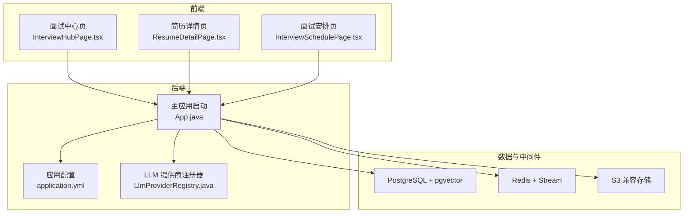
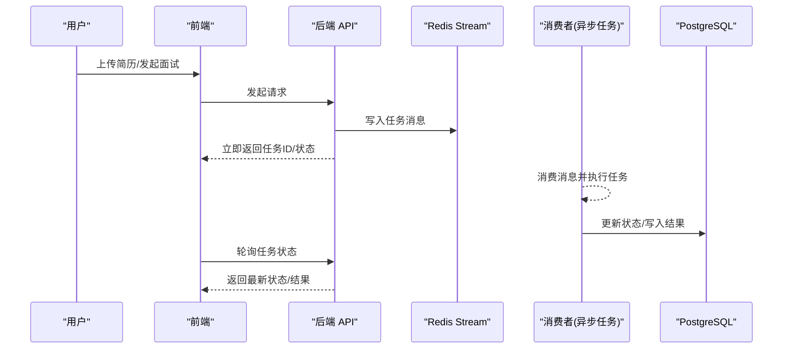
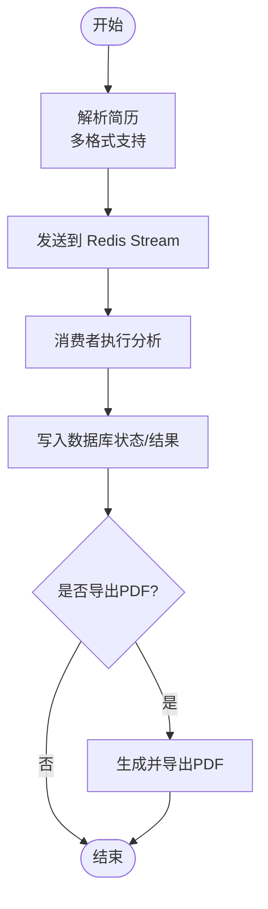
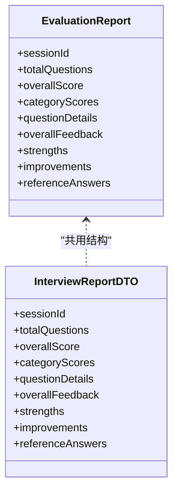
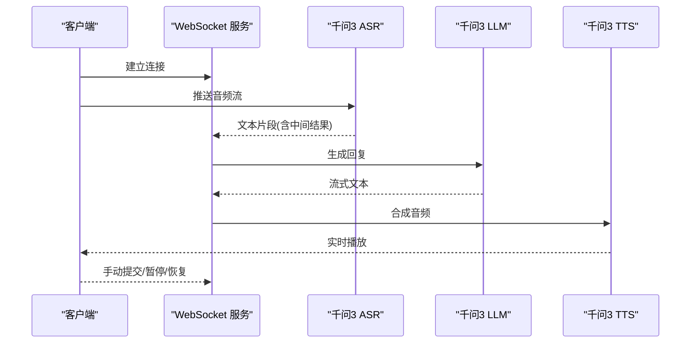
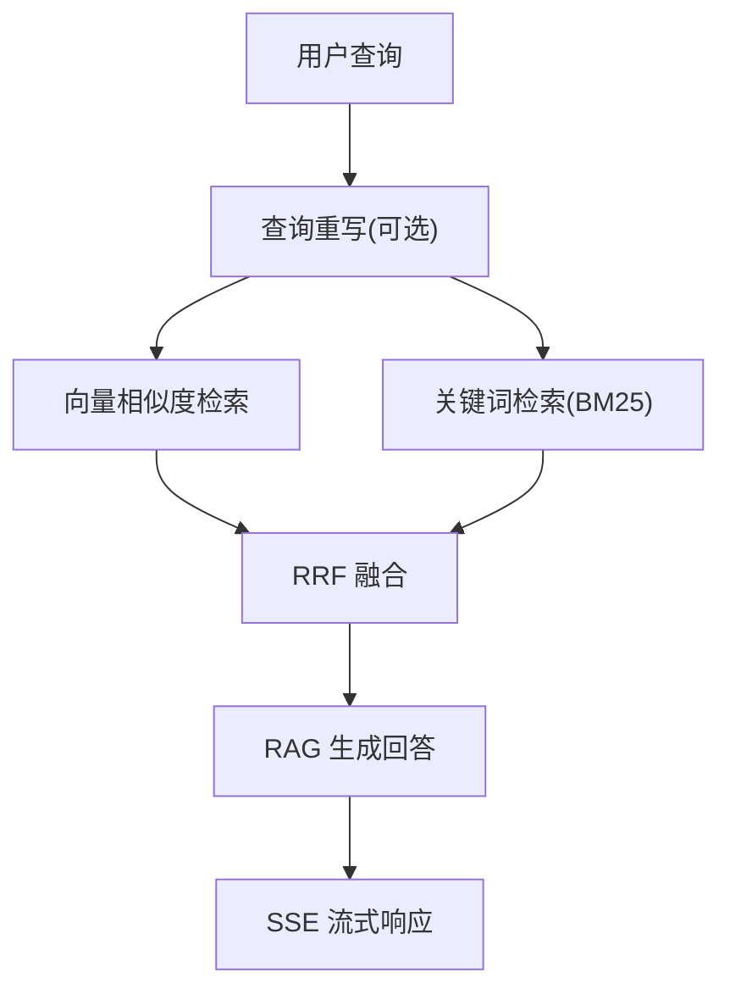
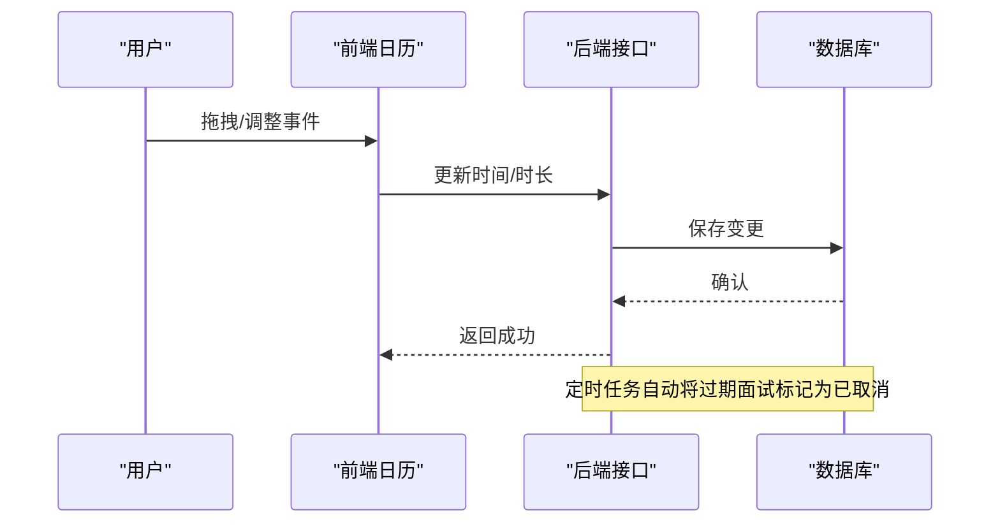
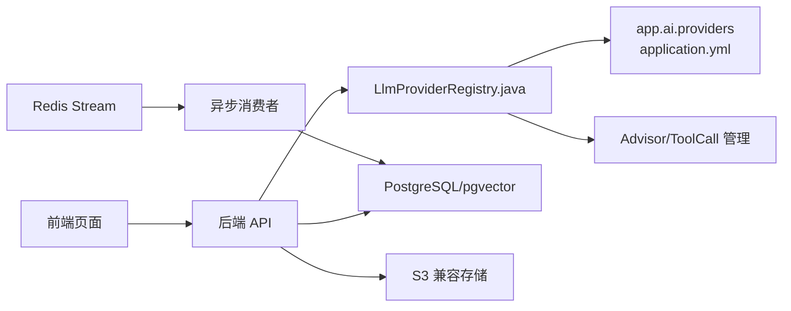

# 项目介绍与背景

<cite>
**本文引用的文件**
- [README.md](file://README.md)
- [App.java](file://app/src/main/java/interview/guide/App.java)
- [application.yml](file://app/src/main/resources/application.yml)
- [LlmProviderRegistry.java](file://app/src/main/java/interview/guide/common/ai/LlmProviderRegistry.java)
- [ResumeAnalysisResponse.java](file://app/src/main/java/interview/guide/modules/interview/model/ResumeAnalysisResponse.java)
- [InterviewHubPage.tsx](file://frontend/src/pages/InterviewHubPage.tsx)
- [ResumeDetailPage.tsx](file://frontend/src/pages/ResumeDetailPage.tsx)
- [InterviewSchedulePage.tsx](file://frontend/src/pages/InterviewSchedulePage.tsx)
- [ScheduleCalendar.tsx](file://frontend/src/components/interviewschedule/ScheduleCalendar.tsx)
- [java-backend/SKILL.md](file://app/src/main/resources/skills/java-backend/SKILL.md)
- [interview-question-resume-user.st](file://app/src/main/resources/prompts/interview-question-resume-user.st)
- [EvaluationReport.java](file://app/src/main/java/interview/guide/common/evaluation/EvaluationReport.java)
- [InterviewReportDTO.java](file://app/src/main/java/interview/guide/modules/interview/model/InterviewReportDTO.java)
- [HybridSearchService.java](file://docs/superpowers/plans/2026-05-12-rag-search-optimization.md)
</cite>

## 目录
1. [引言](#引言)
2. [项目结构](#项目结构)
3. [核心组件](#核心组件)
4. [架构总览](#架构总览)
5. [详细组件分析](#详细组件分析)
6. [依赖关系分析](#依赖关系分析)
7. [性能考量](#性能考量)
8. [故障排查指南](#故障排查指南)
9. [结论](#结论)
10. [附录](#附录)

## 引言
InterviewGuide 是一个面向求职者、HR 与培训机构的智能面试辅助平台，旨在通过大语言模型（LLM）、向量数据库与实时语音技术，提供简历分析、模拟面试（文字+语音）与知识库管理的端到端解决方案。平台致力于解决以下痛点：
- 求职者缺乏系统化、可复盘的面试练习渠道；
- HR 评估简历与筛选候选人的效率低下；
- 企业缺少智能化、可扩展的面试辅助工具。

平台通过“技能驱动出题 + 多模态面试体验 + RAG 知识库增强”的方式，提升面试效率、改善用户体验、降低 HR 成本，并为不同角色提供明确的使用场景与价值定位。

## 项目结构
后端采用 Spring Boot 4.0 + Java 21（虚拟线程）+ Spring AI 2.0.0-M4，前端采用 React 18.3 + TypeScript + Vite，数据库为 PostgreSQL（pgvector），缓存与消息队列为 Redis，语音能力基于千问3（ASR/TTS/LLM）统一 API Key，支持 WebSocket 实时语音面试。

图表来源
- [App.java:11-17](file://app/src/main/java/interview/guide/App.java#L11-L17)
- [application.yml:36-282](file://app/src/main/resources/application.yml#L36-L282)
- [LlmProviderRegistry.java:35-89](file://app/src/main/java/interview/guide/common/ai/LlmProviderRegistry.java#L35-L89)

章节来源
- [README.md:17-247](file://README.md#L17-L247)
- [App.java:11-17](file://app/src/main/java/interview/guide/App.java#L11-L17)
- [application.yml:36-282](file://app/src/main/resources/application.yml#L36-L282)

## 核心组件
- 简历管理模块：支持多格式解析、异步分析、重复检测、报告导出。
- 模拟面试模块：Skill 驱动出题、历史题目去重、阶段时长联动、统一评估架构、报告导出。
- 语音面试模块：WebSocket + 千问3 实时语音（ASR/TTS/LLM），服务端 VAD、字幕、暂停/恢复、回声防护。
- 知识库管理模块：文档上传、分块、向量化、RAG 检索增强、SSE 流式响应。
- 面试安排模块：日历视图、AI 解析面试邀请、状态流转、提醒与过期处理。

章节来源
- [README.md:92-157](file://README.md#L92-L157)

## 架构总览
平台采用“前后端分离 + 异步处理 + 多模态 AI”的架构设计。核心特征包括：
- 异步处理：简历分析、知识库向量化、面试报告生成均通过 Redis Stream 异步执行，前端轮询状态。
- 统一评估：文字面试与语音面试共享同一套评估引擎（分批评估 + 结构化输出 + 二次汇总 + 降级兜底）。
- 多 LLM 提供商：支持 DashScope、LM Studio 等，便于本地与云端灵活切换。
- RAG 增强：pgvector 向量检索 + 关键词检索（BM25）+ RRF 融合，提升问答准确率。

图表来源
- [README.md:25-41](file://README.md#L25-L41)
- [application.yml:86-98](file://app/src/main/resources/application.yml#L86-L98)

章节来源
- [README.md:21-41](file://README.md#L21-L41)
- [application.yml:86-124](file://app/src/main/resources/application.yml#L86-L124)

## 详细组件分析

### 简历分析与评估
- 基于 LLM 的结构化输出，生成包含总分、维度评分、摘要、优缺点与建议的简历分析报告。
- 支持 PDF 导出，内置中文字体与跨平台兼容配置。
- 异步分析流程：上传 → 保存 → 发送消息 → 消费者执行 → 更新状态 → 前端轮询。

图表来源
- [README.md:94-100](file://README.md#L94-L100)
- [application.yml:86-98](file://app/src/main/resources/application.yml#L86-L98)
- [ResumeAnalysisResponse.java:8-26](file://app/src/main/java/interview/guide/modules/interview/model/ResumeAnalysisResponse.java#L8-L26)

章节来源
- [README.md:94-100](file://README.md#L94-L100)
- [ResumeAnalysisResponse.java:8-48](file://app/src/main/java/interview/guide/modules/interview/model/ResumeAnalysisResponse.java#L8-L48)

### 模拟面试（文字+语音）与统一评估
- Skill 驱动出题：内置 10+ 面试方向（如 Java 后端、前端、系统设计等），每个方向由 SKILL.md 定义考察范围与难度分布。
- 历史题目去重：避免重复考察，提升练习质量。
- 统一评估架构：文字与语音面试共享评估引擎，支持分批评估、结构化输出、二次汇总与降级兜底。
- 报告导出：支持异步生成并导出 PDF。

图表来源
- [EvaluationReport.java:8-18](file://app/src/main/java/interview/guide/common/evaluation/EvaluationReport.java#L8-L18)
- [InterviewReportDTO.java:8-18](file://app/src/main/java/interview/guide/modules/interview/model/InterviewReportDTO.java#L8-L18)

章节来源
- [README.md:101-110](file://README.md#L101-L110)
- [java-backend/SKILL.md:1-22](file://app/src/main/resources/skills/java-backend/SKILL.md#L1-L22)
- [EvaluationReport.java:8-40](file://app/src/main/java/interview/guide/common/evaluation/EvaluationReport.java#L8-L40)
- [InterviewReportDTO.java:8-49](file://app/src/main/java/interview/guide/modules/interview/model/InterviewReportDTO.java#L8-L49)

### 语音面试（WebSocket + 千问3）
- 实时流式对话：句子级并发 TTS，首包延迟约 200ms。
- 服务端 VAD：自动断句与实时字幕（含中间结果）。
- 多轮上下文记忆、暂停/恢复、回声防护与手动提交。
- Micrometer 埋点：TTS/ASR 延迟、会话时长等指标。

图表来源
- [README.md:118-128](file://README.md#L118-L128)
- [application.yml:230-282](file://app/src/main/resources/application.yml#L230-L282)

章节来源
- [README.md:118-128](file://README.md#L118-L128)
- [application.yml:194-282](file://app/src/main/resources/application.yml#L194-L282)

### 知识库管理与 RAG 检索增强
- 文档智能处理：支持 PDF、DOCX、Markdown 等格式的自动上传、分块与异步向量化。
- RAG 检索增强：向量检索 + 关键词检索（BM25）+ RRF 融合，提升问答准确性。
- 流式响应交互：基于 SSE 实现打字机式流式响应。

图表来源
- [HybridSearchService.java:282-406](file://docs/superpowers/plans/2026-05-12-rag-search-optimization.md#L282-L406)
- [application.yml:160-169](file://app/src/main/resources/application.yml#L160-L169)

章节来源
- [README.md:130-136](file://README.md#L130-L136)
- [HybridSearchService.java:282-406](file://docs/superpowers/plans/2026-05-12-rag-search-optimization.md#L282-L406)
- [application.yml:117-124](file://app/src/main/resources/application.yml#L117-L124)

### 面试安排与日历管理
- 邀请解析：规则 + AI 双引擎，支持飞书/腾讯会议/Zoom 格式，自动提取公司、岗位、时间、会议链接。
- 日历管理：日/周/月视图 + 拖拽调整 + 列表视图。
- 状态流转：定时任务自动过期，手动标记待面试/已完成/已取消。
- 面试提醒：可配置提醒，避免错过面试。

图表来源
- [InterviewSchedulePage.tsx:61-119](file://frontend/src/pages/InterviewSchedulePage.tsx#L61-L119)
- [ScheduleCalendar.tsx:37-61](file://frontend/src/components/interviewschedule/ScheduleCalendar.tsx#L37-L61)
- [application.yml:194-225](file://app/src/main/resources/application.yml#L194-L225)

章节来源
- [README.md:111-117](file://README.md#L111-L117)
- [InterviewSchedulePage.tsx:61-205](file://frontend/src/pages/InterviewSchedulePage.tsx#L61-L205)
- [ScheduleCalendar.tsx:37-61](file://frontend/src/components/interviewschedule/ScheduleCalendar.tsx#L37-L61)
- [application.yml:194-225](file://app/src/main/resources/application.yml#L194-L225)

## 依赖关系分析
- LLM 提供商注册器：集中管理 DashScope、LM Studio 等提供商，支持动态创建 ChatClient、Advisor 与工具回调。
- 多 LLM 配置：通过 application.yml 的 app.ai.providers 与 app.voice-interview.llm-provider 等属性灵活切换。
- 异步任务：Redis Stream + 消费者，支撑简历分析、知识库向量化与报告生成。
- 数据存储：PostgreSQL（JPA/Hibernate）+ pgvector（向量检索）+ S3 兼容存储（文件）。

图表来源
- [LlmProviderRegistry.java:35-89](file://app/src/main/java/interview/guide/common/ai/LlmProviderRegistry.java#L35-L89)
- [application.yml:126-282](file://app/src/main/resources/application.yml#L126-L282)

章节来源
- [LlmProviderRegistry.java:35-229](file://app/src/main/java/interview/guide/common/ai/LlmProviderRegistry.java#L35-L229)
- [application.yml:126-282](file://app/src/main/resources/application.yml#L126-L282)

## 性能考量
- 虚拟线程：启用 Java 21 虚拟线程，提升 I/O 密集型场景并发能力（Tomcat 虚拟线程配置、Hibernate 批量优化）。
- 异步处理：Redis Stream 解耦任务执行，前端轮询状态，避免阻塞。
- RAG 检索优化：向量 + 关键词双通道 + RRF 融合，兼顾召回与相关性。
- 语音面试：句子级并发 TTS、服务端 VAD、暂停/恢复与回声防护，平衡实时性与稳定性。

章节来源
- [application.yml:42-78](file://app/src/main/resources/application.yml#L42-L78)
- [HybridSearchService.java:282-406](file://docs/superpowers/plans/2026-05-12-rag-search-optimization.md#L282-L406)
- [README.md:118-128](file://README.md#L118-L128)

## 故障排查指南
- 数据库表创建失败/数据丢失：检查 JPA ddl-auto 配置，开发环境推荐 update，生产环境推荐 validate。
- 知识库向量化失败：确认 initialize-schema 配置为 true（开发环境），生产环境手动管理 schema。
- 简历分析失败：检查 AI API Key 配置与网络连通性。
- 简历分析一直显示“分析中”：检查 Redis 连接与 Stream 消费者是否正常运行。
- PDF 导出失败或中文显示异常：确认内置中文字体存在、iText 依赖正确。
- Windows PowerShell 中文乱码：统一控制台编码为 UTF-8，或使用 PowerShell 配置文件。

章节来源
- [README.md:424-494](file://README.md#L424-L494)

## 结论
InterviewGuide 通过“简历分析 + 模拟面试 + 知识库管理 + 面试安排”的一体化设计，结合多 LLM 提供商、RAG 检索增强与多模态语音体验，为求职者、HR 与培训机构提供高效、可扩展、可复用的面试辅助能力。平台强调异步处理、统一评估与跨模态一致性，既满足个人练习需求，也能支撑企业级面试流程的智能化升级。

## 附录

### 使用场景说明
- 求职者：上传简历获取分析建议，基于技能方向进行模拟面试练习，查看历史记录与报告，持续改进。
- HR/招聘人员：批量分析简历，评估候选人能力，安排面试日程，跟踪面试状态，降低筛选成本。
- 培训机构：提供面试培训服务，管理知识库资源，结合 RAG 问答提升教学与答疑质量。

章节来源
- [README.md:416-423](file://README.md#L416-L423)