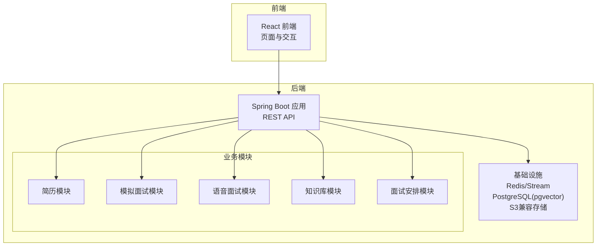
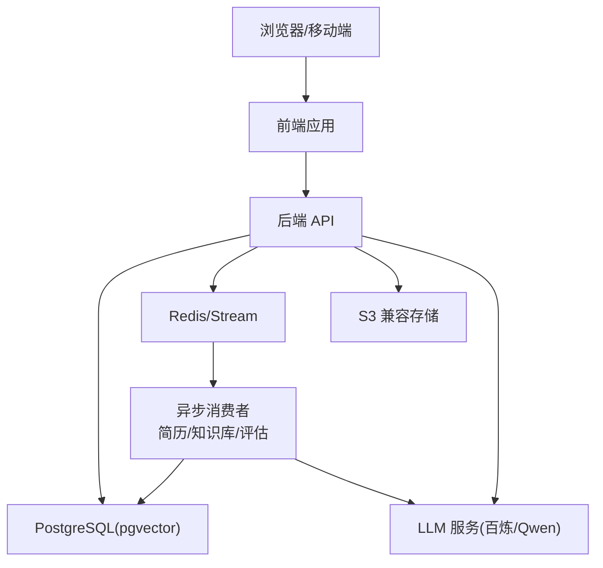
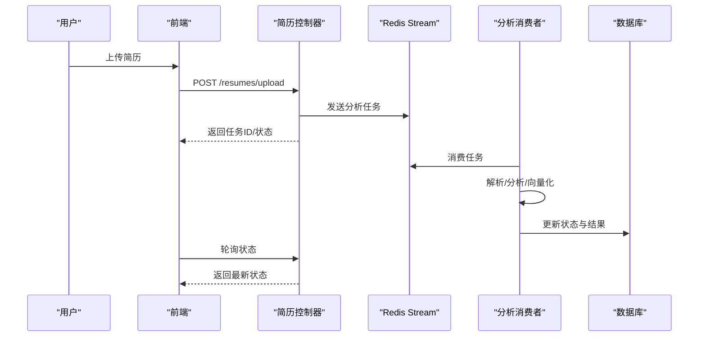
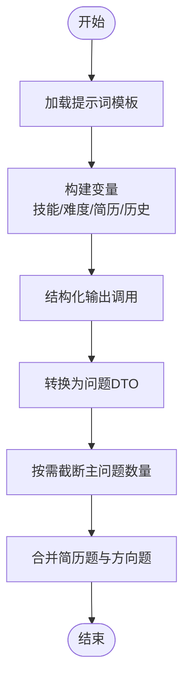
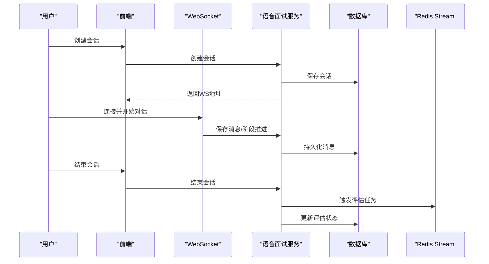
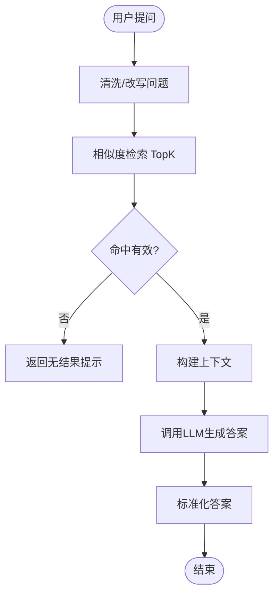
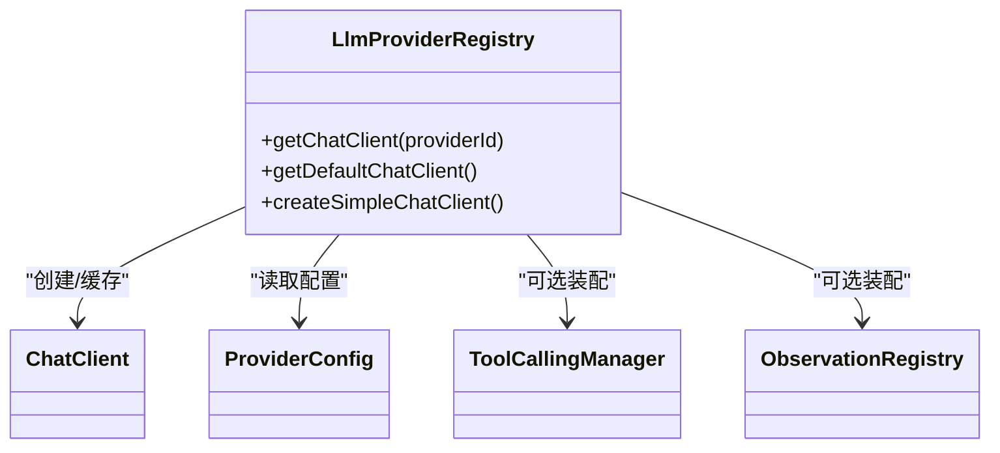
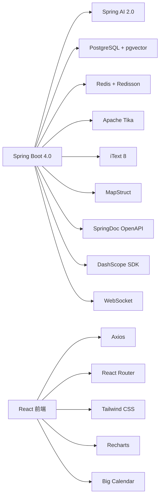

# 项目概述

<cite>
**本文引用的文件**   
- [README.md](file://README.md)
- [App.java](file://app/src/main/java/interview/guide/App.java)
- [libs.versions.toml](file://gradle/libs.versions.toml)
- [docker-compose.yml](file://docker-compose.yml)
- [package.json](file://frontend/package.json)
- [index.ts](file://frontend/src/api/index.ts)
- [ResumeDetailDTO.java](file://app/src/main/java/interview/guide/modules/resume/model/ResumeDetailDTO.java)
- [InterviewDetailDTO.java](file://app/src/main/java/interview/guide/modules/interview/model/InterviewDetailDTO.java)
- [KnowledgeBaseEntity.java](file://app/src/main/java/interview/guide/modules/knowledgebase/model/KnowledgeBaseEntity.java)
- [VoiceInterviewSessionEntity.java](file://app/src/main/java/interview/guide/modules/voiceinterview/model/VoiceInterviewSessionEntity.java)
- [LlmProviderRegistry.java](file://app/src/main/java/interview/guide/common/ai/LlmProviderRegistry.java)
- [InterviewQuestionService.java](file://app/src/main/java/interview/guide/modules/interview/service/InterviewQuestionService.java)
- [KnowledgeBaseQueryService.java](file://app/src/main/java/interview/guide/modules/knowledgebase/service/KnowledgeBaseQueryService.java)
- [VoiceInterviewService.java](file://app/src/main/java/interview/guide/modules/voiceinterview/service/VoiceInterviewService.java)
- [interview-question-resume-system.st](file://app/src/main/resources/prompts/interview-question-resume-system.st)
</cite>

## 目录
1. [引言](#引言)
2. [项目结构](#项目结构)
3. [核心组件](#核心组件)
4. [架构总览](#架构总览)
5. [详细组件分析](#详细组件分析)
6. [依赖分析](#依赖分析)
7. [性能考量](#性能考量)
8. [故障排查指南](#故障排查指南)
9. [结论](#结论)
10. [附录](#附录)

## 引言
InterviewGuide 是一个面向求职者与 HR 的智能面试辅助平台，围绕“简历分析 + 模拟面试（文字+语音）+ 知识库管理”的核心目标，提供从技能驱动出题、RAG 检索增强问答到实时语音面试的完整闭环。系统以 Spring Boot 4.0 + Spring AI 2.0 为核心技术栈，结合 PostgreSQL + pgvector 向量数据库、Redis/Stream 异步处理、WebSocket 实时语音、S3 兼容对象存储等基础设施，形成前后端分离、模块化清晰、可扩展的现代化架构。

## 项目结构
项目采用典型的前后端分离与多模块后端组织方式：
- 后端 app：基于 Spring Boot 4.0，按领域模块划分（简历、模拟面试、语音面试、知识库、面试安排等），统一通过控制器暴露 REST API。
- 前端 frontend：基于 React 18.3 + TypeScript，提供简历上传与分析、面试中心、知识库问答、语音面试等交互页面。
- 基础设施：通过 Docker Compose 编排 PostgreSQL（pgvector）、Redis、MinIO（S3 兼容）与应用服务，支持一键部署与开发调试。

图表来源
- [docker-compose.yml:1-197](file://docker-compose.yml#L1-L197)
- [App.java:1-19](file://app/src/main/java/interview/guide/App.java#L1-L19)

章节来源
- [README.md:210-247](file://README.md#L210-L247)
- [docker-compose.yml:1-197](file://docker-compose.yml#L1-L197)
- [package.json:1-47](file://frontend/package.json#L1-L47)

## 核心组件
- 简历管理模块：支持多格式解析、异步分析、分析报告导出、重复检测与失败重试。
- 模拟面试模块：Skill 驱动出题、历史题目去重、阶段时长联动、统一评估架构、报告导出。
- 语音面试模块：WebSocket 实时对话、服务端 VAD、暂停/恢复、回声防护、Micrometer 埋点。
- 知识库模块：文档上传/分块/向量化、RAG 检索增强问答、SSE 流式响应、统计信息。
- 面试安排模块：邀请解析（规则+AI）、日历视图、状态流转、提醒与定时任务。
- AI 能力：统一的 LLM Provider 注册与 ChatClient 构建、结构化输出、工具调用、Advisor 链路。

章节来源
- [README.md:92-157](file://README.md#L92-L157)
- [ResumeDetailDTO.java:1-43](file://app/src/main/java/interview/guide/modules/resume/model/ResumeDetailDTO.java#L1-L43)
- [InterviewDetailDTO.java:1-42](file://app/src/main/java/interview/guide/modules/interview/model/InterviewDetailDTO.java#L1-L42)
- [KnowledgeBaseEntity.java:1-223](file://app/src/main/java/interview/guide/modules/knowledgebase/model/KnowledgeBaseEntity.java#L1-L223)
- [VoiceInterviewSessionEntity.java:1-122](file://app/src/main/java/interview/guide/modules/voiceinterview/model/VoiceInterviewSessionEntity.java#L1-L122)
- [LlmProviderRegistry.java:1-230](file://app/src/main/java/interview/guide/common/ai/LlmProviderRegistry.java#L1-L230)
- [InterviewQuestionService.java:1-449](file://app/src/main/java/interview/guide/modules/interview/service/InterviewQuestionService.java#L1-L449)
- [KnowledgeBaseQueryService.java:1-461](file://app/src/main/java/interview/guide/modules/knowledgebase/service/KnowledgeBaseQueryService.java#L1-L461)
- [VoiceInterviewService.java:1-582](file://app/src/main/java/interview/guide/modules/voiceinterview/service/VoiceInterviewService.java#L1-L582)

## 架构总览
系统采用“微服务化思维 + 轻量基础设施”的设计理念：
- 后端以 Spring Boot 4.0 为骨架，模块边界清晰，通过统一的控制器与服务层对外提供能力。
- 异步处理：简历分析、知识库向量化、语音面试评估等通过 Redis Stream 实现，消费者异步处理，前端轮询状态。
- 数据层：PostgreSQL + pgvector 存储结构化数据与向量；Redis 作为缓存与会话存储；S3 兼容对象存储保存非结构化文件。
- 前端：React + TS，通过 axios 调用后端 API，页面路由与状态管理解耦。

图表来源
- [docker-compose.yml:1-197](file://docker-compose.yml#L1-L197)
- [LlmProviderRegistry.java:1-230](file://app/src/main/java/interview/guide/common/ai/LlmProviderRegistry.java#L1-L230)
- [VoiceInterviewService.java:1-582](file://app/src/main/java/interview/guide/modules/voiceinterview/service/VoiceInterviewService.java#L1-L582)

## 详细组件分析

### 简历分析模块
- 功能要点：多格式解析、异步分析（Redis Stream）、状态机（待分析/分析中/已完成/失败）、重复检测、PDF 导出。
- 数据模型：ResumeDetailDTO 提供分析历史、分数维度、建议与面试关联。
- 处理流程：上传 → 入队 → 消费者执行 → 更新状态 → 前端轮询。

图表来源
- [README.md:25-42](file://README.md#L25-L42)
- [ResumeDetailDTO.java:1-43](file://app/src/main/java/interview/guide/modules/resume/model/ResumeDetailDTO.java#L1-L43)
- [VoiceInterviewService.java:1-582](file://app/src/main/java/interview/guide/modules/voiceinterview/service/VoiceInterviewService.java#L1-L582)

章节来源
- [README.md:94-100](file://README.md#L94-L100)
- [ResumeDetailDTO.java:1-43](file://app/src/main/java/interview/guide/modules/resume/model/ResumeDetailDTO.java#L1-L43)

### 模拟面试模块
- Skill 驱动出题：支持 10+ 方向（Java 后端、算法、系统设计、测开等），结合 JD 与历史题目去重。
- 统一评估：文字与语音面试共享评估引擎，支持结构化输出与二次汇总。
- 问题生成：InterviewQuestionService 基于提示词模板与结构化输出，动态生成主问题与追问。
- 提示词模板：interview-question-resume-system.st 明确角色、约束与难度分布。

图表来源
- [InterviewQuestionService.java:1-449](file://app/src/main/java/interview/guide/modules/interview/service/InterviewQuestionService.java#L1-L449)
- [interview-question-resume-system.st:1-24](file://app/src/main/resources/prompts/interview-question-resume-system.st#L1-L24)

章节来源
- [README.md:101-110](file://README.md#L101-L110)
- [InterviewQuestionService.java:1-449](file://app/src/main/java/interview/guide/modules/interview/service/InterviewQuestionService.java#L1-L449)
- [interview-question-resume-system.st:1-24](file://app/src/main/resources/prompts/interview-question-resume-system.st#L1-L24)

### 语音面试模块
- 实时对话：WebSocket + 千问3 语音模型（ASR/TTS/LLM 统一 API Key），句子级并发 TTS，服务端 VAD 实时字幕。
- 会话管理：VoiceInterviewService 负责会话生命周期、阶段推进、暂停/恢复、缓存与评估触发。
- 评估与报告：结束会话后触发异步评估，状态回写，前端可查看评估详情。

图表来源
- [VoiceInterviewService.java:1-582](file://app/src/main/java/interview/guide/modules/voiceinterview/service/VoiceInterviewService.java#L1-L582)
- [VoiceInterviewSessionEntity.java:1-122](file://app/src/main/java/interview/guide/modules/voiceinterview/model/VoiceInterviewSessionEntity.java#L1-L122)

章节来源
- [README.md:118-129](file://README.md#L118-L129)
- [VoiceInterviewService.java:1-582](file://app/src/main/java/interview/guide/modules/voiceinterview/service/VoiceInterviewService.java#L1-L582)

### 知识库管理模块
- 文档处理：上传、分块、异步向量化（Redis Stream），向量检索（pgvector）。
- RAG 问答：检索增强生成，SSE 流式响应，查询改写与命中确认。
- 统计与聚合：访问计数、问题计数、向量分块数、状态与错误信息。

图表来源
- [KnowledgeBaseQueryService.java:1-461](file://app/src/main/java/interview/guide/modules/knowledgebase/service/KnowledgeBaseQueryService.java#L1-L461)
- [KnowledgeBaseEntity.java:1-223](file://app/src/main/java/interview/guide/modules/knowledgebase/model/KnowledgeBaseEntity.java#L1-L223)

章节来源
- [README.md:130-136](file://README.md#L130-L136)
- [KnowledgeBaseQueryService.java:1-461](file://app/src/main/java/interview/guide/modules/knowledgebase/service/KnowledgeBaseQueryService.java#L1-L461)

### AI 能力与统一注册
- LlmProviderRegistry：统一管理多 LLM 提供商（DashScope、OpenAI、Minimax 等），支持工具调用、聊天记忆、日志 Advisor。
- 结构化输出：StructuredOutputInvoker 配合 BeanOutputConverter，确保 LLM 输出稳定结构，便于后续处理。

图表来源
- [LlmProviderRegistry.java:1-230](file://app/src/main/java/interview/guide/common/ai/LlmProviderRegistry.java#L1-L230)

章节来源
- [LlmProviderRegistry.java:1-230](file://app/src/main/java/interview/guide/common/ai/LlmProviderRegistry.java#L1-L230)

## 依赖分析
- 后端技术栈：Spring Boot 4.0、Spring AI 2.0、PostgreSQL + pgvector、Redis + Redisson、Apache Tika、iText 8、MapStruct、SpringDoc OpenAPI、DashScope SDK、WebSocket、Gradle。
- 前端技术栈：React 18.3、TypeScript 5.6、Vite 5.4、Tailwind CSS、React Router、Framer Motion、Recharts、Lucide React、React Big Calendar。
- 构建与运行：Gradle 管理依赖与插件；Docker Compose 编排数据库、缓存、对象存储与应用服务。

图表来源
- [README.md:51-91](file://README.md#L51-L91)
- [libs.versions.toml:1-30](file://gradle/libs.versions.toml#L1-L30)
- [package.json:1-47](file://frontend/package.json#L1-L47)

章节来源
- [README.md:51-91](file://README.md#L51-L91)
- [libs.versions.toml:1-30](file://gradle/libs.versions.toml#L1-L30)
- [package.json:1-47](file://frontend/package.json#L1-L47)

## 性能考量
- 异步解耦：简历分析、知识库向量化、语音面试评估通过 Redis Stream 异步执行，避免阻塞主线程。
- 缓存策略：Redis 缓存语音面试会话，减少数据库压力；会话 TTL 控制内存占用。
- 向量检索：根据查询长度动态调整 TopK 与最小相似度阈值，兼顾召回与性能。
- 虚拟线程：问题生成使用虚拟线程池，充分利用 CPU 并发能力。
- 前端优化：RAG 聊天采用虚拟列表，减少 DOM 压力。

## 故障排查指南
- 数据库表创建失败/数据丢失：检查 JPA ddl-auto 配置，开发环境推荐 update，生产环境推荐 validate。
- 知识库向量化失败：确认 initialize-schema=true（开发环境），生产环境手动管理 schema。
- 简历分析失败：核对 AI API Key 配置与网络连通性。
- 简历分析一直“分析中”：检查 Redis 连接与消费者进程状态。
- PDF 导出失败或中文显示异常：确认内置字体文件存在、日志中字体加载信息、iText 依赖版本。
- Windows PowerShell 中文乱码：统一控制台与日志编码为 UTF-8。

章节来源
- [README.md:424-495](file://README.md#L424-L495)

## 结论
InterviewGuide 以“简历分析 + 模拟面试 + 知识库管理”为核心，结合 Spring Boot 4.0 与 Spring AI 2.0 的现代化能力，构建了可扩展、易维护、体验友好的智能面试辅助平台。通过 Redis Stream 异步化、pgvector 向量检索、WebSocket 实时语音与统一的 AI Provider 管理，系统在功能完整性与工程落地之间取得良好平衡。适合初学者学习 AI 集成与微服务架构，也为有经验的开发者提供了可借鉴的工程实践。

## 附录
- 快速开始与 Docker 部署：详见 README 的“快速开始”与“Docker 快速部署”章节。
- 前端 API 统一导出：frontend/src/api/index.ts 提供统一入口，便于按模块调用。

章节来源
- [README.md:249-415](file://README.md#L249-L415)
- [index.ts:1-9](file://frontend/src/api/index.ts#L1-L9)